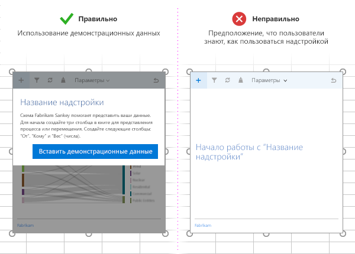

# Рекомендации по разработке надстроек Office

Эффективные надстройки предоставляют уникальные и удобные функции, которые расширяют приложения Office, придавая им привлекательный внешний вид. Чтобы создать хорошую надстройку, сделайте работу пользователей удобной с первого запуска, разработайте первоклассный пользовательский интерфейс и оптимизируйте производительность надстройки. Применяя методики, описанные в этой статье, вы сможете создавать надстройки, которые помогают пользователям выполнять свои задачи быстро и эффективно.

[!INCLUDE [publish policies note](../includes/note-publish-policies.md)]

## Преимущества должны быть очевидными

- Создавайте надстройки, которые помогают пользователям выполнять свои задачи быстро и эффективно. Основное внимание следует уделить сценариям, применимым для приложений Office. Например:
 - обеспечьте более быстрое и простое выполнение основных задач разработки с меньшим количеством прерываний;
 - добавьте в Office новые сценарии;
 - внедрите в ведущие приложения Office дополнительные службы;
 - сделайте работу в Office более удобной, чтобы повысить производительность.
- Чтобы ваша надстройка быстро заинтересовала пользователей, обеспечьте [демонстрацию ее преимуществ уже при первом использовании](#create-an-engaging-first-run-experience).
- Создайте [привлекательное описание надстройки в AppSource](/office/dev/store/create-effective-office-store-listings). Сделайте преимущества вашей надстройки очевидными из названия и описания. Не полагайтесь на то, что по вашей торговой марке будет понятно, для чего предназначена надстройка.

## Удобство работы с первого запуска

- Привлекайте новых пользователей удобным и интуитивно понятным интерфейсом. Помните, что пользователи все еще решают, использовать вашу надстройку или забросить ее после загрузки из магазина.

- Сделайте очевидными действия, необходимые для вызова вашей надстройки. Используйте видеоролики, указатели, панели разбиения на страницы и другие ресурсы, чтобы привлечь пользователей.

- Если пользователям необходимо войти, чтобы использовать надстройку, следует донести до них ценность этой надстройки уже при ее запуске, а не просто просить их выполнить вход.

- Разработайте обучающий интерфейс, чтобы помочь пользователям и персонализировать среду.

   

- Если ваша контентная надстройка привязывается к данным в документе, включите пример данных или шаблон, чтобы показать пользователям рекомендуемый формат данных.

   

- Предлагайте [бесплатные пробные версии](/office/dev/store/decide-on-a-pricing-model). Если для вашей надстройки требуется подписка, сделайте некоторые функции доступными без нее.

- Упростите регистрацию. Используйте автоматическое заполнение сведений (адрес электронной почты, отображаемое имя) и пропустите проверку электронной почты.

- Избегайте всплывающих окон. Если вам необходимо их использовать, помогите пользователю включить всплывающее окно.

Шаблоны, которые можно применять при разработке для первого запуска, представлены в статье [Конструктивные шаблоны для надстроек Office](../design/first-run-experience-patterns.md).

## Команды надстроек

- Предоставьте релевантные точки входа пользовательского интерфейса для надстройки, используя команды надстройки. Соответствующие сведения, включая рекомендации по оформлению, см. в статье [о командах надстроек](../design/add-in-commands.md).

## Принципы оформления элементов пользовательского интерфейса

- Убедитесь, что внешний вид и поведение вашей надстройки согласованы с интерфейсом Office. Используйте [Office UI Fabric](https://developer.microsoft.com/fabric).

- Больше содержимого, меньше хрома. Избегайте лишних элементов интерфейса, которые не представляют ценности для пользователя.

- Пользователь должен быть главным. Убедитесь, что пользователи понимают важные решения и могут с легкостью отменять действия, выполняемые надстройкой.

- Используйте фирменную символику как повод для доверия и ориентир. Она не должна слишком бросаться в глаза или служить рекламой.

- Избегайте прокрутки. Оптимизируйте надстройку для разрешения 1366 x 768.

- Не включайте нелицензированные изображения.

- Используйте [понятный и простой язык](../design/voice-guidelines.md) в надстройке.

- Учитывайте специальные возможности. Обеспечьте удобство работы для всех пользователей и поддержку таких специальных возможностей, как средство чтения с экрана.

- Обеспечьте поддержку всех платформ и методов ввода, включая мышь, клавиатуру и [сенсорное управление](#optimize-for-touch). Убедитесь, что ваш пользовательский интерфейс поддерживает различные форм-факторы.

### Оптимизация для сенсорного управления

- Используйте свойство [Context.touchEnabled](/javascript/api/office/office.context), чтобы определить, поддерживается ли сенсорное управление ведущим приложением, в котором работает надстройка.

  > [!NOTE]
  > Это свойство не поддерживается в Outlook.

- Убедитесь, что размер всех элементов интерфейса удобен для сенсорного управления. Например, кнопки имеют достаточно большие размеры, а в полях ввода будет удобно вводить данные.

- Не рассчитывайте, что можно будет обойтись другими способами ввода, например наведением указателя или щелчком правой кнопкой мыши.

- Убедитесь, что надстройка работает как в книжной, так и в альбомной ориентации. Помните, что на сенсорных устройствах часть надстройки может быть закрыта экранной клавиатурой.

- Протестируйте надстройку на настоящем устройстве, выполнив [загрузку неопубликованного приложения ](../testing/sideload-an-office-add-in-on-ipad-and-mac.md).

> [!NOTE]
> Если используется [Office UI Fabric](https://github.com/OfficeDev/Office-UI-Fabric), то многие из элементов оформления настраиваются без вашего вмешательства.

## Оптимизация и отслеживание производительности приложения

- Создайте ощущение быстрой реакции пользовательского интерфейса. Надстройка должна загружаться за 500 мс или меньше.

- Убедитесь, что все команды пользователя выполняются менее, чем за одну секунду.

-  Добавьте индикаторы загрузки для продолжительных операций.

- Используйте CDN для размещения изображений, ресурсов и общих библиотек. Загружайте как можно больше компонентов из одного источника.

- Соблюдайте стандартные методики для оптимизации веб-страницы. В производственной версии используйте только компактные версии библиотек. Загружайте только необходимые ресурсы и оптимизируйте их загрузку.

- Если для выполнения операций требуется время, сообщайте об этом пользователям. Учитывайте пороговые значения, перечисленные в приведенной ниже таблице. Дополнительные сведения см. в статье [Ограничения ресурсов и оптимизация производительности надстроек Office](../concepts/resource-limits-and-performance-optimization.md).

  |**Класс взаимодействия**|**Целевой объект**|**Верхняя граница**|**Впечатление от использования**|
  |:-----|:-----|:-----|:-----|
  |Мгновенно|<=50 мс|100 мс|Без заметной задержки.|
  |Быстро|50–100 мс|200 мс|Минимально заметная задержка. Нет необходимости в информативном сопровождении.|
  |Нормальное|100–300 мс|500 мс|Достаточная скорость, но не более того. Нет необходимости в информативном сопровождении.|
  |Оперативно|300–500 мс|1 секунда|Не быстро, но надстройка реагирует хорошо. Нет необходимости в информативном сопровождении.|
  |Продолжительно|>500 мс|5 секунд|Среднее время ожидания, надстройка реагирует не так хорошо. Может потребоваться информативное сопровождение.|
  |Длительно|>500 мс|10 секунд|Длительная задержка, но не настолько, чтобы пользователь занялся чем-то другим. Может потребоваться информативное сопровождение.|
  |Долго|>500 мс|Более 10 секунд|Длительная задержка, при которой пользователь может заняться чем-то другим. Может потребоваться информативное сопровождение.|
  |Слишком долго|>5 с|>1 минуты|Пользователи наверняка будут заниматься чем-то другим.|

- Отслеживайте работоспособность службы и используйте телеметрию для отслеживания успешной работы пользователя.

- Минимизируйте обмен данными между надстройкой и документом Office. Дополнительные сведения см. [в статье Избегайте использования метода Context. Sync в циклах](correlated-objects-pattern.md).

## Маркетинг

- Опубликуйте надстройку в [AppSource](/office/dev/store/submit-to-appsource-via-partner-center) и [рекламируйте ее](/office/dev/store/promote-your-office-store-solution) на своем веб-сайте. Создайте [эффективное описание для AppSource](/office/dev/store/create-effective-office-store-listings).

- Давайте надстройкам лаконичные и информативные названия. Их длина не должна превышать 128 символов.

- Составьте краткие и привлекательные описания надстройки. Дайте ответ на вопрос "Какую проблему решает эта надстройка?"

- Опишите преимущества надстройки в названии и описании. Не полагайтесь на свою торговую марку.

- Создайте веб-сайт, который поможет пользователям найти и использовать вашу надстройку.

## Использование JavaScript, поддерживающего Internet Explorer

[!INCLUDE [How to support IE](../includes/es5-support.md)]

## См. также

- [Обзор платформы надстроек Office](../overview/office-add-ins.md)
