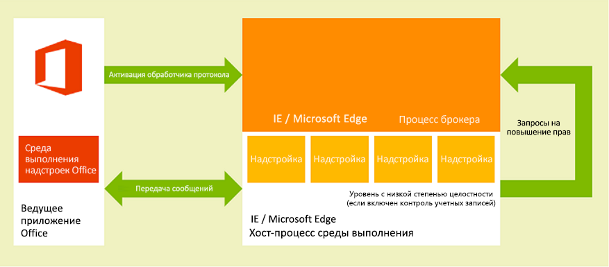
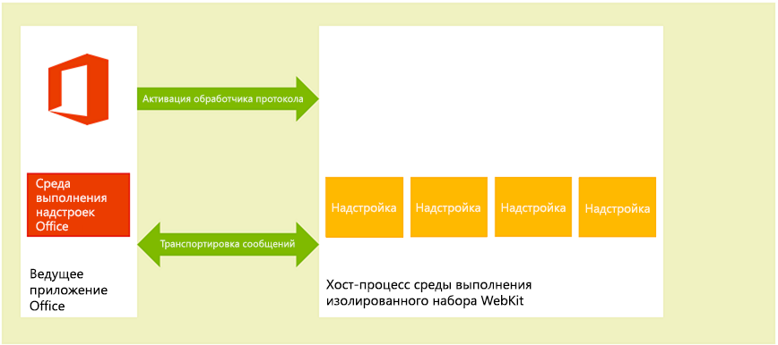
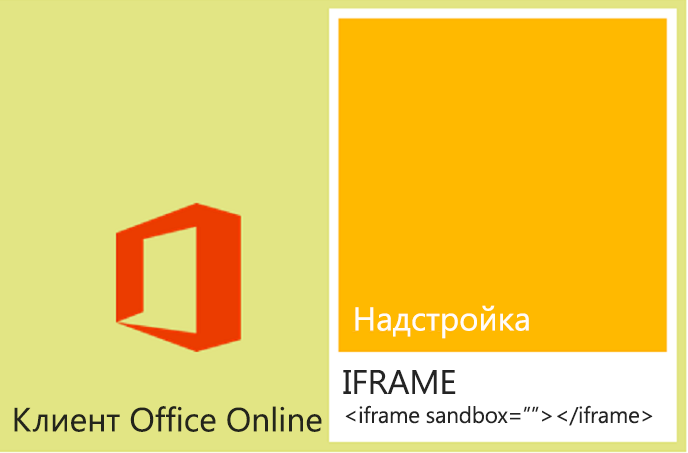

# <a name="privacy-and-security-for-office-add-ins"></a>Конфиденциальность и безопасность надстроек Office

## <a name="understanding-the-add-in-runtime"></a>Общие сведения о среде выполнения надстроек

Надстройки Office защищены средой выполнения надстроек (многоуровневой моделью разрешений) и регуляторами производительности. Эта инфраструктура защищает пользовательский интерфейс указанными ниже способами. 

- Доступ к области пользовательского интерфейса ведущего приложения является управляемым.

- Разрешен только косвенный доступ к потоку пользовательского интерфейса ведущего приложения.

- Модальные взаимодействия не разрешены, например, вызовы JavaScript `alert`, `confirm`и `prompt` функции не разрешены, так как они являются модальными.

Кроме того, инфраструктура среды выполнения предоставляет следующие возможности, благодаря которым надстройка Office не сможет повредить среду пользователя:

- изолирует процесс, в котором работает надстройка;

- не требует замены DLL- или EXE-файлов, а также компонентов ActiveX;

- упрощает установку и удаление надстроек.

Кроме того, вы можете управлять тем, как надстройки Office используют память, ЦП и сетевые ресурсы. Это позволяет поддерживать надлежащую производительность и надежность.

В следующих разделах вкратце описывается поддержка архитектурой среды выполнения надстроек, работающих в клиентах Office на устройствах под управлением Windows, устройствах Mac с OS X и в веб-браузерах.

### <a name="clients-on-windows-and-os-x-devices"></a>Клиенты на устройствах с Windows и OS X

В поддерживаемых клиентах для настольных компьютеров и планшетов, например в Excel для Windows и Outlook для Windows и Mac, надстройки Office поддерживаются путем интеграции внутрипроцессного компонента — среды выполнения надстроек Office, которая управляет жизненным циклом надстройки и позволяет ей взаимодействовать с клиентским приложением. Сама веб-страница надстройки размещена вне процесса. Как показано на рис. 1, на настольном компьютере или планшете с ОС Windows [веб-страница надстройки размещена внутри элемента управления Internet Explorer](browsers-used-by-office-web-add-ins.md), который, в свою очередь, размещен внутри процесса среды выполнения надстройки, обеспечивающего безопасность и изоляцию работы.

На компьютерах с Windows в Internet Explorer для зоны "Опасные сайты" должен быть включен защищенный режим. Обычно этот режим включен по умолчанию. Если он отключен, при запуске надстройки [возникнет ошибка](https://support.microsoft.com/help/2761180/apps-for-office-don-t-start-if-you-disable-protected-mode-for-the-restricted-sites-zone-in-internet-explorer).

*Рис. 1. Среда выполнения надстроек для Office в клиентах для настольных компьютеров и планшетов под управлением ОС Windows*



Как показано на приведенном ниже рисунке, на настольном компьютере Mac под управлением OS X веб-страница надстройки размещается в изолированном хост-процессе среды выполнения WebKit, что обеспечивает аналогичный уровень безопасности и защиты производительности. 

*Рис. 2. Среда выполнения надстроек Office в клиентах для Mac под управлением OS X*



Среда выполнения надстроек Office управляет взаимодействием процессов, преобразованием вызовов и событий API JavaScript в собственные вызовы и события, а также обеспечивает удаленную поддержку пользовательского интерфейса для отображения надстройки внутри документа, в области задач или рядом с электронным письмом, приглашением на собрание или встречей.

### <a name="web-clients"></a>Веб-клиенты

В поддерживаемых веб-клиентах надстройки Office размещаются в элементе **IFRAME** , который выполняется с помощью атрибута HTML5 **Sandbox** . Компоненты ActiveX и навигация по главной странице веб-клиента запрещены. Поддержка надстроек Office в веб-клиентах возможна благодаря интеграции API JavaScript для Office. API JavaScript управляет жизненным циклом надстройки и взаимодействием между надстройкой и веб-клиентом аналогично клиентским приложениям на компьютерах. Это взаимодействие реализуется с помощью специальной инфраструктуры отправки сообщений между фреймами. Для взаимодействия с веб-клиентом доступна та же библиотека JavaScript (Office.js), которая используется на клиентах на компьютерах. На следующем рисунке показана инфраструктура, которая поддерживает надстройки в Office, выполняемые в браузере, и соответствующие компоненты (веб-клиент, **IFRAME**, среда выполнения надстроек Office и API JavaScript для Office), которые необходимы для их поддержки.


*Рис. 3. Инфраструктура, поддерживающая надстройки Office в веб-клиентах Office*



## <a name="add-in-integrity-in-appsource"></a>Целостность надстроек в AppSource

Вы можете публиковать свои надстройки Office в AppSource. Для поддержания целостности надстроек в AppSource используются указанные ниже меры.


- При обмене данными хост-сервер надстройки Office всегда должен использовать SSL.

- Разработчику требуется предоставить доказательство подлинности, контрактное соглашение и соответствующую требованиям политику конфиденциальности для отправки надстроек.

- Убедитесь, что источник надстроек доступен только для чтения.

- Поддерживается система рецензий пользователей для доступных надстроек, чтобы стимулировать формирование саморегулирующегося сообщества.

## <a name="addressing-end-users-privacy-concerns"></a>Решение вопросов, связанных с конфиденциальностью пользователей

В этом разделе описывается защита, обеспечиваемая платформой надстроек Office, с точки зрения клиента (конечного пользователя), а также приводятся рекомендации по безопасной работе с персональными данными пользователей.

### <a name="end-users-perspective"></a>Точка зрения пользователей

При создании надстроек Office используются веб-технологии, работающие в элементе управления браузера или **iframe**. Из-за этого процесс работы с надстройками похож на просмотр веб-сайтов в Интернете или в интрасети. По отношению к организации надстройки могут быть внешними (если вы приобрели надстройку в AppSource) или внутренними (если надстройка получена из каталога надстроек Exchange Server, каталога приложений SharePoint либо на файловом ресурсе в сети организации). Надстройкам предоставляется ограниченный доступ к сети и большинство из них могут считывать данные из активного документа или почтового элемента, а также записывать в них данные. До того как пользователь или администратор установит или запустит надстройку, платформа надстроек применяет определенные ограничения. Но, как и при использовании любой модели расширений, при запуске незнакомых надстроек пользователю следует предпринимать определенные меры предосторожности.

Платформа надстроек обеспечивает конфиденциальность пользователей указанными ниже способами.

- Данные, обмен которыми выполняет тот веб-сервер, на котором размещена контентная надстройка, надстройка Outlook или надстройка области задач, а также данные при взаимодействии между надстройкой и всеми веб-службами, которые она использует, всегда должны быть зашифрованы в соответствии с требованиями протокола SSL.

- Перед установкой надстройки из AppSource пользователь может просмотреть политику конфиденциальности и требования, которые ее касаются. Кроме того, надстройки Outlook, взаимодействующие с почтовыми ящиками пользователей, указывают необходимые им разрешения. Таким образом, перед установкой надстройки Outlook пользователь может просмотреть условия использования, требуемые разрешения и политику конфиденциальности.

- При общем доступе к документу пользователи также совместно используют вставленные в него или связанные с ним надстройки. Если пользователь открывает документ с надстройкой, которая ранее не использовалась, ведущее приложение отображает запрос на предоставление надстройке разрешения на запуск в документе. В среде организации ведущее приложение Office также спрашивает пользователя о том, получен ли документ из внешнего источника.

- Пользователи могут включить или отключить доступ к AppSource. Для контентных надстроек и надстроек области задач пользователи управляют доступом к доверенным надстройкам и каталогам из **центра управления безопасностью** на клиенте узла Office ( **открывается из** > **параметров** > управления**безопасностью** > **центра** > управления безопасностью**Доверенные каталоги надстроек**). Для надстроек Outlook управление надстройками осуществляется с помощью кнопки **Управление** надстройками: в Outlook в Windows выберите **файл** > **Управление**надстройками. В Outlook в Mac нажмите кнопку **Управление надстройками** на панели надстройки. В Outlook в Интернете выберите меню **Параметры** (значок шестеренки) > **Управление надстройками**. Администраторы также могут управлять доступом [с помощью групповой политики](/previous-versions/office/office-2013-resource-kit/jj219429(v=office.15)#using-group-policy-to-manage-how-users-can-install-and-use-apps-for-office).

- Структура платформы надстроек обеспечивает безопасную и эффективную работу пользователей благодаря следующим возможностям:

  - Надстройка Office запускается в элементе управления веб-браузера, размещаемом в среде выполнения надстроек, отделенной от ведущего приложения Office. Такая структура обеспечивает изоляцию от ведущего приложения как с точки зрения безопасности, так и c точки зрения производительности.

  - Выполнение в элементе управления браузера позволяет надстройке совершать практически любые операции, доступные обычной странице в браузере, и в то же время принуждает ее соблюдать политику единого домена для обеспечения изоляции доменов и зон безопасности.

Надстройки Outlook позволяют использовать дополнительные функции обеспечения безопасности и производительности. Для этого отслеживается потребление определенных ресурсов надстройками Outlook. Дополнительные сведения см. в разделе [Конфиденциальность, разрешения и безопасность для надстроек Outlook](../outlook/privacy-and-security.md).

### <a name="developer-guidelines-to-handle-pii"></a>Рекомендации разработчикам по обработке персональных данных

Ниже приведено несколько особых рекомендаций по защите персональных данных при разработке надстроек Office.

- Объект [Settings](/javascript/api/office/office.settings) предназначен для хранения данных о параметрах и состоянии контентных надстроек и надстроек области задач между сеансами. Не следует хранить в объекте **Settings** пароли и другие конфиденциальные личные сведения. Данные в объекте **Settings** невидимы для пользователей, но хранятся в документе в легкодоступном формате. Следует ограничить надстройке доступ к личным сведениям и хранить такие сведения, необходимые для работы надстройки, на сервере, на котором размещена надстройка, в виде защищенного от пользователей ресурса.

- При использовании некоторых надстроек могут быть раскрыты личные сведения. Поэтому необходимо хранить данные удостоверений, сведения о расположениях и времени доступа, а также прочие учетные данные пользователей в безопасном расположении, недоступном другим пользователям надстройки.

- Если надстройка доступна в AppSource, требование AppSource протокола HTTPS защищает личные сведения, передаваемые между веб-сервером и клиентским компьютером или устройством. Однако если вы передаете данные на другие серверы, убедитесь, что обеспечивается такой же уровень защиты.

- Если вы храните личные сведения пользователей, обязательно сообщите об этом и предоставьте пользователям возможность по своему выбору проверять и удалять их. Если надстройка отправляется в AppSource, можно указать собираемые данные и их использование в заявлении о конфиденциальности.

## <a name="developers-permission-choices-and-security-practices"></a>Варианты реализации разрешений и методики обеспечения безопасности для разработчиков

Чтобы обеспечить поддержку модели безопасности, используемой в надстройках Office, и находить дополнительные сведения для каждого типа надстроек, следуйте приведенным ниже общим указаниям.

### <a name="permissions-choices"></a>Варианты разрешений

Платформа надстроек предоставляет модель разрешений, с помощью которой надстройка объявляет уровень доступа к данным пользователя, необходимый для выполнения ее функций. Каждый уровень разрешений соответствует подмножеству API JavaScript для Office, которое вашей надстройке разрешено использовать для выполнения своих функций. Например, разрешение **WriteDocument** для контента и надстройки области задач позволяет получить доступ к методу [Document. setSelectedDataAsync](/javascript/api/office/office.document) , который позволяет надстройке выполнять запись в документ пользователя, но не разрешает доступ ни к одному из методов чтения данных из документа. Такой уровень разрешений целесообразно использовать для надстроек, которым необходимо только записывать данные в документ, например для надстроек, в которых пользователь может запрашивать вставку данных в свой документ.

Рекомендуется запрашивать разрешения по принципу _минимальной привилегии_. Другими словами, следует запрашивать разрешения для доступа только к минимальному подмножеству API, необходимому для правильной работы надстройки. Например, если надстройке требуется только считывать данные из документа пользователя, то максимальное разрешение, которое вам следует запросить, — **ReadDocument**. (Имейте в виду, что если запросить недостаточно разрешений, платформа надстроек запретит надстройке использовать некоторые API, что приведет к ошибке во время выполнения.)

Разрешения указываются в манифесте надстройки, как показано в примере ниже из этого раздела, а пользователи могут просматривать требуемый уровень разрешений перед принятием решения об установке или активации такой надстройки в первый раз. Кроме того, для установки надстроек Outlook, запрашивающих разрешение **ReadWriteMailbox**, требуются явные права администратора.

В приведенном ниже примере показано, как надстройка области задач определяет разрешение **ReadDocument** в манифесте. Чтобы сконцентрировать внимание на разрешениях, другие элементы в манифесте не отображены.

```xml
<?xml version="1.0" encoding="utf-8"?>
<OfficeApp xmlns="http://schemas.microsoft.com/office/appforoffice/1.0"
           xmlns:xsi="http://www.w3.org/2001/XMLSchema-instance" 
           xmlns:ver="http://schemas.microsoft.com/office/appforoffice/1.0"
           xsi:type="TaskPaneApp">

... <!-- To keep permissions as the focus, not displaying other elements. -->
  <Permissions>ReadDocument</Permissions>
...
</OfficeApp>
```

Дополнительные сведения о разрешениях для надстроек области задач и контентных надстроек см. в статье [Запрос разрешений на использование API в надстройках](../develop/requesting-permissions-for-api-use-in-content-and-task-pane-add-ins.md).

Дополнительные сведения о разрешениях для надстроек Outlook см. в следующих статьях:

- [Конфиденциальность, разрешения и безопасность для надстроек Outlook](../outlook/privacy-and-security.md)

- [Общие сведения о разрешениях для надстройки Outlook](../outlook/understanding-outlook-add-in-permissions.md)

### <a name="same-origin-policy"></a>Политика единого домена

Так как надстройки Office представляют собой веб-страницы, выполняемые в элементе управления веб-браузера, они должны соответствовать политике единого домена, применяемой браузером: по умолчанию веб-страница, расположенная в одном домене, не может выполнять запросы [XmlHttpRequest](https://www.w3.org/TR/XMLHttpRequest/) веб-службы к домену, отличному от домена, в котором она размещена.

Одним из способов преодоления этого ограничения является использование JSON/P — предоставление прокси-сервера для веб-службы путем включения тега **скрипта** с атрибутом **src** , указывающего на сценарий, размещенный в другом домене. Вы можете программно создавать теги **script**, динамически формируя URL-адрес, на который указывает атрибут **src**, и передавая параметры на URL-адрес через параметры запроса URI. Поставщики веб-служб создают и размещают код JavaScript с использованием определенных URL-адресов и возвращают разные сценарии в зависимости от параметров запроса URI. Затем эти сценарии выполняются в точке вставки и работают надлежащим образом.

Ниже приведен пример JSON/P в образце надстройки Outlook. 

```js
// Dynamically create an HTML SCRIPT element that obtains the details for the specified video.
function loadVideoDetails(videoIndex) {
    // Dynamically create a new HTML SCRIPT element in the webpage.
    var script = document.createElement("script");
    // Specify the URL to retrieve the indicated video from a feed of a current list of videos,
    // as the value of the src attribute of the SCRIPT element. 
    script.setAttribute("src", "https://gdata.youtube.com/feeds/api/videos/" + 
        videos[videoIndex].Id + "?alt=json-in-script&amp;callback=videoDetailsLoaded");
    // Insert the SCRIPT element at the end of the HEAD section.
    document.getElementsByTagName('head')[0].appendChild(script);
}
```

Exchange и SharePoint предоставляют прокси-серверы на стороне клиента, чтобы обеспечить междоменный доступ. В общем случае в интрасетях действуют более мягкие политики единого домена, чем в Интернете. Дополнительные сведения см. в статьях [Политика единого домена. Часть 1: без просмотра](/archive/blogs/ieinternals/same-origin-policy-part-1-no-peeking) и [Решение вопросов, которые связаны с ограничениями, накладываемыми политикой единого домена, в надстройках Office](../develop/addressing-same-origin-policy-limitations.md).

### <a name="tips-to-prevent-malicious-cross-site-scripting"></a>Советы по предотвращению вредоносных межсайтовых сценариев

Злонамеренный пользователь может атаковать базовую структуру надстройки, вводя вредоносный сценарий через документ или поля в надстройке. Разработчик должен соответствующим образом обрабатывать вводимые пользователем данные, чтобы избежать выполнения кода JavaScript злоумышленника в его домене. Ниже приводятся некоторые рекомендации по обработке вводимых пользователем данных из документа, сообщения или полей надстройки:


- Вместо свойства DOM [innerHTML](https://developer.mozilla.org/docs/Web/API/Element/innerHTML) используйте свойства [innerText](https://developer.mozilla.org/docs/Web/API/Node/innerText) и [textContent](https://developer.mozilla.org/docs/DOM/Node.textContent), где это возможно. Для обеспечения поддержки Internet Explorer и Firefox используйте указанную ниже строку кода:

    ```js
     var text = x.innerText || x.textContent
    ```

    Сведения о различиях между **InnerText** и **textContent**приведены в разделе [node. textContent](https://developer.mozilla.org/docs/DOM/Node.textContent). Дополнительные сведения о совместимости DOM в распространенных браузерах приведены в статье [Совместимость DOM W3C-HTML](https://www.quirksmode.org/dom/w3c_html.html#t07).

- Если необходимо использовать **InnerHtml**, убедитесь, что входные данные пользователя не содержат вредоносного содержимого, прежде чем передавать его в **InnerHtml**. Дополнительные сведения и пример безопасного использования свойства **innerHTML** см. в разделе [innerHTML](https://developer.mozilla.org/docs/Web/API/Element/innerHTML).

- Если вы используете jQuery, то вместо метода [.html()](https://api.jquery.com/text/) воспользуйтесь методом [.text()](https://api.jquery.com/html/).

- С помощью метода [toStaticHTML](https://developer.mozilla.org/en-US/docs/Web/HTML/Reference) перед отправкой введенных пользователем данных в свойство **innerHTML** можно удалить из них любые динамические элементы и атрибуты HTML.

- С помощью функции [encodeURIComponent](https://developer.mozilla.org/docs/Web/JavaScript/Reference/Global_Objects/encodeuricomponent) или [encodeURI](https://developer.mozilla.org/docs/Web/JavaScript/Reference/Global_Objects/encodeuri) можно закодировать текст, который будет использоваться в качестве URL-адреса, введенного пользователем или содержащего введенные пользователем данные.

- Дополнительные рекомендации по созданию безопасных веб-решений см. в разделе [Разработка безопасных надстроек](/previous-versions/windows/apps/hh849625(v=win.10)).

### <a name="tips-to-prevent-clickjacking"></a>Советы для предотвращения атак типа кликджекинг (clickjacking)

Так как при использовании ведущих приложений Office надстройки Office выполняются в браузере и отображаются в элементе iframe, следуйте указанным ниже советам, чтобы снизить риск атак типа [кликджекинг](https://en.wikipedia.org/wiki/Clickjacking) — методики, используемой злоумышленниками для кражи конфиденциальной информации у пользователей.

Во-первых, определите критичные действия, которые может выполнять надстройка. К ним относятся все действия, которые может использовать злоумышленник, например проведение финансовой транзакции или публикация конфиденциальных данных. Например, надстройка может позволять пользователю отправлять платеж указанному получателю.

Во-вторых, перед выполнением критичных действий надстройка должна запрашивать у пользователя подтверждение. Соответствующее сообщение должно содержать подробное описание последствий выполняемого действия. В нем также должно быть указано, как при необходимости пользователь может предотвратить действие: нажать специальную кнопку "Не разрешать" или проигнорировать подтверждение.

В-третьих, чтобы не позволить потенциальным хакерам скрыть или замаскировать подтверждение, необходимо показывать его вне контекста надстройки (т. е. не в диалоговом окне HTML).

Вот некоторые примеры получения подтверждения.

- Отправьте пользователю сообщение электронной почты, которое содержит ссылку для подтверждения.

- Отправьте пользователю SMS-сообщение, содержащее код подтверждения, который можно ввести в надстройке.

- Откройте диалоговое окно подтверждения в новом окне браузера на странице, на которой невозможно использовать элемент iframe. Обычно это шаблон, который используется страницами входа. Создайте новое диалоговое окно с помощью [Dialog API](../develop/dialog-api-in-office-add-ins.md).

Кроме того, убедитесь, что адрес, используемый для связи с пользователем, не может применяться потенциальным злоумышленником. Например, для подтверждения оплаты используйте зарегистрированный адрес авторизованной учетной записи пользователя.

### <a name="other-security-practices"></a>Другие методики обеспечения безопасности

Разработчики также должны учитывать следующие методики обеспечения безопасности:


- Разработчикам не следует использовать в надстройках Office элементы ActiveX, так как последние не поддерживают кроссплатформенные возможности платформы надстроек.

- Для надстроек содержимого и надстроек области задач применяются те же параметры SSL, которые используются по умолчанию в браузере и обеспечивают предоставление основной части содержимого исключительно с использованием SSL. Надстройки Outlook требуют предоставления всего содержимого с помощью SSL. Разработчикам необходимо указывать в элементе **SourceLocation** манифеста надстройки URL-адрес с использованием протокола HTTPS, чтобы определить расположение HTML-файла для надстройки.

    Чтобы гарантировать, что надстройки не предоставляют содержимое с использованием HTTP, при тестировании надстроек разработчикам следует убедиться, что в разделе **Свойства браузера** на **панели управления** выбраны следующие параметры, а в тестовых сценариях отсутствуют предупреждения системы безопасности:

    - Убедитесь, что для параметра **Отображение разнородного содержимого** для зоны **Интернет** установлено значение **Предлагать**. Это можно сделать, выбрав указанные ниже параметры в **свойствах браузера**. на **вкладке Безопасность** выберите зону **Интернета** , выберите **другой уровень**, прокрутите страницу, чтобы найти режим **отображения смешанного контента**, и выберите пункт **запросить** , если он еще не выбран.

    - Убедитесь, что выбран параметр **Предупреждать о переключении режима безопасности** на вкладке **Дополнительно** диалогового окна **Свойства браузера**.

- Чтобы убедиться, что надстройки не превышают допустимый уровень использования ЦП или памяти и не вызывают отказ в обслуживании на клиентском компьютере, платформа надстроек устанавливает пределы использования ресурсов. В рамках тестирования разработчикам следует убедиться, что надстройка соблюдает данные пределы.

- Перед публикацией надстройки разработчикам следует убедиться, что любые личные сведения, указываемые ими в файлах надстройки, защищены.

- Разработчикам не следует внедрять ключи, которые они используют для доступа к сторонним API или службам (например, Bing, Google или Facebook) непосредственно в HTML-страницы своей надстройки. Вместо этого им следует создать настраиваемую веб-службу или хранить ключи в другом надежном веб-хранилище, к которому они затем смогут отправить вызов, чтобы передать значение ключа в надстройку.

- При отправке надстройки в AppSource разработчикам следует:

  - разместить отправляемую надстройку на веб-сервере, поддерживающем SSL;
  - создать заявление, прописывающее соответствующую требованиям политику конфиденциальности;
  - подготовиться к подписанию контрактного соглашения при отправке надстройки.

Помимо соблюдения правил использования ресурсов разработчики надстроек Outlook должны проверять, что их надстройки соблюдают ограничения по заданию правил активации и использованию API JavaScript. Дополнительные сведения см. в статье [Ограничения для активации и API JavaScript для надстроек Outlook](../outlook/limits-for-activation-and-javascript-api-for-outlook-add-ins.md).

## <a name="it-administrators-control"></a>Полномочия ИТ-администраторов

В корпоративной среде ИТ-администраторы обладают высшими полномочиями в том, что касается предоставления или запрета доступа к AppSource и каким-либо частным каталогам.

Управление параметрами Office и их внедрение выполняется с помощью параметров групповой политики. Указанные ниже параметры настраиваются с помощью [средства развертывания Office](/deployoffice/overview-of-the-office-2016-deployment-tool) совместно с [центром развертывания Office](/deployoffice/overview-of-the-office-customization-tool-for-click-to-run).

| Имя параметра | Описание |
|--------------|-------------|
| Разрешить небезопасные веб-надстройки и каталоги | Разрешает пользователям запускать небезопасные надстройки. Это надстройки с расположениями на веб-страницах или в каталоге без SSL-шифрования (https://), не находящиеся в зонах Интернета пользователей. |
| Блокировать веб-надстройки | Позволяет запрещать пользователям применение веб-надстроек. |
| Заблокировать Магазин Office |  Позволяет запрещать пользователям применение или вставку веб-настроек из Магазина Office. |

> [!IMPORTANT]
> Если в рабочих группах используется несколько выпусков Office, для каждого выпуска нужно настроить параметры групповой политики. Подробные сведения о параметрах групповой политики для Office 2013 см. в разделе [Использование групповой политики для управления возможностью установки и использования пользователями приложений для Office](/previous-versions/office/office-2013-resource-kit/jj219429(v=office.15)#using-group-policy-to-manage-how-users-can-install-and-use-apps-for-office) статьи [Обзор приложений для Office 2013](/previous-versions/office/office-2013-resource-kit/jj219429(v%3doffice.15))

## <a name="see-also"></a>См. также

- [Запрос разрешений на использование API в надстройках](../develop/requesting-permissions-for-api-use-in-content-and-task-pane-add-ins.md)
- [Конфиденциальность, разрешения и безопасность для надстроек Outlook](../outlook/privacy-and-security.md)
- [Общие сведения о разрешениях для надстройки Outlook](../outlook/understanding-outlook-add-in-permissions.md)
- [Ограничения активации и API JavaScript для надстроек Outlook](../outlook/limits-for-activation-and-javascript-api-for-outlook-add-ins.md)
- [Работа с ограничениями по принципу одинакового источника в надстройках Office](../develop/addressing-same-origin-policy-limitations.md)
- [Принцип одинакового источника](https://www.w3.org/Security/wiki/Same_Origin_Policy)
- [Принцип одинакового источника. Часть 1. Без просмотра](/archive/blogs/ieinternals/same-origin-policy-part-1-no-peeking)
- [Принцип одинакового источника для JavaScript](https://developer.mozilla.org/docs/Web/Security/Same-origin_policy)
- [Защищенный режим Internet Explorer](https://support.microsoft.com/help/2761180/apps-for-office-don-t-start-if-you-disable-protected-mode-for-the-restricted-sites-zone-in-internet-explorer)
