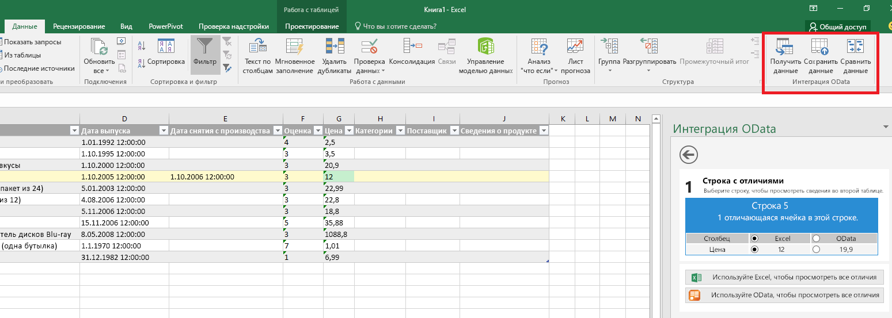
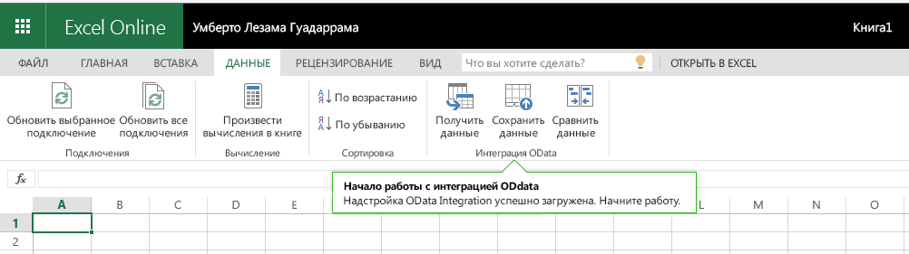
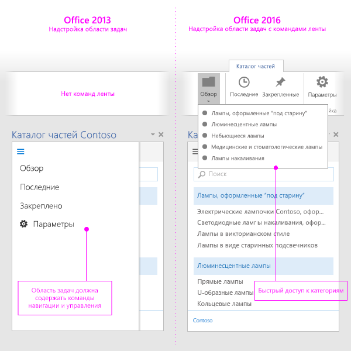

# Команды надстроек для Excel, PowerPoint и WordAdd-in commands for Excel, PowerPoint, and Word

Команды надстроек — это элементы, которые расширяют пользовательский интерфейс Office и запускают действия в надстройке. Команды надстроек можно использовать для добавления кнопки на ленту или элемента в контекстное меню. Когда пользователи выбирают команду надстройки, они инициируют действия, такие как запуск кода JavaScript или отображение страницы надстройки в области задач. Команды надстройки помогают пользователям находить и использовать вашу надстройку, что может повысить показатель внедрения надстройки и коэффициент удержания клиентов.Add-in commands are UI elements that extend the Office UI and start actions in your add-in. You can use add-in commands to add a button on the ribbon or an item to a context menu. When users select an add-in command, they initiate actions such as running JavaScript code, or showing a page of the add-in in a task pane. Add-in commands help users find and use your add-in, which can help increase your add-in's adoption and reuse, and improve customer retention.

Обзор этой функции приведен в видео, посвященном [командам надстроек на ленте приложения Office](https://channel9.msdn.com/events/Build/2016/P551).For an overview of the feature, see the video [Add-in Commands in the Office app ribbon](https://channel9.msdn.com/events/Build/2016/P551).

> [!NOTE]
> В каталогах SharePoint не поддерживаются команды надстроек. Последние можно развернуть с помощью компонента [централизованного развертывания](../publish/centralized-deployment.md) или [AppSource](/office/dev/store/submit-to-appsource-via-partner-center). Чтобы развернуть команду надстройки для тестирования, выполните [загрузку неопубликованного приложения](../testing/create-a-network-shared-folder-catalog-for-task-pane-and-content-add-ins.md).SharePoint catalogs do not support add-in commands. You can deploy add-in commands via [Centralized Deployment](../publish/centralized-deployment.md) or [AppSource](/office/dev/store/submit-to-appsource-via-partner-center), or use [sideloading](../testing/create-a-network-shared-folder-catalog-for-task-pane-and-content-add-ins.md) to deploy your add-in command for testing.

> [!IMPORTANT]
> В Outlook также поддерживаются команды надстроек.Add-in commands are also supported in Outlook. Дополнительные сведения см. в статье [Команды надстроек для Outlook](../outlook/add-in-commands-for-outlook.md).For more information, see [Add-in commands for Outlook](../outlook/add-in-commands-for-outlook.md).

*Рисунок 1. Надстройка с командами, работающая в классическом приложении Excel**Figure 1. Add-in with commands running in Excel Desktop*

*Рисунок 2. Надстройка с командами, работающая в Excel в Интернете**Figure 2. Add-in with commands running in Excel on the web*

## Возможности командCommand capabilities

В настоящее время поддерживаются указанные ниже возможности команд.The following command capabilities are currently supported.

> [!NOTE]
> Контентные надстройки на данный момент не поддерживают команды.Content add-ins do not currently support add-in commands.

### Точки расширенияExtension points

- Вкладки ленты: расширение возможностей встроенных вкладок или создание пользовательской вкладки.Ribbon tabs - Extend built-in tabs or create a new custom tab.
- Контекстные меню: расширение возможностей выбранных контекстных меню.Context menus - Extend selected context menus.

### Типы элементов управленияControl types

- Простые кнопки, запускающие определенные действия.Simple buttons - trigger specific actions.
- Простые раскрывающиеся меню с кнопками, которые запускают действия.Menus - simple menu dropdown with buttons that trigger actions.

### ДействияActions

- ShowTaskpane: отображает одну или несколько областей, в которые можно загрузить пользовательские HTML-страницы.ShowTaskpane - Displays one or multiple panes that load custom HTML pages inside them.
- ExecuteFunction загружает невидимую HTML-страницу, а затем выполняет содержащуюся в ней функцию JavaScript. Для показа ошибок, хода выполнения или дополнительных данных функции можно использовать API [displayDialog](/javascript/api/office/office.ui).ExecuteFunction - Loads an invisible HTML page and then execute a JavaScript function within it. To show UI within your function (such as errors, progress, or additional input) you can use the [displayDialog](/javascript/api/office/office.ui) API.  

### Состояние по умолчанию: "Включено" или "Отключено" (предварительная версия)Default Enabled or Disabled Status (preview)

Вы можете указать, включена или отключена команда при запуске надстройки, а также изменять параметр программными средствами.You can specify whether the command is enabled or disabled when your add-in launches, and programmatically change the setting.

> [!NOTE]
> Эта функция доступна в предварительной версии и поддерживается не всеми приложениями Office и сценариями.This feature is in preview and is not supported in all Office applications or scenarios. Дополнительные сведения см. в статье о [Включение и отключение команд надстроек](disable-add-in-commands.md).For more information, see [Enable and Disable Add-in Commands](disable-add-in-commands.md).

## Поддерживаемые платформыSupported platforms

В настоящее время команды надстроек поддерживаются на перечисленных ниже платформах.Add-in commands are currently supported on the following platforms.

- Office для Windows (сборка 16.0.6769+, подключенная к подписке на Microsoft 365)Office on Windows (build 16.0.6769+, connected to a Microsoft 365 subscription)
- Office 2019 для WindowsOffice 2019 on Windows
- Office для Mac (сборка 15.33+, подключенная к подписке на Microsoft 365)Office on Mac (build 15.33+, connected to a Microsoft 365 subscription)
- Office 2019 для MacOffice 2019 on Mac
- Office в ИнтернетеOffice on the web

> [!NOTE]
> Сведения о поддержке Outlook см. в[Команды надстройки для Outlook](../outlook/add-in-commands-for-outlook.md).For information about support in Outlook, see [Add-in commands for Outlook](../outlook/add-in-commands-for-outlook.md).

## ОтладкаDebugging

Чтобы отлаживать команду надстройки, необходимо запустить ее в Office в Интернете.To debug an Add-in Command, you must run it in Office on the web. Дополнительные сведения см. в статье [Отладка надстроек в Office в Интернете](../testing/debug-add-ins-in-office-online.md)For details, see [Debug add-ins in Office on the web](../testing/debug-add-ins-in-office-online.md).

## РекомендацииBest practices

При разработке надстроек придерживайтесь следующих рекомендаций:Apply the following best practices when you develop add-in commands:

- Каждая команда должна представлять определенное действие с очевидным и конкретным исходом для пользователей. Не совмещайте несколько действий в одной кнопке.Use commands to represent a specific action with a clear and specific outcome for users. Do not combine multiple actions in a single button.
- Предоставляйте точные действия, которые делают выполнение распространенных задач в надстройке более эффективным. Максимально сократите количество шагов, необходимых для выполнения действия.Provide granular actions that make common tasks within your add-in more efficient to perform. Minimize the number of steps an action takes to complete.
- Расположение команд на ленте приложения Office:For the placement of your commands in the Office app ribbon:
    - Помещайте команды на имеющиеся вкладки ("Вставка", "Рецензирование" и т. д.), если соответствующая функция подходит для них. Например, если надстройка позволяет вставлять файлы мультимедиа, добавьте группу на вкладку "Вставка". Обратите внимание, что некоторые вкладки доступны не во всех версиях Office. Дополнительные сведения см. в статье [XML-манифест надстроек Office](../develop/add-in-manifests.md).Place commands on an existing tab (Insert, Review, and so on) if the functionality provided fits there. For example, if your add-in enables users to insert media, add a group to the Insert tab. Note that not all tabs are available across all Office versions. For more information, see [Office Add-ins XML manifest](../develop/add-in-manifests.md).
    - Добавляйте команды на вкладку "Главная", если соответствующие функции не относятся к другим вкладкам, а надстройка содержит менее шести команд верхнего уровня. Вы также можете добавлять команды на вкладку "Главная", если надстройка должна работать в разных версиях Office (например, Office в Интернете и классических приложениях Office), а нужная вкладка доступна не во всех версиях (например, вкладка "Конструктор" отсутствует в Office в Интернете).Place commands on the Home tab if the functionality doesn't fit on another tab, and you have fewer than six top-level commands. You can also add commands to the Home tab if your add-in needs to work across Office versions (such as Office on the web or desktop) and a tab is not available in all versions (for example, the Design tab doesn't exist in Office on the web).  
    - Добавляйте команды на пользовательскую вкладку, если надстройка содержит более шести команд верхнего уровня.Place commands on a custom tab if you have more than six top-level commands.
    - Название группы должно соответствовать названию надстройки. Если у вас есть несколько групп, их имена должны быть связаны с функциями, которые выполняют команды из этих групп.Name your group to match the name of your add-in. If you have multiple groups, name each group based on the functionality that the commands in that group provide.
    - Не добавляйте избыточные кнопки, чтобы надстройка занимала больше места на экране.Do not add superfluous buttons to increase the real estate of your add-in.

     > [!NOTE]
     > Надстройки, которые занимают слишком много места, могут не пройти [проверку в AppSource](/legal/marketplace/certification-policies).Add-ins that take up too much space might not pass [AppSource validation](/legal/marketplace/certification-policies).

- [Руководство по оформлению значков](add-in-icons.md) подходит для всех значков.For all icons, follow the [icon design guidelines](add-in-icons.md).
- Предоставьте версию надстройки, которая работает в приложениях Office, не поддерживающих команды.Provide a version of your add-in that also works on Office applications that do not support commands. Один манифест надстройки может работать в приложениях независимо от того, поддерживают ли они команды.A single add-in manifest can work in both command-aware (with commands) and non-command-aware (as a task pane) applications.

   *Рис. 3. Надстройка области задач в Office 2013 и эта же надстройка, использующая команды надстройки в Office 2016**Figure 3. Task pane add-in in Office 2013 and the same add-in using add-in commands in Office 2016*

   

## Дальнейшие действияNext steps

Лучший способ начать работу с командами надстроек Office — ознакомиться с [примерами](https://github.com/OfficeDev/Office-Add-in-Commands-Samples/) на сайте GitHub.The best way to get started using add-in commands is to take a look at the [Office Add-in commands samples](https://github.com/OfficeDev/Office-Add-in-Commands-Samples/) on GitHub.

Дополнительные сведения об указании команд надстройки в манифесте см. в статье [Создание команд надстроек в манифесте](../develop/create-addin-commands.md) и справочных материалах по [VersionOverrides](../reference/manifest/versionoverrides.md).For more information about specifying add-in commands in your manifest, see [Create add-in commands in your manifest](../develop/create-addin-commands.md) and the [VersionOverrides](../reference/manifest/versionoverrides.md) reference content.
