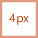

# Рекомендации по использованию значков монострочного стиля для надстроек Office

В приложениях Office используется монострочный стиль. Если вы предпочитаете, чтобы значки соответствовали актуальному стилю бессрочной версии Office 2013 и более поздних версий, см. рекомендации по использованию значков "Новый стиль" для [надстроек Office](add-in-icons-fresh.md).

## Визуальный стиль Монолайна Office

Цель монолинейного стиля — единообразный, понятный и доступный значок для взаимодействия действий и функций с помощью простых визуальных элементов, обеспечения доступности значков для всех пользователей и согласованности стилей, используемых в других средах Windows.

Ниже приведены рекомендации для сторонних разработчиков, которые хотят создавать значки для функций, которые будут согласованы со значками, уже представленными в продуктах Office.

### Принципы оформления

- Простой, чистый, понятный.
- Содержит только необходимые элементы.
- На основе стиля значка Windows.
- Доступно для всех пользователей.

#### Передать значение

- Используйте описательные элементы, такие как страница, для представления документа или конверта для представления почты.
- Используйте один и тот же элемент для представления одной и той же концепции, то есть почта всегда представлена конвертом, а не меткой.
- Используйте основную концепцию во время разработки концепции.

#### Сокращение элементов

- Уменьшите значение значка до его основного значения, используя только элементы, необходимые для использования в образе.
- Ограничив количество элементов в значке двумя, независимо от размера значка.

#### Согласованности

Размеры, расположение и цвет значков должны быть согласованными.

#### Стиль

##### Perspective

По умолчанию значки монострочного формата имеют прямой интерфейс. Допустимы некоторые элементы, которым требуется перспектива и (или) поворот, например куб, но исключения должны быть минимальными.

##### Украшение

Monoline — это чистый минимальный стиль. Все использует плоский цвет, что означает отсутствие градиентов, текстур или источников света.

## Проектирование

### Размеры

Мы рекомендуем создавать каждый значок всех этих размеров для поддержки устройств с высоким разрешением. Абсолютно *необходимые размеры* : 16 px, 20 px и 32 px, так как это 100 % размеров.

**16 px, 20 px, 24 px, 32 px, 40 px, 48 px, 64 px, 80 px, 96 px**

> [!IMPORTANT]
> Изображение, которое является значком представителя надстройки, см. в статье "Создание эффективных описаний в [AppSource и Office](/office/dev/store/create-effective-office-store-listings#create-an-icon-for-your-add-in) для получения сведений о размере и других требованиях".

### Макет

Ниже приведен пример макета значка с модификатором.

  

#### Элементы

- **Базовая**: основная концепция, представленная значком. Обычно это единственный визуальный элемент, необходимый для значка, но иногда основную концепцию можно улучшить с помощью дополнительного элемента, модификатора.

- **Модификатор** Любой элемент, который накладывает основание; То есть модификатор, который обычно представляет действие или состояние. Он изменяет базовый элемент, выполнив функцию сложения, изменения или дескриптора.

### Строительство

#### Размещение элементов

Базовые элементы помещаются в центр значка в заполнении. Если его нельзя разместить по центру, то база должна перенаровно справа вверху. В следующем примере значок идеально выравнивается по центру.

В следующем примере значок находится в левой части экрана.

Модификаторы почти всегда помещаются в правый нижний угол холста значка. В некоторых редких случаях модификаторы помещаются в другой угол. Например, если базовый элемент будет нераспознаваемым с модификатором в правом нижнем углу, рассмотрите возможность его размещения в левом верхнем углу.

#### Заполнение

Каждый значок размера имеет указанный объем заполнения вокруг значка. Базовый элемент остается в пределах отступа, но модификатор должен быть приопределяться до края холста, расширяя его за пределы отступа до края границы значка. На следующих изображениях показано рекомендуемое заполнение для каждого размера значка.

|**16 пк**|**20 пк**|**24 пк**|**32 пк**|**40 пк**|**48 пк**|**64 пк**|**80 пк**|**96 пикселей**|
|:---|:---|:---|:---|:---|:---|:---|:---|:---|
||||||||||

#### Весовые коэффициенты линии

Monoline — это стиль, на который наложены линии и контурные фигуры. В зависимости от размера, который вы создаете, значок должен использовать следующие весовые коэффициенты строки.

|Размер значка:|16 пк|20 пк|24 пк|32 пк|40 пк|48 пк|64 пк|80 пк|96 пикселей|
|:---|:---|:---|:---|:---|:---|:---|:---|:---|:---|
|**Толщина линии:**|1 пк|1 пк|1 пк|1 пк|2 пк|2 пк|2 пк|2 пк|3 пк|
|**Пример значка:**||||||||||

#### Вырезы

Когда элемент значка помещается поверх другого элемента, вырезание (нижнего элемента) используется для предоставления пространства между двумя элементами, главным образом в целях удобочитаемости. Обычно это происходит, когда модификатор помещается поверх базового элемента, но в некоторых случаях ни один из элементов не является модификатором. Эти вырезания между двумя элементами иногда называются пробелами.

Размер зазора должен совпадать с шириной линии, используемой для этого размера. Если создать значок 16 пикселей, ширина зазора будет 1 пкс, а если это значок 48 пикселей, то зазор должен быть 2 пкс. В следующем примере показан значок 32 пикселей с зазором 1 пкс между модификатором и базовой базой.

В некоторых случаях разрыв может увеличиться на 1/2 пикселя, если модификатор имеет диагональный или изогнутый край, а стандартный зазор не обеспечивает достаточное разделение. Скорее всего, это повлияет только на значки с 1 ПКС: 16 пикселей, 20 пикселей, 24 пикселя и 32 пикселя.

#### Фоновые заливки

Большинство значков в наборе значков Monoline требуют заливки фона. Однако в некоторых случаях объект не имеет заливки, поэтому не следует применять заливку. Следующие значки имеют белый цвет заливки.

Следующие значки не заполняются. (Значок шестеренки включается, чтобы показать, что центральное отверстия не заполнено.)

##### Рекомендации по заполняемой заливки

###### Что можно делать

- Заполните любой элемент с определенной границей и естественным образом заполните его.
- Для создания заливки фона используйте отдельную фигуру.
- Используйте **фоновую заливку** из [цветовой палитры](#color).
- Сохраняйте разделение пикселей между перекрывающимися элементами.
- Заполнение между несколькими объектами.

###### Чего не следует делать

- Не заполняйте объекты, которые не были бы заполнены естественным образом; Например, скрепка.
- Не заполняйте квадратные скобки.
- Не заполняйте цифры или альфа-символы.

### Цвет

Цветовая палитра разработана для простоты и специальных возможностей. Он содержит 4 нейтральных цвета и два варианта для синего, зеленого, желтого, красного и фиолетового цветов. Оранжевый цвет намеренно не включен в цветовую палитру значков Monoline. Каждый цвет предназначен для использования определенными способами, как описано в этом разделе.

#### Палитры

#### Использование цвета

В цветовой палитре monoline все цвета имеют автономные варианты, контура и заливки. Как правило, элементы создаются с заливкой и границей. Цвета применяются в одном из следующих шаблонов.

- Автономный цвет для объектов без заливки.
- Граница использует цвет контура, а заливка использует цвет заливки.
- Граница использует автономный цвет, а заливка — цвет заливки фона.

Ниже приведены примеры использования цвета.

Наиболее распространенной ситуацией будет использование элементом автономного темно-серого цвета с фоновой заливкой.

При использовании цветной заливки он всегда должен иметь соответствующий цвет контура. Например, синяя заливка должна использоваться только с синей структурой. Но есть два исключения из этого общего правила.

- Фоновую заливку можно использовать с любым автономным цветом.
- Светло-серая заливка может использоваться с двумя разными цветами контура: темно-серым или средне-серым.

#### Когда следует использовать цвет

Цвет должен использоваться для передачи значения значка, а не для хлама. Он должен **выделить действие** для пользователя. При добавлении модификатора к базовому элементу с цветом базовый элемент обычно становится темно-серым и фоновой заливкой, поэтому модификатор может быть элементом цвета, например в приведенном ниже примере с модификатором "X", добавляемым в основание рисунка в левом значке следующего набора.

Следует ограничить значки одним **дополнительным** цветом, кроме упомянутых выше элементов "Контур" и "Заливка". Однако можно использовать больше цветов, если это крайне важно для его концепция, с ограничением в два дополнительных цвета, отличных от серого. В редких случаях существуют исключения, когда требуется больше цветов. Ниже приведены хорошие примеры значков, использующих только один цвет.

  

Но на следующих значках используется слишком много цветов.

  

Используйте **средний серый** цвет для внутреннего "содержимого", например линий сетки на значке электронной таблицы. Дополнительные внутренние цвета используются, когда содержимое должно отображать поведение элемента управления.

#### Текстовые строки

Если текстовые строки находятся в "контейнере" (например, текст в документе), используйте средне-серый цвет. Текстовые строки, не вмещающие контейнер, должны быть **темно-серыми**.

### Текст

Избегайте использования текстовых символов в значках. Так как продукты Office используются по всему миру, мы хотим, чтобы значки были как можно более нейтральными на языке.

## Производство

### Формат файла значка

Окончательные значки должны сохраняться в виде .png файлов изображений. Используйте формат PNG с прозрачным фоном и 32-разрядной глубиной.

## См. также

- [Элемент манифеста значка](/javascript/api/manifest/icon)
- [Элемент манифеста IconUrl](/javascript/api/manifest/iconurl)
- [Элемент манифеста HighResolutionIconUrl](/javascript/api/manifest/highresolutioniconurl)
- [Создание значка для надстройки](/office/dev/store/create-effective-office-store-listings#create-an-icon-for-your-add-in)
