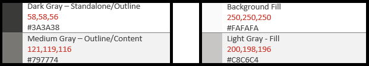
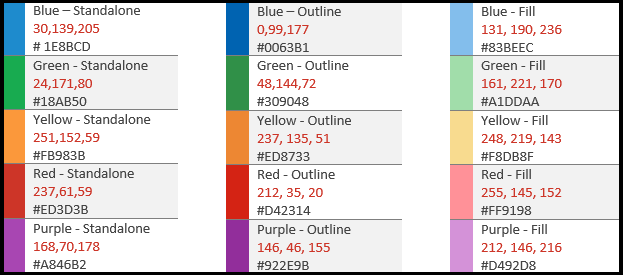

# Рекомендации по использованию значка стиля "inline" для надстроек Office

Стиль значки, который используется в Office 365. Если вы предпочитаете, чтобы значки выглядели как неактуальный стиль Office 2013, не относящегося к подписке, обратитесь к разделу [новые рекомендации по использованию значков стилей для надстроек Office](add-in-icons-fresh.md).

## Линейный визуальный стиль Office

Цель стиля "линейный" для обеспечения согласованных, ясных и доступных значки для общения действий и функций с простыми визуальными элементами, обеспечения доступности значков для всех пользователей и стиля, согласованного с теми, которые используются в других окнах Windows.

Следующие рекомендации предназначены для сторонних разработчиков, которые хотят создать значки для функций, которые будут согласованы с уже присутствующими продуктами Office.

### Принципы разработки

-   Простой, чистый, ясный.
-   Содержать только необходимые элементы.
-   Стиль значков Windows.
-   Доступен всем пользователям.

#### Передающееся значение

-   Используйте элементы с описанием, например страницу, чтобы представить документ или конверт для представления почты.
-   Используйте один и тот же элемент для представления той же концепции, т.е. почта всегда представлена конвертом, а не штампом.
-   Используйте базовую метафору во время разработки концепции.

#### Сокращение элементов

-   Сократите значок до основного значения, используя только те элементы, которые необходимы для метафоры.
-   Ограничьте количество элементов в значке двумя, независимо от размера значка.

#### Обнаружен

Размеры, расположение и цвет значков должны быть согласованы.

#### Изменении

##### Perspective

По умолчанию значки с фиксированной линейкой перемещаются вперед. Некоторые элементы, требующие перспективы и/или вращения, такие как куб, разрешены, но исключения должны быть сохранены как минимум.

##### Надстрочные знаки

"Однострочный" — чистый простой стиль. Все использует плоский цвет, что означает, что нет градиентов, текстур или источников света.

## Работ

### Масштаба

Для поддержки устройств с высоким разрешением рекомендуется создать каждый значок на всех этих размерах. Крайне *обязательные* размеры — 16px, 20px и интервалами по 32, так как размер 100%.

**16px, 20px, интервалами по 24, интервалами по 32, 40px, 48px, 64px, 80px, 96px**

### Макет

Ниже приведен пример макета значков с модификатором.

  

#### Элементы

- **Основание**: основная концепция, которую представляет значок. Обычно это единственный визуальный элемент, который требуется для значка, но иногда его можно улучшить с помощью дополнительного элемента, модификатора.

- **Модификатор** Любой элемент, перекрывающих базовый; то есть модификатор, который обычно представляет действие или состояние. Он изменяет базовый элемент, выполняя в качестве дополнения, изменения или дескриптора.

### Строительство

#### Размещение элементов

Базовые элементы размещаются в центре значка в пределах заполнения. Если он не может быть разработано по центру, то основной правый раздел должен находиться в начале. В следующем примере значок идеально выравнивается по центру:

В следующем примере значок ерринг слева.

Модификаторы почти всегда располагаются в правом нижнем углу холста значка. В некоторых редких случаях модификаторы размещаются в другой угол. Например, если базовый элемент не распознается с помощью модификатора в правом нижнем углу, его можно разместить в левом верхнем углу.

#### Внутренние поля

Каждый значок размера имеет заданный объем заполнения вокруг значка. Базовый элемент остается в пределах заполнения, но модификатор должен Бутт до края холста, расширяя за пределы заполнения---до края границы значка. На следующих изображениях показана Рекомендуемая величина заполнения, используемая для каждого размера значков.

|**16 пк**|**20 пк**|**24 пк**|**32 пк**|**40 пк**|**48 пк**|**64 пк**|**80 пк**|**96px**|
|:---|:---|:---|:---|:---|:---|:---|:---|:---|
||||||||||

#### Толщина линий

"Inline" — это стиль, который облагаются строкой и контурными фигурами. В зависимости от размера, который вы создаете значок, должен использовать следующие веса линии.

|**Размер значка:**|**16 пк**|**20 пк**|**24 пк**|**32 пк**|**40 пк**|**48 пк**|**64 пк**|**80 пк**|**96px**|
|:---|:---|:---|:---|:---|:---|:---|:---|:---|:---|
|**Толщина линии:**|1 пк|1 пк|1 пк|1 пк|2 пк|2 пк|2 пк|2 пк|3 пк|
|||||||||||

#### Контуры

Когда элемент Icon помещается поверх другого элемента, используется отрезки (элемента нижнего элемента) для предоставления промежутка между двумя элементами, в основном для удобства чтения. Обычно это происходит, когда модификатор помещается поверх базового элемента, но существуют также случаи, когда ни один из элементов не является модификатором. Эти отрезки между двумя элементами иногда называют "пропуском".

Размер зазора должен совпадать с шириной линии, используемой для этого размера. При создании значка 16px ширина зазора будет 1 ПКС, а если это значок 48px, то зазор должен быть 2 ПКС. В следующем примере показан значок интервалами по 32 с разрывом 1 ПКС между модификатором и базовым основанием.

В некоторых случаях зазор может быть увеличен на 1/2 ПКС, если у модификатора есть диагональный или изогнутый край, а стандартный зазор не обеспечивает достаточного расстояния. Скорее всего, они повлияют только на значки с 1 пксной толщиной линии; 16px, 20px, интервалами по 24 и интервалами по 32.

#### Заливка фона

Для большинства значков в наборе значков в виде линии требуются фоновые заливки. Однако в некоторых случаях нет необходимости применять заливку для объекта. Следующие значки имеют белую заливку:

Следующие значки не имеют заливки. (Значок шестеренки включается, чтобы показать, что не заполнено Центральная дыра.) 

##### Рекомендации по заполнению

###### Задач

- Заполните любой элемент, который имеет определенную границу, и, естественно, имеет заливку.
- Используйте отдельную фигуру, чтобы создать фоновую заливку.
- Используйте **фоновую заливку** из [цветовой палитры](#color).
- Поддерживать разделение точек между перекрывающимися элементами.
- Заливка между несколькими объектами.

###### Запреты

- Не заполняйте объекты, которые не должны быть заполнены. Например, скрепка.
- Не заполняйте заполнять скобки.
- Не заполняйте заливку за пределами чисел или буквенных символов.

### Цвет

Цветовая палитра разработана для простоты и специальных возможностей. Он содержит 4 нейтральные цвета и два варианта для синего, зеленого, желтого, красного и фиолетового. Оранжевый цвет, намеренно не включен в цветовую палитру значков в виде строки. Каждый цвет предназначен для определенных способов, как описано в этом разделе.

#### Произвольная

#### Использование цвета

В цветовой палитре все цвета имеют отдельные варианты, структуры и заливки. Как правило, элементы создаются с заливкой и границей. Цвета применяются в одном из следующих шаблонов:

- Отдельный цвет для объектов, не имеющих заливки.
- Рамка использует цвет контура, а заливка использует цвет заливки.
- Граница использует отдельный цвет, а заливка использует цвет заливки фона.

Ниже приведены примеры использования Color.

Наиболее распространенной ситуацией будет использование темно-серого элемента с заливкой фона.

При использовании цветной заливки он должен всегда соответствовать соответствующему цвету контура. Например, синяя заливка должна использоваться только с синей структурой. Но существует два исключения из этого общего правила:

- Фоновую заливку можно использовать с отдельными цветами.
- Светло-серая заливка можно использовать с двумя различными цветовыми контурами: темно-серый или средний серый.

#### Когда следует использовать Color

Цвет должен использоваться для передачи значения значка, а не для надстрочных знаков. Он должен **выделить действие** для пользователя. Когда в базовый элемент, имеющий цвет, добавляется модификатор, базовый элемент обычно включается в темно-серый и фоновую заливку, чтобы модификатор мог быть элементом Color, например, с помощью модификатора "X", добавляемого к разделу "изображение" в крайнем левом значке следующего набора.

Вы должны ограничить значки **одним** дополнительным цветом, кроме контура и закрашивания, упомянутого выше. Однако можно использовать дополнительные цвета, если это важно для метафоры, с предельным числом двух дополнительных цветов, отличных от серого. В редких случаях существуют исключения, когда требуется больше цветов. Ниже приведены хорошие примеры значков, использующих только один цвет.

  

Но следующие значки используют слишком много цветов.

  

Используйте **средний серый цвет** для внутреннего "содержимого", например линий сетки, в виде значка электронной таблицы. Дополнительные внутренние цвета используются, когда контент должен показывать поведение элемента управления.

#### Строки текста

Если текстовые строки находятся в контейнере (например, текст в документе), используйте средний серый цвет. Текстовые строки, отсутствующие в контейнере, должны быть **темнее серого цвета**.

### Текст

Избегайте использования текстовых символов в значках. Так как продукты Office используются по всему миру, мы хотим, чтобы значки были как можно более независящими от языка.

## Производственная среда

### Формат файлов значков

Последние значки необходимо сохранить в виде PNG-файлов. Используйте формат PNG с прозрачным фоном и за32-разрядная глубина.
