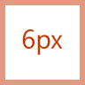

# Руководство по значкам стилей Monoline для надстройок OfficeMonoline style icon guidelines for Office Add-ins

Иконография стилей Monoline используется в приложениях Office.Monoline style iconography are used in Office apps. Если вы предпочитаете, чтобы значки совпадали со стилем Fresh для Office 2013+, см. рекомендации по значкам в стиле Fresh для [надстройок Office.](add-in-icons-fresh.md)If you would prefer that your icons match the Fresh style of non-subscription Office 2013+, see [Fresh style icon guidelines for Office Add-ins](add-in-icons-fresh.md).

## Визуальный стиль Office MonolineOffice Monoline visual style

Цель стиля Monoline — иметь согласованную, четкую и доступную иконографию для связи действий и функций с помощью простых визуальных эффектов, обеспечения доступности значков для всех пользователей и стиля, соответствующего тем, которые используются в других частях Windows.The goal of the Monoline style to have consistent, clear, and accessible iconography to communicate action and features with simple visuals, ensure the icons are accessible to all users, and have a style that is consistent with those used elsewhere in Windows.

Ниже представлены рекомендации для сторонних разработчиков, которые хотят создать значки для функций, которые будут соответствовать значкам, уже представленным продуктам Office.The following guidelines are for 3rd party developers who want to create icons for features that will be consistent with the icons already present Office products.

### Принципы разработкиDesign principles

- Простой, чистый, понятный.Simple, clean, clear.
- Содержит только необходимые элементы.Contain only necessary elements.
- Вдохновленный стилем значка Windows.Inspired by Windows icon style.
- Доступно для всех пользователей.Accessible to all users.

#### Передающее значениеConveying meaning

- Используйте описательные элементы, такие как страница, чтобы представлять документ или конверт для представления почты.Use descriptive elements such as a page to represent a document or an envelope to represent mail.
- Используйте один и тот же элемент для представления одной и той же концепции, то есть почта всегда представлена конвертом, а не штампом.Use the same element to represent the same concept, i.e., mail is always represented by an envelope, not a stamp.
- Используйте основную метафору во время разработки концепции.Use a core metaphor during concept development.

#### Уменьшение элементовReduction of Elements

- Уменьшите значок до основного значения, используя только элементы, необходимые для метафоры.Reduce the icon to its core meaning, using only elements that are essential to the metaphor.
- Ограничить число элементов в значке двумя, независимо от размера значка.Limit the number of elements in an icon to two, regardless of icon size.

#### СогласованностьConsistency

Размеры, расположение и цвет значков должны быть последовательными.Sizes, arrangement, and color of icons should be consistent.

#### СтильStyling

##### PerspectivePerspective

Значки Monoline по умолчанию имеют передовую линию.Monoline icons are forward-facing by default. Допускаются некоторые элементы, которые требуют перспективы и/или вращения, например куба, но исключения следует совмещение.Certain elements that require perspective and/or rotation, such as a cube, are allowed, but exceptions should be kept to a minimum.

##### ПриукрашиваниеEmbellishment

Monoline — это чистый минимальный стиль.Monoline is a clean minimal style. Все использует плоский цвет, что означает отсутствие градиентов, текстур или источников света.Everything uses flat color, which means there are no gradients, textures, or light sources.

## ПроектированиеDesigning

### РазмерыSizes

Мы рекомендуем создавать каждый значок всех этих размеров для поддержки устройств с высоким уровнем DPI.We recommend that you produce each icon in all these sizes to support high DPI devices. Абсолютно *необходимые* размеры 16 px, 20 px и 32 px, так как это 100% размеров.The absolutely *required* sizes are 16 px, 20 px, and 32 px, as those are the 100% sizes.

**16 px, 20 px, 24 px, 32 px, 40 px, 48 px, 64 px, 80 px, 96 px****16 px, 20 px, 24 px, 32 px, 40 px, 48 px, 64 px, 80 px, 96 px**

> [!IMPORTANT]
> Для изображения, которое является символом представительства надстройки, см. в статью Создание эффективных списков в [AppSource](/office/dev/store/create-effective-office-store-listings#create-an-icon-for-your-add-in) и Office для размера и других требований.For an image that is your add-in's representative icon, see [Create effective listings in AppSource and within Office](/office/dev/store/create-effective-office-store-listings#create-an-icon-for-your-add-in) for size and other requirements.

### МакетLayout

Ниже приводится пример макета значков с модификатором.The following is an example of icon layout with a modifier.

  

#### ЭлементыElements

- **База.** Основная концепция, которую представляет значок.**Base**: The main concept that the icon represents. Обычно это единственный визуальный элемент, необходимый для значка, но иногда основная концепция может быть улучшена с помощью дополнительного элемента, модификатора.This is usually the only visual needed for the icon, but sometimes the main concept can be enhanced with a secondary element, a modifier.

- **Модификатор** Любой элемент, наложение на базу; то есть модификатор, который обычно представляет действие или состояние.**Modifier** Any element that overlays the base; that is, a modifier that typically represents an action or a status. Он изменяет базовый элемент, выступая в качестве добавления, изменения или дескриптора.It modifies the base element by acting as an addition, alteration, or a descriptor.

### СтроительствоConstruction

#### Размещение элементовElement placement

Базовые элементы размещаются в центре значка в обивке.Base elements are placed in the center of the icon within the padding. Если он не может быть размещен идеально центр, то база должна err в правом верхнем.If it can't be placed perfectly centered, then the base should err to the top right. В следующем примере иконка идеально центризолась.In the following example, the icon is perfectly centered.

В следующем примере значок забвещается влево.In the following example, the icon is erring to the left.

Модификаторы почти всегда размещаются в правом нижнем углу холста значков.Modifiers are almost always placed in the bottom right corner of the icon canvas. В некоторых редких случаях модификаторы помещаются в другой угол.In some rare cases, modifiers are placed in a different corner. Например, если базовый элемент будет неузнаваем с модификатором в правом нижнем углу, то рассмотрите возможность его размещения в верхнем левом углу.For example, if the base element would be unrecognizable with the modifier in the bottom right corner, then consider placing it in the upper left corner.

#### ОбивкаPadding

Каждый значок размера имеет определенное количество обивки вокруг значка.Each size icon has a specified amount of padding around the icon. Базовый элемент остается в области обивки, но модификатор должен прикладом до края холста, простираясь за пределы обивки до края границы значка.The base element stays within the padding, but the modifier should butt up to the edge of the canvas, extending outside of the padding to the edge of the icon border. На следующих изображениях покажите рекомендуемую обивку для каждого из размеров значка.The following images show the recommended padding to use for each of the icon sizes.

|**16 пк****16px**|**20 пк****20px**|**24 пк****24px**|**32 пк****32px**|**40 пк****40px**|**48 пк****48px**|**64 пк****64px**|**80 пк****80px**|**96px****96px**|
|:---|:---|:---|:---|:---|:---|:---|:---|:---|
||||||||||

#### Весы строкиLine weights

Monoline — это стиль, в котором преобладают линии и контурные фигуры.Monoline is a style dominated by line and outlined shapes. В зависимости от размера, который вы производите, значок должен использовать следующие весы строки.Depending on what size you are producing the icon should use the following line weights.

|Размер значка:Icon Size:|16 пк16px|20 пк20px|24 пк24px|32 пк32px|40 пк40px|48 пк48px|64 пк64px|80 пк80px|96px96px|
|:---|:---|:---|:---|:---|:---|:---|:---|:---|:---|
|**Вес строки:****Line Weight:**|1 пк1px|1 пк1px|1 пк1px|1 пк1px|2 пк2px|2 пк2px|2 пк2px|2 пк2px|3 пк3px|
|**Значок примера:****Example icon:**||||||||||

#### ВырезыCutouts

Когда элемент значка помещается поверх другого элемента, вырез (нижнего элемента) используется для предоставления пространства между двумя элементами, главным образом для целей читаемости.When an icon element is placed on top of another element, a cutout (of the bottom element) is used to provide space between the two elements, mainly for readability purposes. Это обычно происходит, когда модификатор помещается поверх базового элемента, но есть также случаи, когда ни один из элементов не является модификатором.This usually happens when a modifier is placed on top of a base element, but there are also cases where neither of the elements is a modifier. Эти вырезы между двумя элементами иногда называются "разрывом".These cutouts between the two elements is sometimes referred to as a "gap".

Размер зазора должен быть такой же шириной, как и вес строки, используемый для этого размера.The size of the gap should be the same width as the line weight used on that size. Если сделать значок 16 px, ширина пробела будет 1px, а если это значок 48 px, то разрыв должен быть 2px.If making a 16 px icon, the gap width would be 1px and if it is a 48 px icon then the gap should be 2px. В следующем примере показан значок 32 px с разрывом в 1px между модификатором и базовой базой.The following example shows a 32 px icon with a gap of 1px between the modifier and the underlying base.

В некоторых случаях разрыв может быть увеличен на 1/2 px, если модификатор имеет диагональный или изогнутый край, а стандартный разрыв не обеспечивает достаточного разделения.In some cases, the gap can be increase by a 1/2 px if the modifier has a diagonal or curved edge and the standard gap doesn't provide enough separation. Это, скорее всего, повлияет только на значки с весом строки 1px: 16 px, 20 px, 24 px и 32 px.This will likely only affect the icons with 1px line weight: 16 px, 20 px, 24 px, and 32 px.

#### Заполнение фонаBackground fills

Большинство значков в наборе значков Monoline требуют заполнения фона.Most icons in the Monoline icon set require background fills. Однако существуют случаи, когда объект не имеет естественного заполнения, поэтому не следует применять заливки.However, there are cases where the object would not naturally have a fill, so no fill should be applied. Следующие значки имеют белый заливки.The following icons have a white fill.

Следующие значки не заполняются.The following icons have no fill. (Значок передач включен, чтобы показать, что центральное отверстие не заполнено.)(The gear icon is included to show that the center hole is not filled.)

##### Лучшие практики для заполненияBest practices for fills

###### Dos:Dos:

- Заполните любой элемент с определенной границей и естественным образом заполните его.Fill any element that has a defined boundary, and would naturally have a fill.
- Для создания фонового заполнения используйте отдельную форму.Use a separate shape to create the background fill.
- Используйте **фоновое заполнение** [из цветовой палитры](#color).Use **Background Fill** from the [color palette](#color).
- Сохранение разделения пикселей между перекрывающимися элементами.Maintain the pixel separation between overlapping elements.
- Заполните между несколькими объектами.Fill between multiple objects.

###### Не нужно:Don'ts:

- Не заполняйте объекты, которые естественно не заполняются; например, сальто.Don't fill objects that would not naturally be filled; for example, a paperclip.
- Не заполняйте скобки.Don't fill brackets.
- Не заполняйте номера или альфа-символы.Don't fill behind numbers or alpha characters.

### ЦветColor

Цветовая палитра разработана для простоты и доступности.The color palette has been designed for simplicity and accessibility. Он содержит 4 нейтральных цвета и два варианта для синего, зеленого, желтого, красного и фиолетового цветов.It contains 4 neutral colors and two variations for blue, green, yellow, red, and purple. Оранжевый цвет намеренно не входит в цветовую палитру значков Monoline.Orange is intentionally not included in the Monoline icon color palette. Каждый цвет предназначен для использования определенными способами, как описано в этом разделе.Each color is intended to be used in specific ways as outlined in this section.

#### ПалитраPalette

#### Использование цветаHow to use color

В цветовой палитре Monoline все цвета имеют автономные, контурные и заполняемые варианты.In the Monoline color palette, all colors have Standalone, Outline, and Fill variations. Как правило, элементы построены с заполнием и границей.Generally, elements are constructed with a fill and a border. Цвета применяются в одном из следующих шаблонов:The colors are applied in one of the following patterns:

- Автономный цвет для объектов без заполнения.The Standalone color alone for objects that have no fill.
- На границе используется цвет Outline, а для заполнения используется цвет Fill.The border uses the Outline color and the fill uses the Fill color.
- На границе используется автономный цвет, а для заполнения используется цвет Фоновое заполнение.The border uses the Standalone color and the fill uses the Background Fill color.

Ниже приводится пример использования цвета.The following are examples of using color.

Наиболее распространенной ситуацией будет использование элемента Темно-серый автономный с фоновой заливки.The most common situation will be to have an element use Dark Gray Standalone with Background Fill.

При использовании цветной заливки он всегда должен быть с соответствующим цветом Outline.When using a colored Fill, it should always be with its corresponding Outline color. Например, Blue Fill следует использовать только с помощью Blue Outline.For example, Blue Fill should only be used with Blue Outline. Но есть два исключения из этого общего правила:But there are two exceptions to this general rule:

- Фоновое заполнение можно использовать с любым автономным цветом.Background Fill can be used with any color Standalone.
- Светло-серый заливка может использоваться с двумя разными цветами Outline: темно-серый или средний серый.Light Gray Fill can be used with two different Outline colors: Dark Gray or Medium Gray.

#### Когда использовать цветWhen to use color

Цвет должен использоваться для передачи значения значка, а не для украшения.Color should be used to convey the meaning of the icon rather than for embellishment. Он должен **выделить действие** пользователю.It should **highlight the action** to the user. При добавлении модификатора в базовый элемент с цветом базовый элемент обычно превращается в темно-серый и фоновый, так что модификатор может быть элементом цвета, например в случае ниже с модификатором "X", который добавляется в базу изображений в левом значке следующего набора.When a modifier is added to a base element that has color, the base element is typically turned into Dark Gray and Background Fill so that the modifier can be the element of color, such as the case below with the "X" modifier being added to the picture base in the leftmost icon of the following set.

Вы должны ограничить значки **одним дополнительным** цветом, кроме описанных выше набросков и заливки.You should limit your icons to **one** additional color, other than the Outline and Fill mentioned above. Тем не менее, больше цветов можно использовать, если это жизненно важно для его метафоры, с ограничением двух дополнительных цветов, кроме серого.However, more colors can be used if it is vital for its metaphor, with a limit of two additional colors other than gray. В редких случаях существуют исключения, когда требуется больше цветов.In rare cases, there are exceptions when more colors are needed. Ниже приводится хороший пример значков, которые используют только один цвет.The following are good examples of icons that use just one color.

  

Но в следующих значках используется слишком много цветов.But the following icons use too many colors.

  

Используйте **medium Gray** для внутреннего "контента", например линий сетки в значке таблицы.Use **Medium Gray** for interior "content", such as grid lines in an icon of a spreadsheet. Дополнительные цвета интерьера используются, когда содержимое должно показывать поведение управления.Additional interior colors are used when the content needs to show the behavior of the control.

#### Текстовые строкиText lines

Если текстовые строки находятся в "контейнере" (например, текст на документе), используйте средне-серый цвет.When text lines are in a "container" (for example, text on a document), use medium gray. Текстовые строки, не в контейнере, должны быть **темно-серыми.**Text lines not in a container should be **Dark Gray**.

### ТекстText

Избегайте использования текстовых символов в значках.Avoid using text characters in icons. Так как продукты Office используются по всему миру, мы хотим сохранить значки как можно более нейтральными на языке.Since Office products are used around the world, we want to keep icons as language neutral as possible.

## ПроизводствоProduction

### Формат файла iconIcon file format

Конечные значки должны быть сохранены в качестве файлов изображений png.The final icons should be saved as .png image files. Используйте формат PNG с прозрачным фоном и 32-битной глубиной.Use PNG format with a transparent background and have 32-bit depth.

## См. такжеSee also

- [Элемент манифеста IconIcon manifest element](../reference/manifest/icon.md)
- [Элемент манифеста IconUrlIconUrl manifest element](../reference/manifest/iconurl.md)
- [Элемент манифеста HighResolutionIconUrlHighResolutionIconUrl manifest element](../reference/manifest/highresolutioniconurl.md)
- [Создание значка для надстройкиCreate an icon for your add-in](/office/dev/store/create-effective-office-store-listings#create-an-icon-for-your-add-in)
