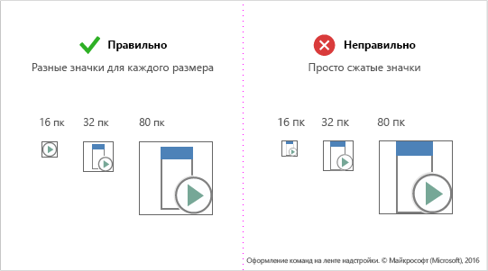
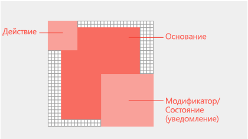

# Значки
Значки — это визуальное представление поведения или концепции. Они часто используются, чтобы отобразить предназначение элементов управления и команд. Визуальные элементы, реалистичные или символические, позволяют выполнять навигацию в пользовательском интерфейсе аналогично значкам в среде пользователя. Эти элементы должны быть простыми, четкими и содержать только необходимые сведения, чтобы пользователи могли быстро проанализировать, какое действие произойдет при выборе элемента управления.

Интерфейсы ленты Office отличаются стандартным визуальным стилем. Это поможет обеспечить знакомый пользователям единообразный интерфейс для всех приложений Office. Рекомендации помогут вам создать для своего решения набор ресурсов PNG, полностью совместимых с Office.

Многие контейнеры HTML содержат элементы управления со значками. Используйте пользовательский шрифт Office UI Fabric для отрисовки значков в стиле Office в своей надстройке. Шрифт значков Fabric содержит ряд глифов для распространенных метафор Office, к которым можно применить необходимые параметры масштабирования, цвета и стиля. Если у вас имеется визуальный язык с собственным набором значков, используйте его на своем полотне HTML. Обеспечение согласованности собственной фирменной символики со стандартным набором значков — важная часть любого языка дизайна. Не допускайте конфликтов с метафорами Office. Это облегчит работу пользователей и поможет избежать путаницы.

## Создание значков для команд надстроек

С помощью [команд надстроек](add-in-commands.md) можно добавить кнопки, текст и значки в пользовательский интерфейс Office. Значки и метки для кнопок надстроек должны быть понятны и четко определять действие, которое выполняется при выборе пользователем команды. В этой статье приведены рекомендации, помогающие создавать значки, которые легко интегрируются в Office, и выбирать их стиль. 

## Принципы создания значков Office

Выпуск Office 2013 предусматривает использование других значков для клиентов Office на настольных ПК. Самое важное стилистическое изменение — сокращения. Новые значки предусматривают использование только основных смысловых элементов. Вспомогательные элементы, включая перспективу, градиенты и источник света, удалены. Упрощение значков способствует ускорению анализа команд и элементов управления. Придерживайтесь этого стиля, чтобы ваши надстройки максимально соответствовали Office.

Принципы создания значков Office: 

- современная интерпретация коллекции значков Office; 
- несмотря на новшества, значки остаются понятными и знакомыми;  
- простота и четкость. 

На следующем изображении показаны значки, к которым применены современные принципы создания.

## Рекомендации

При создании значков следуйте перечисленным ниже рекомендациям. 

|Правильно|Неправильно|
|:---|:---|
|Поддерживайте визуальные изображения простыми и понятными, указывающими на ключевой элемент (элементы) связи.| Не используйте артефакты, которые визуально искажают изображение значка.|
|Используйте язык значков Office для представления поведения или концепций.|Не используйте глифы Office UI Fabric для команд надстроек на ленте Office или в контекстных меню. Значки Fabric имеют собственный стиль, поэтому отличаются от остальных.|
|Повторно используйте общие визуальные метафоры Office, например кисть для форматирования или увеличительное стекло для поиска.|Не используйте повторно визуальные метафоры для различных команд. Добавление одинаковых значков для различных действий и концепций может привести к путанице. |
|Перерисуйте свои значки, чтобы уменьшить или увеличить их. Перерисуйте контуры, углы и скругленные края, чтобы повысить четкость линий. |Не изменяйте размеры значков, сжимая или растягивая их. Это может привести к ухудшению визуального качества и непонятному изображению действий. Сложные значки, созданные в большем размере, могут потерять четкость при их уменьшении без перерисовки. |
|Используйте белую заливку для лучшего восприятия. Для большинства объектов, используемых в значках, необходим белый фон, чтобы они легко читались в темах пользовательского интерфейса Office, а также в режимах высокой контрастности.  ||
|Используйте формат PNG с прозрачным фоном. ||
|Избегайте использования в значках локализуемого содержимого, а также типографских символов, индикаторов абзацев без выравнивания и вопросительных знаков. ||

## Рекомендации и требования, применяющиеся к размерам значков

Значки Office на рабочем столе являются растровыми изображениями. Различные размеры будут отображаться в зависимости от установленного пользователем разрешения экрана и сенсорного режима. Используйте все восемь поддерживаемых размеров, чтобы обеспечить лучшее представление для всех поддерживаемых разрешений и контекстов. Ниже перечислены поддерживаемые размеры, из которых обязательными являются три:

- 16 пк (обязательный);
- 20 пк;
- 24 пк;
- 32 пк (обязательный);
- 40 пк;
- 48 пк;
- 64 пк (рекомендуется, лучший вариант для компьютера Mac);
- 80 пк (обязательный).  

Не сжимайте значки, а перерисуйте их для каждого размера.

<!--
The following table shows the icon sizes that render for different modes at different DPI settings.

|DPI |**Small**||**Medium**||**Large**||**Extra large**|
|:---|:---|:---|:---|:---|:---|:---|:---|
|    |**Mouse**|**Touch**|**Mouse**|**Touch**|**Mouse**|**Touch**|-|
|100%|16px|20px|24px||32px|40px|48px|
|125%|20px|24px|||40px|48px|60px|
|150%|24px|24px|36px||48px|48px|72px|
|200%|32px|40px|48px||64px|80px|96px|
|250%|40px||||80px||120px|
|300%|48px||||96px||144px

> [!NOTE]
> At DPI settings of 150% or greater, the icon does not get swapped out for a larger size when Touch mode is engaged. At DPI settings greater than 250%, Touch mode is turned off by default.

The following table lists the locations for certain icon sizes.

|Location|100% DPI|200% DPI|250% DPI|
|:-------|:-------|:-------|:-------|
|Small ribbon button|16px|32px|40px|
|Contextual menu|16px|32px|40px|
|Quick access toolbar (QAT)|16px|32px|40px|
|Large ribbon icon|32px|64px|80px|

-->

## Структура и схема значка

Значки Office обычно состоят из базового элемента с модификаторами действия и концептуальными модификаторами. Модификаторы действия представляют такие понятия, как "добавить", "открыть", "создать" или "закрыть". Концептуальные модификаторы представляют состояние, изменение или описание значка. 

Чтобы создать команды, соответствующие пользовательскому интерфейсу Office, следуйте рекомендациям по схеме расположения базовых элементов и модификаторов. Благодаря этому ваши команды будут выглядеть профессионально, а надстройка — надежно. Если вы не соблюдаете каких-либо рекомендаций, у вас на то должны быть веские основания.

На следующем изображении показана схема расположения базовых элементов и модификаторов для значка Office.

- Размещайте базовые элементы в центре пиксельной рамки, оставляя немного места по краям.
- Модификаторы действия располагайте в верхнем левом углу. 
- Концептуальные модификаторы размещайте в нижнем правом углу.
- Ограничивайте количество элементов в значках. В значках с размером 32 пк не добавляйте более двух модификаторов. В значках с размером 16 пк не добавляйте более одного модификатора.

###Отступ вокруг базового элемента
Размещайте базовые элементы единообразно для всех размеров. Если у вас не получается разместить базовые элементы в центре рамки, расположите их в левом верхнем углу, оставив несколько дополнительных пикселей в правом нижнем углу. Чтобы достичь наилучших результатов, воспользуйтесь рекомендациями по определению нужного отступа из приведенной ниже таблицы.

###Модификаторы
У всех модификаторов должен быть прозрачный контур (1 пк), граничащий с каждым элементом, включая фон. Элементы не должны сильно перекрывать друг друга. Создайте пустое пространство между метками и границами. Размеры модификаторов могут немного отличаться, но используйте указанные ниже числа в качестве отправной точки.

|**Размер значка**|**Отступ вокруг базового элемента**|**Размер модификатора**|
|:---|:---|:---|
|16 пк|0|9 пк|
|20 пк|1 пк|10 пк|
|24 пк|1 пк|12 пк|
|32 пк|2 пк|14 пк|
|40 пк|2 пк|20 пк|
|48 пк|3 пк|22 пк|
|64 пк|5 пк|29 пк|
|80 пк|5 пк|38 пк|

## Цвета значков

> [!NOTE]
> Эти руководства по цветам применяются к значкам ленты, используемым в [командах надстроек](add-in-commands.md). Эти значки не отрисовываются с помощью Microsoft UI Fabric, и цветовая палитра отличается от палитры, описанной на странице [Microsoft UI Fabric | Colors | Shared](https://fluentfabric.azurewebsites.net/#/color/shared).

Значки Office имеют ограниченную цветовую палитру. Чтобы обеспечить хорошую интеграцию значков в пользовательский интерфейс Office, используйте цвета, перечисленные в приведенной ниже таблице. Рекомендации по использованию цветов: 

- Используйте цвет, чтобы передать значение, а не для украшения. Цвет должен выделять или подчеркивать действие, состояние или элемент, которые явно отличают метку.  
- По возможности используйте только один дополнительный цвет кроме серого. Применяйте не больше двух дополнительных цветов.
- Используйте цвета единообразно для всех размеров значков. Цветовые палитры для значков Office незначительно отличаются в зависимости от размера значков. Значки с размером 16 пк и меньше немного темнее, а значки с размером 32 пк и больше — ярче. Если не учитывать эти незначительные корректировки, цвета могут варьироваться в зависимости от размеров значка.   

|**Название цвета**|**RGB**|**Шестнадцатеричный код**|**Цвет**|**Категория**|
|:---|:---|:---|:---|:---|
|Серый цвет текста (80)|80, 80, 80|#505050|  |Текст|
|Серый цвет текста (95)|95, 95, 95|#5F5F5F|  |Текст|
|Серый цвет текста (105)|105, 105, 105|#696969|  |Текст|
|Темно-серый (32)|128, 128, 128|#808080|  |32 и больше|
|умеренно серый (32)|158, 158, 158|#9E9E9E|  |32 и больше|
|Светло-серый (ВСЕ)|179, 179, 179|#B3B3B3|  |Все размеры|
|Темно-серый (16)|114, 114, 114|#727272|  |16 и меньше|
|Умеренно серый (16)|144, 144, 144|#909090|  |16 и меньше|
|Синий (32)|77, 130, 184|#4d82B8|  |32 и больше|
|Синий (16)|74, 125, 177|#4A7DB1|  |16 и меньше|
|Желтый (ВСЕ)|234, 194, 130|#EAC282|  |Все размеры|
|Оранжевый (32)|231, 142, 70|#E78E46|  |32 и больше|
|Оранжевый (16)|227, 142, 70|#E3751C|  |16 и меньше|
|Розовый (ВСЕ)|230, 132, 151|#E68497|  |Все размеры|
|Зеленый (32)|118, 167, 151|#76A797|  |32 и больше|
|Зеленый (16)|104, 164, 144|#68A490|  |16 и меньше|
|Красный (32)|216, 99, 68|#D86344|  |32 и больше|
|Красный (16)|214, 85, 50|#D65532|  |16 и меньше|
|Сиреневый (32)|152, 104, 185|#9868B9|  |32 и больше|
|Сиреневый (16)|137, 89, 171|#8959AB|  |16 и меньше|

## Значки в режимах высокой контрастности

Значки Office предназначены для использования в режимах высокой контрастности. Элементы переднего плана хорошо различимы на фоновых изображениях, что улучшает читаемость текста и позволяет применять перекрашивание. В режимах высокой контрастности в Office все пиксели красного, зеленого и синего цвета со значением менее 190 в значке перекрашиваются в черный цвет. Все остальные пиксели отображаются белыми. Другими словами, оцениваются все каналы RGB, в которых значения 0–189 отображаются черным цветом, а значения 190–255 — белым. В других темах с высокой контрастностью используемое пороговое значение также равно 190, но применяются другие правила. Например, в белой теме с высокой контрастностью все пиксели со значением больше 190 становятся непрозрачными, тогда как остальные пиксели остаются прозрачными. Чтобы улучшить читаемость при использовании параметров высокой контрастности, следуйте приведенным рекомендациям:

- Старайтесь разграничивать элементы переднего и заднего планов с учетом порогового значения 190.
- Следуйте стилям оформления значков Office.
- Используйте для значков цвета из нашей палитры.
- Не рекомендуется использовать градиенты.
- Избегайте больших блоков цветов с похожими значениями.

## См. также

- [Рекомендации по разработке надстроек](../concepts/add-in-development-best-practices.md)
- [Команды надстроек для Excel, Word и PowerPoint](../design/add-in-commands.md)

- Ваш логотип или торговая марка могут и не указывать на функции определенной команды надстройки. Торговые знаки не всегда можно легко узнать, если они обозначены значками меньшего размера, а также когда к ним применены модификаторы. Торговые знаки часто не соответствуют стилям значков ленты Office, поэтому по-разному привлекают внимание пользователей в среде, где существует множество различных товарных знаков.

