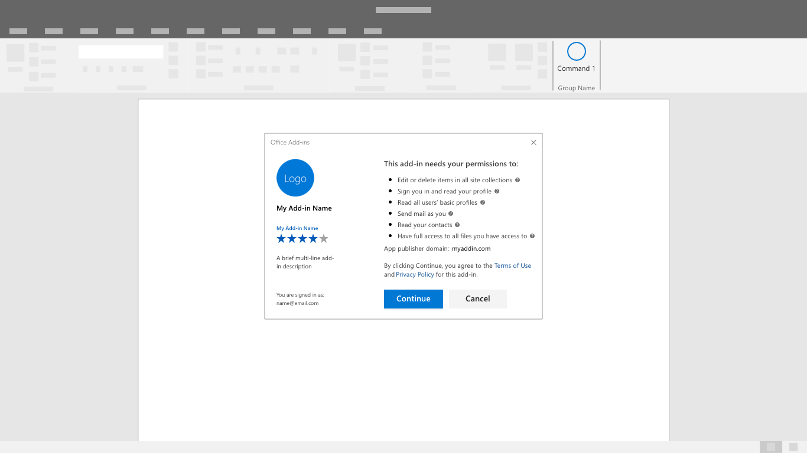

# Шаблоны аутентификации

Для получения доступа к функциям надстройки может требоваться вход или регистрация. В интерфейс часто встраиваются поля для ввода имени пользователя и пароля или кнопки, которые запускают сторонние потоки идентификации. Простая и эффективная аутентификация — важный первый шаг к началу работы с надстройкой.

## Рекомендации

|Правильно|Неправильно|
|:----|:----|
|Опишите значение надстройки или продемонстрируйте функции, не требуя создания учетной записи. |Не ожидайте, что пользователи выполнят вход, не понимая значения и преимуществ надстройки.|
|Направляйте пользователей, используя основную, хорошо видимую кнопку на каждом экране. |Не обращайте внимание на второстепенные и производные задачи с помощью конкурирующих кнопок и призывов к действию.|
|Используйте понятные подписи кнопок с указанием конкретных задач, например "Войти" или "Создать учетную запись".   |Не используйте абстрактные подписи, например "Отправить" или "Начать".|
|Используйте диалоговое окно, чтобы обратить внимание пользователей на формы аутентификации.    |Не перегружайте область задач инструкциями при первом запуске и формами аутентификации.|
|Добавьте небольшие полезные действия, например автофокусировку на полях ввода. |Не добавляйте ненужные шаги, например не требуйте нажимать на поля формы.|
|Предоставьте пользователям возможность выйти и пройти аутентификацию еще раз.    |Не заставляйте пользователей удалять надстройку, чтобы сменить учетную запись.|

## Последовательность аутентификации
Пока система единого входа находится на этапе тестирования, у пользователей должен быть выбор, как войти в производственную надстройку — непосредственно через вашу службу или через службу идентификации, например Майкрософт.

1. Первый запуск. Разместите кнопку для входа как четкий призыв к действию при первом запуске надстройки.

2. Диалоговое окно выбора службы идентификации. Покажите список служб идентификации, включая, при необходимости, форму для ввода имени пользователя и пароля. Пользовательский интерфейс вашей надстройки может быть заблокирован, когда открыто диалоговое окно аутентификации.

3. Вход через службу идентификации. Отобразится пользовательский интерфейс службы идентификации. Microsoft Azure Active Directory позволяет настроить страницы входа и панели доступа, чтобы они соответствовали оформлению вашей службы.  [Подробнее](https://docs.microsoft.com/azure/active-directory/fundamentals/customize-branding).

4. Ход выполнения. Показывайте ход загрузки параметров и пользовательского интерфейса.

> [!NOTE] 
> Используя службу идентификации Майкрософт, вы получите возможность использовать фирменную кнопку входа, которую можно настроить под светлую и темную темы.Узнайте больше.

## Последовательность аутентификации при едином входе (предварительная версия)

> [!NOTE]
> В настоящее время API единого входа поддерживается в тестовом режиме для Word, Excel, Outlook и PowerPoint. Дополнительную информацию о поддержке единого входа см. в статье  [Наборы требований IdentityAPI](https://docs.microsoft.com/office/dev/add-ins/reference/requirement-sets/identity-api-requirement-sets?view=office-js). Если вы работаете с надстройкой Outlook, обязательно включите современную проверку подлинности для клиента Office 365. Информацию о том, как это сделать, см. в статье  [Exchange Online: как включить в клиенте современную проверку подлинности](https://social.technet.microsoft.com/wiki/contents/articles/32711.exchange-online-how-to-enable-your-tenant-for-modern-authentication.aspx).

Когда единый вход будет доступен для производственных надстроек, используйте его, чтобы сделать надстройку удобнее для конечных пользователей. Для входа в надстройку используется учетная запись пользователя в Office (учетная запись Майкрософт или удостоверение Office 365). В результате пользователь входит только один раз. Это упрощает начало работы для пользователей.

1. Во время установки надстройки пользователь увидит окно запроса, подобное приведенному ниже. 
> [!NOTE]
> Издатель надстройки может выбирать логотип, строки и разрешения, включаемые в окно запроса. Пользовательский интерфейс определяет Майкрософт.

2. Надстройка загрузится после того, как пользователь предоставит разрешения. Она может извлечь и отобразить необходимую персонализированную информацию.

## См. также
- Узнайте больше о [разработке надстроек с единым входом (предварительная версия)](https://docs.microsoft.com/office/dev/add-ins/develop/sso-in-office-add-ins)