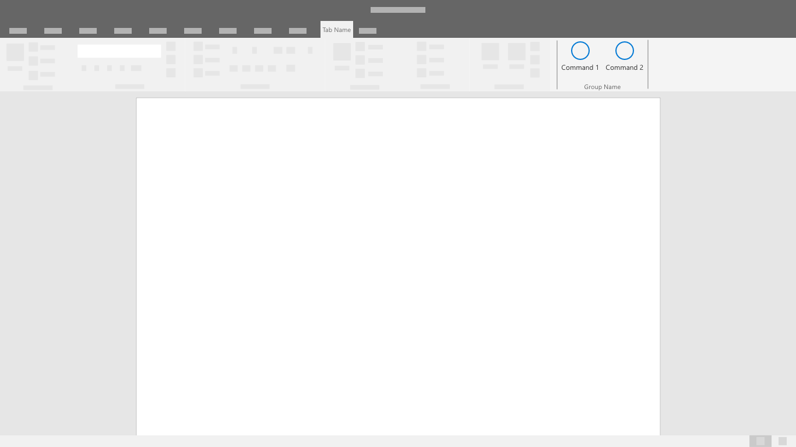

# Шаблоны проверки подлинности

Надстройки могут потребовать от пользователей входа или регистрации для доступа к свойствам и функциям. Ящики ввода для имени пользователя и пароля или кнопок, запускающих сторонние учетные потоки, являются общими элементами управления интерфейсом при проверке подлинности. Простой и эффективный процесс проверки подлинности является важным первым шагом к тому, чтобы пользователи начали с вашей надстройки.

## Рекомендации

|Правильно|Неправильно|
|:----|:----|
|Использовать проверку подлинности с единым входом (SSO) для аутентификации пользователей в вашей надстройке.|Сделать обязательным отдельный вход в надстройку (пользователи должны авторизоваться отдельно, не используя свою личную учетную запись Microsoft или учетную запись Office 365 (на работе или учебе)).|
|Перед авторизацией описать важность надстройки или продемонстрировать ее функциональность, не требуя создания учетной записи. |Быть готовым к тому, что пользователи будут авторизовываться, не понимая ценности и преимуществ надстройки.|
|Помогать пользователям пройти процесс аутентификации, разместив на каждом экране базовую, хорошо заметную кнопку. |Обращать внимание пользователей на второстепенные и третьестепенные задачи с помощью конкурирующих кнопок и кнопок с призывом к действию.|
|Использовать четкие ярлыки кнопок, описывающие конкретные задачи, например, «Войти» или «Создать учетную запись».   |Использовать неопределенные ярлыки кнопок, например, «Отправить» или «Начать», в процессе аутентификации пользователей.|
|Использовать диалоговое окно, чтобы сосредоточить внимание пользователей на формах проверки подлинности.    |Перегрузить свою панель задач с помощью первого запуска и форм проверки подлинности.|
|Найти небольшие элементы эффективности в процессе проверки подлинности, например, автоматическую фокусировку на полях ввода. |Добавить ненужные шаги в процесс взаимодействия, например, требование к пользователям нажимать на поля формы.|
|Предоставить пользователям возможность выхода из системы и повторной проверки подлинности.    |Заставить пользователей удалить надстройку, чтобы сменить пользователя.|

> [!NOTE]
> API единого входа в настоящее время поддерживается в предварительной версии для Word, Excel, Outlook и PowerPoint. Дополнительные сведения о поддержке API единого входа см. в статье [Наборы обязательных элементов IdentityAPI](https://docs.microsoft.com/office/dev/add-ins/reference/requirement-sets/identity-api-requirement-sets?view=office-js). При работе с надстройкой Outlook необходимо включить современную проверку подлинности для клиента Office 365. Со сведениями о том, как это сделать, можно ознакомиться в статье [Exchange Online: как включить в клиенте современную проверку подлинности](https://social.technet.microsoft.com/wiki/contents/articles/32711.exchange-online-how-to-enable-your-tenant-for-modern-authentication.aspx).

## Поток проверки подлинности
Если единый вход еще не доступен вашим пользователям, рассмотрите альтернативный поток аутентификации. Дайте пользователям возможность входа в систему непосредственно с вашей службой или поставщиком удостоверений, таких как Microsoft.

1. Представление первого запуска — Разместите свою кнопку входа в систему в виде четкой кнопки-призыва к действию в первом запуске надстройки.

2. Диалог выбора поставщика удостоверения — отобразите список поставщиков идентификационных данных, включая имя пользователя и пароль, если это применимо. Пользовательский интерфейс вашей надстройки может быть заблокирован при открытии диалогового окна проверки подлинности. 

3. Вход поставщика удостоверений. У поставщика удостоверений будет свой собственный интерфейс пользователя. Microsoft Azure Active Directory позволяет настраивать страницы входа и доступа для обеспечения постоянного соответствия вашим услугам. [Подробнее](https://docs.microsoft.com/azure/active-directory/fundamentals/customize-branding). 

4. Ход выполнения — Указывает ход выполнения загрузки настроек и пользовательского интерфейса.

> [!NOTE] 
> При использовании службы идентификации Microsoft у вас будет возможность использовать фирменную кнопку входа, цвет которой можно настроить (светлый или темный). Подробнее.

## Процесс проверки подлинности с единым входом
Единый вход по-прежнему находится в режиме предварительного просмотра. После того, как он будет доступен в обычном режиме, используйте его для наиболее удобного входа конечных пользователей. Идентификатор пользователя в Office используется для входа в вашу надстройку. В результате пользователи регистрируются только один раз. Это устраняет проблемы, облегчая работу ваших клиентов.

1. Когда надстройка будет установлена, пользователь увидит окно согласия, похожее на показанное ниже: 
> [!NOTE]
> Издатель надстройки будет иметь контроль над логотипом, программными строками и областями разрешений, включенными в окно согласия. Пользовательский интерфейс предварительно настроен Microsoft.

2. Надстройка будет загружена после согласия пользователя. Она может извлекать и отображать любую необходимую пользовательскую информацию. 

## См. также
- Узнайте больше о [разработке надстроек SSO](https://docs.microsoft.com/office/dev/add-ins/develop/sso-in-office-add-ins)