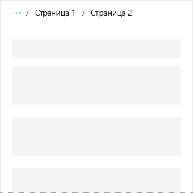

# Компонент Breadcrumb в Office UI Fabric

Используйте строки навигации в надстройках Office. Они показывают расположение текущей страницы в иерархии и помогают пользователям понять, где они находятся. Кроме того, строки навигации позволяют одним щелчком перейти на более высокие уровни иерархии.
  
#### Пример: строка навигации в области задач

## Рекомендации

|**Рекомендуется**|**Не рекомендуется**|
|:------------|:--------------|
|Размещайте строки навигации в верхней части макета: над списком элементов или над основным содержанием макета.   |Не используйте строки навигации в качестве основного способа перехода на другие страницы.  |

## Реализация

Дополнительные сведения см. в статье о [строке навигации](https://dev.office.com/fabric#/components/breadcrumb) и статье с [примером кода для начала работы с Fabric React](https://github.com/OfficeDev/Word-Add-in-GettingStartedFabricReact).

## См. также

- [Конструктивные шаблоны для взаимодействия с пользователем](https://github.com/OfficeDev/Office-Add-in-UX-Design-Patterns-Code)
- [Office UI Fabric в надстройках Office](office-ui-fabric.md)
