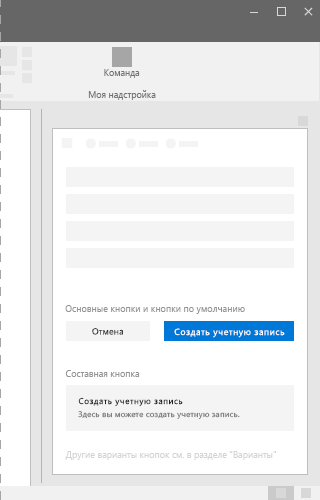
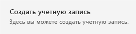

# Компонент Button в Office UI Fabric

Используйте кнопки в надстройке Office, чтобы пользователи могли зафиксировать изменения или выполнять действия в задаче. Убедитесь, что текст кнопки передает суть взаимодействия. Размещайте кнопки в нижней части области задач, диалогового окна или контентной панели. Например, используйте кнопки, чтобы пользователи могли отправить форму, закрыть диалоговое окно или перейти на следующую страницу.
  
#### Пример: кнопки в области задач

## Рекомендации

|**Рекомендуется**|**Не рекомендуется**|
|:-----|:--------|
|Кнопки по умолчанию всегда должны выполнять безопасные операции в надстройках. |Не размещайте в фокусе кнопку, нажатие которой приведет к потере данных. Разместите в фокусе кнопку, которая выполняет безопасную операцию или отменяет действие.|
|Используйте только одну строку текста в подписи кнопки. Используйте лаконичные формулировки.|Не размещайте на кнопке ничего, кроме текста.|
|Убедитесь, что подпись четко передает назначение кнопки. Используйте лаконичные и точные подписи, не требующие пояснений. Рекомендуем использовать только одно слово.|Не используйте кнопки для навигации, за исключением действий **Назад** и **Далее**. Для навигации рекомендуем использовать ссылку.|
|Окно должно содержать только одну или две кнопки (действия). Например, **Принять** и **Отмена**. Если вы хотите, чтобы пользователю были доступны дополнительные действия, используйте флажки или переключатели и предоставьте одну кнопку для запуска выбранных действий.||
|Оформляйте кнопки **Отправить**, **ОК** и **Применить** в виде основных. Если рядом с ними отображаются кнопки **Сброс** или **Отмена**, оформляйте их в виде кнопок по умолчанию.| |

## Варианты

|**Вариант**|**Описание**|**Пример**|
|:------------|:--------------|:----------|
|**Основная кнопка**|Основные кнопки наследуют цвет темы, когда не используются. Используйте основные кнопки для главного призыва к действию.||
|**Кнопка по умолчанию**|Кнопки по умолчанию всегда должны выполнять безопасные операции и никогда не удалять данные.||
|**Составная кнопка**|Используйте составные кнопки, чтобы пользователь мог завершить задачу или переходную задачу.||

## Реализация

Дополнительные сведения см. в статье о [кнопках](https://dev.office.com/fabric#/components/button) и статье с [примером кода для начала работы с Fabric React](https://github.com/OfficeDev/Word-Add-in-GettingStartedFabricReact).

## См. также

- [Конструктивные шаблоны для взаимодействия с пользователем](https://github.com/OfficeDev/Office-Add-in-UX-Design-Patterns-Code)
- [Office UI Fabric в надстройках Office](office-ui-fabric.md)
