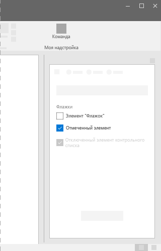
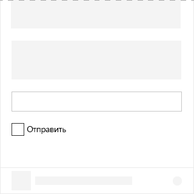

# Компонент Checkbox в Office UI Fabric

Флажок — это элемент пользовательского интерфейса, который позволяет пользователям выбирать параметры в надстройках, задавая нужные. Кроме того, флажок можно связать с другим элементом управления. При установке или снятии флажка меняется поведение связанного элемента управления. Например, может меняться состояние связанного элемента управления (он может становиться видимым или скрытым).
  
#### Пример: флажок в области задач

## Рекомендации

|**Рекомендуется**|**Не рекомендуется**|
|:------------|:--------------|
|Используйте флажки для обозначения состояния.   |Не используйте флажки для обозначения действия.   |
|Используйте несколько флажков, когда пользователи могут выбрать несколько вариантов, которые не являются взаимоисключающими.|Не добавляйте флажок, когда пользователи могут выбирать только один вариант. Добавьте переключатели, когда нужно выбрать только один вариант.|
|Разрешите пользователям выбирать любое сочетание вариантов, когда несколько флажков объединены в группу.|Не размещайте две группы флажков рядом друг с другом. Разделяйте группы подписями.|
|Используйте один флажок в качестве дополнительного параметра. Например, флажок **Запомнить меня** — это дополнительный параметр, используемый при входе.|Не добавляйте флажки для включения и выключения параметров. Для переключения между состояниями "включено" и "отключено" добавьте переключатель.|

## Варианты

|**Вариант**|**Описание**|**Пример**|
|:------------|:--------------|:----------|
|**Неуправляемый флажок**|Используйте в качестве состояния флажка по умолчанию. ||
|**Неуправляемый флажок, который установлен по умолчанию**|Используйте, когда флажок сохраняет свое состояние. ||
|**Отключенный неуправляемый флажок, который установлен по умолчанию**|Отключенное состояние флажка. ||
|**Управляемый флажок**|Состояние этого флажка определяется в другом месте пользовательского интерфейса. В этом сценарии правильное значение передается флажку с использованием события **onChange** и повторной отрисовки пользовательского интерфейса. ||

## Реализация

Дополнительные сведения см. в статье о [флажках](https://dev.office.com/fabric#/components/checkbox) и статье с [примером кода для начала работы с Fabric React](https://github.com/OfficeDev/Word-Add-in-GettingStartedFabricReact).

## См. также

- [Конструктивные шаблоны для взаимодействия с пользователем](https://github.com/OfficeDev/Office-Add-in-UX-Design-Patterns-Code)
- [Office UI Fabric в надстройках Office](office-ui-fabric.md)
