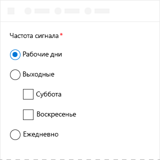

# Компонент ChoiceGroup в Office UI Fabric

Компонент ChoiceGroup, известный также как переключатель, предоставляет пользователям два или более взаимоисключающих варианта. Пользователи могут выбрать только одну кнопку ChoiceGroup в группе. Каждый вариант представлен одной кнопкой ChoiceGroup. 
  
#### Пример. Компонент ChoiceGroup в области задач

 

## Рекомендации

|**Рекомендуется**|**Не рекомендуется**|
|:------------|:--------------|
|Компоненты ChoiceGroup должны быть одноуровневыми.   |Не используйте вложенные компоненты ChoiceGroup или CheckBox.   |
|Используйте компоненты ChoiceGroup с 2–7 вариантами. На экране должно быть достаточно места для отображения всех вариантов. Если места не хватает, добавьте флажок или раскрывающийся список.|Не добавляйте такой компонент, если варианты представляют собой числа с фиксированным шагом (например, 10, 20, 30). В этом случае добавьте ползунок.|
|Если возможна ситуация, когда ни один из вариантов не подходит, советуем включить такой вариант, как **Нет** или **Неприменимо**.|Не используйте две кнопки ChoiceGroup для одного выбора из двух вариантов.|
|Если возможно, расположите кнопки ChoiceGroup вертикально, а не горизонтально. Горизонтальное расположение труднее читать и локализовать.||
|Расположите варианты в логическом порядке, например вначале укажите наиболее вероятные варианты, самые простые операции или минимальные риски. |Не используйте сортировку по алфавиту, так как она зависит от языка.|

## Варианты

|**Вариант**|**Описание**|**Пример**|
|:------------|:--------------|:----------|
|**Компоненты ChoiceGroup**|Используйте, когда наличие изображения необязательно для принятия решения.| |
|**Компоненты ChoiceGroup с изображениями**|Используйте, когда наличие изображения обязательно для принятия решения.| |

## Реализация

Дополнительные сведения см. в статье [ChoiceGroup](https://dev.office.com/fabric#/components/choicegroup) и статье с [примером кода для начала работы с Fabric React](https://github.com/OfficeDev/Word-Add-in-GettingStartedFabricReact).

## См. также

- [Конструктивные шаблоны для взаимодействия с пользователем](https://github.com/OfficeDev/Office-Add-in-UX-Design-Patterns-Code)
- [Office UI Fabric в надстройках Office](office-ui-fabric.md)
