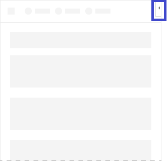

# Контентные надстройки Office

Контентные надстройки — это рабочие области, которые можно внедрять прямо в документы Word, Excel и PowerPoint. Контентные надстройки предоставляют пользователям доступ к элементам управления интерфейсом, которые выполняют код для изменения документов или отображения данных. Используйте контентные надстройки, когда нужно внедрить функции прямо в документ.  

*Рисунок 1. Макет для контентных надстроек*

## Рекомендации

- Включите элемент навигации или управления, такой как CommandBar или Pivot, в верхнюю часть надстройки.
- Включите элемент фирменной символики, такой как BrandBar, в нижнюю часть надстройки (применимо только к надстройкам Word, Excel и PowerPoint).

## Варианты

Размеры контентных надстроек для Word, Excel и PowerPoint в Office 2016 для настольных систем и Office 365 указывает пользователь.

## Меню личных данных

Меню личных данных могут перекрывать элементы навигации и управления, расположенные в правой верхней части надстройки. Ниже указаны текущие размеры меню личных данных в Windows и Mac.

В Windows меню личных данных имеет размер 12 x 32 пикселей, как показано на изображении.

*Рисунок 2. Меню личных данных в Windows* 

В Mac меню личных данных имеет размер 26 x 26 точек, но сдвинуто на 8 пикселей влево и на 6 вниз, из-за чего оно занимает пространство размером 34 x 32 пикселей, как показано на изображении.

*Рисунок 3. Меню личных данных на Mac*

## Реализация

Пример реализации контентной надстройки для Excel: [Humongous Insurance](https://github.com/OfficeDev/Excel-Content-Add-in-Humongous-Insurance) на сайте GitHub.

## См. также

- [Office UI Fabric в надстройках Office](office-ui-fabric.md) 
- [Конструктивные шаблоны для надстроек Office](ux-design-patterns.md)
