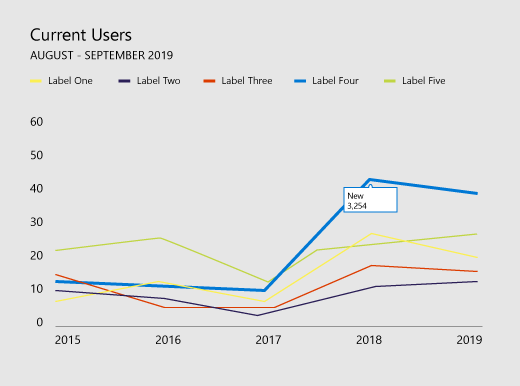

# Рекомендации по выбору стиля визуализации данных для надстроек OfficeData visualization style guidelines for Office Add-ins

Качественная визуализация помогает пользователям анализировать данные. Благодаря этому они смогут рассказывать содержательные и убедительные истории. В этой статье представлены рекомендации по эффективной визуализации данных в надстройках для Excel и других приложений Office.Good data visualizations help users find insights in their data. They can use those insights to tell stories that inform and persuade. This article provides guidelines to help you design effective data visualizations in your add-ins for Excel and other Office apps.

Рекомендуется использовать пользовательский [интерфейс Fluent](../design/add-in-design.md) для создания хрома для визуализации данных.We recommend that you use [Fluent UI](../design/add-in-design.md) to create the chrome for your data visualizations. Fluent UI включает стили и компоненты, которые легко интегрируются с Office внешний вид.Fluent UI includes styles and components that integrate seamlessly with the Office look and feel.

## Элементы визуализации данныхData visualization elements

Визуализации данных имеют общую структуру и общие визуальные и интерактивные элементы, включая заголовки, метки и диаграммы данных, как показано на следующем рисунке.Data visualizations share a general framework and common visual and interactive elements, including titles, labels, and data plots, as shown in the following figure.

### Заголовки диаграммChart titles

При создании заголовков диаграмм следуйте таким рекомендациям:Follow these guidelines for chart titles:

- Сделайте заголовки диаграмм удобочитаемыми. Располагайте их с соблюдением четкой визуальной иерархии относительно остальных элементов диаграммы.Make your chart titles easily readable. Position them to create a clear visual hierarchy in relation to the rest of the chart.
- Как правило, следует начинать предложения с прописной буквы. Чтобы создать контраст или обозначить иерархию, можно использовать все прописные буквы, но этим не следует злоупотреблять.In general, use sentence capitalization (capitalize the first word). To create contrast or to reinforce hierarchies, you can use all caps, but all caps should be used sparingly.
- Включите рампу типа [Fluent,](https://developer.microsoft.com/fluentui#/styles/web/typography) чтобы сделать диаграммы совместимыми Office пользовательского интерфейса, который использует Segoe.Incorporate the [Fluent UI type ramp](https://developer.microsoft.com/fluentui#/styles/web/typography) to make your charts consistent with the Office UI, which uses Segoe. Если же требуется отделить содержимое диаграммы от пользовательского интерфейса, вы можете использовать другой шрифт.You can also use a different typeface to differentiate chart content from the UI.
- Используйте шрифты sans-serif больших размеров.Use sans-serif typefaces with large counters.

### Подписи осейAxis labels

Сделайте подписи осей достаточно темными, чтобы их было легко прочитать. При этом соблюдайте контраст между цветами текста и фона. Убедитесь, что они не настолько темные, чтобы отвлекать внимание от данных.Make your axis labels dark enough to read clearly, with adequate contrast ratios between the text and background colors. Make sure that they are not so dark that they compete with data ink.

Для меток осей лучше всего подходят светло-серые тона.Light grays are most effective for axis labels. Если вы используете пользовательский интерфейс Fluent, см. палитру [нейтральных цветов.](https://developer.microsoft.com/fluentui#/styles/web/colors/neutrals)If you're using Fluent UI, see the [Neutral Colors palette](https://developer.microsoft.com/fluentui#/styles/web/colors/neutrals).

### Точки данныхData ink

Пиксели, представляющие фактические данные на диаграмме, называются точками данных. Основное внимание в визуализации должно уделяться им. Не рекомендуется использовать тени, жирные контуры и лишние элементы оформления, которые искажают данные или отвлекают от них внимание. Используйте градиенты, только если значения данных связаны со значениями цветов. Старайтесь не использовать трехмерные диаграммы, если к третьей оси не привязано измеримое целевое значение.The pixels that represent the actual data in a chart are referred to as data ink. This should be the central focus of the visualization. Avoid the use of drop shadows, heavy outlines, or unnecessary design elements that distort or compete with the data. Use gradients only when data values are tied to color values. Avoid three-dimensional charts unless a measurable, objective value is bound to a third dimension.

### ЦветColor

Выбирайте цвета, соответствующие темам операционной системы и приложения, а не жестко заданные значения. В то же время убедитесь, что применяемые цвета не искажают данные. Неправильное использование цветов при визуализации данных может привести к искажению данных и неправильному их толкованию.Choose colors that follow operating system or application themes rather than hardcoded colors. At the same time, make sure that the colors you apply do not distort the data. Misuse of color in data visualizations can result in data distortion and incorrect reading of information.

Рекомендации по использованию цветов при визуализации данных см. в следующих статьях:For best practices for use of color in data visualizations, see the following:

- [Почему цвета радуги — не лучший вариант для визуализации данныхWhy rainbow colors aren't the best option for data visualizations](https://www.poynter.org/2013/why-rainbow-colors-arent-always-the-best-options-for-data-visualizations/224413/)
- [Color Brewer 2.0: советы по выбору цветов для картографииColor Brewer 2.0: Color Advice for Cartography](https://colorbrewer2.org/)
- [Как выбрать оттенокI Want Hue](https://tools.medialab.sciences-po.fr/iwanthue/)

### Линии сеткиGridlines

Как правило, линии сетки необходимы для точного чтения диаграммы, но их можно представить как вспомогательный визуальный элемент, который выделяет точки данных, а не отвлекает от них. Сделайте статические линии сетки тонкими и светлыми, если они не создаются специально для усиления контраста. Вы также можете создать динамические линии сетки, своевременно появляющиеся в зависимости от контекста, в котором пользователь работает с диаграммой.Gridlines are often necessary for accurately reading a chart, but should be presented as a secondary visual element, enhancing the data ink, not competing with it. Make static gridlines thin and light, unless they are designed specifically for high contrast. You can also use interaction to create dynamic, just-in-time gridlines that appear in context when a user interacts with a chart.

Для линий сетки лучше всего подходят светло-серые тона.Light grays are most effective for gridlines. Если вы используете пользовательский интерфейс Fluent, см. палитру [нейтральных цветов.](https://developer.microsoft.com/fluentui#/styles/web/colors/neutrals)If you're using Fluent UI, see the [Neutral Colors palette](https://developer.microsoft.com/fluentui#/styles/web/colors/neutrals).

На приведенном ниже рисунке показана визуализация данных с линиями сетки.The following image shows a data visualization with gridlines.

### Условные обозначенияLegends

Условные обозначения необходимы для следующего:Add legends if necessary to:

- различения рядов данных;Distinguish between series
- представления изменений масштаба и значений.Present scale or value changes

Убедитесь, что условные обозначения выделяют точки данных, а не отвлекают от них. Располагайте условные обозначения следующим образом:Make sure that your legends enhance the data ink and do not compete with it. Place legends:

- С выравниванием по левому краю над областью представления данных по умолчанию, если все обозначения помещаются над диаграммой.Flush left above the plot area by default, if all legend items fit above the chart.
- Справа вверху в области представления данных, если все обозначения не помещаются над диаграммой. При необходимости можно разрешить прокрутку списка.On the upper right side of the plot area, if all legend items do not fit above the chart, and make it scrollable, if necessary.

Для наглядности придайте маркерам условных обозначений форму, соответствующую типу диаграммы. Например, круглые маркеры подходят для точечных и пузырьковых диаграмм. Для графиков подходят маркеры в виде сегментов линий.To optimize for readability and accessibility, map legend markers to the relevant chart shape. For example, use circle legend markers for scatter plot and bubble chart legends. Use line segment legend markers for line charts.

### Подписи и подсказки данныхData labels and tooltips

Убедитесь, что в подписях и подсказках данных используются достаточно большие отступы и подходящие типы. Используйте алгоритмы, чтобы свести к минимуму наложения. Например, всплывающая подсказка может по умолчанию появляться справа от данных, если соответствующая точка не находится слишком близко к правому краю.Ensure that data labels and tooltips have adequate white space and type variation. Use algorithms to minimize occlusion and collision. For example, a tooltip might surface to the right of a data point by default, but surface to the left if right edges are detected.

## Принципы оформленияDesign principles

Команда разработчиков Office составила приведенный ниже список принципов оформления, которым мы следуем при визуализации данных для набора продуктов Office.The Office Design team created the following set of design principles, which we use when designing new data visualizations for the Office product suite.

### Принципы визуального оформленияVisual design principles

- Визуализация должна точно и качественно передавать данные, чтобы их было легче понять. Выделяйте данные с помощью вспомогательных элементов только в той степени, которой требует контекст. Избегайте лишних украшений (теней, контуров и т. д.), ненужных элементов и искажения данных.Visualizations should honor and enhance the data, making it easy to understand. Highlight the data, adding supporting elements only as needed to provide context. Avoid unnecessary embellishments (drop shadows, outlines, etc), chart junk, or data distortion.
- Визуализация должна вызывать интерес за счет наглядных зрительных образов. Используйте традиционные шаблоны взаимодействия, элементы управления и понятные реакции системы.Visualizations should encourage exploration by providing rich visual feedback. Use well-established interaction patterns, interface controls, and clear system feedback.
- Применяйте проверенные временем принципы оформления. Следуйте традиционным принципам типографии и визуальной передачи, чтобы улучшить оформление, повысить удобочитаемость и точно передать смысл.Embody time-honored design principles. Use established typographic and visual communication design principles to enhance form, readability, and meaning.

### Принципы взаимодействияInteraction design principles

- Диаграмма должна вызывать интерес.Design to allow for exploration.
- Обеспечьте непосредственное взаимодействие с объектами, позволяющее взглянуть на данные с новой стороны (например, сортировку путем перетаскивания).Allow for direct interactions with objects that reveal new insights (sorting via drag, for example).
- Используйте простые, непосредственные и привычные модели взаимодействия.Use simple, direct, familiar interaction models.

Дополнительные сведения о создании понятных интерактивных представлений данных см. в статье [Принципы и распространенные ошибки оформления интерфейса](https://uitraps.com/).For more information about how to design user-friendly interactive data visualizations, see [UI Tenets and Traps](https://uitraps.com/).

### Принципы динамического оформленияMotion design principles

Движение — результат воздействия. Визуальные элементы должны двигаться в одном направлении и с одинаковой скоростью. Это относится к следующему:Motion follows stimulus. Visual elements should move in the same direction at the same rate. This applies to:

- созданию диаграмм;Chart creation
- изменению типа диаграммы;Transition from one chart type to another chart type
- фильтрам;Filtering
- сортировке;Sorting
- сложению и вычитанию данных;Adding or subtracting data
- объединению и сегментации данных;Brushing or slicing data
- изменению размера диаграммы;Resizing a chart

созданию ощущения непринужденности. При создании анимации следуйте таким рекомендациям:Create a perception of causality. When staging animations:

- Проектируйте элементы по одному.Stage one thing at a time.
- Изменяйте оси, прежде чем менять точки данных.Stage changes to axes before changes to data ink.
- Если объекты двигаются в одном направлении и с одинаковой скоростью, обрабатывайте их как группу.Stage and animate objects as a group if they are moving at the same speed in the same direction.
- Собирайте элементы в группы не более чем из 4–5 объектов. Пользователям сложно отслеживать более 4–5 независимых объектов.Stage data elements in groups of no more than 4-5 objects. Viewers have difficulty tracking more than 4-5 objects independently.

Движение добавляет осмысленность.Motion adds meaning.

- Анимация помогает пользователям ориентироваться в изменениях данных, создает контекст и заменяет комментарии.Animations increase user comprehension of changes to the data, provide context, and act as a non-verbal annotation layer.
- Движение должно происходить в понятном координатном пространстве визуализации.Motion should occur in a meaningful coordinate space of the visualization.
- Анимация должна соответствовать визуальному оформлению.Tailor the animation to the visual.
- Не используйте анимацию без необходимости.Avoid gratuitous animations.

Движение следует за данными.Motion follows data.

- Сохраняйте сопоставления данных. Если область привязана к показателю, сохраняйте ее при переходе.Preserve data mappings. If an area is tied to a measure, maintain that area in transition.
- Все анимации должны быть выдержаны в одном стиле. По возможности согласуйте анимацию визуализации данных с оформлением Office. Используйте аналогичные анимации для похожих диаграмм.Maintain a consistent animation design language. Where possible, map data visualization animation to existing Office motion design language. Use similar animations for similar chart types.

## Специальные возможности для визуализации данныхAccessibility in data visualizations

- Цвет не должен быть единственным способом передачи информации. В противном случае люди, страдающие дальтонизмом, не смогут толковать результаты. По мере возможности используйте для передачи информации не только цвет, но и форму, размер и текстуры.Do not use color as the only way to communicate information. People who are color blind will not be able to interpret the results. Use shape, size and texture in addition to color when possible to communicate information.
- Обеспечьте возможность управлять с помощью клавиатуры всеми интерактивными элементами, такими как кнопки и списки.Make all interactive elements, such as push buttons or pick lists, accessible from a keyboard.
- Отправляйте события специальных возможностей средствам чтения с экрана для объявления об изменениях фокуса, всплывающих подсказках и т. д.Send accessibility events to screen readers to announce focus changes, tooltips, and so on.

## См. такжеSee also

- [Пять лучших библиотек для визуализации данныхThe Five Best Libraries for Building Data Visualizations](https://www.fastcompany.com/3029760/the-five-best-libraries-for-building-data-vizualizations)
- [Визуальное представление количественных данныхThe Visual Display of Quantitative Information](https://www.edwardtufte.com/tufte/books_vdqi)
