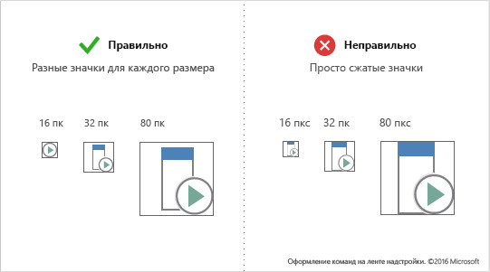

# Создание значков для команд надстроекDesign icons for add-in commands

С помощью [команд надстроек](add-in-commands.md) можно добавить кнопки, текст и значки в пользовательский интерфейс Office. Значки и метки для кнопок надстроек должны быть понятны и четко определять действие, которое выполняется при выборе пользователем команды. В этой статье приведены рекомендации, помогающие создавать значки, которые легко интегрируются в Office, и выбирать их стиль.[Add-in commands](add-in-commands.md) add buttons, text, and icons to the Office UI. Your add-in command buttons should provide meaningful icons and labels that clearly identify the action the user is taking when they use a command. This article provides stylistic and production guidelines that help you design icons that integrate seamlessly with Office. 

## Принципы создания значков OfficeOffice icon design principles

Выпуск Office 2013 предусматривает использование других значков для клиентов Office на настольных ПК. Самое важное стилистическое изменение — сокращения. Новые значки предусматривают использование только основных смысловых элементов. Вспомогательные элементы, включая перспективу, градиенты и источник света, удалены. Упрощение значков способствует ускорению анализа команд и элементов управления. Придерживайтесь этого стиля, чтобы ваши надстройки максимально соответствовали Office.The Office 2013 release of the Office desktop clients includes refreshed iconography. The overriding stylistic change is reduction. The new icons include only essential communicative elements. Non-essential elements including perspective, gradients, and light source are removed. The simplified icons support faster parsing of commands and controls. Follow this style to best fit with Office.

Принципы создания значков Office:Office icons are based on the following design principles: 

- современная интерпретация коллекции значков Office;Modern interpretation of Office icon collection 
- несмотря на новшества, значки остаются понятными и знакомыми;Fresh yet familiar  
- простота и четкость.Simple, clear, and direct 

На следующем изображении показаны значки, к которым применены современные принципы создания.The following image shows icons that apply the modern design principles.

## Рекомендации по созданию значковIcon guidelines
При создании значков следуйте перечисленным ниже рекомендациям.Follow these guidelines when you create your icons: 

- Чтобы достичь наилучших результатов, используйте сетку с шагом 1 пк и инструмент для редактирования растровых изображений.Stick to the 1px grid and use a bitmap editing tool for best results.  
- Перерисовывайте значки, но не изменяйте их размеры. При увеличении или уменьшении размеров значков перерисуйте контуры, углы и скругленные края, чтобы максимизировать четкость линий.Redraw, don't resize. As you resize your icons for larger or smaller sizes, take the time to redraw cutouts, corners, and rounded edges to maximize line clarity. 
- Удалите артефакты, которые визуально искажают изображение значка.Remove artifacts that make your icon look messy.
- Не используйте повторно значки Office UI Fabric в ленте или контекстном меню Office. Значки Fabric отличаются по стилю, поэтому не будут совпадать.Don't reuse Office UI Fabric icons in the Office ribbon or contextual menu. Fabric icons are stylistically different and will not match. 
- Ваш логотип или торговая марка могут и не указывать на функции определенной команды надстройки. Торговые знаки не всегда можно легко узнать, если они обозначены значками меньшего размера, а также когда к ним применены модификаторы. Торговые знаки часто не соответствуют стилям значков ленты Office, поэтому по-разному привлекают внимание пользователей в среде, где существует множество различных товарных знаков.Avoid relying on your logo or brand to communicate what an add-in command does. Brand marks aren't always recognizable at smaller icon sizes and when modifiers are applied. Brand marks often conflict with Office ribbon icon styles, and can compete for user attention in a saturated environment.
- Используйте белую заливку для лучшего восприятия. Для большинства объектов, используемых в значках, необходим белый фон, чтобы они легко читались в темах пользовательского интерфейса Office, а также в режимах высокой контрастности.Use a white fill for accessibility. Most objects in your icons will require a white background to be legible across Office UI themes and in high-contrast modes.  
- Используйте формат PNG с прозрачным фоном.Use the PNG format with a transparent background. 
- Избегайте использования в значках локализуемого содержимого, а также типографских символов, индикаторов абзацев без выравнивания и вопросительных знаков.Avoid localizable content in your icons, including typographic characters, indications of paragraph rags, and question marks. 
- Не используйте повторно визуальные метафоры для различных команд. Добавление одинаковых значков для различных действий может привести к путанице.Don't reuse visual metaphors for different commands. Using the same icon for different actions can cause confusion. 
- Сделайте подписи кнопок понятными и лаконичными. Используйте сочетание визуальной и текстовой информации, чтобы передать то или иное значение.Make your button labels clear and succinct. Use a combination of visual and textual information to convey meaning. 

## Рекомендации и требования, применяющиеся к размерам значковIcon size recommendations and requirements

Значки Office 2016 на рабочем столе — растровые изображения. Различные размеры будут отображаться в зависимости от установленного пользователем разрешения экрана и сенсорного режима. Используйте все восемь поддерживаемых размеров, чтобы обеспечить лучшее представление для всех поддерживаемых разрешений и контекстов. Ниже перечислены поддерживаемые размеры, из которых обязательными являются три:Office 2016 desktop icons are bitmap images. Different sizes will render depending on the user's DPI setting and touch mode. Include all eight supported sizes to create the best experience in all supported resolutions and contexts. The following are the supported sizes - three are required:

- 16 пк (обязательный);16 px (Required)
- 20 пк;20 px
- 24 пк;24 px
- 32 пк (обязательный);32 px (Required)
- 40 пк;40 px
- 48 пк;48 px
- 64 пк (рекомендуется, лучший вариант для компьютера Mac);64 px (Recommended, best for Mac)
- 80 пк (обязательный).80 px (Required)  

Не сжимайте значки, а перерисуйте их для каждого размера.Make sure to redraw your icons for each size rather than shrink them to fit.

<!--
The following table shows the icon sizes that render for different modes at different DPI settings.

|DPI |**Small**||**Medium**||**Large**||**Extra large**|
|:---|:---|:---|:---|:---|:---|:---|:---|
|    |**Mouse**|**Touch**|**Mouse**|**Touch**|**Mouse**|**Touch**|-|
|100%|16px|20px|24px||32px|40px|48px|
|125%|20px|24px|||40px|48px|60px|
|150%|24px|24px|36px||48px|48px|72px|
|200%|32px|40px|48px||64px|80px|96px|
|250%|40px||||80px||120px|
|300%|48px||||96px||144px

> [!NOTE]
> At DPI settings of 150% or greater, the icon does not get swapped out for a larger size when Touch mode is engaged. At DPI settings greater than 250%, Touch mode is turned off by default.

The following table lists the locations for certain icon sizes.

|Location|100% DPI|200% DPI|250% DPI|
|:-------|:-------|:-------|:-------|
|Small ribbon button|16px|32px|40px|
|Contextual menu|16px|32px|40px|
|Quick access toolbar (QAT)|16px|32px|40px|
|Large ribbon icon|32px|64px|80px|

-->

## Структура и схема значкаIcon anatomy and layout

Значки Office обычно состоят из базового элемента с модификаторами действия и концептуальными модификаторами. Модификаторы действия представляют такие понятия, как "добавить", "открыть", "создать" или "закрыть". Концептуальные модификаторы представляют состояние, изменение или описание значка.Office icons are typically comprised of a base element with action and conceptual modifiers overlayed. Action modifiers represent concepts such as add, open, new, or close. Conceptual modifiers represent status, alteration, or a description of the icon. 

Чтобы создать команды, соответствующие пользовательскому интерфейсу Office, следуйте рекомендациям по схеме расположения базовых элементов и модификаторов. Благодаря этому ваши команды будут выглядеть профессионально, а надстройка — надежно. Если вы не соблюдаете каких-либо рекомендаций, у вас на то должны быть веские основания.To create commands that align with the Office UI, follow layout guidelines for the base element and modifiers. This ensures that your commands look professional and that your customers will trust your add-in. If you make exceptions to these guidelines, do so intentionally.

На следующем изображении показана схема расположения базовых элементов и модификаторов для значка Office.The following image shows the layout of base elements and modifiers in an Office icon.

- Размещайте базовые элементы в центре пиксельной рамки, оставляя немного места по краям.Center base elements in the pixel frame with empty padding all around.
- Модификаторы действия располагайте в верхнем левом углу.Place action modifiers on the top left. 
- Концептуальные модификаторы размещайте в нижнем правом углу.Place conceptual modifiers on the bottom right.
- Ограничивайте количество элементов в значках. В значках с размером 32 пк не добавляйте более двух модификаторов. В значках с размером 16 пк не добавляйте более одного модификатора.Limit the number of elements in your icons. At 32px, limit the number of modifiers to a maximum of two. At 16px, limit the number of modifiers to one.

Размещайте базовые элементы единообразно для всех размеров. Если у вас не получается разместить базовые элементы в центре рамки, расположите их в левом верхнем углу, оставив несколько дополнительных пикселей в правом нижнем углу. Чтобы достичь наилучших результатов, воспользуйтесь рекомендациями по определению нужного отступа из приведенной ниже таблицы.Place base elements consistently across sizes. If base elements can't be centered in the frame, align them to the top left, leaving the extra pixels on the bottom right. For best results, apply the padding guidelines listed in the following table.

|**Размер значка****Icon size**|**Отступ вокруг базового элемента****Padding around base element**|
|:---|:---|
|16 пкс16px|00%|
|20 пк20px|1 пк1px|
|24 пк24px|1 пк1px|
|32 пк32px|2 пк2px|
|40 пк40px|2 пк2px|
|48 пк48px|3 пк3px|
|64 пк64px|5 пк5px|
|80 пк80px|5 пк5px|

У всех модификаторов должен быть прозрачный контур (1 пк), граничащий с каждым элементом, включая фон. Элементы не должны сильно перекрывать друг друга. Создайте пустое пространство между метками и границами. Размеры модификаторов могут немного отличаться, но используйте указанные ниже числа в качестве отправной точки.All modifiers should have a 1px transparent cutout between each element, including the background. Elements should not directly overlap. Create whitespace between rules and edges. Modifiers can vary slightly in size, but use these dimensions as a starting point.

|**Размер значка****Icon size**|**Размер модификатора****Modifier size**|
|:---|:---|
|16 пкс16px|9 пк9px|
|20 пк20px|10 пк10px|
|24 пк24px|12 пк12px|
|32 пк32px|14 пк14px|
|40 пк40px|20 пк20px|
|48 пк48px|22 пк22px|
|64 пк64px|29 пк29px|
|80 пк80px|38 пк38px|

## Цвета значковIcon colors

Значки Office имеют ограниченную цветовую палитру. Чтобы обеспечить хорошую интеграцию значков в пользовательский интерфейс Office, используйте цвета, перечисленные в приведенной ниже таблице. Рекомендации по использованию цветов:Office icons have a limited color palette. Use the colors listed in the following table to guarantee seamless integration with the Office UI. Apply the following guidelines to the use of color: 

- Используйте цвет, чтобы передать значение, а не для украшения. Цвет должен выделять или подчеркивать действие, состояние или элемент, которые явно отличают метку.Use color to communicate meaning rather than for embellishment. It should highlight or emphasize an action, status, or an element that explicitly differentiates the mark.  
- По возможности используйте только один дополнительный цвет кроме серого. Применяйте не больше двух дополнительных цветов.If possible, use only one additional color beyond gray. Limit additional colors to two at the most.
- Используйте цвета единообразно для всех размеров значков. Цветовые палитры для значков Office незначительно отличаются в зависимости от размера значков. Значки с размером 16 пк и меньше немного темнее, а значки с размером 32 пк и больше — ярче. Если не учитывать эти незначительные корректировки, цвета могут варьироваться в зависимости от размеров значка.Colors should have a consistent appearance in all icon sizes. Office icons have slightly different color palettes for different icon sizes. 16px and smaller icons are slightly darker and more vibrant than 32px and larger icons. Without these subtle adjustments, colors appear to vary across sizes.   

|**Название цвета****Color name**|**RGB****RGB**|**Шестнадцатеричный код****Hex**|**Цвет****Color**|**Категория****Category**|
|:---|:---|:---|:---|:---|
|Серый цвет текста (80)Text Gray (80)|80, 80, 8080, 80, 80|#505050#505050|  |ТекстText|
|Серый цвет текста (95)Text Gray (95)|95, 95, 9595, 95, 95|#5F5F5F#5F5F5F|  |ТекстText|
|Серый цвет текста (105)Text Gray (105)|105, 105, 105105, 105, 105|#696969#696969|  |ТекстText|
|Темно-серый (32)Dark Gray 32|128, 128, 128128, 128, 128|#808080#808080|  |32 и больше32 and above|
|умеренно серый (32)Medium Gray 32|158, 158, 158158, 158, 158|#9E9E9E#9E9E9E|  |32 и больше32 and above|
|Светло-серый (ВСЕ)Light Gray ALL|179, 179, 179179, 179, 179|#B3B3B3#B3B3B3|  |Все размерыAll sizes|
|Темно-серый (16)Dark Gray 16|114, 114, 114114, 114, 114|#727272#727272|  |16 и меньше16 and below|
|Умеренно серый (16)Medium Gray 16|144, 144, 144144, 144, 144|#909090#909090|  |16 и меньше16 and below|
|Синий (32)Blue 32|77, 130, 18477, 130, 184|#4d82B8#4d82B8|  |32 и больше32 and above|
|Синий (16)Blue 16|74, 125, 17774, 125, 177|#4A7DB1#4A7DB1|  |16 и меньше16 and below|
|Желтый (ВСЕ)Yellow ALL|234, 194, 130234, 194, 130|#EAC282#EAC282|  |Все размерыAll sizes|
|Оранжевый (32)Orange 32|231, 142, 70231, 142, 70|#E78E46#E78E46|  |32 и больше32 and above|
|Оранжевый (16)Orange 16|227, 142, 70227, 142, 70|#E3751C#E3751C|  |16 и меньше16 and below|
|Розовый (ВСЕ)Pink ALL|230, 132, 151230, 132, 151|#E68497#E68497|  |Все размерыAll sizes|
|Зеленый (32)Green 32|118, 167, 151118, 167, 151|#76A797#76A797|  |32 и больше32 and above|
|Зеленый (16)Green 16|104, 164, 144104, 164, 144|#68A490#68A490|  |16 и меньше16 and below|
|Красный (32)Red 32|216, 99, 68216, 99, 68|#D86344#D86344|  |32 и больше32 and above|
|Красный (16)Red 16|214, 85, 50214, 85, 50|#D65532#D65532|  |16 и меньше16 and below|
|Сиреневый (32)Purple 32|152, 104, 185152, 104, 185|#9868B9#9868B9|  |32 и больше32 and above|
|Сиреневый (16)Purple 16|137, 89, 171137, 89, 171|#8959AB#8959AB|  |16 и меньше16 and below|

## Значки в режимах высокой контрастностиIcons in high contrast modes

Значки Office предназначены для использования в режимах высокой контрастности. Элементы переднего плана хорошо различимы на фоновых изображениях, что улучшает читаемость текста и позволяет применять перекрашивание. В режимах высокой контрастности в Office все пиксели красного, зеленого и синего цвета со значением менее 190 в значке перекрашиваются в черный цвет. Все остальные пиксели отображаются белыми. Другими словами, оцениваются все каналы RGB, в которых значения 0–189 отображаются черным цветом, а значения 190–255 — белым. В других темах с высокой контрастностью используемое пороговое значение также равно 190, но применяются другие правила. Например, в белой теме с высокой контрастностью все пиксели со значением больше 190 становятся непрозрачными, тогда как остальные пиксели остаются прозрачными. Чтобы улучшить читаемость при использовании параметров высокой контрастности, следуйте приведенным рекомендациям:Office icons are designed to render well in high contrast modes. Foreground elements are well differentiated from backgrounds to maximize legibility and enable recoloring. In high contrast modes, Office will recolor any pixel of your icon with a red, green, or blue value less than 190 to full black. All other pixels will be white. In other words, each RGB channel is assessed where 0-189 values are black and 190-255 values are white. Other high-contrast themes recolor using the same 190 value threshold but with different rules. For example, the high-contrast white theme will recolor all pixels greater than 190 opaque but all other pixels as transparent. Apply the following guidelines to maximize legibility in high-contrast settings:

- Старайтесь разграничивать элементы переднего и заднего планов с учетом порогового значения 190.Aim to differentiate foreground and background elements along the 190 value threshold.
- Следуйте стилям оформления значков Office.Follow Office icon visual styles.
- Используйте для значков цвета из нашей палитры.Use colors from our icon palette.
- Не рекомендуется использовать градиенты.Avoid the use of gradients.
- Избегайте больших блоков цветов с похожими значениями.Avoid large blocks of color with similar values.

## См. такжеSee also

- [Рекомендации по разработке надстроекAdd-in development best practices](../concepts/add-in-development-best-practices.md)
- [Команды надстроек для Excel, Word и PowerPointAdd-in commands for Excel, Word, and PowerPoint](../design/add-in-commands.md)
