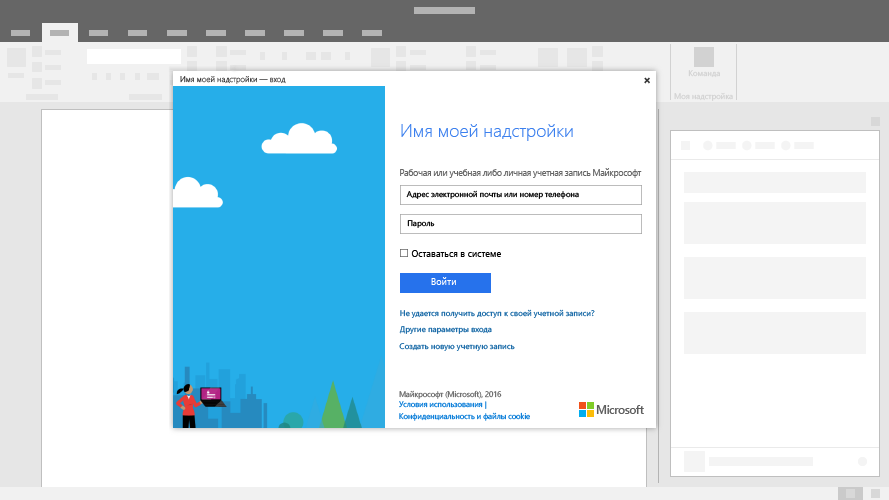

# Диалоговые окна в надстройках Office
 
Диалоговые окна — окна, которые накладываются на активное окно приложения Office. Вы можете использовать диалоговые окна, чтобы показывать страницы входа, которые нельзя открыть непосредственно в области задач, запросы на подтверждение действий, предпринятых пользователем, или видео, которые будут слишком маленькими в области задач.

**Пример диалогового окна**

### Рекомендации

|**Рекомендуется**|**Не рекомендуется**|
|:-----|:--------|
|<ul><li>Укажите описательное название, содержащее имя надстройки и название текущей задачи.</li></ul>|<ul><li>Не включайте в него название вашей компании.</li></ul>|
||<ul><li>Не открывайте диалоговое окно, если этого не требует сценарий.</li></ul>|

## Реализация

Пример реализации диалогового окна см. в [этой статье](https://github.com/OfficeDev/Office-Add-in-Dialog-API-Simple-Example) на сайте GitHub.

## Дополнительные ресурсы

- [Пример конструктивного шаблона](https://office.visualstudio.com/DefaultCollection/OC/_git/GettingStarted-FabricReact)
- [Ресурсы для разработки на сайте GitHub](https://github.com/OfficeDev/Office-Add-in-UX-Design-Patterns-Code)
- [Объект Dialog](https://dev.office.com/reference/add-ins/shared/officeui.dialog)

