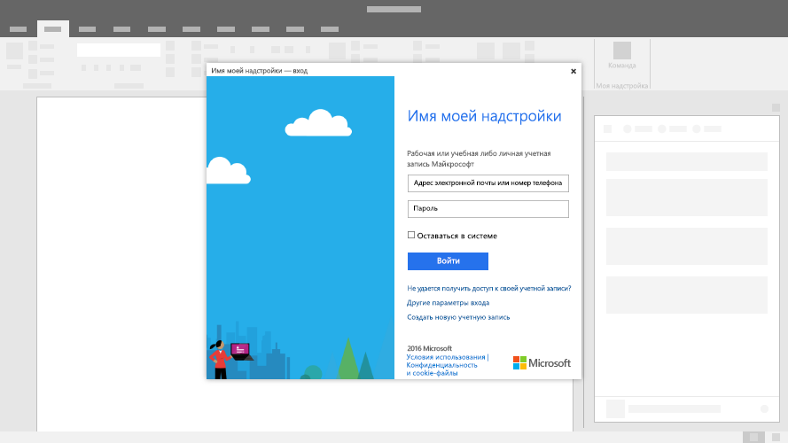

# Диалоговые окна в надстройках Office

Диалоговые окна — окна, которые накладываются на активное окно приложения Office. Вы можете использовать диалоговые окна, чтобы показывать страницы входа, которые нельзя открыть непосредственно в области задач, запросы на подтверждение действий, предпринятых пользователем, или видео, которые будут слишком маленькими в области задач.

*Рисунок 1. Типичный макет диалогового окна*

## Рекомендации

|Правильно|Неправильно|
|:-----|:--------|
|<ul><li>Укажите описательное название, содержащее имя надстройки и название текущей задачи.</li></ul>|<ul><li>Не включайте в него название вашей компании.</li></ul>|
||<ul><li>Не открывайте диалоговое окно, если этого не требует сценарий.</li></ul>|

## Реализация

Пример реализации диалогового окна с использованием Dialog API для надстроек Office см. в [этой статье](https://github.com/OfficeDev/Office-Add-in-Dialog-API-Simple-Example) на сайте GitHub.

## См. также

- [Объект Dialog](/javascript/api/office/office.dialog)
- [Конструктивные шаблоны для надстроек Office](../design/ux-design-pattern-templates.md)
