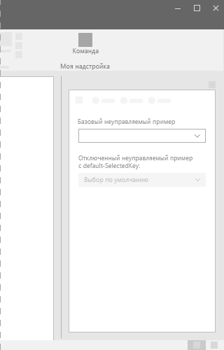
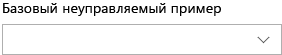

# Компонент DropDown в Office UI Fabric

DropDown — это список вариантов, который отображается при нажатии кнопки раскрывающегося списка. Используйте раскрывающиеся списки или меню для упрощения оформления и в тех случаях, когда пользователи должны сделать выбор в интерфейсе. После сворачивания списка на экране остается выбранный элемент. Чтобы изменить выбранный элемент, пользователи открывают список и выбирают новое значение.
  
#### Пример: раскрывающийся список в области задач

## Рекомендации

|**Рекомендуется**|**Не рекомендуется**|
|:------------|:--------------|
|Используйте раскрывающийся список, когда выбор варианта по умолчанию более вероятен, чем выбор других вариантов. Компонент ChoiceGroup или переключатели отображают все варианты, не акцентируя внимание на каком-либо из них.|Не используйте раскрывающийся список, если вероятность выбора каждого из вариантов одна и та же.|
|Добавляйте раскрывающийся список при наличии нескольких вариантов, которые можно свернуть в одно поле. Кроме того, используйте раскрывающийся список, когда список длинный или место на экране ограничено.|Не добавляйте раскрывающийся список при наличии менее двух вариантов. В этом случае используйте флажок.|
|Раскрывающиеся списки должны содержать сокращенные утверждения или слова.| |

## Варианты

|**Вариант**|**Описание**|**Пример**|
|:------------|:--------------|:----------|
|**Базовый неуправляемый раскрывающийся список**|Используйте при наличии большого количества вариантов.| |
|**Отключенный неуправляемый раскрывающийся список с defaultSelectedKey**|Раскрывающийся список отключен.| |
|**Управляемый раскрывающийся список**|Используйте, если выбранный по умолчанию элемент зависит от другого элемента пользовательского интерфейса, а также элемент в раскрывающемся списке должен оставаться выбранным.| |

## Реализация

Дополнительные сведения см. в статье о [раскрывающихся списках](https://dev.office.com/fabric#/components/dropdown) и статье с [примером кода для начала работы с Fabric React](https://github.com/OfficeDev/Word-Add-in-GettingStartedFabricReact).

## См. также

- [Конструктивные шаблоны для взаимодействия с пользователем](https://github.com/OfficeDev/Office-Add-in-UX-Design-Patterns-Code)
- [Office UI Fabric в надстройках Office](office-ui-fabric.md)
