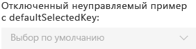
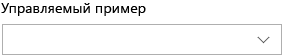

# Компонент DropDown в Office UI Fabric

Раскрывающийся список — это перечень вариантов, который отображается при нажатии соответствующей кнопки. Раскрывающиеся списки или меню позволяют упростить дизайн пользовательского интерфейса и удобны в тех случаях, когда пользователи должны выбирать элементы пользовательского элемента. После сворачивания списка на экране остается выбранный элемент. Чтобы изменить выбранный элемент, пользователи открывают список и выбирают новое значение.
  
#### Пример. Раскрывающийся список в области задач

 

 

## Рекомендации

|**Рекомендуется**|**Не рекомендуется**|
|:------------|:--------------|
|Используйте раскрывающийся список, когда выбор варианта по умолчанию более вероятен, чем выбор других вариантов. Компонент ChoiceGroup или переключатели отображают все варианты, не акцентируя внимание на каком-либо из них.|Не используйте раскрывающийся список, если вероятность выбора всех вариантов одинакова.|
|Используйте раскрывающийся список при наличии нескольких вариантов, которые можно свернуть в одно поле. Кроме того, используйте раскрывающиеся списки, когда списки элементов длинные или когда место на экране ограничено.|Не используйте раскрывающиеся списки при наличии менее двух вариантов. В этом случае используйте флажок.|
|Используйте сокращенные утверждения или слова в раскрывающихся списках.| |

## Варианты

|**Вариант**|**Описание**|**Пример**|
|:------------|:--------------|:----------|
|**Базовый неуправляемый раскрывающийся список**|Используйте при наличии большого количества вариантов.| |
|**Отключенный неуправляемый раскрывающийся список с defaultSelectedKey**|Раскрывающийся список отключен.| |
|**Управляемый раскрывающийся список**|Используйте, если выбранный по умолчанию элемент зависит от другого элемента пользовательского интерфейса, а также элемент в раскрывающемся списке должен оставаться выбранным.| |

## Реализация

Дополнительные сведения см. в статьях [Раскрывающийся список](https://dev.office.com/fabric#/components/dropdown) и [Начало работы с примером кода Fabric React](https://github.com/OfficeDev/Word-Add-in-GettingStartedFabricReact).

## Дополнительные ресурсы

- [Конструктивные шаблоны для обеспечения взаимодействия с пользователем](https://github.com/OfficeDev/Office-Add-in-UX-Design-Patterns-Code)

- [Office UI Fabric в надстройках Office](office-ui-fabric.md)
