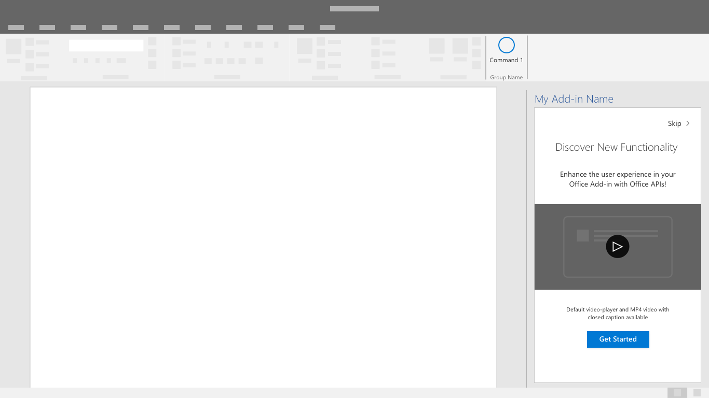

# Шаблоны интерфейса первого запуска

Интерфейс первого запуска (FRE) обеспечивает знакомство пользователя с вашей надстройкой. Когда пользователь впервые открывает надстройку, отображается интерфейс FRE, который дает им представление о функциях, возможностях и/или преимуществах надстройки. Этот интерфейс формирует первое впечатление от надстройки и может сильно повлиять на вероятность того, что пользователь вернется и продолжит пользоваться вашей надстройкой.

## Рекомендации

Следуйте этим лучшим практикам при разработке первого запуска.

|Правильно|Неправильно|
|:------|:------|
|Ясно и кратко опишите основные действия в надстройке. | Не указывайте сведения, не относящиеся к началу работы.
|Предоставьте пользователям возможность выполнить действие, которое создаст у них положительное впечатление от использования надстройки. | Не следует ожидать, что пользователи изучат все возможности сразу. Сосредоточьтесь на самом ценном действии.
|Создайте привлекательный интерфейс, в котором пользователи захотят выполнить все действия. | Не заставляйте пользователей просматривать весь интерфейс первого запуска. Предоставьте пользователям возможность обойти его. |

Решите, как часто необходимо применять интерфейс, используемый при первом запуске: один раз или периодически. Например, если ваша надстройка используется только время от времени, пользователи могут забывать ее возможности, и тогда им будет полезно еще раз ознакомиться с интерфейсом первого запуска.

При создании или улучшении интерфейса первого запуска для надстройки применяйте указанные ниже шаблоны.

## Карусель

Карусель знакомит пользователей с рядом функций или предоставляет определенные сведения, прежде чем они начнут использовать надстройку.

*Рис. 1. Разрешить пользователям заранее или пропустить начало страниц потока карусель*

*Рис. 2. Свести к минимуму количество экранов карусель только до того, что необходимо для эффективного сообщения вашего сообщения*

*Рис. 3. Предоставление четкого вызова действий для выхода из первого запуска*

## Представление ценности

Представление ценности — это ценностное предложение вашей надстройки: размещение логотипа, ясно сформулированное ценностное предложение, краткое описание или обзор функций, а также призыв к действию.

*Рис. 4. Placemat значения с логотипом, предложением четкого значения, сводка функций и вызов к действию*

### Представление видео

Представление видео показывает пользователям видеоролик перед тем, как они начнут использовать вашу надстройку.

*Рис. 5. Первый запуск видео-placemat — экран содержит изображение из видео с кнопкой воспроизведения и кнопкой "Вызов к действию"*

*Рис. 6. Video player — Пользователи, представленные с видео в диалоговом окне*

