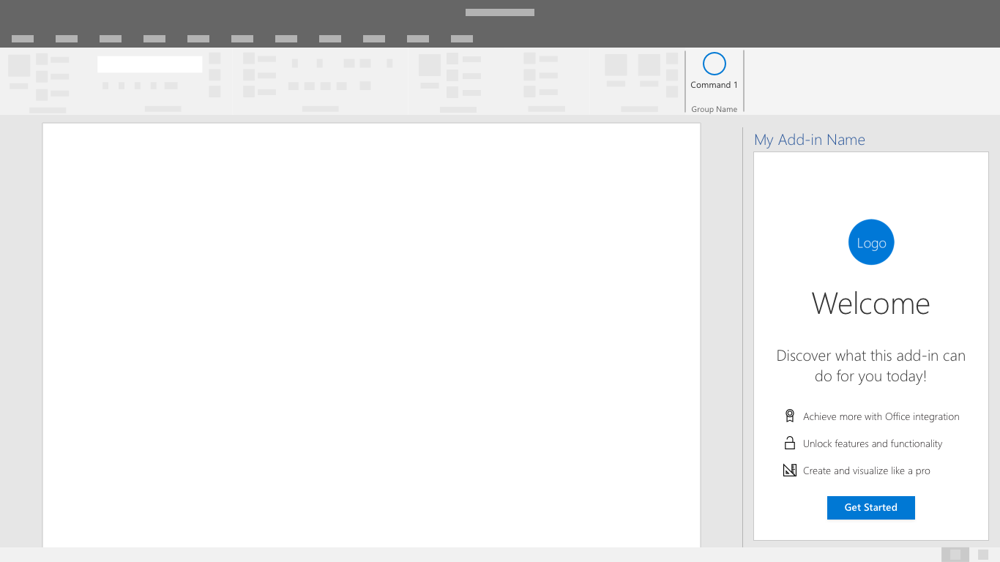

# Шаблоны интерфейса первого запуска

Интерфейс первого запуска (FRE) обеспечивает знакомство пользователя с вашей надстройкой. Когда пользователь впервые открывает надстройку, отображается интерфейс FRE, который дает им представление о функциях, возможностях и/или преимуществах надстройки. Этот интерфейс формирует первое впечатление от надстройки и может сильно повлиять на вероятность того, что пользователь вернется и продолжит пользоваться вашей надстройкой.

## Рекомендации

Следуйте этим рекомендациям при создании интерфейса первого запуска:

|Правильно|Неправильно|
|:------|:------|
|Ясно и кратко опишите основные действия в надстройке. | Не указывайте сведения, не относящиеся к началу работы.
|Предоставьте пользователям возможность выполнить действие, которое создаст у них положительное впечатление от использования надстройки. | Не следует ожидать, что пользователи изучат все возможности сразу. Сосредоточьтесь на самом ценном действии.
|Создайте привлекательный интерфейс, в котором пользователи захотят выполнить все действия. | Не заставляйте пользователей просматривать весь интерфейс первого запуска. Предоставьте пользователям возможность обойти его. |

Решите, как часто необходимо применять интерфейс, используемый при первом запуске: один раз или периодически. Например, если ваша надстройка используется только время от времени, пользователи могут забывать ее возможности, и тогда им будет полезно еще раз ознакомиться с интерфейсом первого запуска.

При создании или улучшении интерфейса первого запуска для надстройки применяйте указанные ниже шаблоны.

## Карусель

Карусель знакомит пользователей с рядом функций или предоставляет определенные сведения, прежде чем они начнут использовать надстройку.

*Рис. 1. Разрешить пользователям перемещать или пропускать начальные страницы для движения обойм*

*Рис. 2. Свертывание экрана с числом обойм только для эффективного сообщения*

*Рис. 3. Предоставление вызова действия для выхода из окна первого запуска*

## Представление ценности

Представление ценности — это ценностное предложение вашей надстройки: размещение логотипа, ясно сформулированное ценностное предложение, краткое описание или обзор функций, а также призыв к действию.

*На рисунке 4. Значение представление с логотипом, предложением по четкому значению, кратким описанием функций и действием по требованию*

### Представление видео

Представление видео показывает пользователям видеоролик перед тем, как они начнут использовать вашу надстройку.

*На рисунке 5. Первый запуск видеопредставлениеа — экран содержит изображение по-прежнему с помощью кнопки "воспроизводящий" и кнопки "Очистить вызов"*

*На рисунке 6. Видеопроигрыватель — пользователи, получив видео в диалоговом окне*

