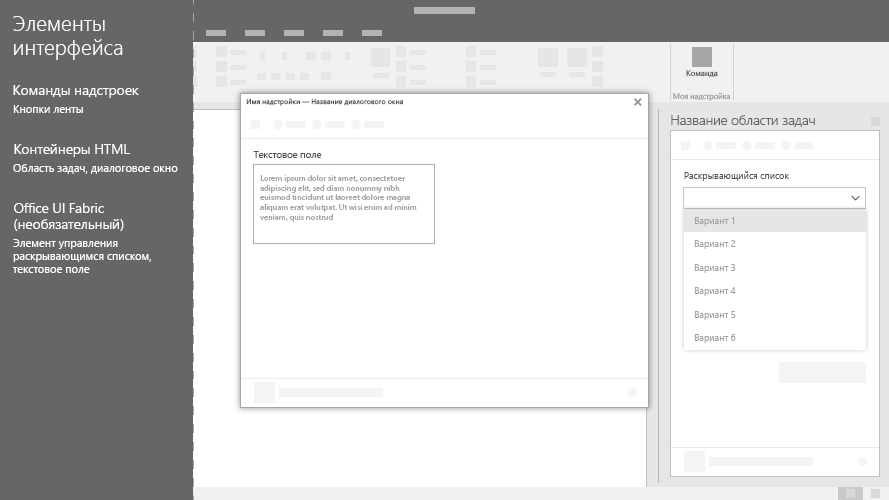

# Элементы пользовательского интерфейса Office для надстроек OfficeOffice UI elements for Office Add-ins

Для расширения пользовательского интерфейса Office, в том числе команд надстроек и контейнеров HTML, можно использовать несколько типов элементов пользовательского интерфейса, которые полностью совместимы с Office и рядом платформ. Вы можете вставить пользовательский веб-код в любой из этих элементов.You can use several types of UI elements to extend the Office UI, including add-in commands and HTML containers. These UI elements look like a natural extension of Office and work across platforms. You can insert your custom web-based code into any of these elements.

На рисунке ниже приведены типы элементов пользовательского интерфейса Office, которые можно создать.The following image shows the types of Office UI elements that you can create.

## Команды надстроекAdd-in commands

[Команды надстроек](add-in-commands.md) используются для добавления точек входа в надстройку на ленте Office. Команды запускают действия в надстройке путем выполнения кода JavaScript или запуска контейнера HTML. Можно создать два типа команд надстроек.Use [add-in commands](add-in-commands.md) to add entry points to your add-in to the Office ribbon. Commands start actions in your add-in either by running JavaScript code, or by launching an HTML container. You can create two types of add-in commands.

|**Тип команды****Command type**|**Описание****Description**|
|:---------------|:--------------|
|Кнопки, меню и вкладки на лентеRibbon buttons, menus, and tabs|Позволяют добавлять в Office пользовательские кнопки, меню (раскрывающиеся меню) или вкладки на ленте по умолчанию. Кнопки и меню используются для запуска действия в Office. Вкладки позволяют сгруппировать и упорядочить кнопки и меню.Use to add custom buttons, menus (dropdowns), or tabs to the default ribbon in Office. Use Buttons and menus to trigger an action in Office. Use tabs to group and organize buttons and menus.|
|Контекстные менюContext menus| Используются для расширения контекстного меню по умолчанию. Контекстные меню отображаются, когда пользователи щелкают правой кнопкой мыши текст в документе Office или таблице Excel.Use to extend the default context menu. Context menus are displayed when users right-click text in an Office document or a table in Excel.| 

## Контейнеры HTMLHTML containers

Контейнеры HTML позволяют внедрить код пользовательского интерфейса на основе HTML в клиентах Office. Эти веб-страницы затем могут ссылаться на API JavaScript для Office для взаимодействия с содержимым в документе. Можно создать HTML-контейнеры трех типов.Use HTML containers to embed HTML-based UI code within Office clients. These web pages can then reference the Office JavaScript API to interact with content in the document. You can create three types of HTML containers.

|**Контейнер HTML****HTML container**|**Описание****Description**|
|:-----------------|:--------------|
|[Области задачTask panes](task-pane-add-ins.md)|Отображение собственного пользовательского интерфейса в правой части документа Office. Области задач позволяют пользователям взаимодействовать с вашей надстройкой, работая с документом Office.Display custom UI in the right pane of the Office document. Use task panes to allow users to interact with your add-in side-by-side with the Office document.|
|[Контентные надстройкиContent add-ins](content-add-ins.md)|Отображение пользовательского интерфейса, внедренного в документы Office. Контентные надстройки позволяют пользователям взаимодействовать с вашей надстройкой непосредственно в документе Office. Например, может понадобиться отобразить внешнее содержимое (видео или визуализации данных из других источников).Display custom UI embedded within Office documents. Use content add-ins to allow users to interact with your add-in directly within the Office document. For example, you might want to show external content such as videos or data visualizations from other sources. |
|[Диалоговые окнаDialog boxes](dialog-boxes.md)|Отображение пользовательского интерфейса в диалоговом окне, которое накладывается на документ Office. Используйте диалоговое окно для действий, которые требуют внимания и не требуют непосредственного взаимодействия с документом.Display custom UI in a dialog box that overlays the Office document. Use a dialog box for interactions that require focus and more real estate, and do not require a side-by-side interaction with the document.|

## См. такжеSee also

- [Команды надстроек для Excel, Word и PowerPointAdd-in commands for Excel, Word, and PowerPoint](add-in-commands.md)
- [Области задачTask panes](task-pane-add-ins.md)
- [Контентные надстройкиContent add-ins](content-add-ins.md)
- [Диалоговые окнаDialog boxes](dialog-boxes.md)