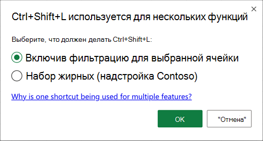
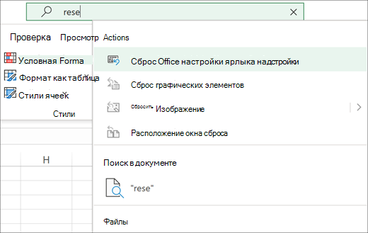

# <a name="add-custom-keyboard-shortcuts-to-your-office-add-ins"></a>Добавление настраиваемого сочетания клавиш в Office надстройки

Ярлыки клавиатуры, также известные как сочетания клавиш, позволяют пользователям надстройки работать более эффективно. Ярлыки клавиатуры также улучшают доступность надстройки для пользователей с ограниченными возможностями, предоставляя альтернативу мыши.

[!include[Keyboard shortcut prerequisites](../includes/keyboard-shortcuts-prerequisites.md)]

> [!NOTE]
> Чтобы начать с рабочей версии надстройки с уже включенными клавишами, клонировать и [запускать Excel клавиши](https://github.com/OfficeDev/Office-Add-in-samples/tree/main/Samples/excel-keyboard-shortcuts). Если вы готовы добавить ярлыки клавиатуры в собственную надстройку, продолжи эту статью.

Существует три шага, чтобы добавить в надстройку ярлыки клавиатуры.

1. [Настройка манифеста надстройки](#configure-the-manifest).
1. [Создание или изменение ярлыков JSON-файла для](#create-or-edit-the-shortcuts-json-file) определения действий и их клавиш.
1. [Добавьте один или несколько вызовов](#create-a-mapping-of-actions-to-their-functions) [API Office.actions.associate](/javascript/api/office/office.actions#office-office-actions-associate-member), чтобы соотновить функцию с каждым действием.

## <a name="configure-the-manifest"></a>Настройка манифеста

В манифест необходимо внести два небольших изменения. Один из них — включить надстройку для использования общего времени работы, а другой — указать на файл в формате JSON, в котором определены ярлыки клавиатуры.

### <a name="configure-the-add-in-to-use-a-shared-runtime"></a>Настройка надстройки для использования общего времени работы

Добавление пользовательских ярлыков клавиатуры требует от надстройки использовать общее время работы. Дополнительные сведения: [Настройка надстройки для использования общего времени работы](../develop/configure-your-add-in-to-use-a-shared-runtime.md).

### <a name="link-the-mapping-file-to-the-manifest"></a>Привязка файла сопоставления к манифесту

Сразу *ниже* (не внутри) элемента `<VersionOverrides>` манифеста добавьте элемент [ExtendedOverrides](/javascript/api/manifest/extendedoverrides) . Установите атрибут `Url` для полного URL-адреса файла JSON в проекте, который будет создан на более позднем этапе.

```xml
    ...
    </VersionOverrides>  
    <ExtendedOverrides Url="https://contoso.com/addin/shortcuts.json"></ExtendedOverrides>
</OfficeApp>
```

## <a name="create-or-edit-the-shortcuts-json-file"></a>Создание или изменение ярлыков JSON-файла

Создайте файл JSON в проекте. Убедитесь, что путь `Url` файла соответствует расположению, указанному для атрибута элемента [ExtendedOverrides](/javascript/api/manifest/extendedoverrides) . В этом файле будут описаны ярлыки клавиатуры и действия, которые они будут вызывать.

1. В файле JSON есть два массива. Массив действий будет содержать объекты, которые определяют действия, которые будут вызываться, а массив ярлыков будет содержать объекты, которые соотносят комбинации ключей с действиями. Пример:
    ```json
    {
        "actions": [
            {
                "id": "SHOWTASKPANE",
                "type": "ExecuteFunction",
                "name": "Show task pane for add-in"
            },
            {
                "id": "HIDETASKPANE",
                "type": "ExecuteFunction",
                "name": "Hide task pane for add-in"
            }
        ],
        "shortcuts": [
            {
                "action": "SHOWTASKPANE",
                "key": {
                    "default": "Ctrl+Alt+Up"
                }
            },
            {
                "action": "HIDETASKPANE",
                "key": {
                    "default": "Ctrl+Alt+Down"
                }
            }
        ]
    }
    ```

    Дополнительные сведения об объектах JSON см. в [дополнительных сведениях о конструкторе объектов действий](#construct-the-action-objects) [и создания объектов ярлыка](#construct-the-shortcut-objects). Полная схема для ярлыков JSON находится в [расширенном манифесте.schema.json](https://developer.microsoft.com/json-schemas/office-js/extended-manifest.schema.json).

    > [!NOTE]
    > В этой статье можно использовать "CONTROL" на месте "Ctrl".

    На более позднем этапе действия сами будут соедему с функциями, которые вы пишете. В этом примере вы позже назовет SHOWTASKPANE функцией, которая вызывает метод, а HIDETASKPANE `Office.addin.showAsTaskpane` — функцией, которая вызывает `Office.addin.hide` метод.

## <a name="create-a-mapping-of-actions-to-their-functions"></a>Создание сопоставления действий с их функциями

1. В проекте откройте файл JavaScript, загруженный вашей htmL-страницей в элементе `<FunctionFile>` .
1. В файле JavaScript [используйте API Office.actions.associate](/javascript/api/office/office.actions#office-office-actions-associate-member), чтобы соотнося каждое действие, указанное в файле JSON, с функцией JavaScript. Добавьте в файл следующий JavaScript. Обратите внимание на следующее о коде.

    - Первый параметр — это одно из действий из файла JSON.
    - Второй параметр — это функция, которая выполняется при нажатии клавиши на сочетание ключей, относясь к действию в файле JSON.

    ```javascript
    Office.actions.associate('-- action ID goes here--', function () {

    });
    ```

1. Чтобы продолжить пример, используйте в `'SHOWTASKPANE'` качестве первого параметра.
1. Для тела функции [используйте метод Office.addin.showAsTaskpane](/javascript/api/office/office.addin#office-office-addin-showastaskpane-member(1)) для открытия области задач надстройки. После этого код должен выглядеть следующим образом:

    ```javascript
    Office.actions.associate('SHOWTASKPANE', function () {
        return Office.addin.showAsTaskpane()
            .then(function () {
                return;
            })
            .catch(function (error) {
                return error.code;
            });
    });
    ```

1. Добавьте второй вызов функции`Office.actions.associate`, чтобы соединить `HIDETASKPANE` действие с функцией, вызываемой [Office.addin.hide](/javascript/api/office/office.addin#office-office-addin-hide-member(1)). Ниже приведен пример.

    ```javascript
    Office.actions.associate('HIDETASKPANE', function () {
        return Office.addin.hide()
            .then(function () {
                return;
            })
            .catch(function (error) {
                return error.code;
            });
    });
    ```

Следуя предыдущим шагам, надстройка позволяет управлять видимостью области задач, нажимая **на Ctrl+Alt+Up** и **Ctrl+Alt+Down**. Такое же поведение показано в примере Excel клавиш в репо Office PnP надстройки в GitHub.[](https://github.com/OfficeDev/Office-Add-in-samples/tree/main/Samples/excel-keyboard-shortcuts)

## <a name="details-and-restrictions"></a>Сведения и ограничения

### <a name="construct-the-action-objects"></a>Построение объектов действия

При указании `actions` объектов в массиве ярлыков.json используйте следующие рекомендации.

- Имена свойств и `id` обязательны `name` .
- Свойство `id` используется для уникальной идентификации действия, вызываемого с помощью ярлыка клавиатуры.
- Свойство `name` должно быть удобной строкой, описываемой действием. Это должно быть сочетание символов A - Z, a - z, 0 - 9 и знаков препинания "-", "_" и "+".
- Свойство `type`— необязательное. В настоящее `ExecuteFunction` время поддерживается только тип.

Ниже приведен пример.

```json
    "actions": [
        {
            "id": "SHOWTASKPANE",
            "type": "ExecuteFunction",
            "name": "Show task pane for add-in"
        },
        {
            "id": "HIDETASKPANE",
            "type": "ExecuteFunction",
            "name": "Hide task pane for add-in"
        }
    ]
```

Полная схема для ярлыков JSON находится в [расширенном манифесте.schema.json](https://developer.microsoft.com/json-schemas/office-js/extended-manifest.schema.json).

### <a name="construct-the-shortcut-objects"></a>Построение объектов ярлыка

При указании `shortcuts` объектов в массиве ярлыков.json используйте следующие рекомендации.

- Имена свойств `action`и `key``default` обязательно.
- Значение свойства является `action` строкой `id` и должно соответствовать одному из свойств объекта действия.
- Свойство `default` может быть любым сочетанием символов A - Z, a -z, 0 - 9, а знаки препинания "-", "_" и "+". (По соглашению в этих свойствах не используются буквы более низкого уровня.)
- Свойство `default` должно содержать имя по крайней мере одного ключа модификатора (Alt, Ctrl, Shift) и только одного другого ключа.
- Shift не может использоваться в качестве только ключа модификатора. Объединяйте Shift с Alt или Ctrl.
- Для macs мы также поддерживаем ключ модификатора Команд.
- Для macs Alt соо- Для Windows командная команда относит к клавише Ctrl.
- Если два символа связаны с одним и тем же физическим ключом в стандартной клавиатуре, `default` они являются синонимами в свойстве; например, Alt+a и Alt+A являются одним и тем же ярлыком, как и Ctrl+- и Ctrl+\_ , так как "-" и "_" являются одним и тем же физическим ключом.
- Символ "+" указывает, что клавиши с обеих сторон нажаты одновременно.

Ниже приведен пример.

```json
    "shortcuts": [
        {
            "action": "SHOWTASKPANE",
            "key": {
                "default": "Ctrl+Alt+Up"
            }
        },
        {
            "action": "HIDETASKPANE",
            "key": {
                "default": "Ctrl+Alt+Down"
            }
        }
    ]
```

Полная схема для ярлыков JSON находится в [расширенном манифесте.schema.json](https://developer.microsoft.com/json-schemas/office-js/extended-manifest.schema.json).

> [!NOTE]
> Клавиши, также известные как последовательное клавиши, например ярлык Excel для выбора цвета заполнения **Alt+H, H**, не поддерживаются в Office надстроек.

## <a name="avoid-key-combinations-in-use-by-other-add-ins"></a>Избегайте комбинаций ключей, которые используются другими надстройки

Существует множество клавиш, которые уже используются Office. Избегайте регистрации клавишных ярлыков для надстройки, которые уже используются, однако могут существовать некоторые случаи, когда необходимо переопределять существующие ярлыки клавиатуры или обрабатывать конфликты между несколькими надстройки, которые зарегистрировали один и тот же ярлык клавиатуры.

В случае конфликта пользователь увидит диалоговое окно при первой попытке использовать конфликтующий ярлык клавиатуры. Обратите внимание, что `name` текст для параметра надстройки, отображаемого в этом диалоговом окте, поступает из свойства в объекте действия в файле `shortcuts.json` .



Пользователь может выбрать, какое действие будет принимать ярлык клавиатуры. После выбора предпочтения сохраняются для будущих применений одного и того же ярлыка. Параметры ярлыка сохраняются для каждого пользователя, для платформы. Если пользователь хочет изменить свои предпочтения, он может **вызвать команду Office** надстройки из поискового окна **Tell me**. При наводке команда очищает все параметры ярлыка надстройки пользователя, и пользователю снова будет предложен диалоговое окно конфликта при следующей попытке использовать конфликтующий ярлык.



Для наилучшего пользовательского интерфейса рекомендуется свести к минимуму конфликты с Excel с этими рекомендациями.

- Используйте только клавиши со следующим шаблоном: **Ctrl+Shift+Alt+* x***, где *x* — это другой ключ.
- Если вам нужно больше клавиш, [проверьте](https://support.microsoft.com/office/1798d9d5-842a-42b8-9c99-9b7213f0040f) список Excel клавиш и не использовать их в надстройки.
- Когда фокус клавиатуры находится внутри пользовательского интерфейса надстройки, **Ctrl+Spacebar** и **Ctrl+Shift+F10** не будут работать, так как это основные ярлыки доступности.
- На компьютере Windows Mac, если в меню поиска отсутствует команда "Reset Office add-ins shortcut preferences", пользователь может вручную добавить команду в ленту, настроив ленту через контекстное меню.

## <a name="customize-the-keyboard-shortcuts-per-platform"></a>Настройка ярлыков клавиатуры для платформы

Можно настроить ярлыки для конкретной платформы. Ниже приводится пример объекта`shortcuts`, который настраивает ярлыки для каждой из следующих платформ: `windows`, , `mac``web`. Обратите внимание, что для `default` каждого ярлыка необходимо иметь клавишу ярлыка.

В следующем примере ключом `default` является клавиша отката для любой платформы, которая не указана. Единственная не указанная платформа Windows, `default` поэтому ключ будет применяться только к Windows.

```json
    "shortcuts": [
        {
            "action": "SHOWTASKPANE",
            "key": {
                "default": "Ctrl+Alt+Up",
                "mac": "Command+Shift+Up",
                "web": "Ctrl+Alt+1",
            }
        },
        {
            "action": "HIDETASKPANE",
            "key": {
                "default": "Ctrl+Alt+Down",
                "mac": "Command+Shift+Down",
                "web": "Ctrl+Alt+2"
            }
        }
    ]
```

## <a name="localize-the-keyboard-shortcuts-json"></a>Локализовать ярлыки клавиатуры JSON

Если надстройка поддерживает несколько локалов, `name` необходимо локализовать свойство объектов действия. Кроме того, если какие-либо из локалов, поддерживаемые надстройками, имеют различные алфавиты или системы записи, а значит, и другие клавиатуры, возможно, потребуется также локализовать ярлыки. Сведения о том, как локализовать клавиши ярлыков JSON, см. в рубрезе [Localize extended overrides](../develop/localization.md#localize-extended-overrides).

## <a name="browser-shortcuts-that-cannot-be-overridden"></a>Ярлыки браузера, которые нельзя переопределять

При использовании настраиваемого сочетания клавиш в Интернете некоторые клавиши, используемые браузером, не могут быть переопределены надстройки. Этот список находится в процессе выполнения. Если вы обнаружите другие комбинации, которые нельзя переопределять, сообщите нам об этом с помощью средства обратной связи в нижней части этой страницы.

- Ctrl+N
- Ctrl+Shift+N
- Ctrl+T
- Ctrl+Shift+T
- Ctrl+W
- Ctrl+PgUp/PgDn

## <a name="enable-custom-keyboard-shortcuts-for-specific-users-preview"></a>Включить настраиваемые ярлыки клавиатуры для определенных пользователей (предварительный просмотр)

Ваша надстройка позволяет пользователям перенастроять действия надстройки на альтернативные сочетания клавиатуры.

> [!IMPORTANT]
> Функции, описанные в этом разделе, в настоящее время находятся в предварительном просмотре и подлежат изменениям. Сейчас они не поддерживаются для использования в рабочих средах. Чтобы попробовать функции предварительного просмотра, необходимо присоединиться к программе [Office insider](https://insider.office.com/join).
> Хороший способ ознакомиться с такими возможностями — использование подписки на Microsoft 365. Если у вас еще нет подписки на Microsoft 365, вы можете оформить ее, присоединившись к [программе для разработчиков Microsoft 365](https://developer.microsoft.com/office/dev-program).

> [!NOTE]
> API, описанные в этом разделе, требуют набора требований [KeyboardShortcuts 1.1](/javascript/api/requirement-sets/keyboard-shortcuts-requirement-sets) .

Используйте [метод Office.actions.replaceShortcuts](/javascript/api/office/office.actions#office-office-actions-replaceshortcuts-member) для назначения пользовательских комбинаций клавиатуры пользователя для действий надстройки. Метод принимает параметр типа `{[actionId:string]: string|null}`, `actionId`где s являются подмножество ID действий, которые должны быть определены в расширенном манифесте надстройки JSON. Значения — это предпочтительные сочетания ключей пользователя. Также может `null`быть значение , `actionId` которое удаляет любую настройку для этого и возвращается к комбинации клавиатуры по умолчанию, которая определена в расширенном манифесте надстройки JSON.

Если пользователь вошел Office, пользовательские комбинации сохраняются в параметрах роуминга пользователя на платформе. Настройка ярлыков в настоящее время не поддерживается анонимными пользователями.

```javascript
const userCustomShortcuts = {
    SHOWTASKPANE:"CTRL+SHIFT+1", 
    HIDETASKPANE:"CTRL+SHIFT+2"
};
Office.actions.replaceShortcuts(userCustomShortcuts)
    .then(function () {
        console.log("Successfully registered.");
    })
    .catch(function (ex) {
        if (ex.code == "InvalidOperation") {
            console.log("ActionId does not exist or shortcut combination is invalid.");
        }
    });
```

Чтобы узнать, какие ярлыки уже используются для пользователя, позвоните по [Office.actions.getShortcuts](/javascript/api/office/office.actions#office-office-actions-getshortcuts-member). Этот метод возвращает объект `[actionId:string]:string|null}`типа, где значения представляют текущую комбинацию клавиатуры, которую пользователь должен использовать для вызова указанного действия. Значения могут быть из трех различных источников:

- Если произошел конфликт с ярлыком, и пользователь решил использовать другое действие (либо родной, либо другой надстройки) для этой комбинации клавиатуры, `null` возвращаемого значения будет, так как ярлык переопределен и нет комбинации клавиатуры, которую пользователь в настоящее время может использовать для вызова этого действия надстройки.
- Если ярлык был настроен с помощью [метода Office.actions.replaceShortcuts](/javascript/api/office/office.actions#office-office-actions-replaceshortcuts-member), возвращаемым значением будет настраиваемая комбинация клавиатуры.
- Если ярлык не был переопределен или настроен, он возвращает значение из расширенного манифеста надстройки JSON.

Ниже приведен пример.

```javascript
Office.actions.getShortcuts()
    .then(function (userShortcuts) {
       for (const action in userShortcuts) {
           let shortcut = userShortcuts[action];
           console.log(action + ": " + shortcut);
       }
    });

```

Как описано в [описании Избегайте](#avoid-key-combinations-in-use-by-other-add-ins) комбинаций ключей, которые используются другими надстройки, это хорошая практика, чтобы избежать конфликтов в ярлыках. Чтобы узнать, используется ли одна или несколько комбинаций ключей, передайте их в качестве массива строк методу [Office.actions.areShortcutsInUse](/javascript/api/office/office.actions#office-office-actions-areshortcutsinuse-member). Метод возвращает отчет, содержащий ключевые сочетания, которые уже используются в виде массива объектов типа `{shortcut: string, inUse: boolean}`. Свойство `shortcut` — это ключевое сочетание, например "CTRL+SHIFT+1". Если комбинация уже зарегистрирована на другое действие, `inUse` свойство настроено на `true`. Например, `[{shortcut: "CTRL+SHIFT+1", inUse: true}, {shortcut: "CTRL+SHIFT+2", inUse: false}]`. Пример следующего фрагмента кода:

```javascript
const shortcuts = ["CTRL+SHIFT+1", "CTRL+SHIFT+2"];
Office.actions.areShortcutsInUse(shortcuts)
    .then(function (inUseArray) {
        const availableShortcuts = inUseArray.filter(function (shortcut) { return !shortcut.inUse; });
        console.log(availableShortcuts);
        const usedShortcuts = inUseArray.filter(function (shortcut) { return shortcut.inUse; });
        console.log(usedShortcuts);
    });

```

## <a name="next-steps"></a>Дальнейшие действия

- См[. Excel надстройки к клавишам](https://github.com/OfficeDev/Office-Add-in-samples/tree/main/Samples/excel-keyboard-shortcuts).
- Получите обзор работы с расширенными переопределениями в Работе с расширенными [переопределениями манифеста](../develop/extended-overrides.md).
