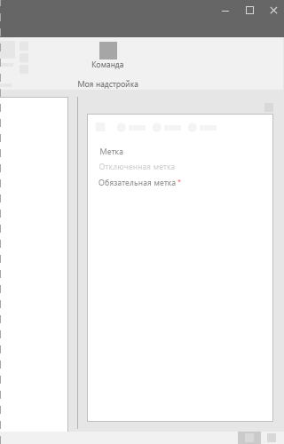

# Компонент Label в Office UI Fabric

Используйте подписи для называния компонента или группы компонентов. Если подпись связана с другим компонентом или группой компонентов, эти связанные компоненты должны находиться на небольшом расстоянии друг от друга. Некоторые компоненты, такие как раскрывающийся список и двухпозиционный элемент, имеют стандартные подписи.
  
#### Пример. Компонент Label в области задач

 

 

## Рекомендации

|**Рекомендуется**|**Не рекомендуется**|
|:------------|:--------------|
|Пишите первое слово с заглавной буквы, например **Имя пользователя**.|Не пишите каждое слово с заглавной буквы, например **Имя Пользователя**.|
|Пишите лаконично.|Не используйте полные предложения или сложную пунктуацию, например двоеточия или точки с запятой.|
|Для подписи компонентов используйте существительное или короткую именную конструкцию.| |

## Варианты

|**Вариант**|**Описание**|**Пример**|
|:------------|:--------------|:----------|
|**Подпись по умолчанию**|Используйте для стандартных подписей.| |
|**Отключенная подпись**|Используйте, когда связанный компонент отключен.| |
|**Обязательная подпись**|Используйте, когда связанный компонент является обязательным.| |

## Реализация

Дополнительные сведения см. в статьях [Подпись](https://dev.office.com/fabric#/components/label) и [Начало работы с примером кода Fabric React](https://github.com/OfficeDev/Word-Add-in-GettingStartedFabricReact).

## Дополнительные ресурсы

- [Конструктивные шаблоны для обеспечения взаимодействия с пользователем](https://github.com/OfficeDev/Office-Add-in-UX-Design-Patterns-Code)

- [Office UI Fabric в надстройках Office](office-ui-fabric.md)
