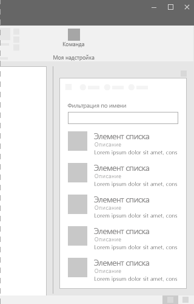
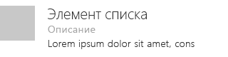
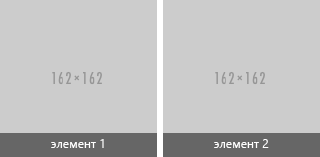

# Компонент "Список" в Office UI Fabric

Списки обеспечивают единообразие при взаимодействии с большими коллекциями содержимого, даже если в них много текста. Списки позволяют пользователям быстро просмотреть содержимое. 
  
#### Пример. Список в области задач

## Рекомендации

- Каждый пункт списка должен заканчиваться точкой в таких случаях:
  - Все пункты представляют собой полное предложение.
  - Один или несколько пунктов содержат как неполное, так и полное предложение, которое содержит дополнительную информацию.
  - Все пункты заканчивают вступительное или неполное предложение.
- Если размещаете на странице несколько списков подряд, разделяйте их заголовками.

## Варианты

|**Вариант**|**Описание**|**Пример**|
|:------------|:--------------|:----------|
|**Список "сетка"**|Используйте, если в каждый пункт списка нужно добавить подробную информацию.| |
|**Список элементов переменной высоты**|Используйте, если нужно добавить большие изображения и текст.| |

## Реализация

Дополнительные сведения см. в статье [Список](https://dev.office.com/fabric#/components/list) и [примере использования кода Fabric React](https://github.com/OfficeDev/Word-Add-in-GettingStartedFabricReact).

## См. также

- [Шаблоны проектирования опыта взаимодействия](https://github.com/OfficeDev/Office-Add-in-UX-Design-Patterns-Code)
- [Office UI Fabric в надстройках Office](office-ui-fabric.md)
