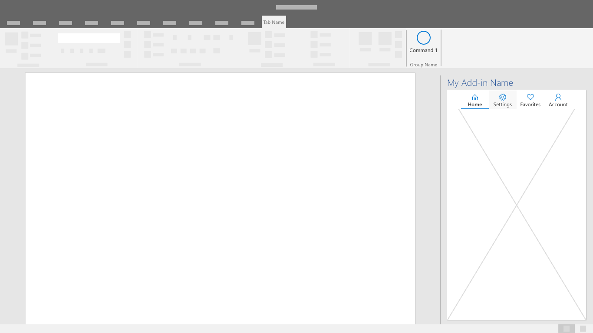
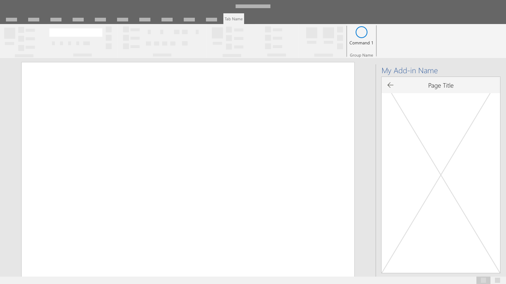

# Шаблоны навигацииNavigation patterns

Доступ к основным функциям надстройки осуществляется через определенные типы команд и ограниченную область экрана.The main features of an add-in are accessed through specific command types and limited screen area. Важно, чтобы навигация была интуитивно понятной, обеспечивала контекст и позволяла пользователю легко перемещаться по всей надстройке.It is important that navigation is intuitive, provides context, and allows the user to move easily throughout the add-in.

## РекомендацииBest practices

| ПравильноDo    | НеправильноDon't |
| :---- | :---- |
| Убедитесь, что пользователю доступен хорошо видимый параметр навигации.Ensure the user has a clearly visible navigation option. | Не затрудняйте процесс навигации, используя нестандартный пользовательский интерфейс.Don't complicate the navigation process by using non-standard UI.
| Используйте, по возможности, указанные ниже компоненты, позволяющие пользователям перемещаться по вашей надстройке.Utilize the following components as applicable to allow users to navigate through your add-in. | Не затрудняйте понимание пользователем своего текущего места или контекста в надстройкеDon't make it difficult for the user to understand their current place or context within the add-in

## Панель командCommand Bar

Панель элементов управления — это поверхность области задач, в которой размещаются команды, работающие с содержимым окна, панели или родительской области, расположенной выше.The CommandBar is a surface within the task pane that houses commands that operate on the content of the window, panel, or parent region it resides above. Дополнительные функции включают точку доступа к меню "гамбургер", поиск и боковые команды.Optional features include a hamburger menu access point, search, and side commands.

## Панель вкладокTab Bar

Панель вкладок показывает навигацию с помощью кнопок с вертикальным текстом и значками.The tab bar shows navigation using buttons with vertically stacked text and icons. Панель вкладок обеспечивает навигацию с помощью вкладок с короткими и понятными названиями.Use the tab bar to provide navigation using tabs with short and descriptive titles.

## Кнопка "Назад"Back Button

Кнопка "назад" позволяет пользователям восстанавливаться при переходе по навигации.The back button allows users to recover from a drill-down navigational action. Этот шаблон помогает пользователям следовать упорядоченной последовательности действий.This pattern helps ensure users follow an ordered series of steps.

