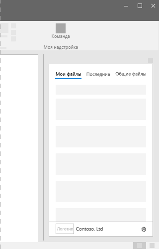

# Области задач в надстройках Office
 
Области задач — это области интерфейса, которые обычно отображаются в правой части окна Word, PowerPoint, Excel и Outlook. Элементы области задач выполняют код для изменения документов или писем, а также для отображения данных. Используйте области задач, когда вам не нужно внедрять функции прямо в документ.

*Рис. 1. Типичный макет области задач*

## Советы и рекомендации

|**Рекомендуется**|**Не рекомендуется**|
|:-----|:--------|
|<ul><li>Включите имя надстройки в название.</li></ul>|<ul><li>Не включайте в него название вашей компании.</li></ul>|
|<ul><li>Используйте короткие описательные имена в названии.</li></ul>|<ul><li>Не добавляйте такие строки, как "надстройка", "для Word" или "для Office", в название надстройки.</li></ul>|
|<ul><li>Добавьте элемент навигации или управления, такой как CommandBar или Pivot, в верхнюю часть надстройки.</li></ul>||
|<ul><li>Включите элемент фирменной символики, такой как BrandBar, в нижнюю часть надстройки, если только она не будет использоваться исключительно в Outlook.</li></ul>||

## Варианты

На следующих рисунках показаны различные размеры области задач с помощью ленты приложения Office с разрешением 1366x768. Для Excel для размещения строки формул требуется дополнительное вертикальное пространство.  

*Рис. 2. Размеры области задач в классических приложениях Office 2016*

- Excel — 320 x 455
- PowerPoint — 320 x 531
- Word — 320 x 531
- Outlook — 348 x 535

 

*Рис. 3. Размеры областей задач Office*

- Excel — 350 x 378
- PowerPoint — 348 x 391
- Word — 329 x 445
- Outlook (в Интернете) — 320 x 570

## Меню личных данных

Меню личных данных могут перекрывать элементы навигации и управления, расположенные в правой верхней части надстройки. Ниже указаны текущие размеры меню личных данных в Windows и Mac.

Меню личных данных в Windows имеет размер 12 x 32 пикселей, как показано ниже.

*Рис. 4. Меню личных данных в Windows*

В Mac меню личных данных имеет размер 26 x 26 пикселей, но сдвинуто на 8 пикселей влево и на 6 вниз, из-за чего оно занимает пространство размером 34 x 32 пикселя, как показано на изображении.

*Рис. 5. Меню личных данных на Mac*

## Реализация

Ознакомьтесь с реализацией области задач на примере [надстройки Excel "Тенденции расходов банка WoodGrove" на JS](https://github.com/OfficeDev/Excel-Add-in-WoodGrove-Expense-Trends) на сайте GitHub. 

## См. также

- [Office UI Fabric в надстройках Office](office-ui-fabric.md) 
- [Конструктивные шаблоны для надстроек Office](../design/ux-design-pattern-templates.md)

