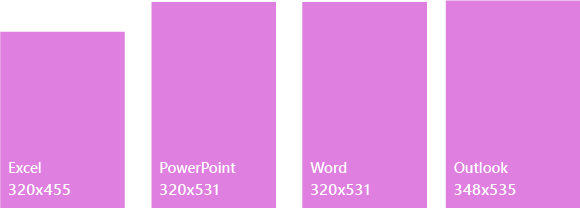

# Области задач в надстройках OfficeTask panes in Office Add-ins
 
Области задач — это области интерфейса, которые обычно отображаются в правой части окна Word, PowerPoint, Excel и Outlook. Элементы области задач выполняют код для изменения документов или писем, а также для отображения данных. Используйте области задач, когда вам не нужно внедрять функции прямо в документ.Task panes are interface surfaces that typically appear on the right side of the window within Word, PowerPoint, Excel, and Outlook. Task panes give users access to interface controls that run code to modify documents or emails, or display data from a data source. Use task panes when you don't need to embed functionality directly into the document.

*Рис. 1. Типичный макет области задач**Figure 1. Typical task pane layout*

## Советы и рекомендацииBest practices

|**Рекомендуется****Do**|**Не рекомендуется****Don't**|
|:-----|:--------|
|<ul><li>Включите имя надстройки в название.Include the name of your add-in in the title.</li></ul>|<ul><li>Не включайте в него название вашей компании.Don't append your company name to the title.</li></ul>|
|<ul><li>Используйте короткие описательные имена в названии.Use short descriptive names in the title.</li></ul>|<ul><li>Не включайте такие строки, как "надстройка", "для Word" или "для Office", в название надстройки.Don't append strings such as “Add-in,” “For Word,” or “for Office” to the title of your add-in.</li></ul>|
|<ul><li>Добавьте элемент навигации или управления, такой как CommandBar или Pivot, в верхнюю часть надстройки.Include some navigational or commanding element such as the CommandBar or Pivot at the top of your add-in.</li></ul>||
|<ul><li>Включите элемент фирменной символики, такой как BrandBar, в нижнюю часть надстройки, если только она не будет использоваться исключительно в Outlook.Include a branding element such as the BrandBar at the bottom of your add-in unless your add-in is to be used within Outlook.</li></ul>||

## ВариантыVariants

На изображениях ниже приведены области задач разных размеров с лентой Office при разрешении 1366 x 768. Чтобы вставить строку формул в Excel, требуется дополнительное пространство по вертикали.The following images show the various task pane sizes with the Office ribbon at a 1366x768 resolution. For Excel, additional vertical space is required to accommodate the formula bar.  

*Рис. 2. Размеры области задач в классических приложениях Office 2016**Figure 2. Office 2016 desktop task pane sizes*

- Excel — 320 x 455Excel - 320x455
- PowerPoint — 320 x 531PowerPoint - 320x531
- Word — 320 x 531Word - 320x531
- Outlook — 348 x 535Outlook - 348x535

 

*Рис. 3. Размеры области задач в Office 365**Figure 3. Office 365 task pane sizes*

- Excel — 350 x 378Excel - 350x378
- PowerPoint — 348 x 391PowerPoint - 348x391
- Word — 329 x 445Word - 329x445
- Outlook Web App — 320 x 570Outlook Web App - 320x570

## Меню личных данныхPersonality menu

Меню личных данных могут перекрывать элементы навигации и управления, расположенные в правой верхней части надстройки. Ниже указаны текущие размеры меню личных данных в Windows и Mac.Personality menus can obstruct navigational and commanding elements located near the top right of the add-in. The following are the current dimensions of the personality menu on Windows and Mac.

Меню личных данных в Windows имеет размер 12 x 32 пикселей, как показано ниже.For Windows, the personality menu measures 12x32 pixels, as shown.

*Рис. 4. Меню личных данных в Windows**Figure 4. Personality menu on Windows*

В Mac меню личных данных имеет размер 26 x 26 пикселей, но сдвинуто на 8 пикселей влево и на 6 вниз, из-за чего оно занимает пространство размером 34 x 32 пикселя, как показано на изображении.For Mac, the personality menu measures 26x26 pixels, but floats 8 pixels in from the right and 6 pixels from the top, which increases the space to 34x32 pixels, as shown.

*Рис. 5. Меню личных данных на Mac**Figure 5. Personality menu on Mac*

## РеализацияImplementation

Ознакомьтесь с реализацией области задач на примере [надстройки Excel "Тенденции расходов банка WoodGrove" на JS](https://github.com/OfficeDev/Excel-Add-in-WoodGrove-Expense-Trends) на сайте GitHub.For a sample that implements a task pane, see [Excel Add-in JS WoodGrove Expense Trends](https://github.com/OfficeDev/Excel-Add-in-WoodGrove-Expense-Trends) on GitHub. 

## См. такжеSee also

- [Office UI Fabric в надстройках OfficeOffice UI Fabric in Office Add-ins](office-ui-fabric.md) 
- [Конструктивные шаблоны для надстроек OfficeUX design patterns for Office Add-ins](https://github.com/OfficeDev/Office-Add-in-UX-Design-Patterns-Code)

