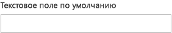
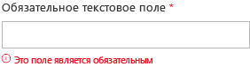

# Компонент "Текстовое поле" в Office UI Fabric

Текстовое поле используется для ввода текста (обычно одной строки, но можно настроить и для ввода нескольких строк). Текст отображается на экране в простом, универсальном формате.
  
#### Пример. Компонент "Текстовое поле" в области задач

## Рекомендации

|**Рекомендуется**|**Не рекомендуется**|
|:------------|:--------------|
|Используйте текстовые поля для ввода данных в форме или на странице.|Не используйте текстовые поля для отображения основной копии в составе элемента body страницы.|
|Подписывайте текстовые поля информативными именами.|Не используйте текстовые поля для ввода даты или времени. Вместо этого используйте элемент выбора даты и времени.|
|Используйте краткий замещающий текст, чтобы указать, что нужно ввести.|Не используйте текстовые поля, если можете определить стандартные варианты выбора. Вместо этого используйте раскрывающийся список.|
|Укажите все возможные состояния для текстовых полей (статическое, в фокусе, занято, недоступно, с ошибкой, с наведенным указателем мыши).||
|Четко обозначьте обязательные и необязательные текстовые поля.||
|По возможности формат текстовых полей должен соответствовать ожидаемому формату данных. Например, если поле предназначено для ввода 10-значного номера телефона, используйте три отдельных поля для разных частей номера.||

## Варианты

|**Вариант**|**Описание**|**Пример**|
|:------------|:--------------|:----------|
|**TextField по умолчанию**|Используйте как текстовое поле по умолчанию.| |
|**Отключенный компонент TextField**|Используйте, когда текстовое поле отключено.| |
|**Обязательный компонент TextField**|Используйте, если в это текстовое поле нужно обязательно ввести данные.| |
|**Компонент TextField с заполнителем**|Используйте, когда требуется замещающий текст.| |
|**Компонент TextField с несколькими строками**|Используется, когда требуется много строк текста.| |

## Реализация

Дополнительные сведения см. в статьях [Текстовое поле](https://dev.office.com/fabric#/components/textfield) и [Начало работы с примером кода Fabric React](https://github.com/OfficeDev/Word-Add-in-GettingStartedFabricReact).

## См. также

- [Шаблоны проектирования опыта взаимодействия](https://github.com/OfficeDev/Office-Add-in-UX-Design-Patterns-Code)
- [Office UI Fabric в надстройках Office](office-ui-fabric.md)
