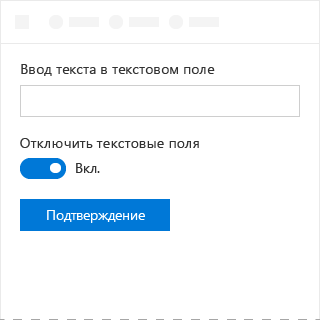

# Компонент "Переключатель" в Office UI Fabric

Используйте переключатели, чтобы предоставить два взаимоисключающих варианта (например, включено/отключено), при выборе одного из которых изменения вступают в силу немедленно.
  
#### Пример. Компонент "Переключатель" в области задач

## Рекомендации

|**Рекомендуется**|**Не рекомендуется**|
|:------------|:--------------|
|Двухпозиционные переключатели используются для выбора одного варианта из двух, при этом изменения применяются немедленно.   |Не используйте двухпозиционные переключатели, если пользователи должны выполнить еще одно действие, чтобы изменения вступили в силу.   |
|Заменяйте метки **Вкл.** и **Выкл.** только при наличии более точных подписей. Используйте короткие подписи (3–4 символа), противоположные по смыслу.| |

## Варианты

|**Вариант**|**Описание**|**Пример**|
|:------------|:--------------|:----------|
|**Включен и выбран**|Используйте, когда переключатель находится в активном состоянии.| |
|**Включен и не выбран**|Используйте, когда переключатель находится в неактивном состоянии.| |
|**Отключен и выбран**|Используйте, когда активное состояние нельзя изменить.| |
|**Отключен и не выбран**|Используйте, когда неактивное состояние нельзя изменить.| |

## Реализация

Дополнительные сведения см. в статьях [Переключатель](https://dev.office.com/fabric#/components/toggle) и [Начало работы с примером кода Fabric React](https://github.com/OfficeDev/Word-Add-in-GettingStartedFabricReact).

## См. также

- [Шаблоны проектирования опыта взаимодействия](https://github.com/OfficeDev/Office-Add-in-UX-Design-Patterns-Code)
- [Office UI Fabric в надстройках Office](office-ui-fabric.md)
