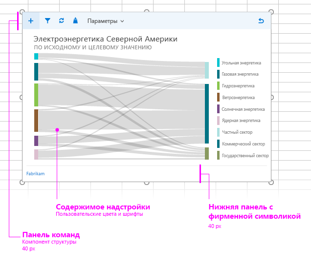

# Макет для контентных надстроек

Обеспечьте единообразный внешний вид и удобство использования ваших контентных надстроек с помощью рекомендованного макета дизайна. Рекомендованный макет контентной надстройки включает следующие элементы: 

- Панель команд (необязательно). Включает значки или средства навигации для пользователей и может располагаться поверх содержимого надстройки. Максимальная высота — 80 пикселей.
- Содержимое надстройки
- Элемент фирменной символики (необязательно)

Вы также можете добавить в контентную надстройку [особый пользовательский интерфейс на основе HTML](ui-elements.md#custom-html-based-ui).

[Пример использования Office UI Fabric в надстройках для Office](https://github.com/OfficeDev/Office-Add-in-Fabric-UI-Sample)

<!-- Add sample template for content add-in and individual building blocks - Command Bar, Input, layout components. -->

## См. также

- [Рекомендации по проектированию надстроек Office](../add-in-design.md)