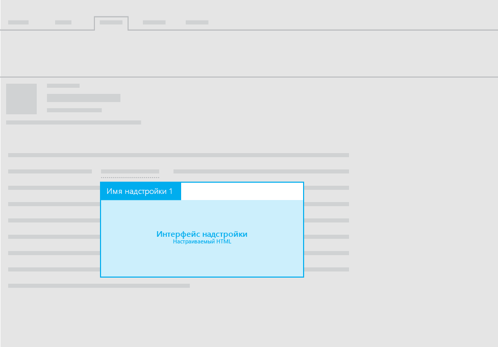

# Макеты для почтовых надстроек

Макеты для почтовых надстроек могут предусматривать использование следующего:

- область задач;
- контекстная область;
- функции с уведомлениями информационной панели.

Рекомендации для текста пользовательского интерфейса надстроек см. в разделе [Стиль речи для Office](https://msdn.microsoft.com/ru-ru/library/office/mt484351.aspx).

## Приложения области задач

Рекомендованные макеты для почтовых надстроек, предусматривающие использование области задач, описаны в разделе [Макет для надстроек области задач](layout-for-task-pane-add-ins.md).

## Контекстные надстройки

На следующем изображении показан рекомендуемый макет [контекстной почтовой надстройки](https://docs.microsoft.com/ru-ru/outlook/add-ins/contextual-outlook-add-ins).

## Функции с уведомлениями информационной панели

Помимо использования области задач или контекстной области для отображения настраиваемого HTML-интерфейса в почтовой надстройке, можно выполнять функции из команд. Показать текст пользовательского интерфейса в результате выполнения функции можно с помощью уведомлений информационной панели. Например, вам может потребоваться использовать уведомление информационной панели для отображения сообщений об ошибке или успешном выполнении. 

Дополнительные сведения см. в статье о [командах надстроек для почты](https://docs.microsoft.com/ru-ru/outlook/add-ins/add-in-commands-for-outlook). 

## См. также

- [Рекомендации по проектированию надстроек Office](../add-in-design.md)
