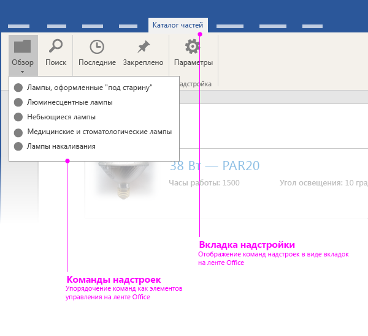
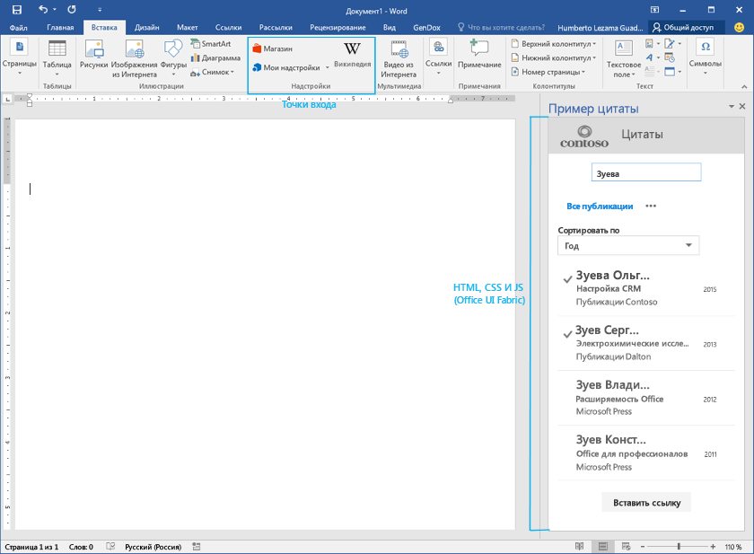

# Элементы пользовательского интерфейса надстроек Office

В надстройках Office можно использовать два типа элементов пользовательского интерфейса: 

- Команды надстроек 
- Настраиваемые интерфейсы на основе HTML

## Команды надстроек
Команды определены в [манифесте XML надстроек](../../../docs/develop/define-add-in-commands.md) и обрабатываются в виде встроенных расширений пользовательского интерфейса Office. Например, вы можете использовать команды надстроек, чтобы добавлять кнопки на ленту Office. 

В настоящее время команды надстроек поддерживаются только для настроек почты. Дополнительные сведения см. в статье, рассказывающей о [командах почтовых надстроек](../../outlook/add-in-commands-for-outlook.md). 

В Excel, PowerPoint и Word есть заранее определенные точки входа для надстроек области задач и контентных надстроек на вкладке "Вставка" ленты Office. Возможность создавать пользовательские команды для надстроек содержимого и области задач появится в скором времени. 

## Настраиваемый пользовательский интерфейс на основе HTML
Надстройки могут внедрять настраиваемый пользовательский интерфейс на основе HTML в клиенты Office. Контейнеры, которые доступны для отображения пользовательского интерфейса, зависят от типа надстройки. Например, надстройки области задач отображают настраиваемый пользовательский интерфейс на основе HTML в правой области документа, в то время как надстройки содержимого — непосредственно в документах Office.

Независимо от типа создаваемой надстройки вы можете использовать стандартные блоки, чтобы создавать настраиваемый пользовательский интерфейс на основе HTML. Мы рекомендуем использовать [Office UI Fabric](https://github.com/OfficeDev/Office-UI-Fabric) для этих элементов пользовательского интерфейса, чтобы ваша надстройка вписалась в стиль Office. Вы также можете свободно использовать собственные элементы пользовательского интерфейса, чтобы подчеркнуть фирменную символику.

Office UI Fabric содержит следующие элементы пользовательского интерфейса:

- шрифтовое оформление;
- Цвет
- Значки
- анимация;
- компоненты ввода;
- макеты;
- элементы навигации.

Вы можете скачать [Office UI Fabric с сайта Github](https://github.com/OfficeDev/Office-UI-Fabric).

Пример использования Office UI Fabric в надстройках можно найти в статье [Пример использования Office UI Fabric в надстройках для Office](https://github.com/OfficeDev/Office-Add-in-Fabric-UI-Sample).

**Примечание.** Если вы решите использовать собственный набор шрифтов и значков, убедитесь, что они не конфликтуют с Office. Например, не используйте значки, которые похожи на значки Office, но представляют другие функции в вашей надстройке. 

### Создание настраиваемой цветовой палитры
Если вы решили использовать собственную цветовую палитру, учитывайте следующее: 
 
- Используйте цвета, чтобы донести пользователям самые ценные сведения о вашем бренде, а также сделать надстройку визуально приятнее.
- Используйте цвета осмысленно и согласованно. Например, выберите один цвет в качестве акцентного, чтобы создать в надстройке единую визуальную тему.
- Не используйте один и тот же цвет для интерактивных и неинтерактивных элементов. Если вы используете определенный цвет для обозначения элементов, с которыми могут взаимодействовать пользователи, например элементов навигации, ссылок и кнопок, не используйте его для статических элементов.
- Используя цветной текст или белый текст на цветном фоне, убедитесь, что цвета достаточно контрастны, чтобы соответствовать требованиям к специальным возможностям (соотношение контраста 4,5:1).
- Помните о неспособности некоторых людей различать цвета — обозначайте интерактивность не только с помощью цветов.

### Темы 
Независимо от того, решите вы применить цветовую схему Office или свою собственную, мы рекомендуем использовать наши API для тем. Надстройки, которые используют темы Office, будут смотреться в нем более целостно.

- Для надстроек почты и области задач используйте свойство [Context.officeTheme](../../../reference/shared/office.context.officetheme.md), чтобы соответствовать темам приложений Office. Этот API в данный момент доступен только в Office 2016.  
- Информацию о контентных надстройках PowerPoint см. в инструкциях по [использованию тем Office в надстройках для PowerPoint](../../powerpoint/use-document-themes-in-your-powerpoint-add-ins.md).

<!-- Link to theming API docs and Humberto's seed sample. Add screenshot of themed add-in. -->

