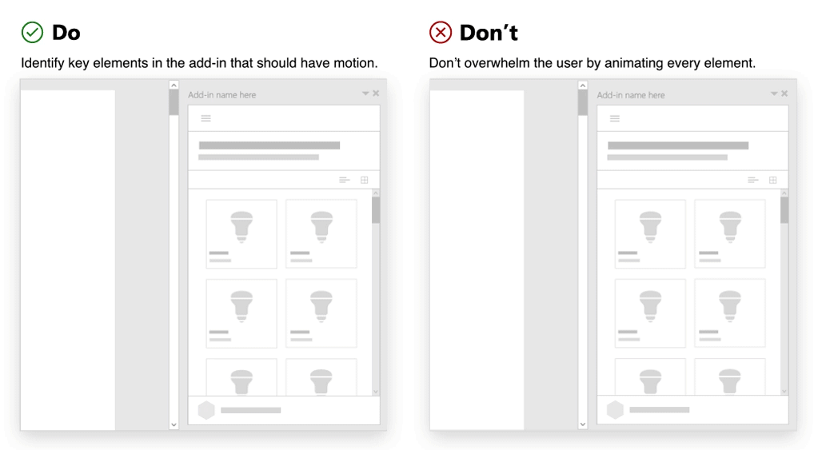

# Использование движения в надстройках OfficeUsing motion in Office add-ins

Вы можете использовать движение, чтобы сделать надстройку Office удобнее для пользователя.When you design an Office Add-in, you can use motion to enhance the user experience. Элементы пользовательского интерфейса, элементы управления и компоненты часто отличаются интерактивным поведением, требующим переходов, перемещений или анимации.UI elements, controls, and components often have interactive behaviors that require transitions, motion, or animation. Общие характеристики перемещения между элементами пользовательского интерфейса определяют свойства анимации языка дизайна.Common characteristics of motion across UI elements define the animation aspects of a design language. 

Так как набор Office ориентирован на производительность, язык анимации Office нацелен в первую очередь на выполнение клиентами своих задач.Because Office is focused on productivity, the Office animation language supports the goal of helping customers get things done. Он обеспечивает баланс между оперативным откликом, надежной хореографией и удобством использования.It strikes a balance between performant response, reliable choreography, and detailed delight. Внедренные в Office надстройки работают в контексте этого языка анимации.Add-ins embedded in Office sit within this existing animation language. Поэтому, применяя движение, важно учитывать указанные ниже рекомендации.Given this context, it is important to consider the following guidelines when applying motion. 

## Создавайте движение с определенной цельюCreate motion with a purpose

Движение должно иметь цель, представляющую ценность для пользователя.Motion should have a purpose that communicates additional value to the user. Учитывайте тон и цель содержимого при выборе анимации.Consider the tone and purpose of your content when choosing animations. Обрабатывайте критические сообщения не так, как описательные.Handle critical messages differently than exploratory navigations.

Стандартные элементы, используемые в надстройке, могут включать движение, которое акцентирует внимание пользователя, показывает, как элементы связаны друг с другом, или подтверждает правильность действия.Standard elements used in an add-in can incorporate motion to help focus the user, show how elements relate to each other, and validate user actions. Спланируйте хореографию элементов, чтобы усилить иерархию и умозрительные модели.Choreograph elements to reinforce hierarchy and mental models.

### РекомендацииBest practices

|ПравильноDo|НеправильноDon't|
|:-----|:-----|
|Определите основные элементы надстройки, которые нужно анимировать.Identify key elements in the add-in that should have motion. Обычно анимируются панели, оверлеи, модальные окна, подсказки, меню и учебные выноски.Commonly animated elements in an add-in are panels, overlays, modals, tool tips, menus, and teaching call outs.| Не перегружайте пользователя, анимируя все элементы.Don't overwhelm the user by animating every element. Не применяйте нескольких движений, которые акцентируют внимание пользователя на нескольких элементах одновременно.Avoid applying multiple motions that attempt to lead or focus the user on many elements at once. |
|Используйте простое предсказуемое движение. Учитывайте происхождение элемента-триггера. Используйте движение, чтобы создать связь между действием и итоговым пользовательским интерфейсом.Use simple, subtle motion that behaves in expected ways. Consider the origin of your triggering element. Use motion to create a link between the action and the resulting UI. | Не заставляйте пользователя ждать движения.Don't create wait time for a motion. Движение в надстройках не должно препятствовать выполнению задачи.Motion in add-ins should not hinder task completion.|

## Используйте предсказуемые движенияUse expected motions
Рекомендуем использовать [Office UI Fabric](https://developer.microsoft.com/fabric) для создания визуальной связи с платформой Office, а также [анимации Fabric](https://developer.microsoft.com/fabric#/styles/animations) для создания движений, которые согласуются с языком движения Fabric.We recommend using [Office UI Fabric](https://developer.microsoft.com/fabric) to create a visual connection with the Office platform, and we also encourage the use of [Fabric Animations](https://developer.microsoft.com/fabric#/styles/animations) to create motions that align with the Fabric motion language. 

Используйте эту платформу для более простой интеграции с Office. Это поможет создавать удобные в работе интерфейсы. Классы CSS анимации обеспечивают направленность, точки входа и выхода, а также особенности длительности, которые усиливают умозрительные модели Office и помогают пользователям научиться работать с вашей надстройкой.Use it to fit seamlessly in Office. It will help you create experiences that are more felt than observed. The animation CSS classes provide directionality, enter/exit, and duration specifics that reinforce Office mental models and provide opportunities for customers to learn how to interact with your add-in.

### РекомендацииBest practices

|ПравильноDo|НеправильноDon't|
|:-----|:-----|
|Используйте движение, которое согласуется с языком движения Fabric.Use motion that aligns with behaviors in Fabric.| Не создавайте движения, которые конфликтуют со стандартными шаблонами движения в Office.Don't create motions that interfere or conflict with common motion patterns in Office. 
|Одинаковые элементы должны иметь одинаковую анимацию.Ensure that there is a consistent application of motion acoss like elements.| Не используйте разные движения для анимации одного и того же компонента или объекта.Don't use different motions to animate the same component or object.|
|Используйте одно направление при анимации элемента.Create consistency with use of direction in animation. Например, панель, которая открывается справа, должна закрываться справа.For example, a panel that opens from the right should close to the right.|Не анимируйте элемент, используя несколько направлений.Don't animate an element using multiple directions.

## Не используйте движение, которое нетипично для элементаAvoid out of character motion for an element

Анимируя элемент, учитывайте размер холста HTML (панели задач, диалогового окна или контентной надстройки).Consider the size of the HTML canvas (task pane, dialog box, or content add-in) when implementing motion. Не перегружайте холст.Avoid overloading in constrained spaces. Движущиеся элементы должны сочетаться со средой Office.Moving element(s) should be in tune with Office. Характер движения надстройки должен быть эффективным, надежным и плавным.The character of add-in motion should be performant, reliable, and fluid. Стремитесь информировать и направлять пользователя, не осложняя его работу.Instead of impeding productivity, aim to inform and direct.

### РекомендацииBest practices

|ПравильноDo|НеправильноDon't|
|:-----|:-----|
| Используйте [рекомендуемую длительность движения](https://developer.microsoft.com/fabric#/styles/animations).Use [recommended motion durations](https://developer.microsoft.com/fabric#/styles/animations). | Не используйте чрезмерную анимацию.Don't use exaggerated animations. Старайтесь не создавать нефункциональные движения, которые только отвлекают пользователей.Avoid creating experiences that embellish and distract your customers.
| Используйте [рекомендуемые кривые замедления](https://docs.microsoft.com/windows/uwp/design/motion/timing-and-easing#easing-in-fluent-motion).Follow recommended easing curves in the [Microsoft Motion Guide](https://docs.microsoft.com/windows/uwp/design/motion/timing-and-easing#easing-in-fluent-motion).  |Не перемещайте элементы рывками или по частям.Don't move elements in a jerky or disjointed manner. Избегайте упреждения, возвратов, эффекта "резиновой ленты" или других эффектов, которые имитируют законы физики реального мира.Avoid anticipations, bounces, rubberband, or other effects that emulate natural world physics.|

## См. такжеSee also

* [Правила анимации FabricFabric animation guidelines](https://developer.microsoft.com/fabric#/styles/animations)
* [Движение для приложений универсальной платформы WindowsMotion for Universal Windows Platform apps](https://docs.microsoft.com/windows/uwp/design/motion)

