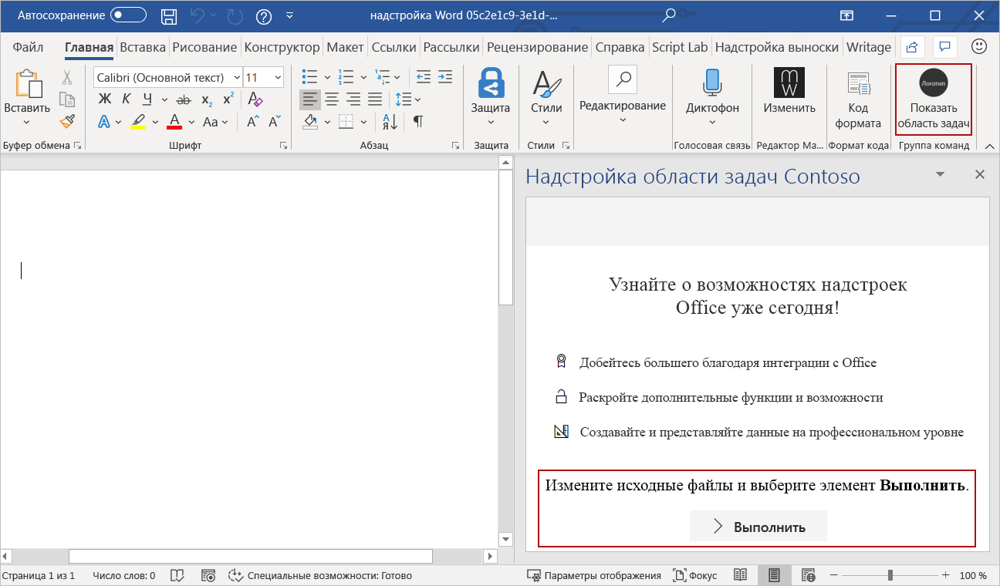
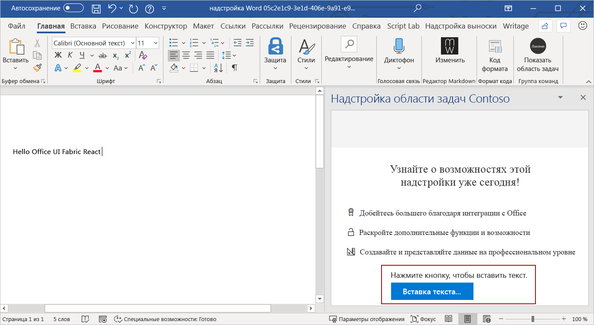

# <a name="use-office-ui-fabric-react-in-office-add-ins"></a><span data-ttu-id="28fa7-103">Использование Office UI Fabric React в надстройках Office</span><span class="sxs-lookup"><span data-stu-id="28fa7-103">Use Office UI Fabric React in Office Add-ins</span></span>

<span data-ttu-id="28fa7-p101">Office UI Fabric — это интерфейсная платформа JavaScript для построения взаимодействия с пользователем в Office и Office 365. Если вы разрабатываете надстройку с использованием React, пользовательский интерфейс рекомендуется создать с помощью Fabric React. В Fabric предоставлены некоторые компоненты дизайна на основе React, например кнопки и флажки, которые можно использовать в надстройке.</span><span class="sxs-lookup"><span data-stu-id="28fa7-p101">Office UI Fabric is a JavaScript front-end framework for building user experiences for Office and Office 365. If you build your add-in using React, consider using Fabric React to create your user experience. Fabric provides several React-based UX components, like buttons or checkboxes, that you can use in your add-in.</span></span>

<span data-ttu-id="28fa7-107">В этой статье объясняется, как создать надстройку с помощью React и использованием компонентов Fabric React.</span><span class="sxs-lookup"><span data-stu-id="28fa7-107">This article describes how to create an add-in that's built with React and uses Fabric React components.</span></span> 

> [!NOTE]
> <span data-ttu-id="28fa7-108">В Fabric React используется[Fabric Core](office-ui-fabric.md#use-fabric-core-icons-fonts-colors), поэтому после выполнения вами действий, указанных в этой статье, ваша надстройка будет включать и доступ к Fabric Core.</span><span class="sxs-lookup"><span data-stu-id="28fa7-108">[Fabric Core](office-ui-fabric.md#use-fabric-core-icons-fonts-colors) is included with Fabric React, which means your add-in will also have access to Fabric Core after you've completed the steps in this article.</span></span>

## <a name="create-an-add-in-project"></a><span data-ttu-id="28fa7-109">Создание проекта надстройки</span><span class="sxs-lookup"><span data-stu-id="28fa7-109">Create an Outlook add-in project</span></span>

<span data-ttu-id="28fa7-110">Чтобы создать надстройку с использованием React, рекомендуется воспользоваться генератором Yeoman для надстроек Office.</span><span class="sxs-lookup"><span data-stu-id="28fa7-110">You'll use the Yeoman generator for Office Add-ins to create an add-in project that uses React.</span></span>

### <a name="install-the-prerequisites"></a><span data-ttu-id="28fa7-111">Установка необходимых компонентов</span><span class="sxs-lookup"><span data-stu-id="28fa7-111">Install the prerequisites.</span></span>

[!include[Yeoman generator prerequisites](../includes/quickstart-yo-prerequisites.md)]

### <a name="create-the-project"></a><span data-ttu-id="28fa7-112">Создание проекта</span><span class="sxs-lookup"><span data-stu-id="28fa7-112">Create the add-in project</span></span>

<span data-ttu-id="28fa7-113">С помощью генератора Yeoman создайте проект надстройки Word.</span><span class="sxs-lookup"><span data-stu-id="28fa7-113">Use the Yeoman generator to create a Word add-in project.</span></span> <span data-ttu-id="28fa7-114">Выполните приведенную ниже команду и ответьте на вопросы, как показано ниже.</span><span class="sxs-lookup"><span data-stu-id="28fa7-114">Run the following command and then answer the prompts as follows:</span></span>

```command&nbsp;line
yo office
```

- <span data-ttu-id="28fa7-115">**Выберите тип проекта:** `Office Add-in Task Pane project using React framework`</span><span class="sxs-lookup"><span data-stu-id="28fa7-115">**Choose a project type:** `Office Add-in Task Pane project using React framework`</span></span>
- <span data-ttu-id="28fa7-116">**Выберите тип сценария:** `TypeScript`</span><span class="sxs-lookup"><span data-stu-id="28fa7-116">**Choose a script type:** `TypeScript`</span></span>
- <span data-ttu-id="28fa7-117">**Как вы хотите назвать надстройку?**</span><span class="sxs-lookup"><span data-stu-id="28fa7-117">**What do you want to name your add-in?**</span></span> `My Office Add-in`
- <span data-ttu-id="28fa7-118">**Какое клиентское приложение Office должно поддерживаться?**</span><span class="sxs-lookup"><span data-stu-id="28fa7-118">**Which Office client application would you like to support?**</span></span> `Word`


<span data-ttu-id="28fa7-120">После завершения работы мастера генератор создаст проект и установит вспомогательные компоненты Node.</span><span class="sxs-lookup"><span data-stu-id="28fa7-120">After you complete the wizard, the generator will create the project and install supporting Node components.</span></span>

### <a name="try-it-out"></a><span data-ttu-id="28fa7-121">Проверка</span><span class="sxs-lookup"><span data-stu-id="28fa7-121">Try it out</span></span>

1. <span data-ttu-id="28fa7-122">Перейдите к корневой папке проекта.</span><span class="sxs-lookup"><span data-stu-id="28fa7-122">Navigate to the root folder of the project.</span></span>

    ```command&nbsp;line
    cd "My Office Add-in"
    ```

2. <span data-ttu-id="28fa7-123">Выполните следующие действия, чтобы запустить локальный веб-сервер и загрузить неопубликованную надстройку.</span><span class="sxs-lookup"><span data-stu-id="28fa7-123">Complete the following steps to start the local web server and sideload your add-in.</span></span>

    > [!NOTE]
    > <span data-ttu-id="28fa7-124">Надстройки Office должны использовать HTTPS, а не HTTP, даже в случае разработки.</span><span class="sxs-lookup"><span data-stu-id="28fa7-124">Office Add-ins should use HTTPS, not HTTP, even when you are developing.</span></span> <span data-ttu-id="28fa7-125">Если вам будет предложено установить сертификат после того, как вы запустите одну из указанных ниже команд, примите предложение установить сертификат, предоставленный генератором Yeoman.</span><span class="sxs-lookup"><span data-stu-id="28fa7-125">If you are prompted to install a certificate after you run one of the following commands, accept the prompt to install the certificate that the Yeoman generator provides.</span></span>

    > [!TIP]
    > <span data-ttu-id="28fa7-126">Если вы тестируете надстройку на компьютере Mac, перед тем, как продолжить, выполните приведенную ниже команду.</span><span class="sxs-lookup"><span data-stu-id="28fa7-126">If you're testing your add-in on Mac, run the following command before proceeding.</span></span> <span data-ttu-id="28fa7-127">После выполнения этой команды запустится локальный веб-сервер.</span><span class="sxs-lookup"><span data-stu-id="28fa7-127">When you run this command, the local web server will start.</span></span>
    >
    > ```command&nbsp;line
    > npm run dev-server
    > ```

    - <span data-ttu-id="28fa7-128">Чтобы проверить надстройку в Word, выполните приведенную ниже команду в корневом каталоге своего проекта.</span><span class="sxs-lookup"><span data-stu-id="28fa7-128">To test your add-in in Word, run the following command in the root directory of your project.</span></span> <span data-ttu-id="28fa7-129">При этом запускается локальный веб-сервер (если он еще не запущен) и открывается приложение Word с загруженной надстройкой.</span><span class="sxs-lookup"><span data-stu-id="28fa7-129">This starts the local web server (if it's not already running) and opens Word with your add-in loaded.</span></span>

        ```command&nbsp;line
        npm start
        ```

    - <span data-ttu-id="28fa7-130">Чтобы проверить надстройку в Word в браузере, выполните приведенную ниже команду в корневом каталоге проекта.</span><span class="sxs-lookup"><span data-stu-id="28fa7-130">To test your add-in in Word on a browser, run the following command in the root directory of your project.</span></span> <span data-ttu-id="28fa7-131">После выполнения этой команды запустится локальный веб-сервер (если он еще не запущен).</span><span class="sxs-lookup"><span data-stu-id="28fa7-131">When you run this command, the local web server will start.</span></span>

        ```command&nbsp;line
        npm run start:web
        ```

        <span data-ttu-id="28fa7-132">Чтобы использовать надстройку, откройте новый документ в Word в Интернете, а затем загрузите неопубликованную надстройку, следуя инструкциям из статьи [Загрузка неопубликованных надстроек Office в Office в Интернете](../testing/sideload-office-add-ins-for-testing.md#sideload-an-office-add-in-in-office-on-the-web).</span><span class="sxs-lookup"><span data-stu-id="28fa7-132">To use your add-in, open a new document in Word Online and then sideload your add-in by following the instructions in [Sideload Office Add-ins in Office Online](../testing/sideload-office-add-ins-for-testing.md#sideload-an-office-add-in-in-office-on-the-web).</span></span>

3. <span data-ttu-id="28fa7-133">В Word выберите вкладку **Главная** и нажмите кнопку **Показать область задач** на ленте, чтобы открыть область задач надстройки.</span><span class="sxs-lookup"><span data-stu-id="28fa7-133">In Word, choose the **Home** tab, and then choose the **Show Taskpane** button in the ribbon to open the add-in task pane.</span></span> <span data-ttu-id="28fa7-134">Обратите внимание на текст по умолчанию и кнопку **Запустить** в нижней части области задач.</span><span class="sxs-lookup"><span data-stu-id="28fa7-134">Notice the default text and the **Run** button at the bottom of the task pane.</span></span> <span data-ttu-id="28fa7-135">Следуя этой инструкции до конца, вы переопределите эти текст и кнопку, создав компонент React с использованием компонентов дизайна Fabric React.</span><span class="sxs-lookup"><span data-stu-id="28fa7-135">In the remainder of this walkthrough, you'll redefine this text and button by creating a React component that uses UX components from Fabric React.</span></span>

    


## <a name="create-a-react-component-that-uses-fabric-react"></a><span data-ttu-id="28fa7-137">Создание компонента React c использованием Fabric React</span><span class="sxs-lookup"><span data-stu-id="28fa7-137">Create a React component that uses Fabric React</span></span>

<span data-ttu-id="28fa7-138">На этом этапе вы уже создали самую простую надстройку в области задач c использованием React.</span><span class="sxs-lookup"><span data-stu-id="28fa7-138">At this point, you've created a very basic task pane add-in that's built using React.</span></span> <span data-ttu-id="28fa7-139">Теперь выполните приведенные ниже действия, чтобы создать новый компонент React (`ButtonPrimaryExample`) в проекте надстройки.</span><span class="sxs-lookup"><span data-stu-id="28fa7-139">Next, complete the following steps to create a new React component (`ButtonPrimaryExample`) within the add-in project.</span></span> <span data-ttu-id="28fa7-140">В этом компоненте будут использованы компоненты `Label` и `PrimaryButton` из Fabric React.</span><span class="sxs-lookup"><span data-stu-id="28fa7-140">The component uses the `Label` and `PrimaryButton` components from Fabric React.</span></span>

1. <span data-ttu-id="28fa7-141">Откройте папку проекта, созданную генератором Yeoman, и перейдите в раздел **src\taskpane\components**.</span><span class="sxs-lookup"><span data-stu-id="28fa7-141">Open the project folder created by the Yeoman generator, and go to **src\components**.</span></span>
2. <span data-ttu-id="28fa7-142">Создайте в этой папке новый файл под названием**Button.tsx**.</span><span class="sxs-lookup"><span data-stu-id="28fa7-142">In that folder, create a new file named **Button.tsx**.</span></span>
3. <span data-ttu-id="28fa7-143">Введите в файл **Button.tsx** приведенный ниже код, чтобы определить компонент `ButtonPrimaryExample`.</span><span class="sxs-lookup"><span data-stu-id="28fa7-143">In **Button.tsx**, add the following code to define the `ButtonPrimaryExample` component.</span></span>

```typescript
import * as React from 'react';
import { PrimaryButton, IButtonProps } from 'office-ui-fabric-react/lib/Button';
import { Label } from 'office-ui-fabric-react/lib/Label';

export class ButtonPrimaryExample extends React.Component<IButtonProps, {}> {
  public constructor(props) {
    super(props);
  }

  insertText = async () => {
    // In the click event, write text to the document.
    await Word.run(async (context) => {
      let body = context.document.body;
      body.insertParagraph('Hello Office UI Fabric React!', Word.InsertLocation.end);
      await context.sync();
    });
  }

  public render() {
    let { disabled } = this.props;
    return (
      <div className='ms-BasicButtonsExample'>
        <Label>Click the button to insert text.</Label>
        <PrimaryButton
          data-automation-id='test'
          disabled={ disabled }
          text='Insert text...'
          onClick={ this.insertText } />
      </div>
    );
  }
}
```

<span data-ttu-id="28fa7-144">Этот код выполняет следующие действия:</span><span class="sxs-lookup"><span data-stu-id="28fa7-144">This code does the following:</span></span>

- <span data-ttu-id="28fa7-145">Ссылается на библиотеку React с помощью `import * as React from 'react';`.</span><span class="sxs-lookup"><span data-stu-id="28fa7-145">References the React library using `import * as React from 'react';`.</span></span>
- <span data-ttu-id="28fa7-146">Ссылается на компоненты Fabric (`PrimaryButton`, `IButtonProps`, `Label`), которые используются для создания `ButtonPrimaryExample`.</span><span class="sxs-lookup"><span data-stu-id="28fa7-146">References the Fabric components (PrimaryButton, IButtonProps, Label) that are used to create .</span></span>
- <span data-ttu-id="28fa7-147">Объявляет новый компонент `ButtonPrimaryExample` с помощью `export class ButtonPrimaryExample extends React.Component`.</span><span class="sxs-lookup"><span data-stu-id="28fa7-147">Declares and make public the new `ButtonPrimaryExample` component using `export class ButtonPrimaryExample extends React.Component`.</span></span>
- <span data-ttu-id="28fa7-148">Объявляет функцию `insertText` для обработки события кнопки `onClick`.</span><span class="sxs-lookup"><span data-stu-id="28fa7-148">Declares the `insertText` function that will handle the button's `onClick` event.</span></span>
- <span data-ttu-id="28fa7-149">Определяет пользовательский интерфейс компонента React в функции `render`.</span><span class="sxs-lookup"><span data-stu-id="28fa7-149">Defines the UI of the React component in the `render` function.</span></span> <span data-ttu-id="28fa7-150">В HTML-разметке используются компоненты `Label` и `PrimaryButton` из Fabric React и указывается, что при подключения события `onClick` будет запускаться функция `insertText`.</span><span class="sxs-lookup"><span data-stu-id="28fa7-150">The HTML markup uses the `Label` and `PrimaryButton` components from Fabric React and specifies that when the `onClick` event fires, the `insertText` function will run.</span></span>

## <a name="add-the-react-component-to-your-add-in"></a><span data-ttu-id="28fa7-151">Добавление компонента React в надстройку</span><span class="sxs-lookup"><span data-stu-id="28fa7-151">Step 3 - Add the React component to your add-in</span></span>

<span data-ttu-id="28fa7-152">Добавьте компонент `ButtonPrimaryExample` к своей надстройке. Для этого откройте файл **src\components\App.tsx** и выполните указанные ниже действия.</span><span class="sxs-lookup"><span data-stu-id="28fa7-152">Add the `ButtonPrimaryExample` component to your add-in by opening **src\components\App.tsx** and completing the following steps:</span></span>

1. <span data-ttu-id="28fa7-153">Добавьте приведенный ниже оператор импорта для ссылки на `ButtonPrimaryExample` из **Button.tsx**.</span><span class="sxs-lookup"><span data-stu-id="28fa7-153">Add the following import statement to reference `ButtonPrimaryExample` from **Button.tsx**.</span></span>

    ```typescript
    import {ButtonPrimaryExample} from './Button';
    ```

2. <span data-ttu-id="28fa7-154">Удалите два приведенные ниже оператора импорта.</span><span class="sxs-lookup"><span data-stu-id="28fa7-154">Remove the following two import statements.</span></span>

    ```typescript
    import { Button, ButtonType } from 'office-ui-fabric-react';
    ...
    import Progress from './Progress';
    ```

3. <span data-ttu-id="28fa7-155">Замените функцию по умолчанию `render()` на приведенный ниже код, в котором используется `ButtonPrimaryExample`.</span><span class="sxs-lookup"><span data-stu-id="28fa7-155">Replace the default `render()` function with the following code that uses `ButtonPrimaryExample`.</span></span>

    ```typescript
    render() {
      return (
        <div className="ms-welcome">
        <Header logo="assets/logo-filled.png" title={this.props.title} message="Welcome" />
        <HeroList message="Discover what this add-in can do for you today!" items={this.state.listItems} >
          <ButtonPrimaryExample />
        </HeroList>
        </div>
      );
    }
    ```

  4. <span data-ttu-id="28fa7-156">Сохраните изменения, внесенные в **App.tsx**.</span><span class="sxs-lookup"><span data-stu-id="28fa7-156">Save the changes you've made to **App.tsx**.</span></span>

## <a name="see-the-result"></a><span data-ttu-id="28fa7-157">Результат</span><span class="sxs-lookup"><span data-stu-id="28fa7-157">See the result</span></span>

<span data-ttu-id="28fa7-158">После сохранения изменений в **App.tsx** область задач надстройки в Word обновляется автоматически. </span><span class="sxs-lookup"><span data-stu-id="28fa7-158">In Word, the add-in task pane automatically updates when you save changes to **App.tsx**.</span></span> <span data-ttu-id="28fa7-159">Текст по умолчанию и кнопка в нижней части области задач теперь отображают пользовательский интерфейс, определяемый компонентом `ButtonPrimaryExample`.</span><span class="sxs-lookup"><span data-stu-id="28fa7-159">The default text and button at the bottom of the task pane now shows the UI that's defined by the `ButtonPrimaryExample` component.</span></span> <span data-ttu-id="28fa7-160">Нажмите кнопку **Вставить текст...** для вставки текста в документ.</span><span class="sxs-lookup"><span data-stu-id="28fa7-160">Choose the **Insert text...** button to insert text into the document.</span></span>



<span data-ttu-id="28fa7-162">Поздравляем! Вы успешно создали надстройку области задач с помощью React и Office UI Fabric React!</span><span class="sxs-lookup"><span data-stu-id="28fa7-162">Congratulations, you've successfully created a task pane add-in using React and Office UI Fabric React!</span></span> 

## <a name="see-also"></a><span data-ttu-id="28fa7-163">См. также</span><span class="sxs-lookup"><span data-stu-id="28fa7-163">See also</span></span>

- [<span data-ttu-id="28fa7-164">Office UI Fabric в надстройках Office</span><span class="sxs-lookup"><span data-stu-id="28fa7-164">Office UI Fabric in Office Add-ins</span></span>](office-ui-fabric.md)
- [<span data-ttu-id="28fa7-165">Office UI Fabric React</span><span class="sxs-lookup"><span data-stu-id="28fa7-165">Office UI Fabric React</span></span>](https://developer.microsoft.com/fabric)
- [<span data-ttu-id="28fa7-166">Конструктивные шаблоны для надстроек Office</span><span class="sxs-lookup"><span data-stu-id="28fa7-166">UX design patterns for Office Add-ins</span></span>](ux-design-pattern-templates.md)
- [<span data-ttu-id="28fa7-167">Начало работы с примером кода Fabric React</span><span class="sxs-lookup"><span data-stu-id="28fa7-167">Getting started with Fabric React code sample</span></span>](https://github.com/OfficeDev/Word-Add-in-GettingStartedFabricReact)
