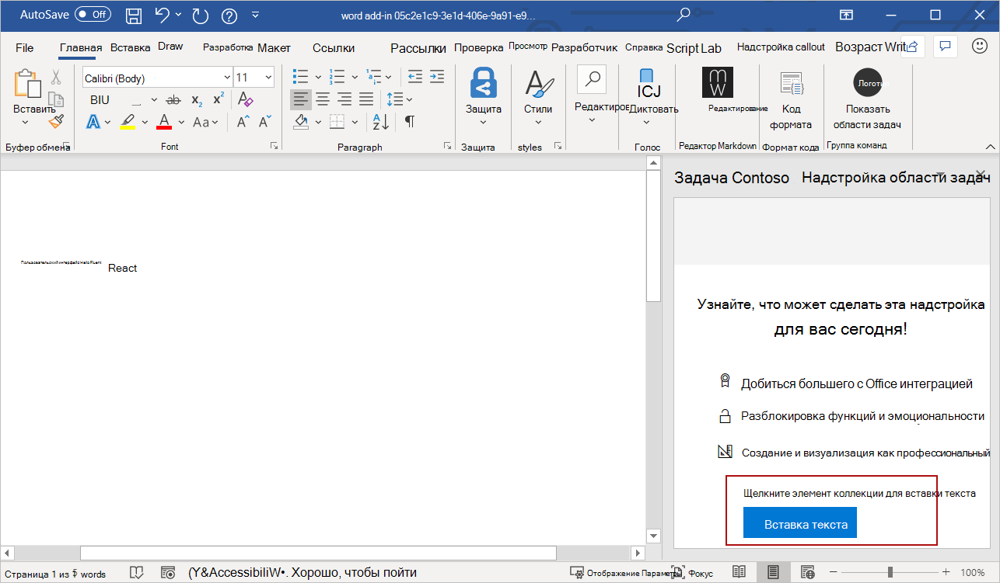

# <a name="use-office-ui-fabric-react-in-office-add-ins"></a>Использование Office UI Fabric React в надстройках Office

Office UI Fabric — это интерфейсная платформа JavaScript для построения взаимодействия с пользователем в Office и Office 365. Если вы разрабатываете надстройку с использованием React, пользовательский интерфейс рекомендуется создать с помощью Fabric React. В Fabric предоставлены некоторые компоненты дизайна на основе React, например кнопки и флажки, которые можно использовать в надстройке.

В этой статье объясняется, как создать надстройку с помощью React и использованием компонентов Fabric React. 

> [!NOTE]
> В Fabric React используется[Fabric Core](office-ui-fabric.md#use-fabric-core-icons-fonts-colors), поэтому после выполнения вами действий, указанных в этой статье, ваша надстройка будет включать и доступ к Fabric Core.

## <a name="create-an-add-in-project"></a>Создание проекта надстройки

Чтобы создать надстройку с использованием React, рекомендуется воспользоваться генератором Yeoman для надстроек Office.

### <a name="install-the-prerequisites"></a>Установка необходимых компонентов

[!include[Yeoman generator prerequisites](../includes/quickstart-yo-prerequisites.md)]

### <a name="create-the-project"></a>Создание проекта

[!include[Yeoman generator create project guidance](../includes/yo-office-command-guidance.md)]

- **Выберите тип проекта:** `Office Add-in Task Pane project using React framework`
- **Выберите тип сценария:** `TypeScript`
- **Как вы хотите назвать надстройку?** `My Office Add-in`
- **Какое клиентское приложение Office должно поддерживаться?** `Word`


После завершения работы мастера генератор создаст проект и установит вспомогательные компоненты Node.

[!include[Yeoman generator next steps](../includes/yo-office-next-steps.md)]

### <a name="try-it-out"></a>Проверка

1. Перейдите к корневой папке проекта.

    ```command&nbsp;line
    cd "My Office Add-in"
    ```

2. Выполните указанные ниже действия, чтобы запустить локальный веб-сервер и загрузить неопубликованную надстройку.

    > [!NOTE]
    > Надстройки Office должны использовать HTTPS, а не HTTP, даже в случае разработки. Если вам будет предложено установить сертификат после того, как вы запустите одну из указанных ниже команд, примите предложение установить сертификат, предоставленный генератором Yeoman. Кроме того, для внесения изменений может потребоваться запустить командную строку или терминал от имени администратора.

    > [!TIP]
    > Если вы тестируете надстройку на компьютере Mac, перед продолжением выполните указанную ниже команду. После выполнения этой команды запустится локальный веб-сервер.
    >
    > ```command&nbsp;line
    > npm run dev-server
    > ```

    - Чтобы проверить надстройку в Word, выполните приведенную ниже команду в корневом каталоге своего проекта. При этом запускается локальный веб-сервер (если он еще не запущен) и открывается приложение Word с загруженной надстройкой.

        ```command&nbsp;line
        npm start
        ```

    - Чтобы проверить надстройку в Word в браузере, выполните приведенную ниже команду в корневом каталоге проекта. После выполнения этой команды запустится локальный веб-сервер (если он еще не запущен).

        ```command&nbsp;line
        npm run start:web
        ```

        Чтобы использовать надстройку, откройте новый документ в Word в Интернете, а затем загрузите неопубликованную надстройку, следуя инструкциям из статьи [Загрузка неопубликованных надстроек Office в Office в Интернете](../testing/sideload-office-add-ins-for-testing.md#sideload-an-office-add-in-in-office-on-the-web).

3. В Word выберите вкладку **Главная** и нажмите кнопку **Показать область задач** на ленте, чтобы открыть область задач надстройки. Обратите внимание на текст по умолчанию и кнопку **Запустить** в нижней части области задач. Следуя этой инструкции до конца, вы переопределите эти текст и кнопку, создав компонент React с использованием компонентов дизайна Fabric React.

    


## <a name="create-a-react-component-that-uses-fabric-react"></a>Создание компонента React c использованием Fabric React

На этом этапе вы уже создали самую простую надстройку в области задач c использованием React. Теперь выполните приведенные ниже действия, чтобы создать новый компонент React (`ButtonPrimaryExample`) в проекте надстройки. В этом компоненте будут использованы компоненты `Label` и `PrimaryButton` из Fabric React.

1. Откройте папку проекта, созданную генератором Yeoman, и перейдите в раздел **src\taskpane\components**.
2. Создайте в этой папке новый файл под названием**Button.tsx**.
3. Введите в файл **Button.tsx** приведенный ниже код, чтобы определить компонент `ButtonPrimaryExample`.

```typescript
import * as React from 'react';
import { PrimaryButton, IButtonProps } from 'office-ui-fabric-react/lib/Button';
import { Label } from 'office-ui-fabric-react/lib/Label';

export class ButtonPrimaryExample extends React.Component<IButtonProps, {}> {
  public constructor(props) {
    super(props);
  }

  insertText = async () => {
    // In the click event, write text to the document.
    await Word.run(async (context) => {
      let body = context.document.body;
      body.insertParagraph('Hello Office UI Fabric React!', Word.InsertLocation.end);
      await context.sync();
    });
  }

  public render() {
    let { disabled } = this.props;
    return (
      <div className='ms-BasicButtonsExample'>
        <Label>Click the button to insert text.</Label>
        <PrimaryButton
          data-automation-id='test'
          disabled={ disabled }
          text='Insert text...'
          onClick={ this.insertText } />
      </div>
    );
  }
}
```

Этот код выполняет следующие действия:

- Ссылается на библиотеку React с помощью `import * as React from 'react';`.
- Ссылается на компоненты Fabric (`PrimaryButton`, `IButtonProps`, `Label`), которые используются для создания `ButtonPrimaryExample`.
- Объявляет новый компонент `ButtonPrimaryExample` с помощью `export class ButtonPrimaryExample extends React.Component`.
- Объявляет функцию `insertText` для обработки события кнопки `onClick`.
- Определяет пользовательский интерфейс компонента React в функции `render`. В HTML-разметке используются компоненты `Label` и `PrimaryButton` из Fabric React и указывается, что при подключения события `onClick` будет запускаться функция `insertText`.

## <a name="add-the-react-component-to-your-add-in"></a>Добавление компонента React в надстройку

Добавьте компонент `ButtonPrimaryExample` к своей надстройке. Для этого откройте файл **src\components\App.tsx** и выполните указанные ниже действия.

1. Добавьте приведенный ниже оператор импорта для ссылки на `ButtonPrimaryExample` из **Button.tsx**.

    ```typescript
    import {ButtonPrimaryExample} from './Button';
    ```

2. Удалите два приведенные ниже оператора импорта.

    ```typescript
    import { Button, ButtonType } from 'office-ui-fabric-react';
    ...
    import Progress from './Progress';
    ```

3. Замените функцию по умолчанию `render()` на приведенный ниже код, в котором используется `ButtonPrimaryExample`.

    ```typescript
    render() {
      return (
        <div className="ms-welcome">
        <Header logo="assets/logo-filled.png" title={this.props.title} message="Welcome" />
        <HeroList message="Discover what this add-in can do for you today!" items={this.state.listItems} >
          <ButtonPrimaryExample />
        </HeroList>
        </div>
      );
    }
    ```

  4. Сохраните изменения, внесенные в **App.tsx**.

## <a name="see-the-result"></a>Результат

После сохранения изменений в **App.tsx** область задач надстройки в Word обновляется автоматически.  Текст по умолчанию и кнопка в нижней части области задач теперь отображают пользовательский интерфейс, определяемый компонентом `ButtonPrimaryExample`. Нажмите кнопку **Вставить текст...** для вставки текста в документ.



Поздравляем! Вы успешно создали надстройку области задач с помощью React и Office UI Fabric React! 

## <a name="see-also"></a>См. также

- [Office UI Fabric в надстройках Office](office-ui-fabric.md)
- [Office UI Fabric React](https://developer.microsoft.com/fabric)
- [Конструктивные шаблоны для надстроек Office](ux-design-pattern-templates.md)
- [Начало работы с примером кода Fabric React](https://github.com/OfficeDev/Word-Add-in-GettingStartedFabricReact)
