# Конструктивные шаблоны пользовательского интерфейса надстроек OfficeUX design pattern templates for Office Add-ins

[Проект конструктивных шаблонов пользовательского интерфейса для надстроек Office](https://github.com/OfficeDev/Office-Add-in-UX-Design-Patterns-Code "Проект конструктивных шаблонов пользовательского интерфейса для надстроек Office") включает файлы HTML, JavaScript и CSS, с помощью которых можно создать пользовательский интерфейс надстройки.The [UX design patterns for Office Add-ins project](https://github.com/OfficeDev/Office-Add-in-UX-Design-Patterns-Code "UX design patterns for Office Add-ins project") includes HTML, JavaScript, and CSS files that you can use to create the UX for your add-in.   

С помощью проекта конструктивных шаблонов пользовательского интерфейса можно:Use the UX design patterns project to:

* применять решения в распространенных клиентских сценариях;Apply solutions to common customer scenarios.
* следовать рекомендациям по оформлению;Apply design best practices.
* внедрять компоненты и стили [Office UI Fabric](https://dev.office.com/fabric#/get-started);Incorporate [Office UI Fabric](https://dev.office.com/fabric#/get-started) components and styles.
* создавать надстройки, внешний вид которых согласован со стандартным пользовательским интерфейсом Office.Build add-ins that visually integrate with the default Office UI.  

## Использование конструктивных UX шаблонов пользовательского интерфейсаUsing the UX design patterns

Вы можете использовать [Набор инструментов надстроек Office Add-ins Design](https://aka.ms/addins_toolkit) вместе с набором инструментов надстроек[Fabric Design](https://aka.ms/fabric-toolkit) как руководство для  создания собственной надстройки Office.You can use the [Office Add-ins Design Toolkit](https://aka.ms/addins_toolkit) together with the [Fabric Design Toolkit](https://aka.ms/fabric-toolkit) as a guide when you design your own Office Add-in. Вы также можете добавить [исходный код](https://github.com/OfficeDev/Office-Add-in-UX-Design-Patterns-Code/tree/master/templates) напрямую к вашему проекту.You can also add the [source code](https://github.com/OfficeDev/Office-Add-in-UX-Design-Patterns-Code/tree/master/templates) directly to your project.

Чтобы создать пользовательский интерфейс надстройки на основе спецификаций, выполните указанные ниже действия.To use the specifications to build a mock-up of your own add-in UI:

1. Скачайте файлы активов разработки и начните создание собственного пользовательского интерфейса:Download design assets files and begin designing your own UI:
    * [Набор инструментов надстроек Office Add-ins DesignOffice Add-ins Design Toolkit](https://aka.ms/addins_toolkit)
    * [Набор инструментов надстроек Fabric DesignFabric Design Toolkit](https://aka.ms/fabric-toolkit)

2. Инструкции см. в следующих статьях:Refer to the following articles for guidance:
    * Рекомендации по [проектированию надстроек Office](add-in-design.md)Best practices for [Designing your Office Add-ins](add-in-design.md)
    * [Наборы инструментов Office UI FabricOffice UI Fabric Toolkits](https://developer.microsoft.com/en-us/fabric#/resources)

> [!NOTE]
> Некоторые  UX-шаблоны в наборе инструментов надстроек не соответствуют  UX-шаблонам проектирования, подробно описанным ниже.Some UX patterns in the Add-ins Design Toolkit do not match the UX design patterns detailed below. Мы планируем выпустить обновленную документацию, которая будет согласована с набором инструментальных средств.We're planning to release updated documentation that will align with the toolkit.

Чтобы добавить исходный код, сделайте следующее:To add the source code:

1. Создайте копию [репозитория проекта конструктивных шаблонов пользовательского интерфейса для надстроек Office](https://github.com/OfficeDev/Office-Add-in-UX-Design-Patterns-Code "Проект конструктивных шаблонов пользовательского интерфейса для надстроек Office").Clone the [UX design patterns for Office Add-ins project repo](https://github.com/OfficeDev/Office-Add-in-UX-Design-Patterns-Code "UX design patterns for Office Add-ins project").
2. Скопируйте [папку с ресурсами](https://github.com/OfficeDev/Office-Add-in-UX-Design-Pattern-Code/tree/master/assets) и папку с кодом выбранного шаблона в проект надстройки.Copy the [assets folder](https://github.com/OfficeDev/Office-Add-in-UX-Design-Pattern-Code/tree/master/assets), and the code folder for the individual pattern you choose to your add-in project.  
3. Внедрите шаблон в надстройку. Например:Incorporate the individual pattern into your add-in. For example:
    - Измените расположение исходного кода или URL-адрес команд надстройки в манифесте.Edit the source location or add-in command URL in the manifest.
    - Используйте шаблон UX-дизайна в качестве шаблона для других страниц.Use the UX design pattern as a template for other pages.
    - Создайте ссылки на конструктивный шаблон пользовательского интерфейса или из него.Link to or from the UX design pattern.

> [!NOTE]
> Некоторые спецификации шаблонов пользовательского интерфейса отличаются от исходного кода.Some UX pattern specifications do not match the source code. Мы работаем над согласованием всех активов.We're working hard to bring all assets into alignment. Кроме того, обратите внимание, что некоторые спецификации представлены как архивные.Also notice that some specifications are presented as archived. Мы оцениваем значение этих архивных спецификаций для платформы.We're assessing these archived specifications for value to the platform. Каждый шаблон уникален и представляет шаблон взаимодействия.Each pattern aims to represent a unique template and pattern of interaction. Шаблоны не должны перекрывать друг друга. Они также должны отличаться от компонентов Office UI Fabric.The patterns should not overlap with each other and should be well differentiated from Office Fabric UI components.

## Типы конструктивных шаблонов пользовательского интерфейсаTypes of UX design patterns
### Универсальные страницыGeneric pages

Шаблоны универсальных страниц можно применить к любой странице надстройки. У них нет особого назначения. Примером страницы особого назначения может служить любой из шаблонов первого запуска. В следующем списке описаны доступные универсальные страницы:Generic page templates can be applied to any page in your add-in and don't have a special purpose. An example of a special purpose page, would be any of the first-run patterns. The following list describes the generic pages available:

* **Целевая страница** — это стандартная страница надстройки, например страница, которая открывается после первого запуска или входа.**Landing page** - A standard add-in page, for example the page a user lands on after a first-run experience or sign-in process. 
    * Рекомендации по внедрению [языка дизайна Office](add-in-design-language.md) в надстройке.Learn about guidelines for adopting the [Office design language](add-in-design-language.md) in your add-in.
    * [Код целевой страницыLanding page code](https://github.com/OfficeDev/Office-Add-in-UX-Design-Patterns-Code/tree/master/templates/generic/landing-page)
* **Панель с фирменной символикой** — целевая страница с изображением, которое находится в нижнем колонтитуле и представляет торговую марку.**Brand image in brand bar** - The landing page with an image in the footer that represents your brand. 
    * [Спецификация панели с фирменной символикойBrand bar specification](https://github.com/OfficeDev/Office-Add-in-UX-Design-Patterns/blob/master/patterns/brand-bar.md)
    * [Код панели с фирменной символикойBrand bar code](https://github.com/OfficeDev/Office-Add-in-UX-Design-Patterns-Code/tree/master/templates/generic/brand-bar)

<table>
 <tr><th>ЦелеваяLanding</th><th>Панель с фирменной символикойBrand Bar</th></tr>
 <tr><td></td>
<td></td></tr>
 </table>
 
### Интерфейс при первом запускеFirst-run experience

Интерфейс при первом запуске — это интерфейс, отображаемый для пользователя, когда тот запускает надстройку в первый раз. Доступны следующие конструктивные шаблоны для первого запуска:A first-run experience is the experience a user has when they open your add-in for the first time. The following first-run design pattern templates are available: 

* **Действия, необходимые для запуска.** Предоставляет пользователям упорядоченный список действий, которые необходимо выполнить, чтобы начать использовать надстройку.**Steps to start** - Provides users with an ordered list of steps to perform to get started using your add-in. 
    * [Спецификация действий для запуска](https://github.com/OfficeDev/Office-Add-in-UX-Design-Patterns/blob/master/assets/archived-patterns/fre_stepsToStart.pdf) (этот конструктивный шаблон заархивирован.[Steps to start specification](https://github.com/OfficeDev/Office-Add-in-UX-Design-Patterns/blob/master/assets/archived-patterns/fre_stepsToStart.pdf) (This UX design pattern has been archived. Пока мы оцениваем его ценность, см. [спецификацию значений при первом запуске](https://github.com/OfficeDev/Office-Add-in-UX-Design-Patterns/blob/master/patterns/value-placemat.md).)As we assess its value, see [First-Run Value specification](https://github.com/OfficeDev/Office-Add-in-UX-Design-Patterns/blob/master/patterns/value-placemat.md).)  
    * [Код действий, необходимых для запускаSteps to start code](https://github.com/OfficeDev/Office-Add-in-UX-Design-Patterns-Code/tree/master/templates/first-run/instruction-step)
* **Решаемые задачи.** Разъясняет, какие задачи можно решить с помощью надстройки.**Value** - Communicates your add-in's value proposition.
    * [Спецификация значенияValue specification](https://github.com/OfficeDev/Office-Add-in-UX-Design-Patterns/blob/master/patterns/value-placemat.md)
    * [Код решаемых задачValue code](https://github.com/OfficeDev/Office-Add-in-UX-Design-Patterns-Code/tree/master/templates/first-run/value-placemat)
* **Видео.** Показывает пользователям видеоролик перед тем, как они начнут использовать вашу надстройку.**Video** - Shows users a video before they start using your add-in.
    * [Спецификация видеоVideo specification](https://github.com/OfficeDev/Office-Add-in-UX-Design-Patterns/blob/master/patterns/video-placemat.md)
    * [Код видеоVideo code](https://github.com/OfficeDev/Office-Add-in-UX-Design-Patterns-Code/tree/master/templates/first-run/video-placemat)
* **Пошаговое руководство.** Рассказывает пользователям о ряде функций или предоставляет определенные сведения, прежде чем они начнут использовать надстройку.**Walkthrough** - Takes users through a series of features or information before they start using the add-in.
    * [Спецификация карусели](https://github.com/OfficeDev/Office-Add-in-UX-Design-Patterns/blob/master/patterns/carousel.md) (обратите внимание, что этот конструктивный шаблон пользовательского интерфейса переименован в "Карусель".[Carousel specification](https://github.com/OfficeDev/Office-Add-in-UX-Design-Patterns/blob/master/patterns/carousel.md) (Note that this UX design pattern has been renamed to "Carousel." Ранее в спецификациях он носил имя "Панель разбиения на страницы".Former specifications refered to it as a "Paging Panel." В ресурсах с кодом он упоминается под названием "Пошаговое руководство по первому запуску".Code assets refer to it as a "First-run Walkthrough." 
    * [Код пошагового руководстваWalkthrough code](https://github.com/OfficeDev/Office-Add-in-UX-Design-Patterns-Code/tree/master/templates/first-run/walkthrough)

В [AppSource](https://docs.microsoft.com/en-us/office/dev/store/use-the-seller-dashboard-to-submit-to-the-office-store) предусмотрена система управления пробными версиями надстроек, но если вам нужно управлять пользовательским интерфейсом такой пробной версии, используйте следующие шаблоны:[AppSource](https://docs.microsoft.com/en-us/office/dev/store/use-the-seller-dashboard-to-submit-to-the-office-store) has a system that manages trial versions of an add-in, but if you want to control the UI of the trial experience for your add-in, use the following patterns:

* **Пробная версия.** Показывает пользователям, как начать работу с пробной версией надстройки.**Trial** - Shows users how to get started with a trial version of your add-in.
    * [Спецификация пробной версии](https://github.com/OfficeDev/Office-Add-in-UX-Design-Patterns/blob/master/assets/archived-patterns/fre_trialVersion.pdf) (этот конструктивный шаблон заархивирован.[Trial specification](https://github.com/OfficeDev/Office-Add-in-UX-Design-Patterns/blob/master/assets/archived-patterns/fre_trialVersion.pdf) (This UX design pattern has been archived. Пока мы оцениваем его ценность, руководствуйтесь данным PDF-файлом.)As we assess its value, refer to this PDF.)
    * [Код пробной версииTrial code](https://github.com/OfficeDev/Office-Add-in-UX-Design-Patterns-Code/tree/master/templates/first-run/trial-placemat)
* **Пробная функция.** Сообщает пользователю, что функция, которую он пытается использовать, недоступна в пробной версии надстройки. Кроме того, этот шаблон можно использовать, если надстройка предоставляется бесплатно, но в ней есть функция, для использования которой требуется подписка. С помощью этого шаблона вы также можете предоставлять ограниченную версию после окончания пробного периода.**Trial feature** - Advises users that the feature they are trying to use is not available in the trial version of the add-in. Alternatively, if your add-in is free but it includes a feature that requires a subscription, consider using this pattern. You might also use this pattern to provide a downgraded experience after a trial has ended.
    * [Спецификация функций пробной версии](https://github.com/OfficeDev/Office-Add-in-UX-Design-Patterns/blob/master/assets/archived-patterns/fre_trialFeature.pdf) (этот конструктивный шаблон заархивирован.[Trial feature specification](https://github.com/OfficeDev/Office-Add-in-UX-Design-Patterns/blob/master/assets/archived-patterns/fre_trialFeature.pdf) (This UX design pattern has been archived. Пока мы оцениваем его ценность, руководствуйтесь данным PDF-файлом.)As we assess its value, refer to this PDF.)
    * [Код функций пробной версииTrial feature code](https://github.com/OfficeDev/Office-Add-in-UX-Design-Patterns-Code/tree/master/templates/first-run/trial-placemat-feature)

> [!IMPORTANT]
> Если вы решите самостоятельно управлять подпиской, не применяя для этого AppSource, добавьте тег **Может потребоваться дополнительная покупка** в примечания по тестированию на Панели мониторинга продаж.If you decide to manage your own trial, and not use AppSource to manage the trial, make sure to include the **Additional purchase may be required** tag in the testing notes in the seller dashboard.

Решите, как часто необходимо применять интерфейс, используемый при первом запуске: один раз или несколько. Например, если пользователи используют надстройку периодически, они могут забыть, как ею пользоваться, поэтому интерфейс первого запуска может пригодиться более одного раза.Consider whether showing users the first-run experience once or many times is important to your scenario. For example, if users use your add-in periodically, they might forget how to use it, and it might be helpful to see the first-run experience more than once. 

 <table>
 <tr><th>Действия, необходимые для запускаSteps to Start</th><th>Решаемые задачиValue</th><th>ВидеоVideo</th></tr>
 <tr>
<td><A href="https://github.com/OfficeDev/Office-Add-in-UX-Design-Patterns-Code/tree/master/templates/first-run/instruction-step">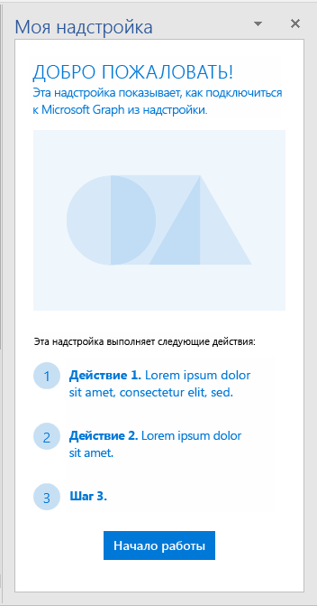</A></td>
<td><A href="https://github.com/OfficeDev/Office-Add-in-UX-Design-Patterns-Code/tree/master/templates/first-run/value-placemat">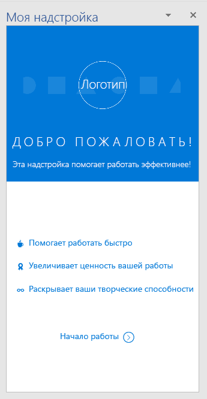</A></td>
<td></td></tr>
 </table>

 <table>
 <tr><th>Первая страница пошагового руководстваWalkthrough first page</th><th>Пробная версияTrial</th><th>Пробная функцияTrial feature</th></tr>
 <tr>
<td></td>
<td><A href="https://github.com/OfficeDev/Office-Add-in-UX-Design-Patterns-Code/tree/master/templates/first-run/trial-placemat">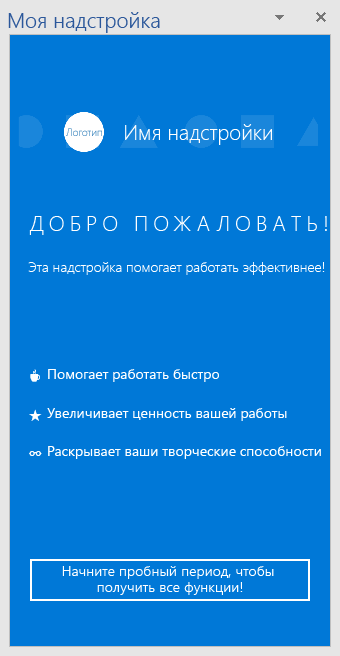</A></td>
<td><A href="https://github.com/OfficeDev/Office-Add-in-UX-Design-Patterns-Code/tree/master/templates/first-run/trial-placemat-feature">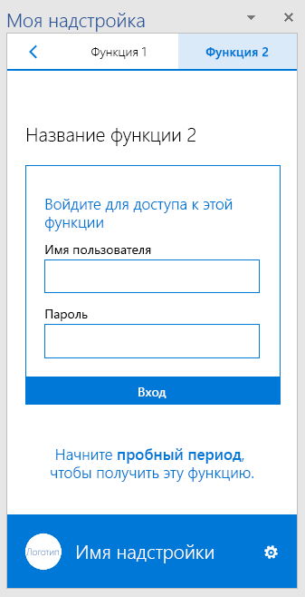</A></td></tr>
 </table> 

### НавигацияNavigation

Пользователям нужно переключаться между разными страницами надстройки. В приведенных ниже шаблонах навигации показаны различные варианты упорядочения страниц и команд надстройки.Users need to navigate between the different pages of your add-in. The following navigation templates show different options you can use to organize pages and commands in your add-in.

* **Страница с кнопками "Назад" и "Вперед".** Показывает область задач с кнопками "Назад" и "Вперед". Этот шаблон поможет гарантировать, что пользователи выполняют действия по порядку.**Back button and Next page** - Shows a task pane with Back and Next page buttons. Use this pattern to ensure users follow an ordered series of steps.
    * [Спецификация страницы с кнопками "Назад" и "Вперед"Back Button and Next Page specification](https://github.com/OfficeDev/Office-Add-in-UX-Design-Patterns/blob/master/patterns/back-button.md)
    * [Код страницы с кнопками "Назад" и "Вперед"Back Button and Next Page code](https://github.com/OfficeDev/Office-Add-in-UX-Design-Patterns-Code/tree/master/templates/navigation/back-button) 
* **Навигация.** Показывает меню (так называемое меню "гамбургер") для перехода между страницами в области задач.**Navigation** - Shows a menu, commonly referred to as the hamburger menu, with page menu items in a task pane. 
    * [Спецификация навигацииNavigation specification](https://github.com/OfficeDev/Office-Add-in-UX-Design-Patterns/blob/master/patterns/contextual-menu.md)
    * [Код навигацииNavigation code](https://github.com/OfficeDev/Office-Add-in-UX-Design-Patterns-Code/tree/master/templates/navigation/navigation) 
* **Навигация с командами.** Показывает меню "гамбургер" с командными кнопками (или управляющими кнопками) в области задач. С помощью этого шаблона можно одновременно предоставлять параметры навигации и команды.**Navigation with commands** - Shows the hamburger menu with command (or action) buttons in a task pane. Use this pattern when you want to provide navigation and command options together. 
    * [Спецификация навигации с командамиNavigation with commands specification](https://github.com/OfficeDev/Office-Add-in-UX-Design-Patterns/blob/master/patterns/command-bar.md)
    * [Код навигации с командамиNavigation with commands code](https://github.com/OfficeDev/Office-Add-in-UX-Design-Patterns-Code/tree/master/templates/navigation/navigation-commands)
* **Сводка.** Показывает сводную панель навигации в области задач. С помощью сводной панели навигации пользователи смогут переключаться между различным контентом.**Pivot** - Shows Pivot navigation inside of a task pane. Use pivot navigation to allow users to navigate between different content.
    * [Спецификация сводкиPivot specification](https://github.com/OfficeDev/Office-Add-in-UX-Design-Patterns/blob/master/patterns/pivot.md)
    * [Код сводкиPivot code](https://github.com/OfficeDev/Office-Add-in-UX-Design-Patterns-Code/tree/master/templates/navigation/pivot)
* **Панель вкладок.** Показывает панель навигации, используя кнопки с расположенными по вертикали текстом и значками. Панель вкладок обеспечивает навигацию с помощью вкладок с короткими и понятными названиями.**Tab bar** - Shows navigation using buttons with vertically stacked text and icons. Use the tab bar to provide navigation using tabs with short and descriptive titles.
    * [Спецификация панели вкладокTab bar specification](https://github.com/OfficeDev/Office-Add-in-UX-Design-Patterns/blob/master/patterns/tab-bar.md)
    * [Код панели вкладокTab bar code](https://github.com/OfficeDev/Office-Add-in-UX-Design-Patterns-Code/tree/master/templates/navigation/tab-bar) 

<table>
<tr><th>Кнопка "Назад"Back button</th><th>НавигацияNavigation</th><th>Навигация с командамиNavigation with commands</th></tr>
<tr>
    <td>
        <A href="https://github.com/OfficeDev/Office-Add-in-UX-Design-Patterns-Code/tree/master/templates/navigation/back-button">
        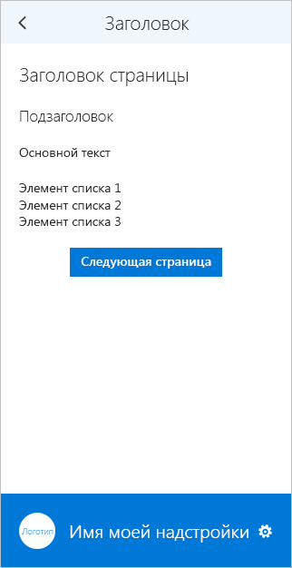</A>
    </td>
    <td>
        
    </td>
    <td>
        <A href="https://github.com/OfficeDev/Office-Add-in-UX-Design-Patterns-Code/tree/master/templates/navigation/navigation-commands">
        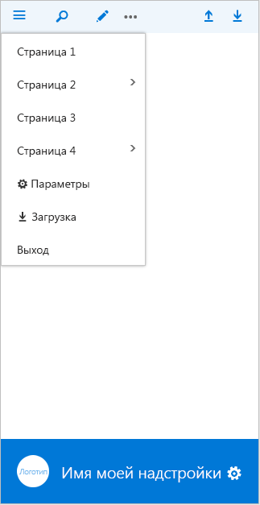</A>
    </td>
</tr>
 </table>

<table>
<tr><th>СводкаPivot</th><th>Панель вкладокTab bar</th></tr>
<tr><td><A href="https://github.com/OfficeDev/Office-Add-in-UX-Design-Patterns-Code/tree/master/templates/navigation/pivot">
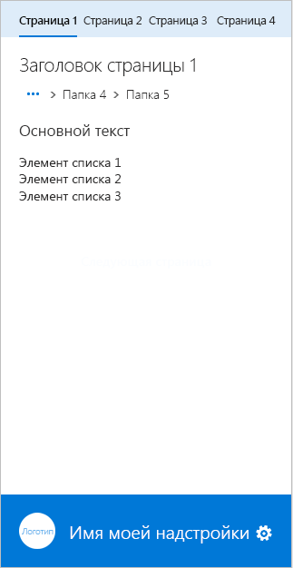</A></td>
<td></td>
</tr>
 </table>

### УведомленияNotifications

Надстройка может уведомлять пользователей о событиях, например ошибках, и о ходе выполнения множеством способов. Доступны следующие шаблоны уведомлений:Your add-in can notify users of events, such as errors, or of progress in a variety of ways. The following notification templates are available: 

* **Внедренное диалоговое окно.** Отображается в области задач и предоставляет сведения и (при необходимости) средства взаимодействия в виде кнопок и других элементов управления. Рекомендуется использовать диалоговое окно для подтверждения пользователем каких-либо действий. Шаблон "Внедренное диалоговое окно" позволяет ограничить пользовательский интерфейс областью задач.**Embedded dialog box** - Shows a dialog box inside the task pane that provides information and, optionally, an interactive experience, using buttons or other controls. Consider using one to prompt a user to confirm an action. Use the Embedded dialog pattern when you want to keep the user experience in the task pane.
    * [Спецификация внедренного диалогового окнаEmbedded dialog box specification](https://github.com/OfficeDev/Office-Add-in-UX-Design-Patterns/blob/master/patterns/embedded-dialog.md)
    * [Код внедренного диалогового окнаEmbedded dialog box code](https://github.com/OfficeDev/Office-Add-in-UX-Design-Patterns-Code/tree/master/templates/notifications/embedded-dialog)
* **Встроенное сообщение.** Содержит информацию об ошибках, успешном выполнении действий или другие сведения. Может отображаться в указанном расположении в области задач. Например, если пользователь вводит в текстовом поле электронный адрес с неправильным форматом, то под полем отобразится соответствующее сообщение об ошибке.**Inline message** - Indicates error, success, or information, and can appear at a specified location in the task pane. For example, if a user enters an incorrectly formatted email address in a text box, an error message appears just below the text box. 
    * [Спецификация встроенного сообщения](https://github.com/OfficeDev/Office-Add-in-UX-Design-Patterns/blob/master/assets/archived-patterns/notification_inlineMessage.pdf) (этот конструктивный шаблон заархивирован.[Inline message specification](https://github.com/OfficeDev/Office-Add-in-UX-Design-Patterns/blob/master/assets/archived-patterns/notification_inlineMessage.pdf) (This UX design pattern has been archived. Пока мы оцениваем его ценность, руководствуйтесь данным PDF-файлом.)As we assess its value, refer to this PDF.)
    * [Код встроенного сообщенияInline message code](https://github.com/OfficeDev/Office-Add-in-UX-Design-Patterns-Code/tree/master/templates/notifications/inline-message)
* **Баннер с сообщением.** Предоставляет сведения и (при необходимости) простые призывы к действиям в виде баннера, который можно свернуть в одну строку, развернуть на несколько строк или закрыть. Баннеры с сообщениями рекомендуется использовать для информирования об обновлениях служб или отображения полезных советов при запуске надстройки.**Message banner** - Provides information and, optionally, a simple call to action, in a banner that can be collapsed to a single line, expanded to multiple lines, or dismissed. Use message banners to report a service update or a helpful tip when the add-in starts. 
    * [Спецификация баннера с сообщением](https://github.com/OfficeDev/Office-Add-in-UX-Design-Patterns/blob/master/assets/archived-patterns/message_bar.pdf) (этот конструктивный шаблон заархивирован.[Message banner specification](https://github.com/OfficeDev/Office-Add-in-UX-Design-Patterns/blob/master/assets/archived-patterns/message_bar.pdf) (This UX design pattern has been archived. Пока мы оцениваем его ценность, руководствуйтесь данным PDF-файлом.)As we assess its value, refer to this PDF.)
    * [Код баннера с сообщениемMessage banner code](https://github.com/OfficeDev/Office-Add-in-UX-Design-Patterns-Code/tree/master/templates/notifications/message-banner)
* **Индикатор выполнения.** Показывает ход выполнения длительных синхронных процессов, например задач по настройке, которые необходимо выполнить, прежде чем пользователь сможет перейти к дальнейшим действиям. Это отдельная промежуточная страница, на которой также используется фирменная символика надстройки. Используйте индикатор выполнения, если процесс может периодически отправлять сведения о том, сколько времени осталось до его завершения.**Progress bar** - Indicates the progress of a long-running, synchronous process, such as a configuration task that must complete before the user can take any further action. It is a separate interstitial page that also reinforces the add-in brand. Use a progress bar when the process can send periodic measures of how far along it is back to the add-in.
    * [Спецификация индикатора выполненияProgress bar specification](https://github.com/OfficeDev/Office-Add-in-UX-Design-Patterns/blob/master/patterns/progress-indicator.md)
    * [Код индикатора выполненияProgress bar code](https://github.com/OfficeDev/Office-Add-in-UX-Design-Patterns-Code/tree/master/templates/notifications/progress-bar)
* **Индикатор работы.** Указывает, что выполняется длительный синхронный процесс, но не указывает, сколько времени осталось до его завершения. Это отдельная промежуточная страница, на которой также используется фирменная символика надстройки. Используйте индикатор работы, если надстройка не может достоверно сообщить, сколько времени необходимо для завершения процесса.**Spinner** - Indicates that a long-running, synchronous process is underway, but provides no indication of how far along it is. It is a separate interstitial page that also reinforces the add-in brand. Use a spinner when the add-in cannot know reliably how far along a process is. 
    * [Спецификация вертушкиSpinner specification](https://github.com/OfficeDev/Office-Add-in-UX-Design-Patterns/blob/master/patterns/spinner.md)
    * [Код индикатора работыSpinner code](https://github.com/OfficeDev/Office-Add-in-UX-Design-Patterns-Code/tree/master/templates/notifications/spinner)
* **Всплывающее уведомление.** Содержит краткое сообщение, исчезающее через несколько секунд. Так как пользователь может и не увидеть такое сообщение, всплывающие уведомления используются для отображения несущественной информации. Это хороший способ уведомлять пользователей о событиях в удаленной системе, например о получении электронного письма.**Toast** - Provides a brief message that fades away after a few seconds. Because the user might not see the message, use toast only for nonessential information. It is a good choice for notifying users of an event in a remote system, such as the receipt of an email.
    * [Спецификация всплывающего уведомленияToast specification](https://github.com/OfficeDev/Office-Add-in-UX-Design-Patterns/blob/master/patterns/toast.md)
    * [Код всплывающего уведомленияToast code](https://github.com/OfficeDev/Office-Add-in-UX-Design-Patterns-Code/tree/master/templates/notifications/toast)

 <table>
 <tr><th>Внедренное диалоговое окноEmbedded dialog</th><th>Встроенное сообщениеInline message</th><th>Баннер с сообщениемMessage banner</th></tr>
 <tr><td></td>
<td></td>
<td><A href="https://github.com/OfficeDev/Office-Add-in-UX-Design-Patterns-Code/tree/master/templates/notifications/message-banner">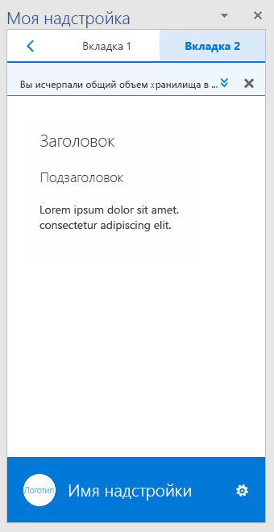</A></td></tr>
 </table>

 <table>
 <tr><th>Индикатор выполненияProgress bar</th><th>Индикатор работыSpinner</th><th>Всплывающее уведомлениеToast</th></tr>
 <tr><td></td>
<td></td>
<td><A href="https://github.com/OfficeDev/Office-Add-in-UX-Design-Patterns-Code/tree/master/templates/notifications/toast">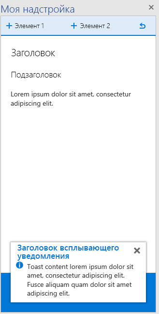</A></td></tr>
 </table>
 

### Общие компонентыGeneral components

Ниже перечислены общие компоненты, которые можно использовать в надстройке для различных сценариев.The following are general components that you can use in your add-ins in a variety of scenarios.  

#### Диалоговые окна клиентовClient dialog boxes

Диалоговые окна клиентов обеспечивают еще один способ работы пользователей с надстройкой за пределами области задач. Доступны следующие шаблоны диалоговых окон:Client dialog boxes provide another way for users to work with your add-in outside of a task pane. The following dialog box templates are available:

* **Диалоговое окно с набором шрифтов.** Показывает диалоговое окно с текстовым содержимым. С помощью этого диалогового окна можно показывать пользователям подробные сведения.**Typeramp dialog box** - Shows a dialog box with textual content. Use the typeramp dialog to display elaborative information to users. 
    * Узнайте больше о разработке [диалоговых окон в надстройках Office](dialog-boxes.md). Кроме того, следуйте нашим рекомендациям по [шрифтовому оформлению надстроек Office](add-in-design-language.md#typography).Learn about designing [dialog boxes in Office Add-ins](dialog-boxes.md). Also follow our guidelines for [Typography in Office Add-ins](add-in-design-language.md#typography).
    * [Код диалогового окна с набором шрифтовTyperamp dialog box code](https://github.com/OfficeDev/Office-Add-in-UX-Design-Patterns-Code/tree/master/templates/dialog/typeramp)
* **Диалоговое окно с оповещением** содержит важные сведения для пользователей, например ошибки или уведомления.**Alert dialog box** - Shows an alert box with important information, such as errors or notifications, to users.  
    * [Спецификация диалогового окна с оповещением](https://github.com/OfficeDev/Office-Add-in-UX-Design-Patterns/blob/master/assets/archived-patterns/notification_alert.pdf) (этот конструктивный шаблон заархивирован.[Alert dialog box specification](https://github.com/OfficeDev/Office-Add-in-UX-Design-Patterns/blob/master/assets/archived-patterns/notification_alert.pdf) (This UX design pattern has been archived. Пока мы оцениваем его ценность, руководствуйтесь данным PDF-файлом.)As we assess its value, refer to this PDF.)
    * [Код диалогового окна с оповещениемAlert dialog box code](https://github.com/OfficeDev/Office-Add-in-UX-Design-Patterns-Code/tree/master/templates/dialog/alert)
* **Диалоговое окно навигации**. Показывает диалоговое окно с элементами навигации. С его помощью пользователи могут переходить к различному содержимому.**Navigation dialog box** - Shows a dialog box with navigation. Use the navigation dialog box to allow users to navigate between different content. 
    * Узнайте больше о разработке [диалоговых окон в надстройках Office](dialog-boxes.md). Кроме того, узнайте, как использовать [сводные компоненты Office UI Fabric в надстройках Office](pivot.md).Learn about designing [dialog boxes in Office Add-ins](dialog-boxes.md). Also learn about using Office UI Fabric [Pivot components in Office Add-ins](pivot.md).
    * [Код диалогового окна навигацииNavigation dialog box code](https://github.com/OfficeDev/Office-Add-in-UX-Design-Patterns-Code/tree/master/templates/dialog/navigation)

<table>
 <tr><th>Диалоговое окно с набором шрифтовTyperamp dialog</th><th>Диалоговое окно с оповещениемAlert dialog</th></tr>
<tr>
<td><A href="https://github.com/OfficeDev/Office-Add-in-UX-Design-Patterns-Code/tree/master/templates/dialog/typeramp">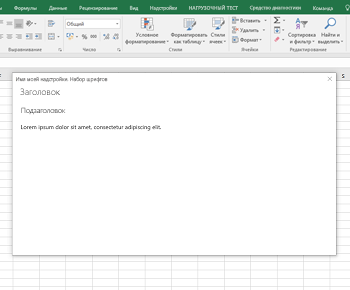</A></td>
<td></td>
</tr></tr>
 </table>
 
 <table>
 <tr><th>Диалоговое окно навигацииNavigation dialog</th></tr>
<tr><td></td></tr>
</tr>
 </table>

#### Отзывы и оценкиFeedback and ratings

Чтобы сделать надстройку более заметной и популярной, полезно предоставить пользователям возможность оценивать и рецензировать надстройку в AppSource. В этом шаблоне показано два способа предоставления отзывов и оценок из надстройки:To improve the visibility and adoption of your add-in, it is helpful to provide users with the ability to rate and review your add-in in AppSource. This pattern shows two methods for presenting feedback and ratings from within the add-in:

- Отзыв, инициированный пользователем, — пользователь отправляет отзыв с помощью меню навигации (например, ссылки **Отправить отзыв**) или значка в нижнем колонтитуле.User-initiated feedback - A user chooses to send feedback by using either the navigation menu (for example, using the **Send Feedback** link) or an icon on the footer.
- Отзыв, инициированный системой, — после трех запусков надстройки появляется баннер с сообщением, в котором пользователю предлагается оставить отзыв.System-initiated feedback - After the add-in runs three times, the user is prompted to provide feedback via a Message Banner.

Независимо от способа открывается диалоговое окно со страницей надстройки в AppSource.Either method opens a dialog box that contains the AppSource page for the add-in.

* [Спецификация отзывов и оценок](https://github.com/OfficeDev/Office-Add-in-UX-Design-Patterns/blob/master/assets/archived-patterns/notification_feedback.pdf) (этот конструктивный шаблон заархивирован.[Feedback and ratings specification](https://github.com/OfficeDev/Office-Add-in-UX-Design-Patterns/blob/master/assets/archived-patterns/notification_feedback.pdf) (This UX design pattern has been archived. Пока мы оцениваем его ценность, руководствуйтесь данным PDF-файлом.)As we assess its value, refer to this PDF.)
* [Код отзывов и оценокFeedback and ratings code](https://github.com/OfficeDev/Office-Add-in-UX-Design-Patterns-Code/tree/master/templates/feedback/office-store)

> [!IMPORTANT]
> В настоящее время этот шаблон указывает на главную страницу AppSource. Обязательно замените эту ссылку на URL-адрес страницы вашей надстройки в AppSource.This pattern currently points to the AppSource home page. Be sure to update this URL to the URL of your add-in's page in AppSource.

 <table>
 <tr><th>Отзывы и оценкиFeedback and ratings</th></tr>
<tr><td></td></tr>
</tr>
 </table>

#### Параметры и конфиденциальностьSettings and privacy

В надстройке может потребоваться страница параметров, где пользователи смогут настраивать параметры, контролирующие работу надстройки. Кроме того, вы можете сообщить пользователям о политиках конфиденциальности, соблюдаемых вашей надстройкой.Add-ins may need a Settings page that allows users to configure settings that control the behavior of the add-in. Also, you may want to provide users with the privacy policies your add-in adheres to. 

* **Параметры.**. Показывает область задач с компонентами конфигурации, которая контролирует работу надстройки. На странице параметров пользователи могут выбрать нужные настройки.**Settings** - Shows a task pane with configuration components that controls the behavior of the add-in. A settings page provides options for the user to choose.
    * [Спецификация параметровSettings specification](https://github.com/OfficeDev/Office-Add-in-UX-Design-Patterns/blob/master/patterns/settings.md)
    * [Код параметровSettings code](https://github.com/OfficeDev/Office-Add-in-UX-Design-Patterns-Code/tree/master/templates/settings)
* **Политика конфиденциальности.** Показывает область задач с важными сведениями о политиках конфиденциальности.**Privacy policy** - Shows task pane with important information about privacy policies. 
    * [Спецификация политики конфиденциальности](https://github.com/OfficeDev/Office-Add-in-UX-Design-Patterns/blob/master/assets/archived-patterns/general_multiSection.pdf) (этот конструктивный шаблон заархивирован.[Privacy Policy specification](https://github.com/OfficeDev/Office-Add-in-UX-Design-Patterns/blob/master/assets/archived-patterns/general_multiSection.pdf) (This UX design pattern has been archived. Пока мы оцениваем его ценность, руководствуйтесь данным PDF-файлом.)As we assess its value, refer to this PDF.)
    * [Код политики конфиденциальностиPrivacy Policy code](https://github.com/OfficeDev/Office-Add-in-UX-Design-Patterns-Code/tree/master/templates/settings)

<table>
 <tr><th>ПараметрыSettings</th><th>Политика конфиденциальностиPrivacy Policy</th></tr>
<tr>
<td><A href="https://github.com/OfficeDev/Office-Add-in-UX-Design-Patterns-Code/tree/master/templates/settings">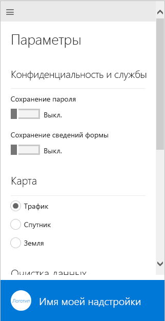</A></td>
<td></td>
</tr></tr>
 </table>

## См. такжеSee also

* [Рекомендации по разработке надстроек OfficeBest practices for developing Office Add-ins](../concepts/add-in-development-best-practices.md)
* [Office UI FabricOffice UI Fabric](http://dev.office.com/fabric/)
