# Конструктивные шаблоны пользовательского интерфейса надстроек Office 

[Проект конструктивных шаблонов пользовательского интерфейса для надстроек Office](https://github.com/OfficeDev/Office-Add-in-UX-Design-Patterns-Code "Проект конструктивных шаблонов пользовательского интерфейса для надстроек Office") включает файлы HTML, JavaScript и CSS, с помощью которых можно создать пользовательский интерфейс надстройки.   

С помощью проекта конструктивных шаблонов пользовательского интерфейса можно:

* применять решения в распространенных клиентских сценариях;
* следовать рекомендациям по оформлению;
* внедрять компоненты и стили [Office UI Fabric](https://dev.office.com/fabric#/get-started);
* создавать надстройки, внешний вид которых согласован со стандартным пользовательским интерфейсом Office.  

## Использование конструктивных шаблонов пользовательского интерфейса

При разработке собственной надстройки Office вы можете взять за основу [спецификации конструктивных шаблонов пользовательского интерфейса](https://github.com/OfficeDev/Office-Add-in-UX-Design-Patterns) или добавить [исходный код](https://github.com/OfficeDev/Office-Add-in-UX-Design-Patterns-Code/tree/master/templates) непосредственно в свой проект.

Чтобы создать пользовательский интерфейс надстройки на основе спецификаций, выполните указанные ниже действия.

1. Скачайте файлы активов разработки и начните создание собственного пользовательского интерфейса:
    * [Компоненты проектирования интерфейса для надстройки Office](https://github.com/OfficeDev/Office-Add-in-UX-Design-Patterns/blob/master/assets/addin_ux_design_components.ai) (файл Adobe Illustrator)
    * [Конструктивные шаблоны пользовательского интерфейса для надстройки Office](https://github.com/OfficeDev/Office-Add-in-UX-Design-Patterns/blob/master/assets/addin_ux_design_patterns.ai) (файл Adobe Illustrator) или
    * [Прототип проекта пользовательского интерфейса для надстройки Office](https://github.com/OfficeDev/Office-Add-in-UX-Design-Patterns/blob/master/assets/addin_ux_design_prototype.xd) (файл Adobe Experience Design)
2. Инструкции см. в следующих статьях:
    * [Конструктивные шаблоны пользовательского интерфейса](https://github.com/OfficeDev/Office-Add-in-UX-Design-Patterns/blob/master/README.md)
    * Рекомендации по [проектированию надстроек Office](https://dev.office.com/docs/add-ins/design/add-in-design)
    * [Наборы средств Office UI Fabric](https://developer.microsoft.com/ru-RU/fabric#/resources)

Чтобы добавить исходный код, сделайте следующее:

1. Создайте копию [репозитория проекта конструктивных шаблонов пользовательского интерфейса для надстроек Office](https://github.com/OfficeDev/Office-Add-in-UX-Design-Patterns-Code "Проект конструктивных шаблонов пользовательского интерфейса для надстроек Office"). 
2. Скопируйте [папку с ресурсами](https://github.com/OfficeDev/Office-Add-in-UX-Design-Pattern-Code/tree/master/assets) и папку с кодом выбранного шаблона в проект надстройки.  
3. Внедрите шаблон в надстройку. Например:
    - Измените расположение исходного кода или URL-адрес команд надстройки в манифесте.
    - Используйте шаблон UX-дизайна в качестве шаблона для других страниц.
    - Создайте ссылки на конструктивный шаблон пользовательского интерфейса или из него.

> **Примечание.** Некоторые спецификации шаблонов пользовательского интерфейса отличаются от исходного кода. Мы работаем над согласованием всех активов. Кроме того, обратите внимание, что некоторые спецификации представлены как архивные. Мы оцениваем значение этих архивных спецификаций для платформы. Каждый шаблон уникален и представляет шаблон взаимодействия. Шаблоны не должны перекрывать друг друга. Они также должны отличаться от компонентов Office UI Fabric.

## Типы конструктивных шаблонов пользовательского интерфейса
### Универсальные страницы

Шаблоны универсальных страниц можно применить к любой странице надстройки. У них нет особого назначения. Примером страницы особого назначения может служить любой из шаблонов первого запуска. В следующем списке описаны доступные универсальные страницы:

* **Целевая страница** — это стандартная страница надстройки, например страница, которая открывается после первого запуска или входа. 
    * Рекомендации по внедрению [языка дизайна Office](https://dev.office.com/docs/add-ins/design/add-in-design-language) в надстройке.
    * [Код целевой страницы](https://github.com/OfficeDev/Office-Add-in-UX-Design-Patterns-Code/tree/master/templates/generic/landing-page)
* **Панель с фирменной символикой** — целевая страница с изображением, которое находится в нижнем колонтитуле и представляет торговую марку. 
    * [Спецификация панели с фирменной символикой](https://github.com/OfficeDev/Office-Add-in-UX-Design-Patterns/blob/master/patterns/brand-bar.md)
    * [Код панели с фирменной символикой](https://github.com/OfficeDev/Office-Add-in-UX-Design-Patterns-Code/tree/master/templates/generic/brand-bar)

<table>
 <tr><th>Целевая</th><th>Панель с фирменной символикой</th></tr>
 <tr><td><A href="https://github.com/OfficeDev/Office-Add-in-UX-Design-Patterns-Code/tree/master/templates/generic/landing-page">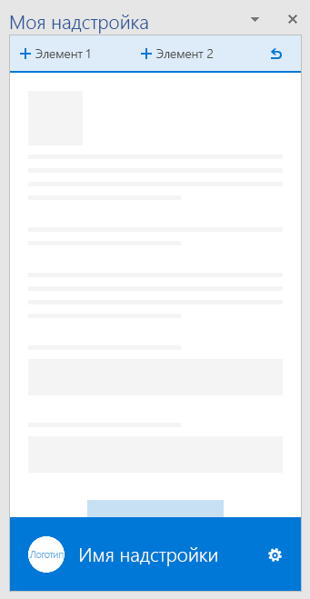</A></td>
<td><A href="https://github.com/OfficeDev/Office-Add-in-UX-Design-Patterns-Code/tree/master/templates/generic/brand-bar">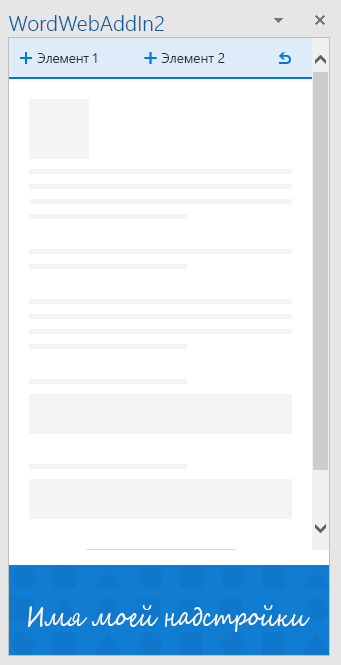</A></td></tr>
 </table>
 
### Интерфейс при первом запуске

Интерфейс при первом запуске — это интерфейс, отображаемый для пользователя, когда тот запускает надстройку в первый раз. Доступны следующие конструктивные шаблоны для первого запуска: 

* **Действия, необходимые для запуска.** Предоставляет пользователям упорядоченный список действий, которые необходимо выполнить, чтобы начать использовать надстройку. 
    * [Спецификация действий, необходимых для запуска](https://github.com/OfficeDev/Office-Add-in-UX-Design-Patterns/blob/master/assets/archived-patterns/fre_stepsToStart.pdf)
        * Этот конструктивный шаблон пользовательского интерфейса является архивным. Так как мы оцениваем его значение, ознакомьтесь также со [спецификацией значения при первом запуске](https://github.com/OfficeDev/Office-Add-in-UX-Design-Patterns/blob/master/patterns/value-placemat.md)  
    * [Код действий, необходимых для запуска](https://github.com/OfficeDev/Office-Add-in-UX-Design-Patterns-Code/tree/master/templates/first-run/instruction-step)
* **Решаемые задачи.** Разъясняет, какие задачи можно решить с помощью надстройки.
    * [Спецификация значения](https://github.com/OfficeDev/Office-Add-in-UX-Design-Patterns/blob/master/patterns/value-placemat.md)
    * [Код решаемых задач](https://github.com/OfficeDev/Office-Add-in-UX-Design-Patterns-Code/tree/master/templates/first-run/value-placemat)
* **Видео.** Показывает пользователям видеоролик перед тем, как они начнут использовать вашу надстройку.
    * [Спецификация видео](https://github.com/OfficeDev/Office-Add-in-UX-Design-Patterns/blob/master/patterns/video-placemat.md)
    * [Код видео](https://github.com/OfficeDev/Office-Add-in-UX-Design-Patterns-Code/tree/master/templates/first-run/video-placemat)
* **Пошаговое руководство.** Рассказывает пользователям о ряде функций или предоставляет определенные сведения, прежде чем они начнут использовать надстройку.
    * [Спецификация карусели](https://github.com/OfficeDev/Office-Add-in-UX-Design-Patterns/blob/master/patterns/carousel.md)
        * Примечание. Этот конструкторский шаблон пользовательского интерфейса переименован в "Карусель". Ранее в спецификациях он носил имя "Панель разбиения на страницы". В активах кода он известен под именем "Пошаговое руководство по первому запуску". 
    * [Код пошагового руководства](https://github.com/OfficeDev/Office-Add-in-UX-Design-Patterns-Code/tree/master/templates/first-run/walkthrough)

В [Магазине Office](https://msdn.microsoft.com/ru-RU/library/office/jj220033.aspx) предусмотрена система управления пробными версиями надстроек, но если вам нужно управлять пользовательским интерфейсом такой пробной версии, используйте следующие шаблоны:

* **Пробная версия.** Показывает пользователям, как начать работу с пробной версией надстройки.
    * [Спецификация пробной версии](https://github.com/OfficeDev/Office-Add-in-UX-Design-Patterns/blob/master/assets/archived-patterns/fre_trialVersion.pdf)
        * Этот конструктивный шаблон пользовательского интерфейса является архивным. Так как мы оцениваем его значение, ознакомьтесь с файлом в формате PDF.
    * [Код пробной версии](https://github.com/OfficeDev/Office-Add-in-UX-Design-Patterns-Code/tree/master/templates/first-run/trial-placemat)
* **Пробная функция.** Сообщает пользователю, что функция, которую он пытается использовать, недоступна в пробной версии надстройки. Кроме того, этот шаблон можно использовать, если надстройка предоставляется бесплатно, но в ней есть функция, для использования которой требуется подписка. С помощью этого шаблона вы также можете предоставлять ограниченную версию после окончания пробного периода.
    * [Спецификация пробной функции](https://github.com/OfficeDev/Office-Add-in-UX-Design-Patterns/blob/master/assets/archived-patterns/fre_trialFeature.pdf)
        * Этот конструктивный шаблон пользовательского интерфейса является архивным. Так как мы оцениваем его значение, ознакомьтесь с указанным выше файлом в формате PDF.
    * [Код пробной функции](https://github.com/OfficeDev/Office-Add-in-UX-Design-Patterns-Code/tree/master/templates/first-run/trial-placemat-feature)

> **Важно!** Если вы решите самостоятельно управлять пробной версией, не применяя для этого Магазин Office, добавьте тег **Может потребоваться дополнительная покупка** в примечания по тестированию на панели мониторинга продаж.

Решите, как часто необходимо применять интерфейс, используемый при первом запуске: один раз или несколько. Например, если пользователи используют надстройку периодически, они могут забыть, как ею пользоваться, поэтому интерфейс первого запуска может пригодиться более одного раза. 

 <table>
 <tr><th>Действия, необходимые для запуска</th><th>Решаемые задачи</th><th>Видео</th></tr>
 <tr>
<td></td>
<td></td>
<td></td></tr>
 </table>

 <table>
 <tr><th>Первая страница пошагового руководства</th><th>Пробная версия</th><th>Пробная функция</th></tr>
 <tr>
<td><A href="https://github.com/OfficeDev/Office-Add-in-UX-Design-Patterns-Code/tree/master/templates/first-run/walkthrough">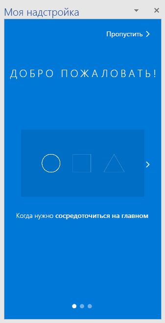</A></td>
<td><A href="https://github.com/OfficeDev/Office-Add-in-UX-Design-Patterns-Code/tree/master/templates/first-run/trial-placemat">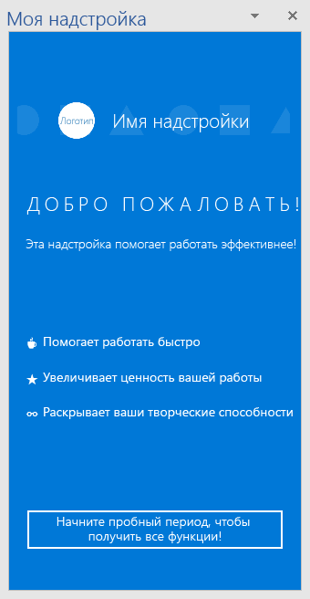</A></td>
<td></td></tr>
 </table> 

### Навигация

Пользователям нужно переключаться между разными страницами надстройки. В приведенных ниже шаблонах навигации показаны различные варианты упорядочения страниц и команд надстройки.

* **Страница с кнопками "Назад" и "Вперед".**. Показывает область задач с кнопками "Назад" и "Вперед". Этот шаблон поможет гарантировать, что пользователи следуют упорядоченной последовательности действий.
    * [Спецификация страницы с кнопками "Назад" и "Вперед"](https://github.com/OfficeDev/Office-Add-in-UX-Design-Patterns/blob/master/patterns/back-button.md)
    * [Код страницы с кнопками "Назад" и "Вперед"](https://github.com/OfficeDev/Office-Add-in-UX-Design-Patterns-Code/tree/master/templates/navigation/back-button) 
* **Навигация.** Показывает меню (так называемое меню "гамбургер") для перехода между страницами в области задач. 
    * [Спецификация навигации](https://github.com/OfficeDev/Office-Add-in-UX-Design-Patterns/blob/master/patterns/contextual-menu.md)
    * [Код навигации](https://github.com/OfficeDev/Office-Add-in-UX-Design-Patterns-Code/tree/master/templates/navigation/navigation) 
* **Навигация с командами.** Показывает меню "гамбургер" с командными кнопками (или управляющими кнопками) в области задач. С помощью этого шаблона можно одновременно предоставлять параметры навигации и команды. 
    * [Спецификация навигации с командами](https://github.com/OfficeDev/Office-Add-in-UX-Design-Patterns/blob/master/patterns/command-bar.md)
    * [Код навигации с командами](https://github.com/OfficeDev/Office-Add-in-UX-Design-Patterns-Code/tree/master/templates/navigation/navigation-commands)
* **Сводка.** Показывает сводную панель навигации в области задач. С помощью сводной панели навигации пользователи смогут переключаться между различным контентом.
    * [Спецификация сводки](https://github.com/OfficeDev/Office-Add-in-UX-Design-Patterns/blob/master/patterns/pivot.md)
    * [Код сводки](https://github.com/OfficeDev/Office-Add-in-UX-Design-Patterns-Code/tree/master/templates/navigation/pivot)
* **Панель вкладок.** Показывает панель навигации, используя кнопки с расположенными по вертикали текстом и значками. Панель вкладок обеспечивает навигацию с помощью вкладок с короткими и понятными названиями.
    * [Спецификация панели вкладок](https://github.com/OfficeDev/Office-Add-in-UX-Design-Patterns/blob/master/patterns/tab-bar.md)
    * [Код панели вкладок](https://github.com/OfficeDev/Office-Add-in-UX-Design-Patterns-Code/tree/master/templates/navigation/tab-bar) 

<table>
<tr><th>Кнопка "Назад"</th><th>Навигация</th><th>Навигация с командами</th></tr>
<tr>
    <td>
        
    </td>
    <td>
        
    </td>
    <td>
        
    </td>
</tr>
 </table>

<table>
<tr><th>Сводка</th><th>Панель вкладок</th></tr>
<tr><td></td>
<td><A href="https://github.com/OfficeDev/Office-Add-in-UX-Design-Patterns-Code/tree/master/templates/navigation/tab-bar">
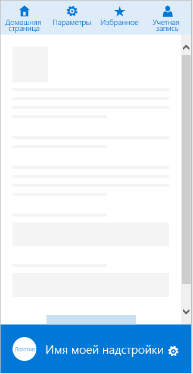</A></td>
</tr>
 </table>

### Уведомления

Надстройка может уведомлять пользователей о событиях, например ошибках, и о ходе выполнения множеством способов. Доступны следующие шаблоны уведомлений: 

* **Внедренное диалоговое окно.** Отображается в области задач и предоставляет сведения и (при необходимости) средства взаимодействия в виде кнопок и других элементов управления. Рекомендуется использовать диалоговое окно для подтверждения пользователем каких-либо действий. Шаблон "Внедренное диалоговое окно" позволяет ограничить пользовательский интерфейс областью задач.
    * [Спецификация внедренного диалогового окна](https://github.com/OfficeDev/Office-Add-in-UX-Design-Patterns/blob/master/patterns/embedded-dialog.md)
    * [Код внедренного диалогового окна](https://github.com/OfficeDev/Office-Add-in-UX-Design-Patterns-Code/tree/master/templates/notifications/embedded-dialog)
* **Встроенное сообщение.** Содержит информацию об ошибках, успешном выполнении действий или другие сведения. Может отображаться в указанном расположении в области задач. Например, если пользователь вводит в текстовом поле электронный адрес с неправильным форматом, то под полем отобразится соответствующее сообщение об ошибке. 
    * [Спецификация встроенного сообщения](https://github.com/OfficeDev/Office-Add-in-UX-Design-Patterns/blob/master/assets/archived-patterns/notification_inlineMessage.pdf)
        * Этот конструктивный шаблон пользовательского интерфейса является архивным. Так как мы оцениваем его значение, ознакомьтесь с указанным выше файлом в формате PDF.
    * [Код встроенного сообщения](https://github.com/OfficeDev/Office-Add-in-UX-Design-Patterns-Code/tree/master/templates/notifications/inline-message)
* **Баннер с сообщением.** Предоставляет сведения и (при необходимости) простые призывы к действиям в виде баннера, который можно свернуть в одну строку, развернуть на несколько строк или закрыть. Баннеры с сообщениями рекомендуется использовать для информирования об обновлениях служб или отображения полезных советов при запуске надстройки. 
    * [Спецификация баннера с сообщением](https://github.com/OfficeDev/Office-Add-in-UX-Design-Patterns/blob/master/assets/archived-patterns/message_bar.pdf)
        * Этот конструктивный шаблон пользовательского интерфейса является архивным. Так как мы оцениваем его значение, ознакомьтесь с указанным выше файлом в формате PDF.
    * [Код баннера с сообщением](https://github.com/OfficeDev/Office-Add-in-UX-Design-Patterns-Code/tree/master/templates/notifications/message-banner)
* **Индикатор выполнения.** Показывает ход выполнения длительных синхронных процессов, например задач по настройке, которые необходимо выполнить, прежде чем пользователь сможет перейти к дальнейшим действиям. Это отдельная промежуточная страница, на которой также используется фирменная символика надстройки. Используйте индикатор выполнения, если процесс может периодически отправлять сведения о том, сколько времени осталось до его завершения.
    * [Спецификация индикатора выполнения](https://github.com/OfficeDev/Office-Add-in-UX-Design-Patterns/blob/master/patterns/progress-indicator.md)
    * [Код индикатора выполнения](https://github.com/OfficeDev/Office-Add-in-UX-Design-Patterns-Code/tree/master/templates/notifications/progress-bar)
* **Индикатор работы.** Указывает, что выполняется длительный синхронный процесс, но не указывает, сколько времени осталось до его завершения. Это отдельная промежуточная страница, на которой также используется фирменная символика надстройки. Используйте индикатор работы, если надстройка не может достоверно сообщить, сколько времени необходимо для завершения процесса. 
    * [Спецификация индикатора работы](https://github.com/OfficeDev/Office-Add-in-UX-Design-Patterns/blob/master/patterns/spinner.md)
    * [Код индикатора работы](https://github.com/OfficeDev/Office-Add-in-UX-Design-Patterns-Code/tree/master/templates/notifications/spinner)
* **Всплывающее уведомление.** Содержит краткое сообщение, исчезающее через несколько секунд. Так как пользователь может и не увидеть такое сообщение, всплывающие уведомления используются для отображения несущественной информации. Это хороший способ уведомлять пользователей о событиях в удаленной системе, например о получении электронного письма.
    * [Спецификация всплывающего уведомления](https://github.com/OfficeDev/Office-Add-in-UX-Design-Patterns/blob/master/patterns/toast.md)
    * [Код всплывающего уведомления](https://github.com/OfficeDev/Office-Add-in-UX-Design-Patterns-Code/tree/master/templates/notifications/toast)

 <table>
 <tr><th>Внедренное диалоговое окно</th><th>Встроенное сообщение</th><th>Баннер с сообщением</th></tr>
 <tr><td><A href="https://github.com/OfficeDev/Office-Add-in-UX-Design-Patterns-Code/tree/master/templates/notifications/embedded-dialog">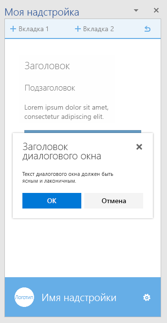</A></td>
<td><A href="https://github.com/OfficeDev/Office-Add-in-UX-Design-Patterns-Code/tree/master/templates/notifications/inline-message">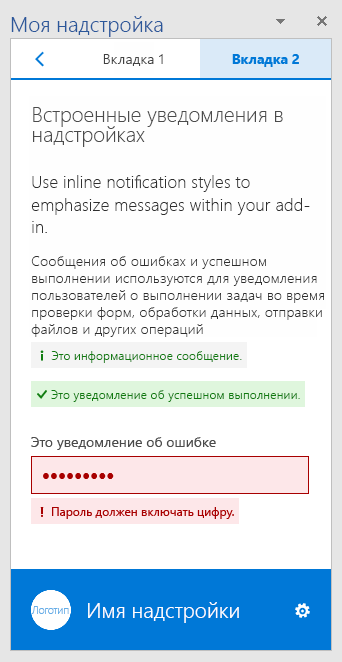</A></td>
<td></td></tr>
 </table>

 <table>
 <tr><th>Индикатор выполнения</th><th>Индикатор работы</th><th>Всплывающее уведомление</th></tr>
 <tr><td></td>
<td><A href="https://github.com/OfficeDev/Office-Add-in-UX-Design-Patterns-Code/tree/master/templates/notifications/spinner">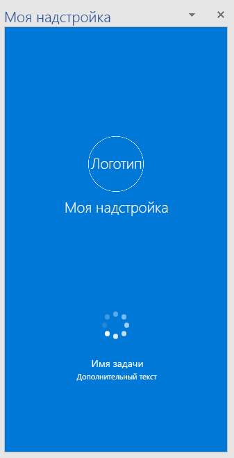</A></td>
<td></td></tr>
 </table>
 

### Общие компоненты

Ниже перечислены общие компоненты, которые можно использовать в надстройке для различных сценариев.  

#### Диалоговые окна клиентов

Диалоговые окна клиентов обеспечивают еще один способ работы пользователей с надстройкой за пределами области задач. Доступны следующие шаблоны диалоговых окон:

* **Диалоговое окно с набором шрифтов.** Содержит текстовый контент. С помощью этого диалогового окна можно показывать пользователям подробные сведения. 
    * Сведения о проектировании [диалоговых окон в надстройках Office](https://dev.office.com/docs/add-ins/design/dialog-boxes). Кроме того, следуйте нашим рекомендациям по [Шрифтовому оформлению надстроек Office](https://dev.office.com/docs/add-ins/design/add-in-design-language#typography).
    * [Код диалогового окна с набором шрифтов](https://github.com/OfficeDev/Office-Add-in-UX-Design-Patterns-Code/tree/master/templates/dialog/typeramp)
* **Диалоговое окно с оповещением** содержит важные сведения для пользователей, например ошибки или уведомления.  
    * [Спецификация диалогового окна с оповещением](https://github.com/OfficeDev/Office-Add-in-UX-Design-Patterns/blob/master/assets/archived-patterns/notification_alert.pdf)
        * Этот конструктивный шаблон пользовательского интерфейса является архивным. Так как мы оцениваем его значение, ознакомьтесь с указанным выше файлом в формате PDF.
    * [Код диалогового окна с оповещением](https://github.com/OfficeDev/Office-Add-in-UX-Design-Patterns-Code/tree/master/templates/dialog/alert)
* **Диалоговое окно навигации**. Содержит элементы для навигации. С его помощью пользователи могут открывать различный контент. 
    * Сведения о проектировании [диалоговых окон в надстройках Office](https://dev.office.com/docs/add-ins/design/dialog-boxes). Ознакомьтесь также со сведениями об использовании [компонентов сводки Office UI Fabric в надстройках Office](https://dev.office.com/docs/add-ins/design/pivot).
    * [Код диалогового окна навигации](https://github.com/OfficeDev/Office-Add-in-UX-Design-Patterns-Code/tree/master/templates/dialog/navigation)

<table>
 <tr><th>Диалоговое окно с набором шрифтов</th><th>Диалоговое окно с оповещением</th></tr>
<tr>
<td></td>
<td><A href="https://github.com/OfficeDev/Office-Add-in-UX-Design-Patterns-Code/tree/master/templates/dialog/alert">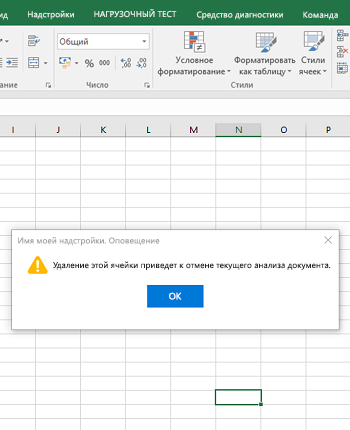</A></td>
</tr></tr>
 </table>
 
 <table>
 <tr><th>Диалоговое окно навигации</th></tr>
<tr><td><A href="https://github.com/OfficeDev/Office-Add-in-UX-Design-Patterns-Code/tree/master/templates/dialog/navigation">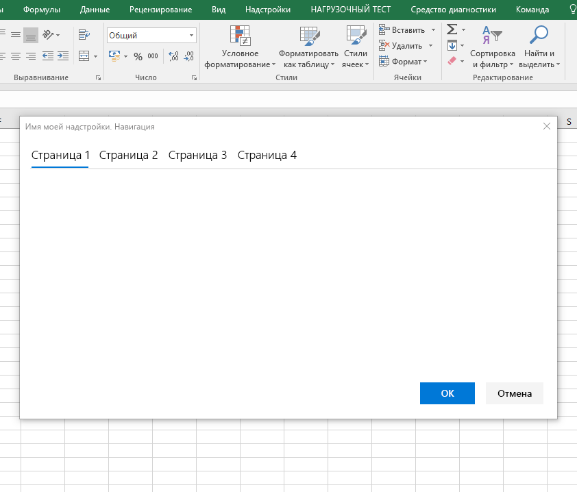</A></td></tr>
</tr>
 </table>

#### Отзывы и оценки

Чтобы сделать надстройку более заметной и популярной, полезно предоставить пользователям возможность оценивать и рецензировать надстройку в Магазине Office. В этом шаблоне показано два способа предоставления отзывов и оценок из надстройки:

- Отзыв, инициированный пользователем, — пользователь отправляет отзыв с помощью меню навигации (например, ссылки **Отправить отзыв**) или значка в нижнем колонтитуле.
- Отзыв, инициированный системой, — после трех запусков надстройки появляется баннер с сообщением, в котором пользователю предлагается оставить отзыв.

Независимо от способа открывается диалоговое окно со страницей надстройки в Магазине Office.

* [Спецификация отзывов и оценок](https://github.com/OfficeDev/Office-Add-in-UX-Design-Patterns/blob/master/assets/archived-patterns/notification_feedback.pdf)
    * Этот конструктивный шаблон пользовательского интерфейса является архивным. Так как мы оцениваем его значение, ознакомьтесь с указанным выше файлом в формате PDF.
* [Код отзывов и оценок](https://github.com/OfficeDev/Office-Add-in-UX-Design-Patterns-Code/tree/master/templates/feedback/office-store)

>**Важно!** В настоящее время этот шаблон указывает на главную страницу Магазина Office. Обязательно замените эту ссылку на URL-адрес страницы вашей надстройки в Магазине Office.

 <table>
 <tr><th>Отзывы и оценки</th></tr>
<tr><td><A href="https://github.com/OfficeDev/Office-Add-in-UX-Design-Patterns-Code/tree/master/templates/feedback/office-store">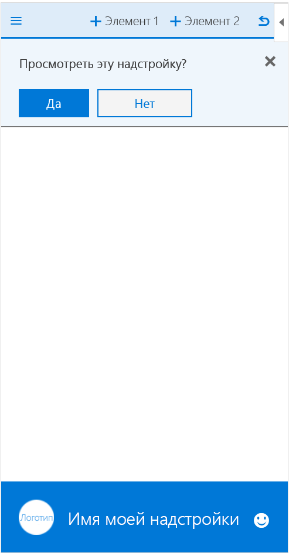</A></td></tr>
</tr>
 </table>

#### Параметры и конфиденциальность

В надстройке может потребоваться страница параметров, где пользователи смогут настраивать параметры, контролирующие работу надстройки. Кроме того, вы можете сообщить пользователям о политиках конфиденциальности, соблюдаемых вашей надстройкой. 

* **Параметры.**. Показывает область задач с компонентами конфигурации, которая контролирует работу надстройки. На странице параметров пользователи могут выбрать нужные настройки.
    * [Спецификация параметров](https://github.com/OfficeDev/Office-Add-in-UX-Design-Patterns/blob/master/patterns/settings.md)
    * [Код параметров](https://github.com/OfficeDev/Office-Add-in-UX-Design-Patterns-Code/tree/master/templates/settings)
* **Политика конфиденциальности.** Показывает область задач с важными сведениями о политиках конфиденциальности. 
    * [Спецификация политики конфиденциальности](https://github.com/OfficeDev/Office-Add-in-UX-Design-Patterns/blob/master/assets/archived-patterns/general_multiSection.pdf)
        * Этот конструктивный шаблон пользовательского интерфейса является архивным. Так как мы оцениваем его значение, ознакомьтесь с указанным выше файлом в формате PDF.
    * [Код политики конфиденциальности](https://github.com/OfficeDev/Office-Add-in-UX-Design-Patterns-Code/tree/master/templates/settings)

<table>
 <tr><th>Параметры</th><th>Политика конфиденциальности</th></tr>
<tr>
<td></td>
<td><A href="https://github.com/OfficeDev/Office-Add-in-UX-Design-Patterns-Code/tree/master/templates/settings">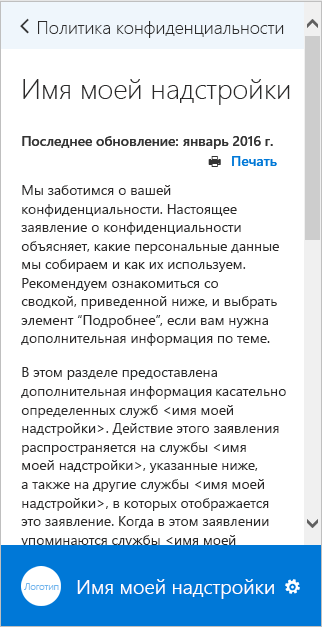</A></td>
</tr></tr>
 </table>

## Дополнительные ресурсы

* [Рекомендации по разработке надстроек Office](https://dev.office.com/docs/add-ins/overview/add-in-development-best-practices)
* [Office UI Fabric](http://dev.office.com/fabric/)
