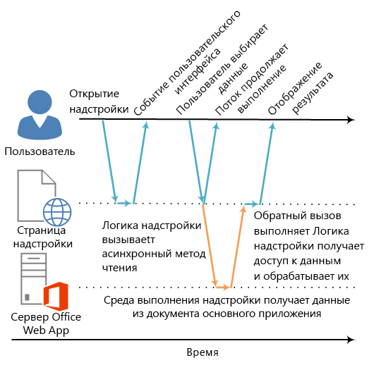

# <a name="asynchronous-programming-in-office-add-ins"></a><span data-ttu-id="b35f6-102">Асинхронное программирование в случае надстроек Office</span><span class="sxs-lookup"><span data-stu-id="b35f6-102">Asynchronous programming in Office Add-ins</span></span>

<span data-ttu-id="b35f6-p101">Почему в API Надстройки Office используется асинхронное программирование? JavaScript — это язык однопотокового программирования, поэтому если скрипт вызывает продолжительный синхронный процесс, исполнение всех последующих скриптов будет заблокировано до завершения этого процесса. Поскольку определенные операции с веб-клиентами Office (а также и с полнофункциональными клиентами) могут быть заблокированы при синхронном выполнении, большинство методов в API JavaScript для Office спроектированы для асинхронного выполнения. Это дает гарантию, что Надстройки Office будут отвечать и работать с высокой производительностью. При работе с асинхронными методами зачастую требуется создавать функции обратного вызова.</span><span class="sxs-lookup"><span data-stu-id="b35f6-p101">Why does the Office Add-ins API use asynchronous programming? Because JavaScript is a single-threaded language, if script invokes a long-running synchronous process, all subsequent script execution will be blocked until that process completes. Because certain operations against Office web clients (but rich clients as well) could block execution if they are run synchronously, most of the methods in the JavaScript API for Office are designed to execute asynchronously. This makes sure that Office Add-ins are responsive and highly performing. It also frequently requires you to write callback functions when working with these asynchronous methods.</span></span>

<span data-ttu-id="b35f6-p102">Имена всех асинхронных методов в API, например [Document.getSelectedDataAsync](https://dev.office.com/reference/add-ins/shared/document.getselecteddataasync), [Binding.getDataAsync](https://dev.office.com/reference/add-ins/shared/binding.getdataasync) или [Item.loadCustomPropertiesAsync](https://dev.office.com/reference/add-ins/outlook/Office.context.mailbox.item), заканчиваются на "Async". При вызове асинхронного метода он выполняется немедленно и все дополнительные скрипты могут продолжать работу. Необязательная функция обратного вызова, передаваемая в асинхронный метод, выполняется тогда, когда готовы данные или запрашиваемая операция. Обычно это происходит быстро, но иногда возможен возврат с небольшой задержкой.</span><span class="sxs-lookup"><span data-stu-id="b35f6-p102">The names of all asynchronous methods in the API end with "Async", such as the  [Document.getSelectedDataAsync](https://dev.office.com/reference/add-ins/shared/document.getselecteddataasync), [Binding.getDataAsync](https://dev.office.com/reference/add-ins/shared/binding.getdataasync), or [Item.loadCustomPropertiesAsync](https://dev.office.com/reference/add-ins/outlook/Office.context.mailbox.item) methods. When an "Async" method is called, it executes immediately and any subsequent script execution can continue. The optional callback function you pass to an "Async" method executes as soon as the data or requested operation is ready. This generally occurs promptly, but there can be a slight delay before it returns.</span></span>

<span data-ttu-id="b35f6-p103">На следующей схеме показан поток выполнения для вызова асинхронного метода, который считывает данные, выделенные пользователем в документе, открытом в серверном веб-приложении Word Online или Excel Online. На момент вызова асинхронного метода поток выполнения JavaScript свободен для выполнения любой дополнительной обработки на стороне клиента, хотя это и не показано на схеме. Когда асинхронный метод возвращается, обратный вызов возобновляет выполнение в потоке, и надстройка может получать доступ к данным, проводить операции над ними и отображать результат. Такой же шаблон асинхронного выполнения используется при работе с ведущими приложениями полнофункционального клиента Office, например с Word 2013 или Excel 2013.</span><span class="sxs-lookup"><span data-stu-id="b35f6-p103">The following diagram shows the flow of execution for a call to an "Async" method that reads the data the user selected in a document open in the server-based Word Online or Excel Online. At the point when the "Async" call is made, the JavaScript execution thread is free to perform any additional client-side processing. (Although none are shown in the diagram.) When the "Async" method returns, the callback resumes execution on the thread, and the add-in can the access data, do something with it, and display the result. The same asynchronous execution pattern holds when working with the Office rich client host applications, such as Word 2013 or Excel 2013.</span></span>

<span data-ttu-id="b35f6-116">*Рис. 1. Процесс выполнения при асинхронном программировании*</span><span class="sxs-lookup"><span data-stu-id="b35f6-116">*Figure 1. Asynchronous programing execution flow*</span></span>



<span data-ttu-id="b35f6-p104">Поддержка этой асинхронной конструкции как в полнофункциональных, так и в веб-клиентах, — это часть стратегии проектирования "однократное написание — запуск на нескольких платформах" модели разработки Надстройки Office. Например, вы можете создать контентную надстройку или надстройку области задач на единой базе кода, которая будет работать и в Excel 2013, и в Excel Online.</span><span class="sxs-lookup"><span data-stu-id="b35f6-p104">Support for this asynchronous design in both rich and web clients is part of the "write once-run cross-platform" design goals of the Office Add-ins development model. For example, you can create a content or task pane add-in with a single code base that will run in both Excel 2013 and Excel Online.</span></span>

## <a name="writing-the-callback-function-for-an-async-method"></a><span data-ttu-id="b35f6-120">Написание функции обратного вызова для асинхронного метода</span><span class="sxs-lookup"><span data-stu-id="b35f6-120">Writing the callback function for an "Async" method</span></span>


<span data-ttu-id="b35f6-p105">Функция обратного вызова, передаваемая в асинхронный метод в качестве аргумента _callback_, должна объявлять единственный параметр, который всегда будет использоваться средой выполнения надстройки для предоставления доступа к объекту [AsyncResult](https://dev.office.com/reference/add-ins/shared/asyncresult) при выполнении этой функции. Например:</span><span class="sxs-lookup"><span data-stu-id="b35f6-p105">The callback function you pass as the  _callback_ argument to an "Async" method must declare a single parameter that the add-in runtime will use to provide access to an [AsyncResult](https://dev.office.com/reference/add-ins/shared/asyncresult) object when the callback function executes. You can write:</span></span>


- <span data-ttu-id="b35f6-123">Анонимная функция, которая должна быть написана и передана непосредственно в вызове асинхронного метода в качестве параметра _callback_ асинхронного метода.</span><span class="sxs-lookup"><span data-stu-id="b35f6-123">An anonymous function that must be written and passed directly in line with the call to the "Async" method as the  _callback_ parameter of the "Async" method.</span></span>
    
- <span data-ttu-id="b35f6-124">Именованная функция, передающая свое имя в качестве параметра _callback_ асинхронного метода.</span><span class="sxs-lookup"><span data-stu-id="b35f6-124">A named function, passing the name of that function as the  _callback_ parameter of an "Async" method.</span></span>
    
<span data-ttu-id="b35f6-p106">Анонимную функцию удобно использовать, если код такой функции будет использован всего один раз (так как у нее нет имени, вы не сможете сослаться на нее в другой части кода). Именованные функции применяются, если необходимо многократно использовать функцию обратного вызова для нескольких асинхронных методов.</span><span class="sxs-lookup"><span data-stu-id="b35f6-p106">An anonymous function is useful if you are only going to use its code once - because it has no name, you can't reference it in another part of your code. A named function is useful if you want to reuse the callback function for more than one "Async" method.</span></span>


### <a name="writing-an-anonymous-callback-function"></a><span data-ttu-id="b35f6-127">Написание анонимной функции обратного вызова</span><span class="sxs-lookup"><span data-stu-id="b35f6-127">Writing an anonymous callback function</span></span>

<span data-ttu-id="b35f6-128">Следующая анонимная функция обратного вызова объявляет единственный параметр с именем `result`, который получает данные из свойства [AsyncResult.value](https://dev.office.com/reference/add-ins/shared/asyncresult.status) при возврате обратного вызова.</span><span class="sxs-lookup"><span data-stu-id="b35f6-128">The following anonymous callback function declares a single parameter named  `result` that retrieves data from the [AsyncResult.value](https://dev.office.com/reference/add-ins/shared/asyncresult.status) property when the callback returns.</span></span>


```js
function (result) {
        write('Selected data: ' + result.value);
}
```

<span data-ttu-id="b35f6-129">В следующем примере показано, как передать анонимную функцию обратного вызова в полном вызове асинхронного метода **Document.getSelectedDataAsync**.</span><span class="sxs-lookup"><span data-stu-id="b35f6-129">The following example shows how to pass this anonymous callback function in line in the context of a full "Async" method call to the  **Document.getSelectedDataAsync** method.</span></span>


- <span data-ttu-id="b35f6-130">Первый аргумент _coercionType_, `Office.CoercionType.Text`, указывает, что необходимо возвратить выделенные данные в виде строки текста.</span><span class="sxs-lookup"><span data-stu-id="b35f6-130">The first  _coercionType_ argument, `Office.CoercionType.Text`, specifies to return the selected data as a string of text.</span></span>
    
- <span data-ttu-id="b35f6-p107">Второй аргумент _callback_ — это анонимная функция, передаваемая в метод. В процессе выполнения она использует параметр _result_ для доступа к свойству **value** объекта **AsyncResult**, чтобы отобразить данные, выделенные пользователем в документе.</span><span class="sxs-lookup"><span data-stu-id="b35f6-p107">The second  _callback_ argument is the anonymous function passed in-line to the method. When the function executes, it uses the _result_ parameter to access the **value** property of the **AsyncResult** object to display the data selected by the user in the document.</span></span>
    


```js
Office.context.document.getSelectedDataAsync(Office.CoercionType.Text, 
    function (result) {
        write('Selected data: ' + result.value);
    }
});

// Function that writes to a div with id='message' on the page.
function write(message){
    document.getElementById('message').innerText += message; 
}
```

<span data-ttu-id="b35f6-p108">Вы также можете использовать параметр функции обратного вызова для получения доступа к другим свойствам объекта **AsyncResult**. Используйте свойство [AsyncResult.status](https://dev.office.com/reference/add-ins/shared/asyncresult.error), чтобы определить, успешно ли был выполнен вызов. Если не удалось выполнить вызов, можно использовать свойство [AsyncResult.error](https://dev.office.com/reference/add-ins/shared/asyncresult.context), чтобы получить доступ к объекту [Error](https://dev.office.com/reference/add-ins/shared/error) и получить сведения об ошибке.</span><span class="sxs-lookup"><span data-stu-id="b35f6-p108">You can also use the parameter of your callback function to access other properties of the  **AsyncResult** object. Use the [AsyncResult.status](https://dev.office.com/reference/add-ins/shared/asyncresult.error) property to determine if the call succeeded or failed. If your call fails you can use the [AsyncResult.error](https://dev.office.com/reference/add-ins/shared/asyncresult.context) property to access an [Error](https://dev.office.com/reference/add-ins/shared/error) object for error information.</span></span>

<span data-ttu-id="b35f6-136">Дополнительные сведения об использовании метода **getSelectedDataAsync** см. в статье "Считывание и запись данных в активное выделение документа или таблицы" ([Считывание и запись данных в активное выделение документа или таблицы](read-and-write-data-to-the-active-selection-in-a-document-or-spreadsheet.md)).</span><span class="sxs-lookup"><span data-stu-id="b35f6-136">For more information about using the  **getSelectedDataAsync** method, see [Read and write data to the active selection in a document or spreadsheet](read-and-write-data-to-the-active-selection-in-a-document-or-spreadsheet.md).</span></span> 


### <a name="writing-a-named-callback-function"></a><span data-ttu-id="b35f6-137">Написание именованной функции обратного вызова</span><span class="sxs-lookup"><span data-stu-id="b35f6-137">Writing a named callback function</span></span>

<span data-ttu-id="b35f6-p109">Кроме того, вы можете написать именованную функцию и передать ее имя параметру _callback_ асинхронного метода. Например, предыдущий пример можно изменить так, чтобы передавать функцию с именем `writeDataCallback` в качестве параметра _callback_.</span><span class="sxs-lookup"><span data-stu-id="b35f6-p109">Alternatively, you can write a named function and pass its name to the  _callback_ parameter of an "Async" method. For example, the previous example can be rewritten to pass a function named `writeDataCallback` as the _callback_ parameter like this.</span></span>


```js
Office.context.document.getSelectedDataAsync(Office.CoercionType.Text, 
    writeDataCallback);

// Callback to write the selected data to the add-in UI.
function writeDataCallback(result) {
    write('Selected data: ' + result.value);
}

// Function that writes to a div with id='message' on the page.
function write(message){
    document.getElementById('message').innerText += message; 
}
```


## <a name="differences-in-whats-returned-to-the-asyncresultvalue-property"></a><span data-ttu-id="b35f6-140">Что возвращается в свойство AsyncResult.value?</span><span class="sxs-lookup"><span data-stu-id="b35f6-140">Differences in what's returned to the AsyncResult.value property</span></span>


<span data-ttu-id="b35f6-p110">Свойства **asyncContext**, **status** и **error** объекта **AsyncResult** возвращают одни и те же виды сведений в функцию обратного вызова, передаваемую в любые асинхронные методы. Однако то, что будет возвращено в свойство **AsyncResult.value**, зависит от функциональных возможностей асинхронного метода.</span><span class="sxs-lookup"><span data-stu-id="b35f6-p110">The  **asyncContext**,  **status**, and  **error** properties of the **AsyncResult** object return the same kinds of information to the callback function passed to all "Async" methods. However, what's returned to the **AsyncResult.value** property varies depending on the functionality of the "Async" method.</span></span>

<span data-ttu-id="b35f6-p111">Например, методы **addHandlerAsync** (для объектов [Binding](https://dev.office.com/reference/add-ins/shared/binding), [CustomXmlPart](https://dev.office.com/reference/add-ins/shared/customxmlpart.customxmlpart), [Document](https://dev.office.com/reference/add-ins/shared/document), [RoamingSettings](https://dev.office.com/reference/add-ins/outlook/RoamingSettings) и [Settings](https://dev.office.com/reference/add-ins/shared/settings)) позволяют добавить функции обработчиков событий в элементы, представленные этими объектами. Вы можете получить доступ к свойству **AsyncResult.value** из функции обратного вызова, передаваемой в любой из методов **addHandlerAsync**. Но так как при добавлении обработчика событий не происходит доступа к данным или объектам, то при попытке доступа к нему свойство **value** всегда возвращает значение **undefined**.</span><span class="sxs-lookup"><span data-stu-id="b35f6-p111">For example, the  **addHandlerAsync** methods (of the [Binding](https://dev.office.com/reference/add-ins/shared/binding), [CustomXmlPart](https://dev.office.com/reference/add-ins/shared/customxmlpart.customxmlpart), [Document](https://dev.office.com/reference/add-ins/shared/document), [RoamingSettings](https://dev.office.com/reference/add-ins/outlook/RoamingSettings), and [Settings](https://dev.office.com/reference/add-ins/shared/settings) objects) are used to add event handler functions to the items represented by these objects. You can access the **AsyncResult.value** property from the callback function you pass to any of the **addHandlerAsync** methods, but since no data or object is being accessed when you add an event handler, the **value** property always returns **undefined** if you attempt to access it.</span></span>

<span data-ttu-id="b35f6-p112">С другой стороны, при вызове метода **Document.getSelectedDataAsync** он возвращает данные, выделенные пользователем в документе, в свойство **AsyncResult.value** в обратном вызове. Если вызвать метод [Bindings.getAllAsync](https://dev.office.com/reference/add-ins/shared/bindings.getallasync), он возвратит массив всех объектов **Binding** в документе. И, наконец, если вызвать метод [Bindings.getByIdAsync](https://dev.office.com/reference/add-ins/shared/bindings.getbyidasync), он возвратит один объект **Binding**.</span><span class="sxs-lookup"><span data-stu-id="b35f6-p112">On the other hand, if you call the  **Document.getSelectedDataAsync** method, it returns the data the user selected in the document to the **AsyncResult.value** property in the callback. Or, if you call the [Bindings.getAllAsync](https://dev.office.com/reference/add-ins/shared/bindings.getallasync) method, it returns an array of all of the **Binding** objects in the document. And, if you call the [Bindings.getByIdAsync](https://dev.office.com/reference/add-ins/shared/bindings.getbyidasync) method, it returns a single **Binding** object.</span></span>

<span data-ttu-id="b35f6-p113">Описание того, что возвращается в свойство **AsyncResult.value** асинхронного метода, см. в разделе "Значение обратного вызова" справочной статьи для этого метода. Сводку всех объектов, имеющих асинхронные методы, см. в таблице в конце статьи об объекте [AsyncResult](https://dev.office.com/reference/add-ins/shared/asyncresult).</span><span class="sxs-lookup"><span data-stu-id="b35f6-p113">For a description of what's returned to the  **AsyncResult.value** property for an "Async" method, see the "Callback value" section of that method's reference topic. For a summary of all of the objects that provide "Async" methods, see the table at the bottom of the [AsyncResult](https://dev.office.com/reference/add-ins/shared/asyncresult) object topic.</span></span>


## <a name="asynchronous-programming-patterns"></a><span data-ttu-id="b35f6-150">Шаблоны асинхронного программирования</span><span class="sxs-lookup"><span data-stu-id="b35f6-150">Asynchronous programming patterns</span></span>


<span data-ttu-id="b35f6-151">API JavaScript для Office поддерживает два вида шаблонов асинхронного программирования.</span><span class="sxs-lookup"><span data-stu-id="b35f6-151">The JavaScript API for Office supports two kinds of asynchronous programming patterns:</span></span>


- <span data-ttu-id="b35f6-152">С использованием вложенных обратных вызовов</span><span class="sxs-lookup"><span data-stu-id="b35f6-152">Using nested callbacks</span></span>
    
- <span data-ttu-id="b35f6-153">С использованием шаблона promise</span><span class="sxs-lookup"><span data-stu-id="b35f6-153">Using the promises pattern</span></span>
    
<span data-ttu-id="b35f6-p114">При асинхронном программировании с использованием функций обратного вызова зачастую требуется вкладывать возвращаемый результат одного обратного вызова в один или несколько других обратных вызовов. В этом случае вы можете использовать вложенные обратные вызовы асинхронных методов API.</span><span class="sxs-lookup"><span data-stu-id="b35f6-p114">Asynchronous programming with callback functions frequently requires you to nest the returned result of one callback within two or more callbacks. If you need to do so, you can use nested callbacks from all "Async" methods of the API.</span></span>

<span data-ttu-id="b35f6-p115">Использование вложенных обратных вызовов — это шаблон программирования, знакомый большинству разработчиков на языке JavaScript, но код с глубоко вложенными обратными вызовами может быть труден для чтения и понимания. В качестве альтернативы вложенным обратным вызовам API JavaScript для Office также поддерживает реализацию шаблона promise. Однако в текущей версии API JavaScript для Office шаблон promise работает только с кодом для привязок [в электронных таблицах Excel и документах Word](bind-to-regions-in-a-document-or-spreadsheet.md).</span><span class="sxs-lookup"><span data-stu-id="b35f6-p115">Using nested callbacks is a programming pattern familiar to most JavaScript developers, but code with deeply nested callbacks can be difficult to read and understand. As an alternative to nested callbacks, the JavaScript API for Office also supports an implementation of the promises pattern. However, in the current version of the JavaScript API for Office, the promises pattern only works with code for [bindings in Excel spreadsheets and Word documents](bind-to-regions-in-a-document-or-spreadsheet.md).</span></span>

<a name="AsyncProgramming_NestedCallbacks" />
### <a name="asynchronous-programming-using-nested-callback-functions"></a><span data-ttu-id="b35f6-159">Асинхронное программирование с использованием вложенных функций обратного вызова</span><span class="sxs-lookup"><span data-stu-id="b35f6-159">Asynchronous programming using nested callback functions</span></span>


<span data-ttu-id="b35f6-p116">Зачастую для какой-либо задачи необходимо выполнять несколько асинхронных операций. Для этого можно вкладывать один асинхронный вызов в другой.</span><span class="sxs-lookup"><span data-stu-id="b35f6-p116">Frequently, you need to perform two or more asynchronous operations to complete a task. To accomplish that, you can nest one "Async" call inside another.</span></span> 

<span data-ttu-id="b35f6-162">В следующем примере кода показано, как вложить два асинхронных вызова.</span><span class="sxs-lookup"><span data-stu-id="b35f6-162">The following code example nests two asynchronous calls.</span></span> 


- <span data-ttu-id="b35f6-p117">Сначала вызывается метод [Bindings.getByIdAsync](https://dev.office.com/reference/add-ins/shared/bindings.getbyidasync) для получения доступа к привязке в документе с именем "MyBinding". Объект **AsyncResult**, возвращаемый в параметр `result` этого обратного вызова, обеспечивает доступ к указанному объекту привязки из свойства **AsyncResult.value**.</span><span class="sxs-lookup"><span data-stu-id="b35f6-p117">First, the [Bindings.getByIdAsync](https://dev.office.com/reference/add-ins/shared/bindings.getbyidasync) method is called to access a binding in the document named "MyBinding". The **AsyncResult** object returned to the `result` parameter of that callback provides access to the specified binding object from the **AsyncResult.value** property.</span></span>
    
- <span data-ttu-id="b35f6-165">Затем объект привязки, к которому получен доступ из первого параметра `result`, используется для вызова метода [Binding.getDataAsync](https://dev.office.com/reference/add-ins/shared/binding.getdataasync).</span><span class="sxs-lookup"><span data-stu-id="b35f6-165">Then, the binding object accessed from the first  `result` parameter is used to call the [Binding.getDataAsync](https://dev.office.com/reference/add-ins/shared/binding.getdataasync) method.</span></span>
    
- <span data-ttu-id="b35f6-166">И, наконец, параметр `result2` обратного вызова, передаваемый в метод **Binding.getDataAsync**, используется для отображения данных в привязке.</span><span class="sxs-lookup"><span data-stu-id="b35f6-166">Finally, the  `result2` parameter of the callback passed to the **Binding.getDataAsync** method is used to display the data in the binding.</span></span>
    


```js
function readData() {
    Office.context.document.bindings.getByIdAsync("MyBinding", function (result) {
        result.value.getDataAsync({ coercionType: 'text' }, function (result2) {
            write(result2.value);
        });
    });
}

// Function that writes to a div with id='message' on the page.
function write(message){
    document.getElementById('message').innerText += message; 
}
```

<span data-ttu-id="b35f6-167">Этот базовый шаблон вложенного обратного вызова можно использовать для всех асинхронных методов в API JavaScript для Office.</span><span class="sxs-lookup"><span data-stu-id="b35f6-167">This basic nested callback pattern can be used for all asynchronous methods in the JavaScript API for Office.</span></span>

<span data-ttu-id="b35f6-168">В следующих разделах показано, как использовать анонимные или именованные функции для вложенных обратных вызовов в асинхронных методах.</span><span class="sxs-lookup"><span data-stu-id="b35f6-168">The following sections show how to use either anonymous or named functions for nested callbacks in asynchronous methods.</span></span>


#### <a name="using-anonymous-functions-for-nested-callbacks"></a><span data-ttu-id="b35f6-169">Использование анонимных функций для вложенных обратных вызовов</span><span class="sxs-lookup"><span data-stu-id="b35f6-169">Using anonymous functions for nested callbacks</span></span>

<span data-ttu-id="b35f6-p118">В следующем примере показано, как объявить две встроенные анонимные функции и передать их в методы **getByIdAsync** и **getDataAsync** в качестве вложенных обратных вызовов. Поскольку это простые и встроенные функции, их назначение сразу же становится понятным.</span><span class="sxs-lookup"><span data-stu-id="b35f6-p118">In the following example, two anonymous functions are declared inline and passed into the  **getByIdAsync** and **getDataAsync** methods as nested callbacks. Because the functions are simple and inline, the intent of the implementation is immediately clear.</span></span>


```js
Office.context.document.bindings.getByIdAsync('myBinding', function (bindingResult) {
    bindingResult.value.getDataAsync(function (getResult) {
        if (getResult.status == Office.AsyncResultStatus.Failed) {
            write('Action failed. Error: ' + asyncResult.error.message);
        } else {
            write('Data has been read successfully.');
        }
    });
});

// Function that writes to a div with id='message' on the page.
function write(message){
    document.getElementById('message').innerText += message; 
}
```


#### <a name="using-named-functions-for-nested-callbacks"></a><span data-ttu-id="b35f6-172">Использование именованных функций для вложенных обратных вызовов</span><span class="sxs-lookup"><span data-stu-id="b35f6-172">Using named functions for nested callbacks</span></span>

<span data-ttu-id="b35f6-p119">В сложных реализациях может оказаться полезным использовать именованные функции для упрощения чтения, поддержки и повторного использования. В следующем примере две анонимные функции из примера предыдущего раздела были переписаны как функции `deleteAllData` и `showResult`. Эти именованные функции затем передаются в методы **getByIdAsync** и **deleteAllDataValuesAsync** в виде обратных вызовов по имени.</span><span class="sxs-lookup"><span data-stu-id="b35f6-p119">In complex implementations, it may be helpful to use named functions to make your code easier to read, maintain, and reuse. In the following example, the two anonymous functions from the example in the previous section have been rewritten as functions named  `deleteAllData` and `showResult`. These named functions are then passed into the  **getByIdAsync** and **deleteAllDataValuesAsync** methods as callbacks by name.</span></span>


```js
Office.context.document.bindings.getByIdAsync('myBinding', deleteAllData);

function deleteAllData(asyncResult) {
    asyncResult.value.deleteAllDataValuesAsync(showResult);
}

function showResult(asyncResult) {
    if (asyncResult.status == Office.AsyncResultStatus.Failed) {
        write('Action failed. Error: ' + asyncResult.error.message);
    } else {
        write('Data has been deleted successfully.');
    }
}

// Function that writes to a div with id='message' on the page.
function write(message){
    document.getElementById('message').innerText += message; 
}
```


### <a name="asynchronous-programming-using-the-promises-pattern-to-access-data-in-bindings"></a><span data-ttu-id="b35f6-176">Асинхронное программирование с применением шаблона, предусматривающего использование обещаний для получения доступа к данным в привязках</span><span class="sxs-lookup"><span data-stu-id="b35f6-176">Asynchronous programming using the promises pattern to access data in bindings</span></span>


<span data-ttu-id="b35f6-p120">Если применяется шаблон программирования, предусматривающий использование обещаний, в коде не нужно указывать передачу функции обратного вызова и ожидание ее возвращения для продолжения выполнения. В этом случае сразу возвращается объект обещания, который представляет нужный результат. Но в отличие от традиционного синхронного программирования, в этом случае получение обещанного результата на самом деле откладывается до тех пор, пока среда выполнения надстроек Office не сможет выполнить запрос. Обработчик _onError_ предоставляется для ситуаций, когда запрос не может быть выполнен.</span><span class="sxs-lookup"><span data-stu-id="b35f6-p120">Instead of passing a callback function and waiting for the function to return before execution continues, the promises programming pattern immediately returns a promise object that represents its intended result. However, unlike true synchronous programming, under the covers the fulfillment of the promised result is actually deferred until the Office Add-ins runtime environment can complete the request. An _onError_ handler is provided to cover situations when the request can't be fulfilled.</span></span>

<span data-ttu-id="b35f6-p121">API JavaScript для Office предоставляет метод [Office.select](https://dev.office.com/reference/add-ins/shared/office.select), которые поддерживает использование шаблона promise для работы с существующими объектами привязки. Объект promise, возвращаемый в метод **Office.select**, поддерживает только четыре метода, к которым можно получить доступ непосредственно из объекта [Binding](https://dev.office.com/reference/add-ins/shared/binding): [getDataAsync](https://dev.office.com/reference/add-ins/shared/binding.getdataasync), [setDataAsync](https://dev.office.com/reference/add-ins/shared/binding.setdataasync), [addHandlerAsync](https://dev.office.com/reference/add-ins/shared/asyncresult.value) или [removeHandlerAsync](https://dev.office.com/reference/add-ins/shared/binding.removehandlerasync).</span><span class="sxs-lookup"><span data-stu-id="b35f6-p121">The JavaScript API for Office provides the [Office.select](https://dev.office.com/reference/add-ins/shared/office.select) method to support the promises pattern for working with existing binding objects. The promise object returned to the **Office.select** method supports only the four methods that you can access directly from the [Binding](https://dev.office.com/reference/add-ins/shared/binding) object: [getDataAsync](https://dev.office.com/reference/add-ins/shared/binding.getdataasync), [setDataAsync](https://dev.office.com/reference/add-ins/shared/binding.setdataasync), [addHandlerAsync](https://dev.office.com/reference/add-ins/shared/asyncresult.value), and [removeHandlerAsync](https://dev.office.com/reference/add-ins/shared/binding.removehandlerasync).</span></span>

<span data-ttu-id="b35f6-182">Шаблон promise для работы с привязками принимает такую форму:</span><span class="sxs-lookup"><span data-stu-id="b35f6-182">The promises pattern for working with bindings takes this form:</span></span>

 <span data-ttu-id="b35f6-183">**Office.select(**_selectorExpression_,  _onError_**).**_BindingObjectAsyncMethod_</span><span class="sxs-lookup"><span data-stu-id="b35f6-183">**Office.select(**_selectorExpression_,  _onError_**).**_BindingObjectAsyncMethod_</span></span>

<span data-ttu-id="b35f6-p122">Параметр _selectorExpression_ принимает форму `"bindings#bindingId"`, где _bindingId_ — это имя (**id**) привязки, созданной ранее в документе или электронной таблице (с использованием одного из методов "addFrom" коллекции **Bindings**: **addFromNamedItemAsync**, **addFromPromptAsync** или **addFromSelectionAsync**). Например, выражение отбора `bindings#cities` указывает, что необходимо получить доступ к привязке с **id** городов.</span><span class="sxs-lookup"><span data-stu-id="b35f6-p122">The  _selectorExpression_ parameter takes the form `"bindings#bindingId"`, where  _bindingId_ is the name ( **id**) of a binding that you created previously in the document or spreadsheet (using one of the "addFrom" methods of the  **Bindings** collection: **addFromNamedItemAsync**,  **addFromPromptAsync**, or  **addFromSelectionAsync**). For example, the selector expression  `bindings#cities` specifies that you want to access the binding with an **id** of 'cities'.</span></span>

<span data-ttu-id="b35f6-p123">Параметр _onError_ — эта функция обработки ошибки, принимающая единственный параметр типа **AsyncResult**, который можно использовать для получения доступа к объекту **Error**, если методу **select** не удается получить доступ к указанной привязке. В следующем примере показана базовая функция обработки ошибки, которую можно передать в параметр _onError_.</span><span class="sxs-lookup"><span data-stu-id="b35f6-p123">The  _onError_ parameter is an error handling function which takes a single parameter of type **AsyncResult** that can be used to access an **Error** object, if the **select** method fails to access the specified binding. The following example shows a basic error handler function that can be passed to the _onError_ parameter.</span></span>


```js
function onError(result){
    var err = result.error;
    write(err.name + ": " + err.message);
}
// Function that writes to a div with id='message' on the page.
function write(message){
    document.getElementById('message').innerText += message; 
}
```

<span data-ttu-id="b35f6-p124">Замените заполнитель _BindingObjectAsyncMethod_ вызовом методов любого из четырех объектов **Binding**, поддерживаемых объектом promise: **getDataAsync**, **setDataAsync**, **addHandlerAsync** или **removeHandlerAsync**. Вызовы этих методов не поддерживают дополнительные шаблоны promise. Их нужно вызывать с помощью [шаблона функции вложенного обратного вызова](#AsyncProgramming_NestedCallbacks).</span><span class="sxs-lookup"><span data-stu-id="b35f6-p124">Replace the  _BindingObjectAsyncMethod_ placeholder with a call to any of the four **Binding** object methods supported by the promise object: **getDataAsync**,  **setDataAsync**,  **addHandlerAsync**, or  **removeHandlerAsync**. Calls to these methods don't support additional promises. You must call them using the [nested callback function pattern](#AsyncProgramming_NestedCallbacks).</span></span>

<span data-ttu-id="b35f6-p125">После выполнения promise объекта **Binding** его можно повторно использовать в вызове последующего метода, как если бы он был привязкой (среда выполнения надстройки не будет повторно пытаться асинхронно выполнить promise). Если promise объекта **Binding** невозможно выполнить, среда выполнения надстройки снова попытается получить доступ к объекту привязки в следующий раз, когда будет вызван один из ее асинхронных методов.</span><span class="sxs-lookup"><span data-stu-id="b35f6-p125">After a  **Binding** object promise is fulfilled, it can be reused in the chained method call as if it were a binding (the add-in runtime won't asynchronously retry fulfilling the promise). If the **Binding** object promise can't be fulfilled, the add-in runtime will try again to access the binding object the next time one of its asynchronous methods is invoked.</span></span>

<span data-ttu-id="b35f6-193">В следующем примере кода используется метод **select**, чтобы получить привязку с **id** "`cities`" из коллекции **Bindings**, а затем вызвать метод [addHandlerAsync](https://dev.office.com/reference/add-ins/shared/asyncresult.value) для добавления обработчика событий для события [dataChanged](https://dev.office.com/reference/add-ins/shared/binding.bindingdatachangedevent) привязки.</span><span class="sxs-lookup"><span data-stu-id="b35f6-193">The following code example uses the  **select** method to retrieve a binding with the **id** " `cities`" from the  **Bindings** collection, and then calls the [addHandlerAsync](https://dev.office.com/reference/add-ins/shared/asyncresult.value) method to add an event handler for the [dataChanged](https://dev.office.com/reference/add-ins/shared/binding.bindingdatachangedevent) event of the binding.</span></span>


```js
function addBindingDataChangedEventHandler() {
    Office.select("bindings#cities", function onError(){/* error handling code */}).addHandlerAsync(Office.EventType.BindingDataChanged,
    function (eventArgs) {
        doSomethingWithBinding(eventArgs.binding);
    });
}

```


> [!IMPORTANT]
> <span data-ttu-id="b35f6-p126">Обещание объекта **Binding**, возвращаемое методом **Office.select**, обеспечивает доступ только к четырем методам объекта **Binding**. Чтобы получить доступ к любым другим элементам объекта **Binding**, используйте свойство **Document.bindings** и метод **Bindings.getByIdAsync** или **Bindings.getAllAsync** для получения объекта **Binding**. Например, если необходимо получить доступ к каким-либо свойствам объекта **Binding** (**document**, **id** или **type**) или к свойствам объектов [MatrixBinding](https://dev.office.com/reference/add-ins/shared/binding.matrixbinding) и [TableBinding](https://dev.office.com/reference/add-ins/shared/binding.tablebinding), необходимо использовать метод **getByIdAsync** или **getAllAsync**, чтобы получить объект **Binding**.</span><span class="sxs-lookup"><span data-stu-id="b35f6-p126">The  **Binding** object promise returned by the **Office.select** method provides access to only the four methods of the **Binding** object. If you need to access any of the other members of the **Binding** object, instead you must use the **Document.bindings** property and **Bindings.getByIdAsync** or **Bindings.getAllAsync** methods to retrieve the **Binding** object. For example, if you need to access any of the **Binding** object's properties (the **document**,  **id**, or  **type** properties), or need to access the properties of the [MatrixBinding](https://dev.office.com/reference/add-ins/shared/binding.matrixbinding) or [TableBinding](https://dev.office.com/reference/add-ins/shared/binding.tablebinding) objects, you must use the **getByIdAsync** or **getAllAsync** methods to retrieve a **Binding** object.</span></span>


## <a name="passing-optional-parameters-to-asynchronous-methods"></a><span data-ttu-id="b35f6-197">Передача дополнительных параметров в асинхронные методы</span><span class="sxs-lookup"><span data-stu-id="b35f6-197">Passing optional parameters to asynchronous methods</span></span>


<span data-ttu-id="b35f6-198">Общий синтаксис методов "Async" следует следующему шаблону:</span><span class="sxs-lookup"><span data-stu-id="b35f6-198">The common syntax for all "Async" methods follows this pattern:</span></span>

 <span data-ttu-id="b35f6-199">_AsyncMethod_ `(`_RequiredParameters_`, [`_OptionalParameters_`],`_CallbackFunction_ `);`</span><span class="sxs-lookup"><span data-stu-id="b35f6-199">_AsyncMethod_ `(` _RequiredParameters_ `, [` _OptionalParameters_ `],` _CallbackFunction_ `);`</span></span>

<span data-ttu-id="b35f6-p127">Все асинхронные методы поддерживают дополнительные параметры, которые передаются в виде объекта JSON, содержащего один или несколько дополнительных параметров. Объект JSON, содержащий дополнительные параметры, является неупорядоченной коллекцией пар "ключ-значение" с разделителем ":". Каждая пара в объекте разделяется точкой с запятой, а весь набор пар заключен в скобки. Ключом является имя параметра, а значением — значение, которое следует передать этому параметру.</span><span class="sxs-lookup"><span data-stu-id="b35f6-p127">All asynchronous methods support optional parameters, which are passed in as a JavaScript Object Notation (JSON) object that contains one or more optional parameters. The JSON object containing the optional parameters is an unordered collection of key-value pairs with the ":" character separating the key and the value. Each pair in the object is comma-separated, and the entire set of pairs is enclosed in braces. The key is the parameter name, and value is the value to pass for that parameter.</span></span>

<span data-ttu-id="b35f6-204">Можно создать объект JSON, содержащий дополнительные встроенные параметры, как встроенный объект, а можно создать объект `options` и передать его в качестве параметра _options_.</span><span class="sxs-lookup"><span data-stu-id="b35f6-204">You can create the JSON object that contains optional parameters inline, or by creating an  `options` object and passing that in as the _options_ parameter.</span></span>


### <a name="passing-optional-parameters-inline"></a><span data-ttu-id="b35f6-205">Передача дополнительных параметров в качестве встроенных</span><span class="sxs-lookup"><span data-stu-id="b35f6-205">Passing optional parameters inline</span></span>

<span data-ttu-id="b35f6-206">Например, синтаксис вызова метода [Document.setSelectedDataAsync](https://dev.office.com/reference/add-ins/shared/document.setselecteddataasync) с необязательными параметрами в качестве встроенных выглядит так:</span><span class="sxs-lookup"><span data-stu-id="b35f6-206">For example, the syntax for calling the [Document.setSelectedDataAsync](https://dev.office.com/reference/add-ins/shared/document.setselecteddataasync) method with optional parameters inline looks like this:</span></span>

```js
 Office.context.document.setSelectedDataAsync(data, {coercionType: 'coercionType', asyncContext:' asyncContext},callback);

```

<span data-ttu-id="b35f6-207">При таком раскладе два дополнительных параметра в синтаксисе вызова _coercionType_ и _asyncContext_ определяются как объект JSON внутри скобок.</span><span class="sxs-lookup"><span data-stu-id="b35f6-207">In this form of the calling syntax, the two optional parameters,  _coercionType_ and _asyncContext_, are defined as a JSON object inline enclosed in braces.</span></span>

<span data-ttu-id="b35f6-208">В приведенном ниже примере показано, как вызывать метод **Document.setSelectedDataAsync**, указав дополнительные встроенные параметры.</span><span class="sxs-lookup"><span data-stu-id="b35f6-208">The following example shows how to call to the  **Document.setSelectedDataAsync** method by specifying optional parameters inline.</span></span>


```js
Office.context.document.setSelectedDataAsync(
    "<html><body>hello world</body></html>",
    {coercionType: "html", asyncContext: 42},
    function(asyncResult) {
        write(asyncResult.status + " " + asyncResult.asyncContext);
    }
)

// Function that writes to a div with id='message' on the page.
function write(message){
    document.getElementById('message').innerText += message; 
}
```


> [!NOTE]
> <span data-ttu-id="b35f6-209">Дополнительные параметры можно задавать в объекте JSON в любом порядке, если их имена указываются правильно.</span><span class="sxs-lookup"><span data-stu-id="b35f6-209">You can specify optional parameters in any order in the JSON object as long as their names are specified correctly.</span></span>


### <a name="passing-optional-parameters-in-an-options-object"></a><span data-ttu-id="b35f6-210">Передача дополнительных параметров в объекте options</span><span class="sxs-lookup"><span data-stu-id="b35f6-210">Passing optional parameters in an options object</span></span>

<span data-ttu-id="b35f6-211">Кроме того, можно создать объект с именем `options`, который определяет дополнительные параметры отдельно от метода вызова, а затем передает объект `options` в качестве аргумента _options_.</span><span class="sxs-lookup"><span data-stu-id="b35f6-211">Alternatively, you can create an object named  `options` that specifies the optional parameters separately from the method call, and then pass the `options` object as the _options_ argument.</span></span>

<span data-ttu-id="b35f6-212">В следующем примере демонстрируется один из способов создания объекта `options`, где `parameter1`, `value1` и т. п. являются заполнителями для фактических имен и значений параметров.</span><span class="sxs-lookup"><span data-stu-id="b35f6-212">The following example shows one way of creating the  `options` object, where `parameter1`,  `value1`, and so on, are placeholders for the actual parameter names and values.</span></span>


```js
var options = {
    parameter1: value1,
    parameter2: value2,
    ...
    parameterN: valueN
};

```

<span data-ttu-id="b35f6-213">Когда указываются параметры [ValueFormat](https://dev.office.com/reference/add-ins/shared/valueformat-enumeration) и [FilterType](https://dev.office.com/reference/add-ins/shared/filtertype-enumeration), код будет таким:</span><span class="sxs-lookup"><span data-stu-id="b35f6-213">Which looks like the following example when used to specify the [ValueFormat](https://dev.office.com/reference/add-ins/shared/valueformat-enumeration) and [FilterType](https://dev.office.com/reference/add-ins/shared/filtertype-enumeration) parameters.</span></span>


```js
var options = {
    valueFormat: "unformatted",
    filterType: "all"
};
```

<span data-ttu-id="b35f6-214">Вот еще один способ создания объекта `options`.</span><span class="sxs-lookup"><span data-stu-id="b35f6-214">Here's another way of creating the  `options` object.</span></span>


```js
var options = {};
options[parameter1] = value1;
options[parameter2] = value2;
...
options[parameterN] = valueN;
```

<span data-ttu-id="b35f6-215">Когда указываются параметры **ValueFormat** и **FilterType**, код будет таким:</span><span class="sxs-lookup"><span data-stu-id="b35f6-215">Which looks like the following example when used to specify the  **ValueFormat** and **FilterType** parameters.:</span></span>


```js
var options = {};
options["ValueFormat"] = "unformatted";
options["FilterType"] = "all";
```


> [!NOTE]
> <span data-ttu-id="b35f6-216">При использовании любого метода создания объекта `options` можно задавать дополнительные параметры в любом порядке, если их имена указываются правильно.</span><span class="sxs-lookup"><span data-stu-id="b35f6-216">When using either method of creating the  `options` object, you can specify optional parameters in any order as long as their names are specified correctly.</span></span>

<span data-ttu-id="b35f6-217">В следующем примере показано, как вызывать метод **Document.setSelectedDataAsync** путем указания дополнительных параметров в объекте `options`.</span><span class="sxs-lookup"><span data-stu-id="b35f6-217">The following example shows how to call to the  **Document.setSelectedDataAsync** method by specifying optional parameters in an `options` object.</span></span>


```js
var options = {
   coercionType: "html",
   asyncContext: 42
};

document.setSelectedDataAsync(
    "<html><body>hello world</body></html>",
    options,
    function(asyncResult) {
        write(asyncResult.status + " " + asyncResult.asyncContext);
    }
)

// Function that writes to a div with id='message' on the page.
function write(message){
    document.getElementById('message').innerText += message; 
}
```


<span data-ttu-id="b35f6-p128">В обоих примерах с необязательными параметрами _callback_ указывается как последний параметр (следует за необязательными встроенными параметрами или за объектом аргумента _options_). Кроме того, параметр _callback_ можно указать либо во встроенном объекте JSON, либо в объекте `options`. Однако параметр _callback_ можно передать только одним из способов: или в объекте _options_ (встроенном или созданном внешне), или в качестве последнего параметра.</span><span class="sxs-lookup"><span data-stu-id="b35f6-p128">In both optional parameter examples, the  _callback_ parameter is specified as the last parameter (following the inline optional parameters, or following the _options_ argument object). Alternatively, you can specify the _callback_ parameter inside either the inline JSON object, or in the `options` object. However, you can pass the _callback_ parameter in only one location: either in the _options_ object (inline or created externally), or as the last parameter, but not both.</span></span>


## <a name="see-also"></a><span data-ttu-id="b35f6-221">См. также</span><span class="sxs-lookup"><span data-stu-id="b35f6-221">See also</span></span>

- [<span data-ttu-id="b35f6-222">Общие сведения об API JavaScript для Office</span><span class="sxs-lookup"><span data-stu-id="b35f6-222">Understanding the JavaScript API for Office</span></span>](understanding-the-javascript-api-for-office.md) 
- [<span data-ttu-id="b35f6-223">API JavaScript для Office</span><span class="sxs-lookup"><span data-stu-id="b35f6-223">JavaScript API for Office</span></span>](https://dev.office.com/reference/add-ins/javascript-api-for-office)
     
