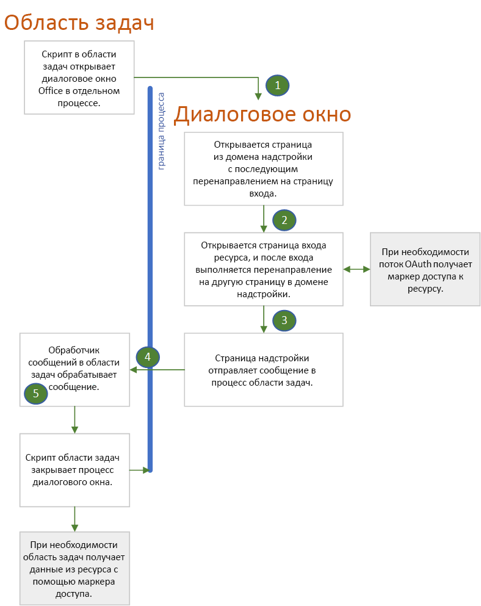

# Проверка подлинности и авторизация с помощью Dialog API для OfficeAuthenticate and authorize with the Office dialog API

Многие удостоверяющие центры, которые также называются службами маркеров безопасности (STS), не разрешают открывать свою страницу входа в элементе iframe.Many identity authorities, also called Secure Token Services (STS), prevent their login page from opening in an iframe. К ним относятся Google, Facebook и службы, защищенные платформой удостоверений Майкрософт (прежнее название — Azure AD 2.0), например учетная запись Майкрософт, Microsoft 365 для образования или рабочая учетная запись.These include Google, Facebook, and services protected by Microsoft Identity Platform (formerly Azure AD V 2.0) such as a Microsoft account, a Microsoft 365 Education or work account, or other common account. При этом возникает проблема с надстройками Office, потому что при работе с надстройкой в **Office в Интернете** область задач является элементом iframe.This creates a problem for Office Add-ins because when the add-in is running in **Office on the web**, the task pane is an iframe. Пользователи надстройки могут войти только в одну из этих служб, если она открывает полностью отдельный экземпляр браузера.Users of an add-in can only login to one of these services if the add-in can open an entirely separate browser instance. Вот почему Office предоставляет [Dialog API для Office](dialog-api-in-office-add-ins.md), а именно метод [displayDialogAsync](/javascript/api/office/office.ui).This is why Office provides its [Office dialog API](dialog-api-in-office-add-ins.md), specifically the [displayDialogAsync](/javascript/api/office/office.ui) method.

> [!NOTE]
> В данной статье предполагается, что вы знакомы с [использованием Dialog API для Office в надстройках Office](dialog-api-in-office-add-ins.md).This article assumes that you are familiar with [Use the Office dialog API in your Office Add-ins](dialog-api-in-office-add-ins.md).

Диалоговое окно, открытое с помощью этого API, имеет указанные ниже характеристики.The dialog box that is opened with this API has the following characteristics:

- Оно [не модальное](https://en.wikipedia.org/wiki/Dialog_box).It is [nonmodal](https://en.wikipedia.org/wiki/Dialog_box).
- Это полностью отдельный экземпляр браузера в области задач. Это означает следующее:It is a completely separate browser instance from the task pane, meaning:
  - В нем есть собственная среда выполнения JavaScript, объект окна и глобальные переменные.It has its own JavaScript runtime environment and window object and global variables.
  - Не существует общей среды выполнения с областью задач.There is no shared execution environment with the task pane.
  - Оно не использует то же хранилище сеанса (свойство [Window.sessionStorage](https://developer.mozilla.org/docs/Web/API/Window/sessionStorage)), что и область задач.It does not share the same session storage (the [Window.sessionStorage](https://developer.mozilla.org/docs/Web/API/Window/sessionStorage) property) as the task pane.
- Первая страница, открытая в диалоговом окне, должна размещаться в том же домене, что и область задач, включая протокол, поддомены и порт, если есть.The first page opened in the dialog box must be hosted in the same domain as the task pane, including protocol, subdomains, and port, if any.
- Из диалогового окна информация может направляться обратно в область задач с помощью метода [messageParent](/javascript/api/office/office.ui#messageparent-message-), однако этот метод можно вызывать только на странице, размещенной в том же домене, что и область задач, включая протокол, поддомены и порт.The dialog box can send information back to the task pane by using the [messageParent](/javascript/api/office/office.ui#messageparent-message-) method, but this method can be called only from a page that is hosted in the same domain as the task pane, including protocol, subdomains, and port.

Если диалоговое окно не является элементом iframe (по умолчанию), оно позволяет открыть страницу входа поставщика удостоверений.When the dialog box is not an iframe (which is the default), it can open the login page of an identity provider. Как показано ниже, характеристики диалогового окна Office определяют, каким образом вы используете библиотеки проверки подлинности и авторизации, такие как MSAL и Passport.As you'll see below, the characteristics of the Office dialog box have implications for how you use authentication or authorization libraries such as MSAL and Passport.

> [!NOTE]
> Вы можете настроить открытие диалогового окна в плавающем iframe. Для этого просто передайте параметр `displayInIframe: true` во время вызова `displayDialogAsync`.There is a way to configure the dialog box to open in a floating iframe: you simply pass the `displayInIframe: true` option in the call to `displayDialogAsync`. *Не* делайте этого, если для входа используется Dialog API для Office.Do *not* do this when you are using the Office dialog API for login.

## Поток проверки подлинности с помощью диалогового окна OfficeAuthentication flow with the Office dialog box

Ниже описан простой типичный поток проверки подлинности.The following is a simple and typical authentication flow. Подробные сведения приведены после схемы.Details are after the diagram.

1. Сначала в диалоговом окне открывается локальная страница или другой ресурс, размещенный в домене надстройки (то есть в том же домене, что и окно области задач).The first page that opens in the dialog box is a page (or other resource) that is hosted in the add-in's domain; that is, the same domain as the task pane window. На этой странице может быть простая надпись "Подождите, мы перенаправляем вас на страницу, где вы сможете войти в учетную запись *ИМЯ_ПОСТАВЩИКА*".This page can have a simple UI that says "Please wait, we are redirecting you to the page where you can sign in to *NAME-OF-PROVIDER*." Код на этой странице создает URL-адрес страницы входа поставщика удостоверений, используя данные, передаваемые диалоговому окну, как описано в разделе [Передача данных диалоговому окну](dialog-api-in-office-add-ins.md#pass-information-to-the-dialog-box), или жестко заданные в файле конфигурации надстройки, например в файле web.config.The code in this page constructs the URL of the identity provider's sign-in page with information that is either passed to the dialog box as described in [Pass information to the dialog box](dialog-api-in-office-add-ins.md#pass-information-to-the-dialog-box) or is hardcoded into a configuration file of the add-in, such as a web.config file.
2. Затем диалоговое окно перенаправляет пользователя на страницу входа.The dialog box window then redirects to the sign-in page. URL-адрес включает параметр запроса, который дает указание поставщику удостоверений после входа пользователя перенаправить диалоговое окно на определенную страницу.The URL includes a query parameter that tells the identity provider to redirect the dialog box window to a specific page after the user signs in. В этой статье мы назовем эту страницу **redirectPage.html**.In this article, we'll call this page **redirectPage.html**. *Эта страница должна быть размещена в том же домене, что и главное окно*, чтобы результаты попытки входа можно было передавать в область задач с помощью вызова `messageParent`.*This must be a page in the same domain as the host window*, so that the results of the sign-in attempt can be passed to the task pane with a call of `messageParent`.
3. Служба поставщика удостоверений обрабатывает входящий запрос GET, поступивший из диалогового окна.The identity provider's service processes the incoming GET request from the dialog box window. Если пользователь уже вошел в систему, она немедленно перенаправляет его на страницу **redirectPage.html** и включает пользовательские данные в параметр запроса.If the user is already signed in, it immediately redirects the window to **redirectPage.html** and includes user data as a query parameter. Если пользователь еще не вошел, в окне появляется страница поставщика для входа.If the user is not already signed in, the provider's sign-in page appears in the window, and the user signs in. Если пользователю не удается войти, большинство поставщиков показывают в диалоговом окне страницу с сообщением об ошибке и не перенаправляют его на страницу **redirectPage.html**.For most providers, if the user cannot sign in successfully, the provider shows an error page in the dialog box window and does not redirect to **redirectPage.html**. Пользователь должен закрыть это окно, нажав кнопку **X** в углу.The user must close the window by selecting the **X** in the corner. Если пользователь успешно входит, диалоговое окно перенаправляется на страницу **redirectPage.html**, а пользовательские данные добавляются в параметр запроса.If the user successfully signs in, the dialog box window is redirected to **redirectPage.html** and user data is included as a query parameter.
4. Когда открывается страница **redirectPage.html**, она вызывает функцию `messageParent`, чтобы сообщить о результате в область панели задач, а также сообщить пользовательские данные или данные об ошибке.When the **redirectPage.html** page opens, it calls `messageParent` to report the success or failure to the task pane page and optionally also report user data or error data. Она также может передавать маркер доступа или сообщать в область задач, что маркер находится в хранилище.Other possible messages include passing an access token or telling the task pane that the token is in storage.
5. На странице области задач запускается событие `DialogMessageReceived`, и его обработчик закрывает диалоговое окно и может дальше обрабатывать сообщение.The `DialogMessageReceived` event fires in the task pane page and its handler closes the dialog box window and may further process of the message.

#### Поддержка нескольких поставщиков удостоверенийSupport multiple identity providers

Если пользователь может выбрать поставщика для входа в надстройку, например учетную запись Майкрософт, Google или Facebook, первой должна открываться локальная страница со списком поставщиков (см. предыдущий раздел). После выбора поставщика происходит создание URL-адреса входа и перенаправление на него.If your add-in gives the user a choice of providers, such as a Microsoft account, Google, or Facebook, you need a local first page (see preceding section) that provides a UI for the user to select a provider. Selection triggers the construction of the sign-in URL and redirection to it.

#### Авторизация надстройки через внешний ресурсAuthorization of the add-in to an external resource

В современном Интернете пользователи и веб-приложения являются субъектами безопасности. In the modern web, users and web applications are security principals. У приложений есть свои удостоверения и разрешения для онлайн-ресурсов, таких как Microsoft 365, Google+, Facebook и LinkedIn.The application has its own identity and permissions to an online resource such as Microsoft 365, Google Plus, Facebook, or LinkedIn. Перед развертыванием приложение регистрируется у поставщика ресурса.The application is registered with the resource provider before it is deployed. Регистрация включает:The registration includes:

- Список разрешений, которые нужны приложению.A list of the permissions that the application needs.
- URL-адрес, на который служба ресурса должна возвращать маркер доступа, когда приложение получает доступ к службе.A URL to which the resource service should return an access token when the application accesses the service.  

Когда пользователь вызывает функцию в приложении, которое получает доступ к его данным в службе ресурса, пользователю будет предложено войти в службу, а затем предоставить приложению необходимые разрешения. Служба затем перенаправляет пользователя на зарегистрированный URL-адрес и передает маркер доступа. Приложение использует маркер доступа для доступа к ресурсам пользователя.When a user invokes a function in the application that accesses the user's data in the resource service, they are prompted to sign in to the service and then prompted to grant the application the permissions it needs to the user's resources. The service then redirects the sign-in window to the previously registered URL and passes the access token. The application uses the access token to access the user's resources.

Вы можете управлять этим процессом с помощью Dialog API для Office, используя поток, похожий на тот, который обеспечивает возможность входа пользователей.You can use the Office dialog API to manage this process by using a flow that is similar to the one described for users to sign in. Отличия:The only differences are:

- Если пользователь не предоставил приложению необходимые разрешения, ему будет предложено сделать это в диалоговом окне после входа.If the user hasn't previously granted the application the permissions it needs, the user is prompted to do so in the dialog box after signing in.
- Диалоговое окно отправляет маркер доступа в главное окно, преобразовывая его в строку с помощью функции `messageParent` или сохраняя его там, откуда главное окно сможет его извлечь (и с помощью `messageParent` сообщает в главное окно о доступности маркера).The dialog box window sends the access token to the host window either by using `messageParent` to send the stringified access token or by storing the access token where the host window can retrieve it (and using `messageParent` to tell the host window that the token is available). Пока срок действия этого маркера не истек, главное окно может использовать его для прямого доступа к ресурсам пользователя без дополнительных запросов.The token has a time limit, but while it lasts, the host window can use it to directly access the user's resources without any further prompting.

Примеры проверки подлинности в надстройках, использующих Dialog API для Office, приводятся в разделе [Примеры](#samples).Some authentication sample add-ins that use the Office dialog API for this purpose are listed in [Samples](#samples).

## Использование библиотек проверки подлинности с помощью диалогового окнаUsing authentication libraries with the dialog box

Диалоговые окна Office и область задач находятся в разных экземплярах браузера и среды выполнения JavaScript, поэтому использование многих библиотек проверки подлинности и авторизации отличается от того, как они используются при выполнении проверки подлинности и авторизации в одном окне.The fact that the Office dialog box and the task pane run in different browser, and JavaScript runtime, instances means that you must use many authentication/authorization libraries in the way that is different from how they are used when authentication and authorization can take place in the same window. В следующих разделах описывается, как *можно* использовать эти библиотеки и какие способы неприменимы. The following sections describe the main ways that you usually cannot use these libraries and the way that you *can* use them.

### Как правило, для хранения маркеров нельзя использовать внутренний кэш библиотеки.You usually cannot use the library's internal cache to store tokens

Обычно библиотеки проверки подлинности хранят маркер доступа в кэше в памяти. Typically, auth-related libraries provide an in-memory cache to store the access token. При последующих обращениях к поставщику ресурсов (например, Google, Microsoft Graph, Facebook и т. д.) библиотека сначала проверит, действителен ли маркер в кэше.If subsequent calls to the resource provider (such as Google, Microsoft Graph, Facebook, etc.) are made, the library will first check to see if the token in its cache is expired. Если срок его действия не истек, библиотека возвращает кэшированный маркер и не совершает повторно круговой путь в STS за новым маркером.If it is unexpired, the library returns the cached token rather than making another round-trip to the STS for a new token. Этот шаблон не поддерживается в надстройках Office. Так как вход выполняется в экземпляре браузера в диалоговом окне Office, кэш маркера находится в этом экземпляре.But this pattern is not usable in Office Add-ins. Since the login occurs in the Office dialog box's browser instance, the token cache is in that instance.

Кроме того, библиотека обычно предоставляет как интерактивные, так и автоматические методы для получения маркера.Closely related to this is the fact that a library will typically provide both interactive and "silent" methods for getting a token. Если вы выполняете проверку подлинности и звонки для передачи данных в ресурс в одном экземпляре браузера, код вызывает автоматический метод, чтобы получить маркер непосредственно перед добавлением его в звонок для передачи данных.When you can do both the authentication and the data calls to the resource in the same browser instance, your code calls the silent method to obtain a token just before your code adds the token to the data call. Автоматический метод проверяет, есть ли в кэше действительный маркер, и возвращает его.The silent method checks for an unexpired token in the cache and returns it, if there is one. В противном случае автоматический метод вызывает интерактивный метод, который перенаправляет на вход в STS.Otherwise, the silent method calls the interactive method which redirects to the STS's login. После входа в систему интерактивный метод возвращает маркер, а также кэширует его в памяти.After login completes, the interactive method returns the token, but also caches it in memory. Но если используется Dialog API для Office, вызовы данных из ресурса, которые должны вызывать автоматический метод, находятся в экземпляре браузера в области задач.But when the Office dialog API is being used, the data calls to the resource, which would call the silent method, are in the task pane's browser instance. Кэш маркеров библиотеки не существует в этом экземпляре.The library's token cache does not exist in that instance.

В качестве альтернативы экземпляр браузера в диалоговом окне надстройки может напрямую вызывать интерактивный метод работы библиотеки.As an alternative, your add-in's dialog box browser instance can directly call the library's interactive method. Если этот метод возвращает маркер, код должен явным образом сохранить маркер в определенном расположении, таком как локальное хранилище\* или база данных на стороне сервера, откуда экземпляр браузера в области задач может извлечь его.When that method returns a token, your code must explicitly store the token someplace where the task pane's browser instance can retrieve it, such as Local Storage\* or a server-side database. Кроме того, можно передать маркер в область задач, используя `messageParent` метод.Another option is to pass the token to the task pane with the `messageParent` method. Это можно сделать только в том случае, если интерактивный метод сохранил маркер доступа в таком расположении, в котором код может прочитать его.This alternative is only possible if the interactive method stores the access token in a place where your code can read it. Иногда интерактивный метод работы библиотеки сохраняет маркер в частном свойстве объекта, недоступном для вашего кода.Sometimes a library's interactive method is designed to store the token in a private property of an object that is inaccessible to your code.

> [!NOTE]
> \* Существует ошибка, влияющая на вашу стратегию обработки маркеров.\* There is a bug that will effect your strategy for token handling. Если надстройка работает в **Office в Интернете** с использованием браузера Safari или Microsoft Edge, у диалогового окна и области задач нет одного общего локального хранилища, поэтому его нельзя использовать для связи между ними.If the add-in is running in **Office on the web** in either the Safari or Edge browser, the dialog box and task pane do not share the same Local Storage, so it cannot be used to communicate between them.

### Как правило, невозможно использовать объект библиотеки в контексте проверки подлинности.You usually cannot use the library's "auth context" object

Часто библиотека проверки подлинности использует метод, позволяющий получить маркер в интерактивном режиме, а также создать объект в контексте проверки подлинности, возвращаемый методом.Often, an auth-related library has a method that both obtains a token interactively and also creates an "auth-context" object which the method returns. Маркер — это свойство объекта (которое может быть частным и недоступным непосредственно из кода).The token is a property of the object (possibly private and inaccessible directly from your code). У этого объекта есть методы получения данных из ресурса.That object has the methods that get data from the resource. Они включают маркер в HTTP-запросах, которые они выполняют к поставщику ресурсов (например, Google, Microsoft Graph, Facebook и т. д.).These methods include the token in the HTTP Requests that they make to the resource provider (such as Google, Microsoft Graph, Facebook, etc.).

Такие объекты в контексте проверки подлинности и методы их создания не поддерживаются в надстройках Office. Так как вход выполняется в экземпляре браузера в диалоговом окне Office, там же должен быть создан и объект.These auth-context objects, and the methods that create them, are not usable in Office Add-ins. Since the login occurs in the Office dialog box's browser instance, the object would have to be created there. Но данные, поступающие в ресурс, находятся в экземпляре браузера в области задач, и вам не удастся передать объект из одного экземпляра в другой.But the data calls to the resource are in the task pane browser instance and there is no way to get the object from one instance to another. Например, невозможно передать объект методом `messageParent`, так как `messageParent` может передавать только строки или логические значения.For example, you cannot pass the object with `messageParent` because `messageParent` can only pass strings or boolean values. Объект JavaScript, содержащий методы, нельзя надежно преобразовать в строку.A JavaScript object with methods cannot be reliably stringified.

### Использование библиотек с помощью Dialog API для OfficeHow you can use libraries with the Office dialog API

Большинство библиотек в дополнение к монолитным объектам в контексте проверки подлинности или вместо них обеспечивает API более низкого уровня абстракции, разрешая коду создавать менее монолитные вспомогательные объекты.In addition to, or instead of, monolithic "auth context" objects, most libraries provide APIs at a lower level of abstraction that enable your code to create less monolithic helper objects. Например, [MSAL.NET](https://github.com/AzureAD/microsoft-authentication-library-for-dotnet/wiki#conceptual-documentation) версииFor example, [MSAL.NET](https://github.com/AzureAD/microsoft-authentication-library-for-dotnet/wiki#conceptual-documentation) v. 3.x.x имеет API для создания URL-адреса входа и еще один API, который создает объект AuthResult, содержащий маркер доступа в свойстве, доступном для вашего кода.3.x.x has an API to construct a login URL, and another API that constructs an AuthResult object that contains an access token in a property that is accessible to your code. Примеры MSAL.NET в надстройке Office см. в статьях [Надстройка Office в Microsoft Graph ASP.NET](https://github.com/OfficeDev/PnP-OfficeAddins/tree/master/Samples/auth/Office-Add-in-Microsoft-Graph-ASPNET) и [Надстройка Outlook в Microsoft Graph ASP.NET](https://github.com/OfficeDev/PnP-OfficeAddins/tree/master/Samples/auth/Outlook-Add-in-Microsoft-Graph-ASPNET).For examples of MSAL.NET in an Office Add-in see: [Office Add-in Microsoft Graph ASP.NET](https://github.com/OfficeDev/PnP-OfficeAddins/tree/master/Samples/auth/Office-Add-in-Microsoft-Graph-ASPNET) and [Outlook Add-in Microsoft Graph ASP.NET](https://github.com/OfficeDev/PnP-OfficeAddins/tree/master/Samples/auth/Outlook-Add-in-Microsoft-Graph-ASPNET). Пример использования [msal.js](https://github.com/AzureAD/microsoft-authentication-library-for-js) в надстройке см. в статье [Надстройка Office в Microsoft Graph React](https://github.com/OfficeDev/PnP-OfficeAddins/tree/master/Samples/auth/Office-Add-in-Microsoft-Graph-React).For an example of using [msal.js](https://github.com/AzureAD/microsoft-authentication-library-for-js) in an add-in, see [Office Add-in Microsoft Graph React](https://github.com/OfficeDev/PnP-OfficeAddins/tree/master/Samples/auth/Office-Add-in-Microsoft-Graph-React).

Дополнительные сведения о библиотеках проверки подлинности и авторизации см. в статье[Microsoft Graph — Рекомендуемые библиотеки](authorize-to-microsoft-graph-without-sso.md#recommended-libraries-and-samples) и [Другие внешние службы: библиотеки](auth-external-add-ins.md#libraries).For more information about authentication and authorization libraries, see [Microsoft Graph: Recommended libraries](authorize-to-microsoft-graph-without-sso.md#recommended-libraries-and-samples) and [Other external services: Libraries](auth-external-add-ins.md#libraries).

## ПримерыSamples

- [Надстройка Office в Microsoft Graph ASP.NET](https://github.com/OfficeDev/PnP-OfficeAddins/tree/master/Samples/auth/Office-Add-in-Microsoft-Graph-ASPNET) — это надстройка на основе ASP.NET (Excel, Word или PowerPoint), использующая библиотеку MSAL.NET и поток кода авторизации для входа и получения маркера доступа к данным Microsoft Graph.[Office Add-in Microsoft Graph ASP.NET](https://github.com/OfficeDev/PnP-OfficeAddins/tree/master/Samples/auth/Office-Add-in-Microsoft-Graph-ASPNET): An ASP.NET based add-in (Excel, Word, or PowerPoint) that uses the MSAL.NET library and the Authorization Code Flow to log in and get an access token for Microsoft Graph data.
- [Надстройка Outlook в Microsoft Graph ASP.NET](https://github.com/OfficeDev/PnP-OfficeAddins/tree/master/Samples/auth/Outlook-Add-in-Microsoft-Graph-ASPNET) — это такая же надстройка, как описано выше, но относящаяся к приложению Outlook.[Outlook Add-in Microsoft Graph ASP.NET](https://github.com/OfficeDev/PnP-OfficeAddins/tree/master/Samples/auth/Outlook-Add-in-Microsoft-Graph-ASPNET): Just like the one above, but the Office application is Outlook.
- [Надстройка Office в Microsoft Graph React](https://github.com/OfficeDev/PnP-OfficeAddins/tree/master/Samples/auth/Office-Add-in-Microsoft-Graph-React) — это надстройка на основе NodeJS (Excel, Word или PowerPoint), использующая библиотеку msal.js и неявный поток для входа и получения маркера доступа к данным Microsoft Graph.[Office Add-in Microsoft Graph React](https://github.com/OfficeDev/PnP-OfficeAddins/tree/master/Samples/auth/Office-Add-in-Microsoft-Graph-React): A NodeJS based add-in (Excel, Word, or PowerPoint) that uses the msal.js library and the Implicit Flow to log in and get an access token for Microsoft Graph data.

Дополнительные сведения см. в указанных ниже статьях.For more information, see:
- [Авторизация внешних служб в надстройке OfficeAuthorize external services in your Office Add-in](auth-external-add-ins.md)
- [Использование Dialog API для Office в надстройках OfficeUse the Office dialog API in your Office Add-ins](dialog-api-in-office-add-ins.md)
