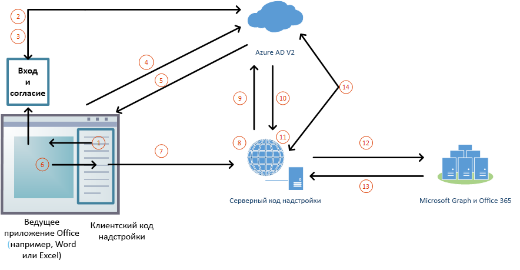

# Авторизация в Microsoft Graph с помощью единого входа (предварительная версия)

Пользователи входят в Office (в Интернете, на мобильных устройствах и настольных компьютерах), используя личную учетную запись Майкрософт либо рабочую или учебную учетную запись (Office 365). Чтобы надстройка Office могла получить авторизованный доступ к [Microsoft Graph](https://developer.microsoft.com/graph/docs), лучше всего использовать учетные данные для входа пользователя в Office. Это позволяет пользователям получить доступ к своим данным Microsoft Graph без необходимости повторного входа. 

> [!NOTE]
> В настоящее время API единого входа поддерживается для Word, Excel, Outlook и PowerPoint в тестовом режиме. Дополнительные сведения о текущей поддержке API единого входа см. в статье [Наборы обязательных элементов API идентификации](/office/dev/add-ins/reference/requirement-sets/identity-api-requirement-sets). Если вы работаете с надстройкой Outlook, обязательно включите современную проверку подлинности для клиента Office 365. Инструкции см. в [этой статье](https://social.technet.microsoft.com/wiki/contents/articles/32711.exchange-online-how-to-enable-your-tenant-for-modern-authentication.aspx).

## Архитектура надстройки для единого входа и Microsoft Graph

Помимо страниц и кода JavaScript веб-приложения, в надстройке также должны размещаться (с тем же [полным доменном именем](/windows/desktop/DNS/f-gly#_dns_fully_qualified_domain_name_fqdn__gly)) один или несколько веб-API, которые будут получать маркер доступа и отправлять запросы к Microsoft Graph.

Манифест надстройки содержит разметку, которая указывает, как надстройка регистрируется в конечной точке Azure Active Directory (Azure AD) версии 2.0, а также задает необходимые надстройке разрешения для Microsoft Graph.

### Принцип работы во время выполнения

На приведенной ниже схеме показан процесс входа в систему и получения доступа к Microsoft Graph.

1. В надстройке JavaScript вызывает новый API Office.js [getAccessTokenAsync](/office/dev/add-ins/develop/sso-in-office-add-ins#sso-api-reference). Он указывает ведущему приложению Office, что необходимо получить маркер доступа к надстройке. (Далее он будет называться **маркером доступа к начальной загрузке**, поскольку в этом процессе он позже будет заменен вторым маркером. Пример раскодированного маркера доступа к начальной загрузке см. в разделе [Пример маркера доступа](sso-in-office-add-ins.md#example-access-token)).
1. Если вход в Office не выполнен, в ведущем приложении открывается всплывающее окно, в котором пользователю предлагается войти.
1. Если пользователь запускает надстройку в первый раз, ему предлагается дать согласие.
1. Ведущее приложение Office запрашивает **маркер доступа к начальной загрузке** у конечной точки Azure AD версии 2.0 для текущего пользователя.
1. Azure AD отправляет маркер начальной загрузки ведущему приложению Office.
1. Ведущее приложение Office отправляет надстройке **маркер доступа к начальной загрузке** в составе объекта результата, возвращенного при вызове метода `getAccessTokenAsync`.
1. Код JavaScript надстройки отправляет HTTP-запрос к веб-API с тем же полным доменным именем, что и у надстройки. Этот запрос включает **маркер доступа к начальной загрузке** в качестве подтверждения авторизации.  
1. Серверный код проверяет входящий **маркер доступа к начальной загрузке**.
1. Серверный код использует поток "от имени" (определенный в [OAuth2 Token Exchange](https://tools.ietf.org/html/draft-ietf-oauth-token-exchange-02) и [сценарии аутентификации в Azure из управляющей программы или серверного приложения в веб-API](/azure/active-directory/develop/active-directory-authentication-scenarios)), чтобы получить маркер доступа в Microsoft Graph в обмен на маркер доступа к начальной загрузке.
1. Azure AD возвращает надстройке маркер доступа в Microsoft Graph (и маркер обновления, если надстройка запрашивает разрешение *offline_access*).
1. Серверный код кэширует маркер доступа в Microsoft Graph.
1. Серверный код отправляет запросы к Microsoft Graph и включает маркер доступа в Microsoft Graph.
1. Microsoft Graph возвращает данные надстройке, а она может передать их своему пользовательскому интерфейсу.
1. Когда маркер доступа в Microsoft Graph истекает, серверный код может использовать свой маркер обновления, чтобы получить новый маркер доступа в Microsoft Graph.

## Разработка надстройки с единым входом для Microsoft Graph

Надстройка с доступом в Microsoft Graph разрабатывается так же, как и любая другая надстройка с единым входом. Подробное описание см. в статье [Включение единого входа для надстроек Office](/office/dev/add-ins/develop/sso-in-office-add-ins). Разница заключается в том, что у надстройки обязательно должен быть серверный веб-API, а также в использовании термина "маркер доступа к начальной загрузке" вместо термина "маркер доступа" из указанной статьи. 

В зависимости от языка и платформы могут быть доступны библиотеки, которые упростят создание серверного кода. Ваш код должен выполнять следующее:

* проверять маркер доступа к начальной загрузке надстройки, полученный от созданного ранее обработчика маркеров. Дополнительные сведения см. в разделе [Проверка маркера доступа](sso-in-office-add-ins.md#validate-the-access-token); 
* запускать поток "от имени" путем вызова конечной точки Azure AD версии 2.0, включающего маркер доступа к начальной загрузке, некоторые метаданные пользователя и учетные данные надстройки (идентификатор и секрет);
* поместить в кэш возвращенный маркер доступа в Microsoft Graph. Дополнительные сведения об этом потоке см. в статье [Azure Active Directory версии 2.0 и поток "от имени" OAuth 2.0](/azure/active-directory/develop/active-directory-v2-protocols-oauth-on-behalf-of);
* создать один или несколько методов веб-API, которые получают данные Microsoft Graph, передавая кэшированный маркер доступа в Microsoft Graph.

> [!NOTE]
> Примеры раскодированных маркеров доступа в Microsoft Graph, которые были получены потоком "от имени", см. в статье [Azure Active Directory версии 2.0 и поток "от имени" OAuth 2.0](/azure/active-directory/develop/active-directory-v2-protocols-oauth-on-behalf-of).

Подробные пошаговые инструкции и сценарии см. в следующих статьях:

* [Создание надстройки Office на платформе Node.js с использованием единого входа](create-sso-office-add-ins-nodejs.md)
* [Создание надстройки Office на платформе ASP.NET с использованием единого входа](create-sso-office-add-ins-aspnet.md)
* [Сценарий: реализация единого входа для службы в надстройке Outlook](/outlook/add-ins/implement-sso-in-outlook-add-in)
