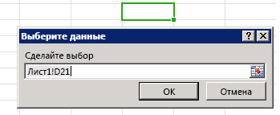

# <a name="bind-to-regions-in-a-document-or-spreadsheet"></a><span data-ttu-id="f0312-103">Привязка к областям в документе или электронной таблице</span><span class="sxs-lookup"><span data-stu-id="f0312-103">Bind to regions in a document or spreadsheet</span></span>

<span data-ttu-id="f0312-p101">Благодаря доступу к данным на основе привязок контентные надстройки и надстройки области задач могут согласованно получать доступ к определенной области документа или электронной таблицы с помощью идентификатора. Прежде всего надстройке необходимо создать привязку, вызвав один из методов, сопоставляющих часть документа с уникальным идентификатором: [addFromPromptAsync], [addFromSelectionAsync] или [addFromNamedItemAsync]. После создания привязки надстройка может использовать предоставленный идентификатор для доступа к данным, содержащимся в сопоставленной области документа или электронной таблицы. При создании привязки надстройке предоставляется указанное ниже значение.</span><span class="sxs-lookup"><span data-stu-id="f0312-p101">Binding-based data access enables content and task pane add-ins to consistently access a particular region of a document or spreadsheet through an identifier. The add-in first needs to establish the binding by calling one of the methods that associates a portion of the document with a unique identifier: [addFromPromptAsync], [addFromSelectionAsync], or [addFromNamedItemAsync]. After the binding is established, the add-in can use the provided identifier to access the data contained in the associated region of the document or spreadsheet. Creating bindings provides the following value to your add-in:</span></span>

- <span data-ttu-id="f0312-108">Разрешает доступ к общим структурам данных в поддерживаемых приложениях Office, таким как: таблицы, диапазоны или текст (связанная последовательность знаков).</span><span class="sxs-lookup"><span data-stu-id="f0312-108">Permits access to common data structures across supported Office applications, such as: tables, ranges, or text (a contiguous run of characters).</span></span>
- <span data-ttu-id="f0312-109">Позволяет производить операции чтения или записи без необходимости выделения пользователем фрагмента.</span><span class="sxs-lookup"><span data-stu-id="f0312-109">Enables read/write operations without requiring the user to make a selection.</span></span>
- <span data-ttu-id="f0312-p102">Устанавливает отношение между надстройкой и данными в документе. Привязки сохраняются в документе и могут использоваться позже.</span><span class="sxs-lookup"><span data-stu-id="f0312-p102">Establishes a relationship between the add-in and the data in the document. Bindings are persisted in the document, and can be accessed at a later time.</span></span>

<span data-ttu-id="f0312-p103">Установка привязки также позволяет подписываться на данные и выбирать изменения событий, относящиеся к конкретной области документа или электронной таблицы. Это означает, что надстройка уведомляется только об изменениях, происходящих внутри данной конкретной области, в отличие от изменений, затрагивающих в целом весь документ или электронную таблицу.</span><span class="sxs-lookup"><span data-stu-id="f0312-p103">Establishing a binding also allows you to subscribe to data and selection change events that are scoped to that particular region of the document or spreadsheet. This means that the add-in is only notified of changes that happen within the bound region as opposed to general changes across the whole document or spreadsheet.</span></span>

<span data-ttu-id="f0312-p104">Объект [Bindings] предоставляет метод [getAllAsync], открывающий доступ к полному набору привязок, установленных в документе или на листе. Доступ к отдельной привязке можно получить по ее идентификатору с помощью метода Bindings.[getByIdAsync] или [Office.select]. Вы можете устанавливать новые привязки или удалять существующие с помощью одного из следующих методов объекта [Bindings]: [addFromSelectionAsync], [addFromPromptAsync], [addFromNamedItemAsync] или [releaseByIdAsync].</span><span class="sxs-lookup"><span data-stu-id="f0312-p104">The [Bindings] object exposes a [getAllAsync] method that gives access to the set of all bindings established on the document or spreadsheet. An individual binding can be accessed by its ID using either the Bindings.[getByIdAsync] or [Office.select] methods. You can establish new bindings as well as remove existing ones by using one of the following methods of the [Bindings] object: [addFromSelectionAsync], [addFromPromptAsync], [addFromNamedItemAsync], or [releaseByIdAsync].</span></span>

## <a name="binding-types"></a><span data-ttu-id="f0312-117">Типы привязок</span><span class="sxs-lookup"><span data-stu-id="f0312-117">Binding types</span></span>

<span data-ttu-id="f0312-118">Существует [три различных типа привязок][Office. BindingType] , указанных с помощью параметра _BindingType_ при создании привязки с помощью методов [addFromSelectionAsync], [addFromPromptAsync] и [addFromNamedItemAsync] :</span><span class="sxs-lookup"><span data-stu-id="f0312-118">There are [three different types of bindings][Office.BindingType] that you specify with the _bindingType_ parameter when you create a binding with the [addFromSelectionAsync], [addFromPromptAsync] or [addFromNamedItemAsync] methods:</span></span>

1. <span data-ttu-id="f0312-119">**[Текстовая привязка][TextBinding]**. Выполняет привязку к области документа, которая может быть представлена как текст.</span><span class="sxs-lookup"><span data-stu-id="f0312-119">**[Text Binding][TextBinding]** - Binds to a region of the document that can be represented as text.</span></span>

    <span data-ttu-id="f0312-p105">В Word поддерживается большинство связанных выделений, тогда как в Excel для привязки текста можно использовать только выделения отдельных ячеек. Excel поддерживает только обычный текст, а Word — три формата: обычный текст, HTML и Open XML для Office.</span><span class="sxs-lookup"><span data-stu-id="f0312-p105">In Word, most contiguous selections are valid, while in Excel only single cell selections can be the target of a text binding. In Excel, only plain text is supported. In Word, three formats are supported: plain text, HTML, and Open XML for Office.</span></span>

2. <span data-ttu-id="f0312-123">**[Привязка матрицы][MatrixBinding]** — привязывается к фиксированной области документа, содержащей табличные данные без заголовков. Данные в привязке матрицы записываются или считываются как двухмерный **массив**, который в JavaScript реализован как массив массивов.</span><span class="sxs-lookup"><span data-stu-id="f0312-123">**[Matrix Binding][MatrixBinding]** - Binds to a fixed region of a document that contains tabular data without headers.Data in a matrix binding is written or read as a two dimensional **Array**, which in JavaScript is implemented as an array of arrays.</span></span> <span data-ttu-id="f0312-124">Например, две строки значений **string** в двух столбцах можно записать или прочитать как `[['a', 'b'], ['c', 'd']]`, а один столбец, состоящий из трех строк, — как `[['a'], ['b'], ['c']]`.</span><span class="sxs-lookup"><span data-stu-id="f0312-124">For example, two rows of **string** values in two columns can be written or read as `[['a', 'b'], ['c', 'd']]`, and a single column of three rows can be written or read as `[['a'], ['b'], ['c']]`.</span></span>

    <span data-ttu-id="f0312-p107">В Excel для установки матричной привязки может использоваться любое связанное выделение ячеек. В Word матричная привязка поддерживается только таблицами.</span><span class="sxs-lookup"><span data-stu-id="f0312-p107">In Excel, any contiguous selection of cells can be used to establish a matrix binding. In Word, only tables support matrix binding.</span></span>

3. <span data-ttu-id="f0312-p108">**[Табличная привязка][TableBinding]**. Выполняет привязку к области документа, содержащей таблицу с заголовками. Данные в табличной привязке записываются или считываются как объект [TableData](/javascript/api/office/office.tabledata). Объект `TableData` предоставляет данные с помощью свойств `headers` и `rows`.</span><span class="sxs-lookup"><span data-stu-id="f0312-p108">**[Table Binding][TableBinding]** - Binds to a region of a document that contains a table with headers.Data in a table binding is written or read as a [TableData](/javascript/api/office/office.tabledata) object. The `TableData` object exposes the data through the `headers` and `rows` properties.</span></span>

    <span data-ttu-id="f0312-p109">Любая таблица Excel или Word может быть основой для табличной привязки. После создания табличной привязки каждая новая строка или столбец, добавляемые пользователем в таблицу, автоматически включаются в привязку.</span><span class="sxs-lookup"><span data-stu-id="f0312-p109">Any Excel or Word table can be the basis for a table binding. After you establish a table binding, each new row or column a user adds to the table is automatically included in the binding.</span></span>

<span data-ttu-id="f0312-131">После создания привязки с помощью одного из трех методов "Аддфром" `Bindings` объекта можно работать с данными и свойствами привязки с помощью методов соответствующего объекта: [MatrixBinding], [TableBinding]или [TextBinding].</span><span class="sxs-lookup"><span data-stu-id="f0312-131">After a binding is created by using one of the three "addFrom" methods of the `Bindings` object, you can work with the binding's data and properties by using the methods of the corresponding object: [MatrixBinding], [TableBinding], or [TextBinding].</span></span> <span data-ttu-id="f0312-132">Все три объекта наследуют методы [getDataAsync] и [setDataAsync] объекта `Binding`, позволяющие работать со связанными данными.</span><span class="sxs-lookup"><span data-stu-id="f0312-132">All three of these objects inherit the [getDataAsync] and [setDataAsync] methods of the `Binding` object that enable you to interact with the bound data.</span></span>

> [!NOTE]
> <span data-ttu-id="f0312-p111">**В каких случаях следует использовать матричные и табличные привязки?** Если табличные данные, с которыми вы работаете, содержат строку итогов, а сценарию надстройки необходимо получить доступ к значениям в этой строке или проверить, находится ли в ней выбранный пользователем фрагмент, то необходимо использовать матричную привязку. Если установить привязку к табличным данным, содержащим строку итогов, то значения свойства [TableBinding.rowCount], а также свойств `rowCount` и `startRow` объекта [BindingSelectionChangedEventArgs] в обработчиках событий не будут отражать строку итогов. Чтобы обойти это ограничение, необходимо установить матричную привязку для работы со строкой итогов.</span><span class="sxs-lookup"><span data-stu-id="f0312-p111">**When should you use matrix versus table bindings?** When the tabular data you are working with contains a total row, you must use a matrix binding if your add-in's script needs to access values in the total row or detect that the user's selection is in the total row. If you establish a table binding for tabular data that contains a total row, the [TableBinding.rowCount] property and the `rowCount` and `startRow` properties of the [BindingSelectionChangedEventArgs] object in event handlers won't reflect the total row in their values. To work around this limitation, you must use establish a matrix binding to work with the total row.</span></span>

## <a name="add-a-binding-to-the-users-current-selection"></a><span data-ttu-id="f0312-137">Добавление привязки к текущему фрагменту, выделенному пользователем</span><span class="sxs-lookup"><span data-stu-id="f0312-137">Add a binding to the user's current selection</span></span>

<span data-ttu-id="f0312-138">В приведенном ниже примере показано, как добавить текстовую привязку с именем `myBinding` к текущему выделенному фрагменту в документе с помощью метода [addFromSelectionAsync].</span><span class="sxs-lookup"><span data-stu-id="f0312-138">The following example shows how to add a text binding called  `myBinding` to the current selection in a document by using the [addFromSelectionAsync] method.</span></span>

```js
Office.context.document.bindings.addFromSelectionAsync(Office.BindingType.Text, { id: 'myBinding' }, function (asyncResult) {
    if (asyncResult.status == Office.AsyncResultStatus.Failed) {
        write('Action failed. Error: ' + asyncResult.error.message);
    } else {
        write('Added new binding with type: ' + asyncResult.value.type + ' and id: ' + asyncResult.value.id);
    }
});

// Function that writes to a div with id='message' on the page.
function write(message){
    document.getElementById('message').innerText += message; 
}
```

<span data-ttu-id="f0312-p112">В этом примере указанным типом привязки является текст. Это означает, что для выделенного фрагмента будет создан объект [TextBinding]. Различные типы привязок предоставляют различные данные и операции. [Office.BindingType] — это перечисление доступных значений типов привязки.</span><span class="sxs-lookup"><span data-stu-id="f0312-p112">In this example, the specified binding type is text. This means that a [TextBinding] will be created for the selection. Different binding types expose different data and operations. [Office.BindingType] is an enumeration of available binding type values.</span></span>

<span data-ttu-id="f0312-p113">Вторым дополнительным параметром является объект, который указывает идентификатор новой создаваемой привязки. Если идентификатор не указан, он создается автоматически.</span><span class="sxs-lookup"><span data-stu-id="f0312-p113">The second optional parameter is an object that specifies the ID of the new binding being created. If an ID is not specified, one is generated automatically.</span></span>

<span data-ttu-id="f0312-p114">Анонимная функция, передаваемая функции в качестве конечного параметра _callback_, выполняется по завершении создания привязки. Функция вызывается с использованием параметра `asyncResult`, предоставляющего доступ к объекту [AsyncResult], который сообщает состояние вызова. Свойство `AsyncResult.value` содержит ссылку на объект [Binding] того типа, который указан для новой привязки. С помощью объекта [Binding] можно получать и задавать данные.</span><span class="sxs-lookup"><span data-stu-id="f0312-p114">The anonymous function that is passed into the function as the final  _callback_ parameter is executed when the creation of the binding is complete. The function is called with a single parameter, `asyncResult`, which provides access to an [AsyncResult] object that provides the status of the call. The `AsyncResult.value` property contains a reference to a [Binding] object of the type that is specified for the newly created binding. You can use this [Binding] object to get and set data.</span></span>

## <a name="add-a-binding-from-a-prompt"></a><span data-ttu-id="f0312-149">Добавление привязки по запросу</span><span class="sxs-lookup"><span data-stu-id="f0312-149">Add a binding from a prompt</span></span>

<span data-ttu-id="f0312-p115">В приведенном ниже примере показано, как добавить текстовую привязку с именем `myBinding`, используя метод [addFromPromptAsync]. Этот метод позволяет пользователю указать диапазон для привязки с помощью встроенного в приложение запроса на выбор диапазона.</span><span class="sxs-lookup"><span data-stu-id="f0312-p115">The following example shows how to add a text binding called  `myBinding` by using the [addFromPromptAsync] method. This method lets the user specify the range for the binding by using the application's built-in range selection prompt.</span></span>

```js
function bindFromPrompt() {
    Office.context.document.bindings.addFromPromptAsync(Office.BindingType.Text, { id: 'myBinding' }, function (asyncResult) {
        if (asyncResult.status == Office.AsyncResultStatus.Failed) {
            write('Action failed. Error: ' + asyncResult.error.message);
        } else {
            write('Added new binding with type: ' + asyncResult.value.type + ' and id: ' + asyncResult.value.id);
        }
    });
}

// Function that writes to a div with id='message' on the page.
function write(message){
    document.getElementById('message').innerText += message;
}
```

<span data-ttu-id="f0312-p116">В этом примере указанным типом привязки является текст. Это означает, что для выделенного фрагмента, указанного пользователем в окне ввода, будет создан объект [TextBinding].</span><span class="sxs-lookup"><span data-stu-id="f0312-p116">In this example, the specified binding type is text. This means that a [TextBinding] will be created for the selection that the user specifies in the prompt.</span></span>

<span data-ttu-id="f0312-p117">Вторым параметром является объект, который содержит идентификатор новой создаваемой привязки. Если идентификатор не указан, он создается автоматически.</span><span class="sxs-lookup"><span data-stu-id="f0312-p117">The second parameter is an object that contains the ID of the new binding being created. If an ID is not specified, one is generated automatically.</span></span>

<span data-ttu-id="f0312-156">Анонимная функция, передаваемая функции в качестве третьего параметра _обратного вызова_ , выполняется при завершении создания привязки.</span><span class="sxs-lookup"><span data-stu-id="f0312-156">The anonymous function passed into the function as the third _callback_ parameter is executed when the creation of the binding is complete.</span></span> <span data-ttu-id="f0312-157">При выполнении функции обратного вызова объект [AsyncResult] содержит сведения о состоянии вызова и только что созданную привязку.</span><span class="sxs-lookup"><span data-stu-id="f0312-157">When the callback function executes, the [AsyncResult] object contains the status of the call and the newly created binding.</span></span>

<span data-ttu-id="f0312-158">На рис. 1 показано встроенное окно запроса выбора диапазона в Excel.</span><span class="sxs-lookup"><span data-stu-id="f0312-158">Figure 1 shows the built-in range selection prompt in Excel.</span></span>

<span data-ttu-id="f0312-159">*Рис. 1. Пользовательский интерфейс выбора данных в Excel*</span><span class="sxs-lookup"><span data-stu-id="f0312-159">*Figure 1. Excel Select Data UI*</span></span>



## <a name="add-a-binding-to-a-named-item"></a><span data-ttu-id="f0312-161">Добавление привязки к именованному элементу</span><span class="sxs-lookup"><span data-stu-id="f0312-161">Add a binding to a named item</span></span>

<span data-ttu-id="f0312-162">В приведенном ниже примере показано, как добавить привязку к существующему `myRange` именованному элементу как привязку матрицы с помощью метода [addFromNamedItemAsync] и назначить привязку `id` как "myMatrix".</span><span class="sxs-lookup"><span data-stu-id="f0312-162">The following example shows how to add a binding to the existing `myRange` named item as a "matrix" binding by using the [addFromNamedItemAsync] method, and assigns the binding's `id` as "myMatrix".</span></span>

```js
function bindNamedItem() {
    Office.context.document.bindings.addFromNamedItemAsync("myRange", "matrix", {id:'myMatrix'}, function (result) {
        if (result.status == 'succeeded'){
            write('Added new binding with type: ' + result.value.type + ' and id: ' + result.value.id);
            }
        else
            write('Error: ' + result.error.message);
    });
}

// Function that writes to a div with id='message' on the page.
function write(message){
    document.getElementById('message').innerText += message; 
}

```

<span data-ttu-id="f0312-163">**Для Excel** `itemName` параметр метода [addFromNamedItemAsync] может ссылаться на существующий именованный диапазон, диапазон, указанный `A1` стилем ссылки `("A1:A3")` или таблицей.</span><span class="sxs-lookup"><span data-stu-id="f0312-163">**For Excel**, the `itemName` parameter of the [addFromNamedItemAsync] method can refer to an existing named range, a range specified with the `A1` reference style `("A1:A3")`, or a table.</span></span> <span data-ttu-id="f0312-164">По умолчанию при добавлении таблиц в Excel имя "Table1" назначается первой добавленной таблице, "Table2" — второй таблице и так далее.</span><span class="sxs-lookup"><span data-stu-id="f0312-164">By default, adding a table in Excel assigns the name "Table1" for the first table you add, "Table2" for the second table you add, and so on.</span></span> <span data-ttu-id="f0312-165">Чтобы присвоить понятное имя таблице в пользовательском интерфейсе Excel, используйте `Table Name` свойство в разделе **Работа с таблицами |** Вкладка "Конструктор" на ленте.</span><span class="sxs-lookup"><span data-stu-id="f0312-165">To assign a meaningful name for a table in the Excel UI, use the `Table Name` property on the **Table Tools | Design** tab of the ribbon.</span></span>

> [!NOTE]
> <span data-ttu-id="f0312-166">В Excel при указании таблицы в качестве именованного элемента необходимо полностью указать имя листа в имени таблицы в следующем формате: `"Sheet1!Table1"`</span><span class="sxs-lookup"><span data-stu-id="f0312-166">In Excel, when specifying a table as a named item, you must fully qualify the name to include the worksheet name in the name of the table in this format: `"Sheet1!Table1"`</span></span>

<span data-ttu-id="f0312-167">В приведенном ниже примере показано, как создать привязку в Excel к первым трем ячейкам в столбце A ( `"A1:A3"` ), назначить идентификатор `"MyCities"` , а затем записать три названия городов в эту привязку.</span><span class="sxs-lookup"><span data-stu-id="f0312-167">The following example creates a binding in Excel to the first three cells in column A ( `"A1:A3"`), assigns the id `"MyCities"`, and then writes three city names to that binding.</span></span>

```js
 function bindingFromA1Range() {
    Office.context.document.bindings.addFromNamedItemAsync("A1:A3", "matrix", {id: "MyCities" },
        function (asyncResult) {
            if (asyncResult.status == "failed") {
                write('Error: ' + asyncResult.error.message);
            }
            else {
                // Write data to the new binding.
                Office.select("bindings#MyCities").setDataAsync([['Berlin'], ['Munich'], ['Duisburg']], { coercionType: "matrix" },
                    function (asyncResult) {
                        if (asyncResult.status == "failed") {
                            write('Error: ' + asyncResult.error.message);
                        }
                    });
            }
        });
}
// Function that writes to a div with id='message' on the page.
function write(message){
    document.getElementById('message').innerText += message; 
}
```

<span data-ttu-id="f0312-168">**Для Word** `itemName` параметр метода [addFromNamedItemAsync] ссылается на `Title` свойство `Rich Text` элемента управления содержимым.</span><span class="sxs-lookup"><span data-stu-id="f0312-168">**For Word**, the `itemName` parameter of the [addFromNamedItemAsync] method refers to the `Title` property of a `Rich Text` content control.</span></span> <span data-ttu-id="f0312-169">(`Rich Text` — единственный элемент управления содержимым, поддерживающий привязку.)</span><span class="sxs-lookup"><span data-stu-id="f0312-169">(You can't bind to content controls other than the `Rich Text` content control.)</span></span>

<span data-ttu-id="f0312-170">По умолчанию для элемента управления содержимым не `Title*` назначено значение.</span><span class="sxs-lookup"><span data-stu-id="f0312-170">By default, a content control has no `Title*`value assigned.</span></span> <span data-ttu-id="f0312-171">Чтобы назначить понятное имя в пользовательском интерфейсе Word, после вставки элемента управления контентом **Форматированный текст** из группы **Элементы управления** на вкладке **Разработчик** ленты выберите команду **Свойства** в группе **Элементы управления**, чтобы открыть диалоговое окно **Свойства элемента управления контентом**.</span><span class="sxs-lookup"><span data-stu-id="f0312-171">To assign a meaningful name in the Word UI, after inserting a **Rich Text** content control from the **Controls** group on the **Developer** tab of the ribbon, use the **Properties** command in the **Controls** group to display the **Content Control Properties** dialog box.</span></span> <span data-ttu-id="f0312-172">Затем присвойте `Title` свойству элемента управления контенту имя, на которое вы хотите создать ссылку из вашего кода.</span><span class="sxs-lookup"><span data-stu-id="f0312-172">Then set the `Title` property of the content control to the name you want to reference from your code.</span></span>

<span data-ttu-id="f0312-173">В следующем примере показано, как в Word создать привязку текста к элементу управления содержимым "форматированный текст" с именем `"FirstName"` , назначить **идентификатор** `"firstName"` , а затем отобразить эти сведения.</span><span class="sxs-lookup"><span data-stu-id="f0312-173">The following example creates a text binding in Word to a rich text content control named `"FirstName"`, assigns the **id** `"firstName"`, and then displays that information.</span></span>

```js
function bindContentControl() {
    Office.context.document.bindings.addFromNamedItemAsync('FirstName', 
        Office.BindingType.Text, {id:'firstName'},
        function (result) {
            if (result.status === Office.AsyncResultStatus.Succeeded) {
                write('Control bound. Binding.id: '
                    + result.value.id + ' Binding.type: ' + result.value.type);
            } else {
                write('Error:', result.error.message);
            }
    });
}
// Function that writes to a div with id='message' on the page.
function write(message){
    document.getElementById('message').innerText += message; 
}
```

## <a name="get-all-bindings"></a><span data-ttu-id="f0312-174">Получение всех привязок</span><span class="sxs-lookup"><span data-stu-id="f0312-174">Get all bindings</span></span>

<span data-ttu-id="f0312-175">В приведенном ниже примере показано, как получить все привязки в документе с помощью метода Bindings.[getAllAsync].</span><span class="sxs-lookup"><span data-stu-id="f0312-175">The following example shows how to get all bindings in a document by using the Bindings.[getAllAsync] method.</span></span>

```js
Office.context.document.bindings.getAllAsync(function (asyncResult) {
    var bindingString = '';
    for (var i in asyncResult.value) {
        bindingString += asyncResult.value[i].id + '\n';
    }
    write('Existing bindings: ' + bindingString);
});

// Function that writes to a div with id='message' on the page.
function write(message){
    document.getElementById('message').innerText += message; 
}
```

<span data-ttu-id="f0312-176">Анонимная функция, передаваемая функции в качестве параметра, `callback` выполняется по завершении операции.</span><span class="sxs-lookup"><span data-stu-id="f0312-176">The anonymous function that is passed into the function as the `callback` parameter is executed when the operation is complete.</span></span> <span data-ttu-id="f0312-177">Функция вызывается с помощью одного параметра, `asyncResult` который содержит массив привязок в документе.</span><span class="sxs-lookup"><span data-stu-id="f0312-177">The function is called with a single parameter, `asyncResult`, which contains an array of the bindings in the document.</span></span> <span data-ttu-id="f0312-178">Массив перебирается для создания строки, содержащей идентификаторы привязок.</span><span class="sxs-lookup"><span data-stu-id="f0312-178">The array is iterated to build a string that contains the IDs of the bindings.</span></span> <span data-ttu-id="f0312-179">Строка отображается в окне сообщения.</span><span class="sxs-lookup"><span data-stu-id="f0312-179">The string is then displayed in a message box.</span></span>

## <a name="get-a-binding-by-id-using-the-getbyidasync-method-of-the-bindings-object"></a><span data-ttu-id="f0312-180">Получение привязки по идентификатору с помощью метода getByIdAsync объекта Bindings</span><span class="sxs-lookup"><span data-stu-id="f0312-180">Get a binding by ID using the getByIdAsync method of the Bindings object</span></span>

<span data-ttu-id="f0312-p123">В приведенном ниже примере показано, как с помощью метода [getByIdAsync] получить привязку в документе, указав ее идентификатор. В этом примере предполагается, что привязка с именем `'myBinding'` была добавлена в документ с помощью одного из методов, описанных ранее в этой статье.</span><span class="sxs-lookup"><span data-stu-id="f0312-p123">The following example shows how to use the [getByIdAsync] method to get a binding in a document by specifying its ID. This example assumes that a binding named `'myBinding'` was added to the document using one of the methods described earlier in this topic.</span></span>

```js
Office.context.document.bindings.getByIdAsync('myBinding', function (asyncResult) {
    if (asyncResult.status == Office.AsyncResultStatus.Failed) {
        write('Action failed. Error: ' + asyncResult.error.message);
    }
    else {
        write('Retrieved binding with type: ' + asyncResult.value.type + ' and id: ' + asyncResult.value.id);
    }
});

// Function that writes to a div with id='message' on the page.
function write(message){
    document.getElementById('message').innerText += message; 
}
```

<span data-ttu-id="f0312-183">В этом примере первый `id` параметр — идентификатор получаемой привязки.</span><span class="sxs-lookup"><span data-stu-id="f0312-183">In the example, the first `id` parameter is the ID of the binding to retrieve.</span></span>

<span data-ttu-id="f0312-184">Анонимная функция, передаваемая функции в качестве второго параметра _обратного вызова_ , выполняется по завершении операции.</span><span class="sxs-lookup"><span data-stu-id="f0312-184">The anonymous function that is passed into the function as the second _callback_ parameter is executed when the operation is completed.</span></span> <span data-ttu-id="f0312-185">Функция вызывается с передачей одного параметра _asyncResult_, который содержит состояние вызова и привязки с идентификатором "myBinding".</span><span class="sxs-lookup"><span data-stu-id="f0312-185">The function is called with a single parameter, _asyncResult_, which contains the status of the call and the binding with the ID "myBinding".</span></span>

## <a name="get-a-binding-by-id-using-the-select-method-of-the-office-object"></a><span data-ttu-id="f0312-186">Получение привязки по идентификатору с помощью метода select объекта Office</span><span class="sxs-lookup"><span data-stu-id="f0312-186">Get a binding by ID using the select method of the Office object</span></span>

<span data-ttu-id="f0312-p125">В приведенном ниже примере показано, как с помощью метода [Office.select] получить обещание для объекта [Binding] в документе, указав его идентификатор в строке селектора. Затем вызывается метод Binding.[getDataAsync] для получения данных из указанной привязки. В этом примере предполагается, что привязка с именем `'myBinding'` была добавлена в документ с помощью одного из методов, описанных ранее в этой статье.</span><span class="sxs-lookup"><span data-stu-id="f0312-p125">The following example shows how to use the [Office.select] method to get a [Binding] object promise in a document by specifying its ID in a selector string. It then calls the Binding.[getDataAsync] method to get data from the specified binding. This example assumes that a binding named `'myBinding'` was added to the document using one of the methods described earlier in this topic.</span></span>

```js
Office.select("bindings#myBinding", function onError(){}).getDataAsync(function (asyncResult) {
    if (asyncResult.status == Office.AsyncResultStatus.Failed) {
        write('Action failed. Error: ' + asyncResult.error.message);
    } else {
        write(asyncResult.value);
    }
});

// Function that writes to a div with id='message' on the page.
function write(message){
    document.getElementById('message').innerText += message; 
}
```


> [!NOTE]
> <span data-ttu-id="f0312-190">Если `select` обещание метода успешно возвращает объект [Binding] , этот объект предоставляет только следующие четыре метода объекта: [getDataAsync], [setDataAsync], [addHandlerAsync]и [removeHandlerAsync].</span><span class="sxs-lookup"><span data-stu-id="f0312-190">If the `select` method promise successfully returns a [Binding] object, that object exposes only the following four methods of the object: [getDataAsync], [setDataAsync], [addHandlerAsync], and [removeHandlerAsync].</span></span> <span data-ttu-id="f0312-191">Если обещание не может вернуть объект Binding, `onError` обратный вызов можно использовать для доступа к объекту [asyncResult]. Error для получения дополнительных сведений. Если необходимо вызвать член объекта Binding, отличного от четырех методов, предоставляемых объектом [Binding] , возвращаемым `select` методом, вместо этого используйте метод [GetByIdAsync] с помощью свойства [Document. Bindings] и Bindings[ . метод getByIdAsync] для получения объекта [Binding] .</span><span class="sxs-lookup"><span data-stu-id="f0312-191">If the promise cannot return a Binding object, the `onError` callback can be used to access an [asyncResult].error object to get more information.If you need to call a member of the Binding object other than the four methods exposed by the [Binding] object promise returned by the `select` method, instead use the [getByIdAsync] method by using the [Document.bindings] property and Bindings.[getByIdAsync] method to retrieve the [Binding] object.</span></span>

## <a name="release-a-binding-by-id"></a><span data-ttu-id="f0312-192">Отмена привязки по идентификатору</span><span class="sxs-lookup"><span data-stu-id="f0312-192">Release a binding by ID</span></span>

<span data-ttu-id="f0312-193">В приведенном ниже примере показано, как с помощью метода [releaseByIdAsync] удалить привязку из документа, указав ее идентификатор.</span><span class="sxs-lookup"><span data-stu-id="f0312-193">The following example shows how use the [releaseByIdAsync] method to release a binding in a document by specifying its ID.</span></span>

```js
Office.context.document.bindings.releaseByIdAsync('myBinding', function (asyncResult) {
    write('Released myBinding!');
});

// Function that writes to a div with id='message' on the page.
function write(message){
    document.getElementById('message').innerText += message; 
}
```

<span data-ttu-id="f0312-194">В этом примере первый параметр `id` — идентификатор удаляемой привязки.</span><span class="sxs-lookup"><span data-stu-id="f0312-194">In the example, the first `id` parameter is the ID of the binding to release.</span></span>

<span data-ttu-id="f0312-p127">Анонимная функция, которая передается в функцию в качестве второго параметра, является функцией обратного вызова, которая выполняется после завершения операции. Функция вызывается с передачей одного параметра [asyncResult], который содержит состояние вызова.</span><span class="sxs-lookup"><span data-stu-id="f0312-p127">The anonymous function that is passed into the function as the second parameter is a callback that is executed when the operation is complete. The function is called with a single parameter,  [asyncResult], which contains the status of the call.</span></span>

## <a name="read-data-from-a-binding"></a><span data-ttu-id="f0312-197">Чтение данных из привязки</span><span class="sxs-lookup"><span data-stu-id="f0312-197">Read data from a binding</span></span>

<span data-ttu-id="f0312-198">В приведенном ниже примере показано, как с помощью метода [getDataAsync] получить данные из существующей привязки.</span><span class="sxs-lookup"><span data-stu-id="f0312-198">The following example shows how to use the [getDataAsync] method to get data from an existing binding.</span></span>

```js
myBinding.getDataAsync(function (asyncResult) {
    if (asyncResult.status == Office.AsyncResultStatus.Failed) {
        write('Action failed. Error: ' + asyncResult.error.message);
    } else {
        write(asyncResult.value);
    }
});

// Function that writes to a div with id='message' on the page.
function write(message){
    document.getElementById('message').innerText += message; 
}
```

<span data-ttu-id="f0312-p128">`myBinding` — переменная, содержащая существующую текстовую привязку в документе. Кроме того, с помощью метода [Office.select] можно получить доступ к привязке по ее идентификатору и вызвать метод [getDataAsync]. Вот как это сделать:</span><span class="sxs-lookup"><span data-stu-id="f0312-p128">`myBinding` is a variable that contains an existing text binding in the document. Alternatively, you could use the [Office.select] to access the binding by its ID, and start your call to the [getDataAsync] method, like this:</span></span> 

```js
Office.select("bindings#myBindingID").getDataAsync
```

<span data-ttu-id="f0312-p129">Анонимная функция передается функции в качестве параметра callback и выполняется по завершении операции. Свойство [AsyncResult].value содержит данные в `myBinding`. Тип значения зависит от типа привязки. В этом примере используется текстовая привязка. Следовательно, значение будет содержать строку. Дополнительные примеры работы с матричными и табличными привязками представлены в статье, посвященной методу [getDataAsync].</span><span class="sxs-lookup"><span data-stu-id="f0312-p129">The anonymous function that is passed into the function is a callback that is executed when the operation is complete. The [AsyncResult].value property contains the data within `myBinding`. The type of the value depends on the binding type. The binding in this example is a text binding. Therefore, the value will contain a string. For additional examples of working with matrix and table bindings, see the [getDataAsync] method topic.</span></span>

## <a name="write-data-to-a-binding"></a><span data-ttu-id="f0312-207">Запись данных в привязку</span><span class="sxs-lookup"><span data-stu-id="f0312-207">Write data to a binding</span></span>

<span data-ttu-id="f0312-208">В приведенном ниже примере показано, как с помощью метода [setDataAsync] задать данные в существующей привязке.</span><span class="sxs-lookup"><span data-stu-id="f0312-208">The following example shows how to use the [setDataAsync] method to set data in an existing binding.</span></span>

```js
myBinding.setDataAsync('Hello World!', function (asyncResult) { });
```

<span data-ttu-id="f0312-209">`myBinding` — переменная, содержащая существующую текстовую привязку в документе.</span><span class="sxs-lookup"><span data-stu-id="f0312-209">`myBinding` is a variable that contains an existing text binding in the document.</span></span>

<span data-ttu-id="f0312-210">В этом примере первый параметр — это значение, которое необходимо задать `myBinding` .</span><span class="sxs-lookup"><span data-stu-id="f0312-210">In the example, the first parameter is the value to set on `myBinding`.</span></span> <span data-ttu-id="f0312-211">Так как привязка текстовая, этим значением будет `string`.</span><span class="sxs-lookup"><span data-stu-id="f0312-211">Because this is a text binding, the value is a `string`.</span></span> <span data-ttu-id="f0312-212">Привязки разных типов принимают разные типы данных.</span><span class="sxs-lookup"><span data-stu-id="f0312-212">Different binding types accept different types of data.</span></span>

<span data-ttu-id="f0312-213">Анонимная функция, которая передается в функцию, является обратной функцией, которая выполняется после завершения операции.</span><span class="sxs-lookup"><span data-stu-id="f0312-213">The anonymous function that is passed into the function is a callback that is executed when the operation is complete.</span></span> <span data-ttu-id="f0312-214">Функция вызывается с помощью одного параметра, `asyncResult` который содержит состояние результата.</span><span class="sxs-lookup"><span data-stu-id="f0312-214">The function is called with a single parameter, `asyncResult`, which contains the status of the result.</span></span>

> [!NOTE]
> <span data-ttu-id="f0312-215">С момента выпуска Excel 2013 с пакетом обновления 1 (SP1) и соответствующей сборки Excel в Интернете можно [задавать форматирование при записи или обновлении данных в связанных таблицах](../excel/excel-add-ins-tables.md).</span><span class="sxs-lookup"><span data-stu-id="f0312-215">Starting with the release of the Excel 2013 SP1 and the corresponding build of Excel on the web, you can now [set formatting when writing and updating data in bound tables](../excel/excel-add-ins-tables.md).</span></span>

## <a name="detect-changes-to-data-or-the-selection-in-a-binding"></a><span data-ttu-id="f0312-216">Обнаружение изменений в данных или выделенном фрагменте для привязки</span><span class="sxs-lookup"><span data-stu-id="f0312-216">Detect changes to data or the selection in a binding</span></span>

<span data-ttu-id="f0312-217">В приведенном ниже примере показано, как присоединить обработчик событий к событию [DataChanged](/javascript/api/office/office.binding) привязки с идентификатором MyBinding.</span><span class="sxs-lookup"><span data-stu-id="f0312-217">The following example shows how to attach an event handler to the [DataChanged](/javascript/api/office/office.binding) event of a binding with an id of "MyBinding".</span></span>

```js
function addHandler() {
Office.select("bindings#MyBinding").addHandlerAsync(
    Office.EventType.BindingDataChanged, dataChanged);
}
function dataChanged(eventArgs) {
    write('Bound data changed in binding: ' + eventArgs.binding.id);
}
// Function that writes to a div with id='message' on the page.
function write(message){
    document.getElementById('message').innerText += message;
}
```

<span data-ttu-id="f0312-218">`myBinding` — переменная, содержащая существующую текстовую привязку в документе.</span><span class="sxs-lookup"><span data-stu-id="f0312-218">The `myBinding` is a variable that contains an existing text binding in the document.</span></span>

<span data-ttu-id="f0312-219">Первый параметр _EventType_ метода [addHandlerAsync] указывает имя события, на которое необходимо подписаться.</span><span class="sxs-lookup"><span data-stu-id="f0312-219">The first _eventType_ parameter of the [addHandlerAsync] method specifies the name of the event to subscribe to.</span></span> <span data-ttu-id="f0312-220">[Office.EventType] — это перечисление доступных значений типов событий.</span><span class="sxs-lookup"><span data-stu-id="f0312-220">[Office.EventType] is an enumeration of available event type values.</span></span> <span data-ttu-id="f0312-221">`Office.EventType.BindingDataChanged` Возвращает строку "bindingDataChanged".</span><span class="sxs-lookup"><span data-stu-id="f0312-221">`Office.EventType.BindingDataChanged` evaluates to the string "bindingDataChanged".</span></span>

<span data-ttu-id="f0312-222">`dataChanged`Функция, которая передается в функцию в качестве второго параметра _handler_ , является обработчиком событий, выполняемым при изменении данных в привязке.</span><span class="sxs-lookup"><span data-stu-id="f0312-222">The `dataChanged` function that is passed into the function as the second _handler_ parameter is an event handler that is executed when the data in the binding is changed.</span></span> <span data-ttu-id="f0312-223">Функция вызывается с одним параметром _eventArgs_, который содержит ссылку на привязку.</span><span class="sxs-lookup"><span data-stu-id="f0312-223">The function is called with a single parameter, _eventArgs_, which contains a reference to the binding.</span></span> <span data-ttu-id="f0312-224">Эта привязка может использоваться для получения обновленных данных.</span><span class="sxs-lookup"><span data-stu-id="f0312-224">This binding can be used to retrieve the updated data.</span></span>

<span data-ttu-id="f0312-p134">Так же вы можете определять, поменял ли пользователь выделенный фрагмент в привязке, добавив обработчик события [SelectionChanged] привязки. Для этого задайте параметр `eventType` метода [addHandlerAsync] как `Office.EventType.BindingSelectionChanged` или `"bindingSelectionChanged"`.</span><span class="sxs-lookup"><span data-stu-id="f0312-p134">Similarly, you can detect when a user changes selection in a binding by attaching an event handler to the [SelectionChanged] event of a binding. To do that, specify the `eventType` parameter of the [addHandlerAsync] method as `Office.EventType.BindingSelectionChanged` or `"bindingSelectionChanged"`.</span></span>

<span data-ttu-id="f0312-p135">Вы можете добавить несколько обработчиков событий для этого события, снова вызвав метод [addHandlerAsync] и передав дополнительную функцию обработчика событий для параметра `handler`. Это возможно при условии, что имя каждой функции обработчика событий уникально.</span><span class="sxs-lookup"><span data-stu-id="f0312-p135">You can add multiple event handlers for a given event by calling the [addHandlerAsync] method again and passing in an additional event handler function for the `handler` parameter. This will work correctly as long as the name of each event handler function is unique.</span></span>

### <a name="remove-an-event-handler"></a><span data-ttu-id="f0312-229">Удаление обработчика события</span><span class="sxs-lookup"><span data-stu-id="f0312-229">Remove an event handler</span></span>

<span data-ttu-id="f0312-p136">Чтобы удалить обработчик какого-либо события, вызовите метод [removeHandlerAsync], передав тип события в качестве первого параметра _eventType_, а имя удаляемой функции обработчика событий — в качестве второго параметра _handler_. Например, приведенная ниже функция удалит функцию обработчика событий `dataChanged`, добавленную в примере, который представлен в предыдущем разделе.</span><span class="sxs-lookup"><span data-stu-id="f0312-p136">To remove an event handler for an event, call the [removeHandlerAsync] method passing in the event type as the first _eventType_ parameter, and the name of the event handler function to remove as the second _handler_ parameter. For example, the following function will remove the `dataChanged` event handler function added in the previous section's example.</span></span>

```js
function removeEventHandlerFromBinding() {
    Office.select("bindings#MyBinding").removeHandlerAsync(
        Office.EventType.BindingDataChanged, {handler:dataChanged});
}
```

> [!IMPORTANT]
> <span data-ttu-id="f0312-232">Если необязательный параметр _handler_ опущен при вызове метода [removeHandlerAsync] , все обработчики событий для указанного события `eventType` будут удалены.</span><span class="sxs-lookup"><span data-stu-id="f0312-232">If the optional _handler_ parameter is omitted when the [removeHandlerAsync] method is called, all event handlers for the specified `eventType` will be removed.</span></span>

## <a name="see-also"></a><span data-ttu-id="f0312-233">См. также</span><span class="sxs-lookup"><span data-stu-id="f0312-233">See also</span></span>

- [<span data-ttu-id="f0312-234">Общие сведения об API JavaScript для Office</span><span class="sxs-lookup"><span data-stu-id="f0312-234">Understanding the Office JavaScript API</span></span>](understanding-the-javascript-api-for-office.md)
- [<span data-ttu-id="f0312-235">Асинхронное программирование в надстройках для Office</span><span class="sxs-lookup"><span data-stu-id="f0312-235">Asynchronous programming in Office Add-ins</span></span>](asynchronous-programming-in-office-add-ins.md)
- [<span data-ttu-id="f0312-236">Выполняйте чтение и запись данных при активном выделении фрагмента в документе или электронной таблице.</span><span class="sxs-lookup"><span data-stu-id="f0312-236">Read and write data to the active selection in a document or spreadsheet</span></span>](read-and-write-data-to-the-active-selection-in-a-document-or-spreadsheet.md)

[Binding]:               /javascript/api/office/office.binding
[MatrixBinding]:         /javascript/api/office/office.matrixbinding
[TableBinding]:          /javascript/api/office/office.tablebinding
[TextBinding]:           /javascript/api/office/office.textbinding
[getDataAsync]:          /javascript/api/office/Office.Binding#getdataasync-options--callback-
[setDataAsync]:          /javascript/api/office/Office.Binding#setdataasync-data--options--callback-
[SelectionChanged]:      /javascript/api/office/office.bindingselectionchangedeventargs
[addHandlerAsync]:       /javascript/api/office/Office.Binding#addhandlerasync-eventtype--handler--options--callback-
[removeHandlerAsync]:    /javascript/api/office/Office.Binding#removehandlerasync-eventtype--options--callback-

[Bindings]:              /javascript/api/office/office.bindings
[getByIdAsync]:          /javascript/api/office/office.bindings#getbyidasync-id--options--callback- 
[getAllAsync]:           /javascript/api/office/office.bindings#getallasync-options--callback-
[addFromNamedItemAsync]: /javascript/api/office/office.bindings#addfromnameditemasync-itemname--bindingtype--options--callback-
[addFromSelectionAsync]: /javascript/api/office/office.bindings#addfromselectionasync-bindingtype--options--callback-
[addFromPromptAsync]:    /javascript/api/office/office.bindings#addfrompromptasync-bindingtype--options--callback-
[releaseByIdAsync]:      /javascript/api/office/office.bindings#releasebyidasync-id--options--callback-

[AsyncResult]:          /javascript/api/office/office.asyncresult
[Office.BindingType]:   /javascript/api/office/office.bindingtype
[Office.select]:        /javascript/api/office 
[Office.EventType]:     /javascript/api/office/office.eventtype 
[Document.bindings]:    /javascript/api/office/office.document

[TableBinding.rowCount]: /javascript/api/office/office.tablebinding
[BindingSelectionChangedEventArgs]: /javascript/api/office/office.bindingselectionchangedeventargs
