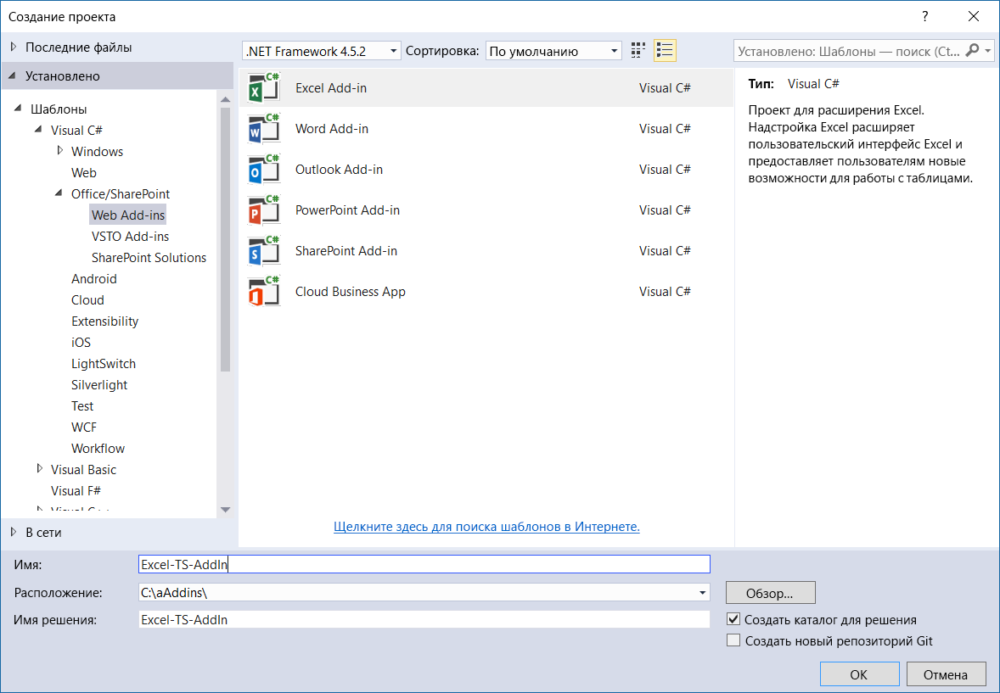
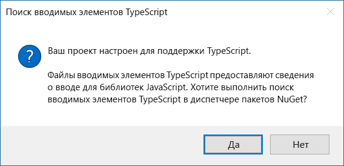
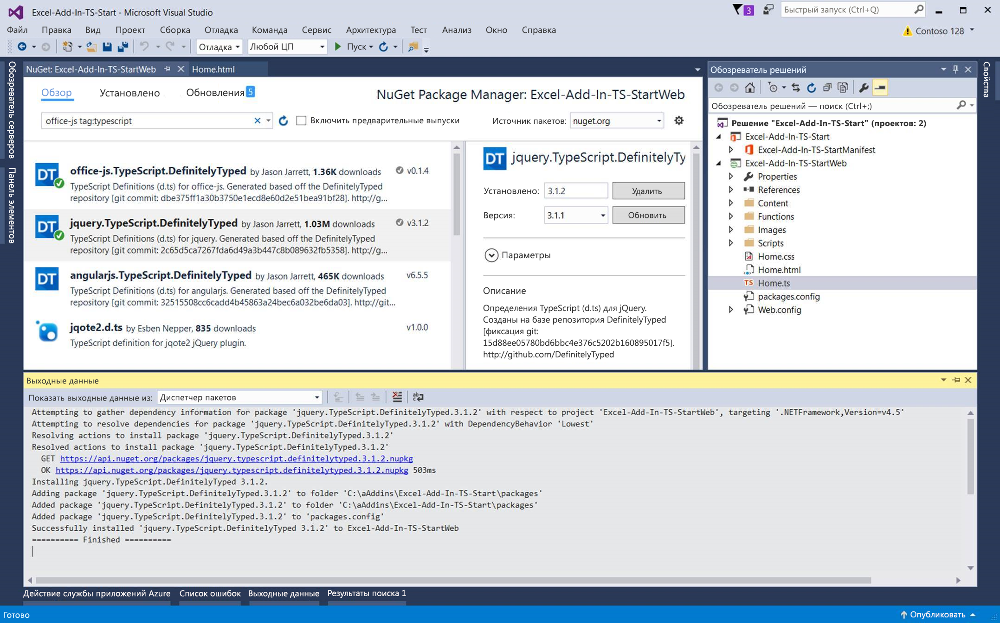

# <a name="convert-an-office-add-in-task-pane-template-in-visual-studio-to-typescript"></a>Преобразование шаблона области задач надстройки Office в Visual Studio в TypeScript


Вы можете использовать шаблон надстройки Office на JavaScript в Visual Studio, чтобы создать надстройку на TypeScript. После создания надстройки в Visual Studio вы можете преобразовать проект в TypeScript.  Таким образом, вам не нужно начинать проект надстройки Office на TypeScript с нуля.  

   > **Примечание.** Чтобы узнать, как создать проект надстройки Office на TypeScript без Visual Studio, просмотрите статью [Создание надстройки Office с помощью любого редактора](../get-started/create-an-office-add-in-using-any-editor.md).

В проекте TypeScript могут быть как файлы TypeScript, так и файлы JavaScript, это не повлияет на компиляцию. Потому что TypeScript — это типизированная расширенная версия языка JavaScript. Код TypeScript компилируется в JavaScript. 

В этой статье показано, как преобразовать шаблон области задач надстройки Excel в Visual Studio из JavaScript в TypeScript. Преобразование других шаблонов JavaScript выполняется аналогично.

Чтобы просмотреть или скачать пример кода, который используется в этой статье, откройте страницу [Excel-Add-In-TS-Start](https://github.com/officedev/Excel-Add-In-TS-Start) на сайте GitHub.

## <a name="prerequisites"></a>Необходимые компоненты

Убедитесь, что установлены следующие компоненты:

* [Visual Studio 2015 или более поздней версии](https://www.visualstudio.com/downloads/)
* [Инструменты разработчика Office для Visual Studio](https://www.visualstudio.com/ru-RU/features/office-tools-vs.aspx)
* [Накопительный выпуск исправлений для Microsoft Visual Studio 2015 с обновлением 3 (KB3165756)](https://msdn.microsoft.com/ru-RU/library/mt752379.aspx)
* Excel 2016
* [TypeScript 2.1 для Visual Studio 2015](http://download.microsoft.com/download/6/D/8/6D8381B0-03C1-4BD2-AE65-30FF0A4C62DA/TS2.1-dev14update3-20161206.2/TypeScript_Dev14Full.exe) (после установки Visual Studio 2015 с обновлением 3)

    > **Примечание.**  Дополнительные сведения об установке TypeScript 2.1 см. в статье [Представляем TypeScript 2.1](https://blogs.msdn.microsoft.com/typescript/2016/12/07/announcing-typescript-2-1/).

## <a name="create-new-add-in-project"></a>Создание проекта надстройки

1.  Откройте Visual Studio и выберите **Файл** > **Создать** > **Проект**. 
2.  В разделе **Office/SharePoint**, выберите **Надстройка Excel** и нажмите **ОК**.

    

3.  В мастере создания приложений выберите **Добавить новые функции в Excel** и нажмите **Готово**.
4.  Нажмите клавишу F5 или зеленую кнопку **Запуск**, чтобы запустить новую надстройку Excel. Надстройка будет размещена локально в IIS, и Excel откроется уже с загруженной надстройкой.

## <a name="convert-the-add-in-project-to-typescript"></a>Преобразование проекта надстройки в TypeScript

1. В **обозревателе решений** переименуйте файл Home.js на Home.ts.
2. Нажмите **Да**, чтобы подтвердить изменение расширения имени файла.  
3. Нажмите **Да**, чтобы подтвердить поиск определений TypeScript в диспетчере пакетов NuGet, как показано на приведенном ниже снимке экрана. Откроется **диспетчер пакетов NuGet**.

    

4. Выберите **Обзор** в **диспетчере пакетов Nuget**.  
5. В поле поиска введите **office-js tag:typescript**.
6. Установите определения **office.js.TypeScript.DefinitelyTyped** и **jquery.TypeScript.DefinitelyTyped**, как показано ниже.

    

7. Откройте Home.ts (прежнее название — Home.js). Удалите следующую ссылку в начале файла Home.ts:

    ```///<reference path="/Scripts/FabricUI/MessageBanner.js" />```

8. Добавьте следующее объявление в начало файла Home.ts:

    ```declare var fabric: any;```

9. Измените **‘1.1’** на **1.1**, то есть удалите кавычки из следующей строки в файле Home.ts:

    ```if (!Office.context.requirements.isSetSupported('ExcelApi', 1.1)) {```
 
## <a name="run-the-converted-add-in-project"></a>Запуск преобразованного проекта надстройки

1. Нажмите клавишу F5 или зеленую кнопку **Запуск**, чтобы запустить надстройку. 
2. Запустив Excel, нажмите кнопку **Показать область задач** на ленте **Главная**.
3. Выделите все ячейки с числами.
4. Нажмите кнопку **Выделить** в области задач. 

## <a name="homets-code-file"></a>Файл с кодом Home.ts

Ниже приведен код, включенный в файл Home.ts. Этот файл включает минимальное количество изменений, необходимое для запуска надстройки.

>**Примечание.** Полный пример файла JavaScript, преобразованного в TypeScript, см. в статье [Excel-Add-In-TS-StartWeb/Home.ts](https://github.com/officedev/Excel-Add-In-TS-Start/blob/master/Excel-Add-In-TS-StartWeb/Home.ts). 

```
declare var fabric: any;

(function () {
    "use strict";

    var cellToHighlight;
    var messageBanner;

    // The initialize function must be run each time a new page is loaded.
    Office.initialize = function (reason) {
        $(document).ready(function () {
            // Initialize the FabricUI notification mechanism and hide it
            var element = document.querySelector('.ms-MessageBanner');
            messageBanner = new fabric.MessageBanner(element);
            messageBanner.hideBanner();
            
            // If not using Excel 2016, use fallback logic.
            if (!Office.context.requirements.isSetSupported('ExcelApi', 1.1)) {
                $("#template-description").text("This sample will display the value of the cells you have selected in the spreadsheet.");
                $('#button-text').text("Display!");
                $('#button-desc').text("Display the selection");

                $('#highlight-button').click(
                    displaySelectedCells);
                return;
            }

            $("#template-description").text("This sample highlights the highest value from the cells you have selected in the spreadsheet.");
            $('#button-text').text("Highlight!");
            $('#button-desc').text("Highlights the largest number.");
                
            loadSampleData();

            // Add a click event handler for the highlight button.
            $('#highlight-button').click(
                hightlightHighestValue);
        });
    }

    function loadSampleData() {

        var values = [
                        [Math.floor(Math.random() * 1000), Math.floor(Math.random() * 1000), Math.floor(Math.random() * 1000)],
                        [Math.floor(Math.random() * 1000), Math.floor(Math.random() * 1000), Math.floor(Math.random() * 1000)],
                        [Math.floor(Math.random() * 1000), Math.floor(Math.random() * 1000), Math.floor(Math.random() * 1000)]
        ];

        // Run a batch operation against the Excel object model.
        Excel.run(function (ctx) {
            // Create a proxy object for the active sheet
            var sheet = ctx.workbook.worksheets.getActiveWorksheet();
            // Queue a command to write the sample data to the worksheet
            sheet.getRange("B3:D5").values = values;

            // Run the queued-up commands, and return a promise to indicate task completion
            return ctx.sync();
        })
        .catch(errorHandler);
    }

    function hightlightHighestValue() {

        // Run a batch operation against the Excel object model.
        Excel.run(function (ctx) {

            // Create a proxy object for the selected range and load its address and values properties.
            var sourceRange = ctx.workbook.getSelectedRange().load("values, address, rowIndex, columnIndex, rowCount, columnCount");

            // Run the queued-up command, and return a promise to indicate task completion
            return ctx.sync().
                .then(function () {
                    var highestRow = 0;
                    var highestCol = 0;
                    var highestValue = sourceRange.values[0][0];

                    // Find the cell to highlight
                    for (var i = 0; i < sourceRange.rowCount; i++) {
                        for (var j = 0; j < sourceRange.columnCount; j++) {
                            if (!isNaN(sourceRange.values[i][j]) && sourceRange.values[i][j] > highestValue) {
                                highestRow = i;
                                highestCol = j;
                                highestValue = sourceRange.values[i][j];
                            }
                        }
                    }

                    cellToHighlight = sourceRange.getCell(highestRow, highestCol);
                    sourceRange.worksheet.getUsedRange().format.fill.clear();
                    sourceRange.worksheet.getUsedRange().format.font.bold = false;

                    cellToHighlight.load("values");
                })
                   // Run the queued-up commands.
                .then(ctx.sync)
                .then(function () {
                    // Highlight the cell
                    cellToHighlight.format.fill.color = "orange";
                    cellToHighlight.format.font.bold = true;
                })
                .then(ctx.sync)
        })
        .catch(errorHandler);
    }

    function displaySelectedCells() {
        Office.context.document.getSelectedDataAsync(Office.CoercionType.Text,
            function (result) {
                if (result.status === Office.AsyncResultStatus.Succeeded) {
                    showNotification('The selected text is:', '"' + result.value + '"');
                } else {
                    showNotification('Error', result.error.message);
                }
            });
    }

    // Helper function for treating errors.
    function errorHandler(error) {
        // Always be sure to catch any accumulated errors that bubble up from the Excel.run execution
        showNotification("Error", error);
        console.log("Error: " + error);
        if (error instanceof OfficeExtension.Error) {
            console.log("Debug info: " + JSON.stringify(error.debugInfo));
        }
    }

    // Helper function for displaying notifications
    function showNotification(header, content) {
        $("#notificationHeader").text(header);
        $("#notificationBody").text(content);
        messageBanner.showBanner();
        messageBanner.toggleExpansion();
    }
})();

```

## <a name="additional-resources"></a>Дополнительные ресурсы

* [Обсуждение реализации обещаний на StackOverflow](https://stackoverflow.com/questions/44461312/office-addins-file-in-its-typescript-version-doesnt-work)
* [Примеры надстроек Office на сайте GitHub](https://github.com/officedev)
