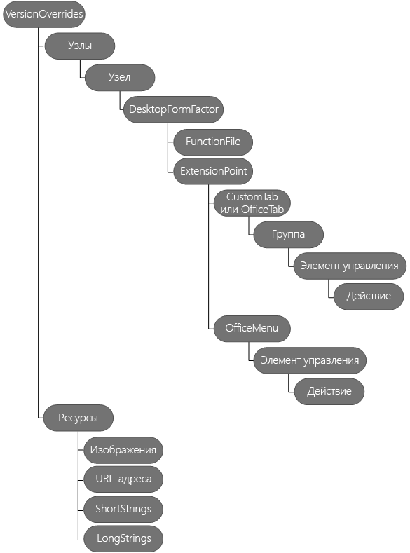

# <a name="create-add-in-commands-in-your-manifest-for-excel-word-and-powerpoint"></a>Создание команд надстроек в манифесте для Excel, Word и PowerPoint


Используйте элемент **[VersionOverrides](https://dev.office.com/reference/add-ins/manifest/versionoverrides)** в манифесте, чтобы определить команды надстроек для Excel, Word и PowerPoint. Команды надстроек позволяют легко настроить пользовательский интерфейс Office по умолчанию, добавив конкретные элементы интерфейса, выполняющие действия. С помощью команд надстройки можно следующее:
- Создавать элементы пользовательского интерфейса или точки входа, которые упрощают использование функций надстройки.  
  
- Добавлять кнопки или раскрывающийся список кнопок на ленту.    
  
- Добавлять отдельные элементы меню, каждый из которых может содержать необязательное подменю, к определенным контекстным меню.    
  
- Выполнять действия при выборе команды надстройки. Варианты действий:
    
  - Показать пользователю одну или несколько надстроек области задач. В надстройке области задач может отображаться код HTML, использующий Office UI Fabric для создания пользовательского интерфейса.
    
     *или* 
      
  - Запустить код JavaScript, который обычно выполняется без отображения пользовательского интерфейса.
      
В этой статье описывается, как отредактировать манифест, чтобы задать команды надстройки. На следующей схеме показана иерархия элементов, используемых для задания команд надстройки. Эти элементы подробнее рассматриваются в этой статье. 
      
На приведенном ниже изображении представлен обзор элементов команд надстройки в манифесте. 

 
## <a name="step-1-start-from-a-sample"></a>Этап 1. Ознакомление с примером

Настоятельно рекомендуем сначала ознакомиться с одним из примеров, доступных на [странице с примерами команд для надстроек Office](https://github.com/OfficeDev/Office-Add-in-Command-Sample). При необходимости вы можете создать свой манифест, следуя приведенным в руководстве инструкциям. Проверить манифест можно с использованием XSD-файла на сайте с примерами команд для надстроек Office. Прежде чем приступать к использованию команд надстроек, прочтите статью [Команды надстроек для Excel, Word и PowerPoint](../design/add-in-commands.md).

## <a name="step-2-create-a-task-pane-add-in"></a>Шаг 2. Создание надстройки области задач

Чтобы приступить к использованию команд надстройки, сначала необходимо создать надстройку области задач, а затем изменить ее манифест, как описано в этой статье. Команды надстроек невозможно использовать с контентными надстройками. Если вы обновляете существующий манифест, добавьте в манифест нужные **пространства имен XML**, а также элемент **VersionOverrides**, как описано в разделе [Шаг 3. Добавление элемента VersionOverrides](#step-3-add-versionoverrides-element).
   
Ниже приведен пример манифеста надстройки Office 2013. В этом манифесте нет команд надстройки, так как здесь отсутствует элемент **VersionOverrides**. Office 2013 не поддерживает команды надстройки, но при добавлении элемента **VersionOverrides** в этот манифест надстройка будет работать как в Office 2013, так и в Office 2016. В Office 2013, надстройка не отображает команды и использует значение **SourceLocation** для запуска надстройки в виде единой области задач. В Office 2016, если элемент **VersionOverrides** не включен, для запуска надстройки используется элемент **SourceLocation**. Однако при включении элемента **VersionOverrides** надстройка отображает только команды, но не отображает надстройку в виде единой области задач.
  
```xml
<OfficeApp xmlns="http://schemas.microsoft.com/office/appforoffice/1.1" xmlns:xsi="http://www.w3.org/2001/XMLSchema-instance" xmlns:bt="http://schemas.microsoft.com/office/officeappbasictypes/1.0" xmlns:ov="http://schemas.microsoft.com/office/taskpaneappversionoverrides" xsi:type="TaskPaneApp">
  <Id>657a32a9-ab8a-4579-ac9f-df1a11a64e52</Id>
  <Version>1.0.0.0</Version>
  <ProviderName>Contoso</ProviderName>
  <DefaultLocale>en-US</DefaultLocale>
  <DisplayName DefaultValue="Contoso Add-in Commands" />
  <Description DefaultValue="Contoso Add-in Commands"/>
  <IconUrl DefaultValue="~remoteAppUrl/Images/Icon_32.png" />
 
  <AppDomains>
    <AppDomain>AppDomain1</AppDomain>
    <AppDomain>AppDomain2</AppDomain>
    <AppDomain>AppDomain3</AppDomain>
  </AppDomains>
  <Hosts>
    <Host Name="Workbook" />
  </Hosts>
  <DefaultSettings>
    <SourceLocation DefaultValue="https://www.contoso.com/Pages/Home.aspx" />
  </DefaultSettings>
  <Permissions>ReadWriteDocument</Permissions>

 <!-- The VersionOverrides element is inserted at this location in the manifest. -->

</OfficeApp>
```

## <a name="step-3-add-versionoverrides-element"></a>Этап 3. Добавление элемента VersionOverrides
Элемент **VersionOverrides** — это корневой элемент, содержащий определение команды надстройки. Элемент манифеста **VersionOverrides** является дочерним для элемента **OfficeApp**. В приведенной ниже таблице перечислены атрибуты элемента **VersionOverrides**.

|**Атрибут**|**Описание**|
|:-----|:-----|
|**xmlns** <br/> | Обязательный. Расположение схемы. Необходимое значение — http://schemas.microsoft.com/office/taskpaneappversionoverrides. <br/> |
|**xsi:type** <br/> |Обязательный атрибут. Версия схемы. В этой статье описывается версия VersionOverridesV1_0.  <br/> |
   
В приведенной ниже таблице показаны дочерние элементы **VersionOverrides**.
  
|**Элемент**|**Описание**|
|:-----|:-----|
|**Описание** <br/> |Необязательный параметр. Описывает надстройку. Дочерний элемент **Description** переопределяет предыдущий элемент **Description** в родительской части манифеста. Атрибут **resid** для элемента **Description** задан как **id** элемента **String**. Элемент **String** содержит текст для элемента **Description**. <br/> |
|**Requirements** <br/> |Необязательный параметр. Задает минимальные набор требований и версию библиотеки Office.js, необходимые надстройке. Дочерний элемент **Requirements** переопределяет элемент **Requirements** в родительской части манифеста. Дополнительные сведения см. в статье [Указание требований касательно API и узлов Office](../develop/specify-office-hosts-and-api-requirements.md).  <br/> |
|**Hosts** <br/> |Обязательный. Задает набор узлов Office. Дочерний элемент **Hosts** переопределяет элемент **Hosts** в родительской части манифеста. Необходимо включить атрибут **xsi:type**, для которого задано значение "Книга" или "Документ". <br/> |
|**Resources** <br/> |Определяет коллекцию ресурсов (строк, URL-адресов и изображений), на которые ссылаются другие элементы манифеста. Например, значение элемента **Description** ссылается на дочерний элемент в элементе **Resources**. Элемент **Resources** описан в разделе [Этап 7. Добавление элемента Resources](#step-7-add-the-resources-element) далее в этой статье. <br/> |
   
В приведенном ниже примере показано, как использовать элемент **VersionOverrides** и его дочерние элементы.

```xml
<OfficeApp>
...
  <VersionOverrides xmlns="http://schemas.microsoft.com/office/taskpaneappversionoverrides" xsi:type="VersionOverridesV1_0">
    <Description resid="residDescription" />
    <Requirements>
      <!-- add information about requirement sets -->
    </Requirements>
    <Hosts>
      <Host xsi:type="Workbook">
        <!-- add information about form factors -->
      </Host>
      <Host xsi:type="Document">
        <!-- add information about form factors -->
      </Host>
    </Hosts>
    <Resources> 
      <!-- add information about resources -->
    </Resources>
  </VersionOverrides>
...
</OfficeApp>
```

## <a name="step-4-add-hosts-host-and-desktopformfactor-elements"></a>Этап 4. Добавление элементов Hosts, Host и DesktopFormFactor

Элемент **Hosts** содержит один или несколько элементов **Host**. Элемент **Host** задает конкретный узел Office. Элемент **Host** содержит дочерние элементы, определяющие команды надстройки, которые отображаются после установки надстройки в соответствующем узле Office. Для отображения тех же команд надстройки в нескольких различных узлах Office, необходимо продублировать дочерние элементы в каждом из элементов **Host**.
       
Элемент **DesktopFormFactor** задает параметры надстройки, которая работает в Office на компьютере с Windows и в Office Online (в браузере).
      
Ниже приведены примеры элементов **Hosts**, **Host** и **DesktopFormFactor**.

```xml
<OfficeApp>
...
  <VersionOverrides xmlns="http://schemas.microsoft.com/office/taskpaneappversionoverrides" xsi:type="VersionOverridesV1_0">
  ...
    <Hosts>
      <Host xsi:type="Workbook">
        <DesktopFormFactor>

              <!-- information about FunctionFile and ExtensionPoint -->

        </DesktopFormFactor>
      </Host>
    </Hosts>
  ...
  </VersionOverrides>
...
</OfficeApp>
```

## <a name="step-5-add-the-functionfile-element"></a>Этап 5. Добавление элемента FunctionFile

Элемент **FunctionFile** задает файл, который содержит код JavaScript, выполняемый, когда команда надстройки использует действие **ExecuteFunction** (описание см. в разделе [Элементы управления "Кнопка"](https://dev.office.com/reference/add-ins/manifest/control#Button-control)). В атрибуте **resid** элемента **FunctionFile** указан HTML-файл, включающий все файлы JavaScript, необходимые командам надстройки. Ссылаться непосредственно на файл JavaScript невозможно. Вы можете сослаться только на HTML-файл. Имя файла задано в дочернем элементе **Url** элемента **Resources**.
        
Ниже приведен пример элемента **FunctionFile**.
  
```xml
<DesktopFormFactor>
    <FunctionFile resid="residDesktopFuncUrl" />
    <ExtensionPoint xsi:type="PrimaryCommandSurface">
      <!-- information about this extension point -->
    </ExtensionPoint> 

    <!-- You can define more than one ExtensionPoint element as needed -->
</DesktopFormFactor>
```

> [!IMPORTANT]
> Убедитесь, что код JavaScript вызывает `Office.initialize`. 
   
JavaScript должен вызывать `Office.initialize` в HTML-файле, на который ссылается элемент **FunctionFile**. Элемент **FunctionName** (описание см. в разделе [Элементы управления "Кнопка"](https://dev.office.com/reference/add-ins/manifest/control#Button-control)) использует функции в элементе **FunctionFile**.
     
Приведенный ниже пример кода показывает, как внедрить функцию, используемую элементом **FunctionName**.

```javascript

<script>
    // The initialize function must be run each time a new page is loaded.
    (function () {
        Office.initialize = function (reason) {
            // If you need to initialize something you can do so here. 
        };
    })();

    // Your function must be in the global namespace.
    function writeText(event) {

        // Implement your custom code here. The following code is a simple example.  
        Office.context.document.setSelectedDataAsync("ExecuteFunction works. Button ID=" + event.source.id,
            function (asyncResult) {
                var error = asyncResult.error;
                if (asyncResult.status === "failed") {
                    // Show error message. 
                }
                else {
                    // Show success message.
                }
            });
        
        // Calling event.completed is required. event.completed lets the platform know that processing has completed. 
        event.completed();
    }
</script>
```

> [!IMPORTANT]
> Вызов **event.completed** свидетельствует, что событие успешно обработано. Если функция вызывается несколько раз, например при выборе одной команды надстройки несколько раз, все события автоматически помещаются в очередь. Первое событие запускается автоматически, тогда как остальные ожидают в очереди. Как только функция вызывает **event.completed**, для нее запускается следующий вызов из очереди. Если объект **event.completed** не реализован, функция не запускается.
 
## <a name="step-6-add-extensionpoint-elements"></a>Этап 6. Добавление элементов ExtensionPoint

Элемент **ExtensionPoint** определяет, где в пользовательском интерфейсе Office должны появиться команды надстройки. Вы можете определить элементы **ExtensionPoint** по этим значениям **xsi:type**:
   
- **PrimaryCommandSurface**, которое обозначает ленту в Office.
     
- **ContextMenu** — контекстное меню, которое появляется при нажатии правой кнопкой мыши в пользовательском интерфейсе Office.
    
В приведенных ниже примерах показано, как применять элемент **ExtensionPoint** со значениями атрибута **PrimaryCommandSurface** и **ContextMenu**, и какие дочерние элементы использовать с каждым из них.
    
> [!IMPORTANT]
> Для элементов, содержащих атрибут идентификатора, необходимо предоставить уникальный идентификатор. Рекомендуем указать название компании с идентификатором. Используйте, например, формат `<CustomTab id="mycompanyname.mygroupname">`. 
  
```xml
<ExtensionPoint xsi:type="PrimaryCommandSurface">
  <CustomTab id="Contoso Tab">
  <!-- If you want to use a default tab that comes with Office, remove the above CustomTab element, and then uncomment the following OfficeTab element -->
  <!-- <OfficeTab id="TabData"> -->
    <Label resid="residLabel4" />
    <Group id="Group1Id12">
      <Label resid="residLabel4" />
      <Icon>
        <bt:Image size="16" resid="icon1_32x32" />
        <bt:Image size="32" resid="icon1_32x32" />
        <bt:Image size="80" resid="icon1_32x32" />
      </Icon>
      <Tooltip resid="residToolTip" />
      <Control xsi:type="Button" id="Button1Id1">
        
        <!-- information about the control -->
      </Control>   
      <!-- other controls, as needed -->                                    
    </Group>
  </CustomTab>
</ExtensionPoint>
<ExtensionPoint xsi:type="ContextMenu">
  <OfficeMenu id="ContextMenuCell">
    <Control xsi:type="Menu" id="ContextMenu2">
            <!-- information about the control -->
    </Control>   
    <!-- other controls, as needed -->         
  </OfficeMenu>
</ExtensionPoint>
```

|**Элемент**|**Описание**|
|:-----|:-----|
|**CustomTab** <br/> |Обязательный, если требуется добавить пользовательскую вкладку в ленту (с помощью элемента **PrimaryCommandSurface**). Невозможно использовать элементы **CustomTab** и **OfficeTab** одновременно. Атрибут **id** является обязательным. <br/> |
|**OfficeTab** <br/> |Обязательный, если требуется расширить стандартную вкладку ленты Office (с помощью элемента **PrimaryCommandSurface**). Невозможно использовать элементы **OfficeTab** и **CustomTab** одновременно. <br/> Дополнительные значения, которые можно использовать с атрибутом **id**, см. в разделе [Значения для стандартных вкладок Office](https://dev.office.com/reference/add-ins/manifest/officetab).  <br/> |
|**OfficeMenu** <br/> | Обязательный при добавлении команд надстройки в контекстное меню по умолчанию (с помощью элемента **ContextMenu**). Для атрибута **id** необходимо задать следующее значение: <br/> **ContextMenuText** для Excel или Word. Отображает элемент в контекстном меню, когда пользователь щелкает выделенный текст правой кнопкой мыши.<br/> **ContextMenuCell** для Excel. Отображает элемент в контекстном меню, когда пользователь щелкает ячейку электронной таблицы правой кнопкой мыши. <br/> |
|**Group** <br/> |Группа точек расширения интерфейса пользователя на вкладке. В группе может быть до шести элементов управления. Атрибут **id** является обязательным. Это строка длиной до 125 символов. <br/> |
|**Label** <br/> |Обязательный. Метка группы. Для атрибута **resid** должно быть задано значение атрибута **id**, принадлежащего элементу **String**. **String** — это дочерний элемент **ShortStrings**, который в свою очередь является дочерним для элемента **Resources**. <br/> |
|**Icon** <br/> |Обязательный. Определяет значок группы для использования на устройствах с малым форм-фактором или в случаях, когда отображается слишком много кнопок. Для атрибута **resid** должно быть задано значение атрибута **id**, принадлежащего элементу **Image**. **Image** — это дочерний элемент **Images**, который в свою очередь является дочерним для элемента **Resources**. Атрибут **size** определяет размер изображения в пикселях. Обязательными являются три размера изображения: 16, 32 и 80. Кроме того, поддерживаются пять необязательных размеров: 20, 24, 40, 48 и 64. <br/> |
|**Tooltip** <br/> |Необязательный параметр. Всплывающая подсказка группы. Для атрибута **resid** должно быть задано значение атрибута **id**, принадлежащего элементу **String**. **String** — это дочерний элемент **LongStrings**, который в свою очередь является дочерним для элемента **Resources**. <br/> |
|**Control** <br/> |Для каждой группы требуется хотя бы один элемент управления. Элемент **Control** может иметь значение **Button** или **Menu**. Укажите **Menu**, чтобы задать раскрывающийся список элементов управления "Кнопка". В настоящий момент поддерживаются только кнопки и меню. Дополнительные сведения см. в разделах [Элементы управления "Кнопка"](https://dev.office.com/reference/add-ins/manifest/control) и [Элементы управления "Меню"](https://dev.office.com/reference/add-ins/manifest/control).<br/>**Примечание.** Чтобы упростить устранение неполадок, рекомендуем добавлять элемент **Control** и соответствующие дочерние элементы **Resources** по одному.          |
   

### <a name="button-controls"></a>Элементы управления "Кнопка"
Когда пользователь нажимает кнопку, она выполняет одно действие. Она может выполнять функцию JavaScript или отображать область задач. В приведенном ниже примере показано, как определить две кнопки. Первая кнопка выполняет функцию JavaScript без отображения пользовательского интерфейса, а вторая отображает область задач. В элементе **Control**:        

- атрибут **type** является обязательным и должен иметь значение **Button**;
    
- атрибут **id** элемента **Control** — это строка длиной до 125 символов.
    
```xml
<!-- Define a control that calls a JavaScript function. -->
<Control xsi:type="Button" id="Button1Id1">
  <Label resid="residLabel" />
  <Tooltip resid="residToolTip" />
  <Supertip>
    <Title resid="residLabel" />
    <Description resid="residToolTip" />
  </Supertip>
  <Icon>
    <bt:Image size="16" resid="icon1_32x32" />
    <bt:Image size="32" resid="icon1_32x32" />
    <bt:Image size="80" resid="icon1_32x32" />
  </Icon>
  <Action xsi:type="ExecuteFunction">
    <FunctionName>getData</FunctionName>
  </Action>
</Control>

<!-- Define a control that shows a task pane. -->
<Control xsi:type="Button" id="Button2Id1">
  <Label resid="residLabel2" />
  <Tooltip resid="residToolTip" />
  <Supertip>
    <Title resid="residLabel" />
    <Description resid="residToolTip" />
  </Supertip>
  <Icon>
    <bt:Image size="16" resid="icon2_32x32" />
    <bt:Image size="32" resid="icon2_32x32" />
    <bt:Image size="80" resid="icon2_32x32" />
  </Icon>
  <Action xsi:type="ShowTaskpane">
    <SourceLocation resid="residUnitConverterUrl" />
  </Action>
</Control>
```

|**Элементы**|**Описание**|
|:-----|:-----|
|**Label** <br/> |Обязательный. Текст для кнопки. Для атрибута **resid** должно быть задано значение атрибута **id**, принадлежащего элементу **String**. **String** — это дочерний элемент **ShortStrings**, который в свою очередь является дочерним для элемента **Resources**. <br/> |
|**Tooltip** <br/> |Необязательный параметр. Всплывающая подсказка для кнопки. Для атрибута **resid** должно быть задано значение атрибута **id**, принадлежащего элементу **String**. **String** — это дочерний элемент **LongStrings**, который в свою очередь является дочерним для элемента **Resources**. <br/> |
|**Supertip** <br/> | Обязательный элемент. Суперподсказка для кнопки, определяемая указанными ниже элементами. <br/> **Title** <br/>  Обязательный. Текст суперподсказки. Для атрибута **resid** должно быть задано значение атрибута **id**, принадлежащего элементу **String**. **String** — это дочерний элемент **ShortStrings**, который в свою очередь является дочерним для элемента **Resources**. <br/> **Описание** <br/>  Обязательный. Описание суперподсказки. Для атрибута **resid** должно быть задано значение атрибута **id**, принадлежащего элементу **String**. **String** — это дочерний элемент **LongStrings**, который в свою очередь является дочерним для элемента **Resources**. <br/> |
|**Icon** <br/> | Обязательный. Содержит элементы **Image** для кнопки. Файлы изображений должны быть в формате PNG. <br/> **Image** <br/>  Определяет изображение для кнопки. Для атрибута **resid** должно быть задано значение атрибута **id**, принадлежащего элементу **Image**. **Image** — это дочерний элемент **Images**, который в свою очередь является дочерним для элемента **Resources**. Атрибут **size** определяет размер изображения в пикселях. Обязательными являются три размера изображения: 16, 32 и 80. Кроме того, поддерживаются пять необязательных размеров: 20, 24, 40, 48 и 64. <br/> |
|**Действие** <br/> | Обязательный. Указывает действие, которое необходимо выполнить, когда пользователь нажимает кнопку. Для этого атрибута **xsi:type** можно указать следующие значения: <br/> **ExecuteFunction.** Вызывает функцию JavaScript, расположенную в файле, на который ссылается элемент **FunctionFile**. **ExecuteFunction** не отображает пользовательский интерфейс. Дочерний элемент **FunctionName** задает имя выполняемой функции.<br/> **ShowTaskPane.** Отображает надстройку области задач. Дочерний элемент **SourceLocation** задает расположение исходного файла отображаемой надстройки области задач. Для атрибута **resid** должно быть задано значение атрибута **id** элемента **Url** в элементе **Urls**, включенном в элемент **Resources**. <br/> |
   

### <a name="menu-controls"></a>Элементы управления "Меню"
Элемент управления **Меню** можно использовать с элементом **PrimaryCommandSurface** или **ContextMenu**. Он определяет следующее:
  
- элемент меню корневого уровня;
   
- список элементов подменю.
 
При использовании совместно с элементом **PrimaryCommandSurface**, корневой элемент меню отображается в виде кнопки на ленте. При выборе кнопки отображается подменю в виде раскрывающегося списка. При использовании совместно с элементом **ContextMenu**, элемент меню с подменю вставляется в контекстное меню. В обоих случаях индивидуальные элементы подменю могут выполнять функцию JavaScript или отображать область задач. В настоящее время поддерживается только один уровень подменю.
       
В приведенном ниже примере показано, как определить элемент меню с двумя элементами подменю. Первый элемент подменю показывает область задач, а второй запускает функцию JavaScript. В элементе **Control**:
    
- атрибут **xsi:type** является обязательным и должен иметь значение **Menu**;
  
- атрибут **id** — это строка длиной до 125 символов.
    
```xml

<Control xsi:type="Menu" id="TestMenu2">
  <Label resid="residLabel3" />
  <Tooltip resid="residToolTip" />
  <Supertip>
    <Title resid="residLabel" />
    <Description resid="residToolTip" />
  </Supertip>
  <Icon>
    <bt:Image size="16" resid="icon1_32x32" />
    <bt:Image size="32" resid="icon1_32x32" />
    <bt:Image size="80" resid="icon1_32x32" />
  </Icon>
  <Items>
    <Item id="showGallery2">
      <Label resid="residLabel3"/>
      <Supertip>
        <Title resid="residLabel" />
        <Description resid="residToolTip" />
      </Supertip>
      <Icon>
        <bt:Image size="16" resid="icon1_32x32" />
        <bt:Image size="32" resid="icon1_32x32" />
        <bt:Image size="80" resid="icon1_32x32" />
      </Icon>
      <Action xsi:type="ShowTaskpane">
        <TaskpaneId>MyTaskPaneID1</TaskpaneId>
        <SourceLocation resid="residUnitConverterUrl" />
      </Action>
    </Item>
    <Item id="showGallery3">
      <Label resid="residLabel5"/>
      <Supertip>
        <Title resid="residLabel" />
        <Description resid="residToolTip" />
      </Supertip>
      <Icon>
        <bt:Image size="16" resid="icon4_32x32" />
        <bt:Image size="32" resid="icon4_32x32" />
        <bt:Image size="80" resid="icon4_32x32" />
      </Icon>
      <Action xsi:type="ExecuteFunction">
        <FunctionName>getButton</FunctionName>
      </Action>
    </Item>
  </Items>
</Control>
```

|**Элементы**|**Описание**|
|:-----|:-----|
|**Label** <br/> |Обязательный. Текст корневого элемента меню. Для атрибута **resid** должно быть задано значение атрибута **id**, принадлежащего элементу **String**. **String** — это дочерний элемент **ShortStrings**, который в свою очередь является дочерним для элемента **Resources**. <br/> |
|**Tooltip** <br/> |Необязательный параметр. Всплывающая подсказка для меню. Для атрибута **resid** должно быть задано значение атрибута **id**, принадлежащего элементу **String**. **String** — это дочерний элемент **LongStrings**, который в свою очередь является дочерним для элемента **Resources**. <br/> |
|**SuperTip** <br/> | Обязательный элемент. Суперподсказка для меню, определяемая указанными ниже элементами. <br/> **Title** <br/>  Обязательный. Текст суперподсказки. Для атрибута **resid** должно быть задано значение атрибута **id**, принадлежащего элементу **String**. **String** — это дочерний элемент **ShortStrings**, который в свою очередь является дочерним для элемента **Resources**. <br/> **Описание** <br/>  Обязательный. Описание суперподсказки. Для атрибута **resid** должно быть задано значение атрибута **id**, принадлежащего элементу **String**. **String** — это дочерний элемент **LongStrings**, который в свою очередь является дочерним для элемента **Resources**. <br/> |
|**Icon** <br/> | Обязательный. Содержит элементы **Image** для меню. Файлы изображений должны быть в формате PNG. <br/> **Image** <br/>  Изображение для меню. Для атрибута **resid** должно быть задано значение атрибута **id**, принадлежащего элементу **Image**. **Image** — это дочерний элемент **Images**, который в свою очередь является дочерним для элемента **Resources**. Атрибут **size** определяет размер изображения в пикселях. Обязательными являются три размера изображения в пикселях: 16, 32 и 80. Кроме того, поддерживаются пять необязательных размеров в пикселях: 20, 24, 40, 48 и 64. <br/> |
|**Items** <br/> |Обязательный. Содержит элементы **Item** для каждого элемента подменю. Каждый элемент **Item** содержит те же дочерние элементы, что и [Элементы управления ''Кнопка''](https://dev.office.com/reference/add-ins/manifest/control).  <br/> |
   
## <a name="step-7-add-the-resources-element"></a>Этап 7. Добавление элемента Resources

Элемент **Resources** содержит ресурсы, используемые различными дочерними элементами элемента **VersionOverrides**. Ресурсы включают значки, строки и URL-адреса. Элемент манифеста может использовать ресурс, ссылаясь на его **id**. Использование **id** помогает упорядочить манифест, особенно если для разных языковых стандартов используются разные версии ресурса. **id** может содержать до 32 знаков.
  
    
    
Ниже приведен пример использования элемента **Resources**. Каждый ресурс может иметь один или несколько дочерних элементов **Override**, позволяющих указать другой ресурс для определенного языкового стандарта.


```xml
<Resources>
  <bt:Images>
    <bt:Image id="icon1_16x16" DefaultValue="https://www.contoso.com/Images/icon_default.png">
      <bt:Override Locale="ja-jp" Value="https://www.contoso.com/Images/ja-jp16-icon_default.png" />
    </bt:Image>
    <bt:Image id="icon1_32x32" DefaultValue="https://www.contoso.com/Images/icon_default.png">
      <bt:Override Locale="ja-jp" Value="https://www.contoso.com/Images/ja-jp32-icon_default.png" />
    </bt:Image>
    <bt:Image id="icon1_80x80" DefaultValue="https://www.contoso.com/Images/icon_default.png">
      <bt:Override Locale="ja-jp" Value="https://www.contoso.com/Images/ja-jp80-icon_default.png" />
    </bt:Image>        
  </bt:Images>
  <bt:Urls>
    <bt:Url id="residDesktopFuncUrl" DefaultValue="https://www.contoso.com/Pages/Home.aspx">
      <bt:Override Locale="ja-jp" Value="https://www.contoso.com/Pages/Home.aspx" />
    </bt:Url>        
  </bt:Urls>
  <bt:ShortStrings>
    <bt:String id="residLabel" DefaultValue="GetData">
      <bt:Override Locale="ja-jp" Value="JA-JP-GetData" />
    </bt:String>      
  </bt:ShortStrings>
  <bt:LongStrings>
    <bt:String id="residToolTip" DefaultValue="Get data for your document.">
      <bt:Override Locale="ja-jp" Value="JA-JP - Get data for your document." />
    </bt:String>
  </bt:LongStrings>
</Resources>
```

|**Ресурс**|**Описание**|
|:-----|:-----|
|**Images**/ **Image** <br/> | Предоставляет URL-адрес файла изображения по протоколу HTTPS. Каждое изображение должно быть определено в трех обязательных размерах: <br/>  16×16 <br/>  32×32 <br/>  80×80 <br/>  Кроме того, поддерживаются следующие необязательные размеры: <br/>  20×20 <br/>  24×24 <br/>  40×40 <br/>  48×48 <br/>  64×64 <br/> |
|**Urls**/ **Url** <br/> |Предоставляет URL-адрес с префиксом HTTPS. URL-адрес может включать до 2048 символов.  <br/> |
|**ShortStrings**/ **String** <br/> |Текст для элементов **Label** и **Title**. Каждая **строка** содержит не более 125 символов. <br/> |
|**LongStrings**/ **String** <br/> |Текст для элементов **Tooltip** и **Description**. Каждый элемент **String** содержит не более 250 символов.<br/> |
   
> [!NOTE] 
> Для всех URL-адресов в элементах **Image** и **Url** необходимо использовать протокол SSL.

### <a name="tab-values-for-default-office-ribbon-tabs"></a>Значения для стандартных вкладок ленты Office
В Excel и Word вы можете добавить команды надстройки на ленту с помощью стандартных вкладок пользовательского интерфейса Office. В приведенной ниже таблице перечислены значения, которые можно использовать для атрибута **id** элемента **OfficeTab**. Значения вкладок указываются с учетом регистра.

|**Ведущее приложение Office**|**Значения вкладок**|
|:-----|:-----|
|Excel  <br/> |**TabHome**         **TabInsert**         **TabPageLayoutExcel**         **TabFormulas**         **TabData**         **TabReview**         **TabView**         **TabDeveloper**         **TabAddIns**         **TabPrintPreview**         **TabBackgroundRemoval** <br/> |
|Word  <br/> |**TabHome**         **TabInsert**         **TabWordDesign**         **TabPageLayoutWord**         **TabReferences**         **TabMailings**         **TabReviewWord**         **TabView**         **TabDeveloper**         **TabAddIns**         **TabBlogPost**         **TabBlogInsert**         **TabPrintPreview**         **TabOutlining**         **TabConflicts**         **TabBackgroundRemoval**         **TabBroadcastPresentation** <br/> |
|PowerPoint  <br/> |**TabHome**         **TabInsert**         **TabDesign**         **TabTransitions**         **TabAnimations**         **TabSlideShow**         **TabReview**         **TabView**         **TabDeveloper**         **TabAddIns**         **TabPrintPreview**         **TabMerge**         **TabGrayscale**         **TabBlackAndWhite**         **TabBroadcastPresentation**         **TabSlideMaster**         **TabHandoutMaster**         **TabNotesMaster**         **TabBackgroundRemoval**         **TabSlideMasterHome**          <br/> |
   
## <a name="see-also"></a>См. также

-  [Команды надстроек для Excel, Word и PowerPoint](../design/add-in-commands.md)      
