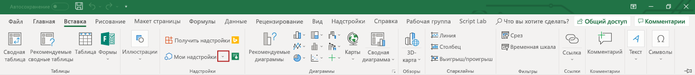

# Создание и отладка надстроек Office в Visual Studio

В этой статье описано создание надстройки Office для Excel, Word, PowerPoint или Outlook и отладка надстройки и в настольном клиенте Office для Windows с помощью Visual Studio 2017. Если вы используете другую версию Visual Studio, используемые действия могут немного отличаться.

> [!NOTE]
> Visual Studio не поддерживает создание надстроек Office для OneNote или проекта, но вы можете использовать [Yeoman генератор для надстроек Office ](https://github.com/OfficeDev/generator-office) для создания данных типов надстроек.
> - Чтобы начать работу с надстройкой OneNote, см. статью [Создание вашей первой надстройки OneNote](../quickstarts/onenote-quickstart.md).
>
> - Чтобы начать работу с надстройкой для проекта, ознакомьтесь со статьей [Создание вашей первой надстройки для проекта](../quickstarts/project-quickstart.md).

## Обязательные условия

- [Visual Studio 2017](https://www.visualstudio.com/vs/) с установленной рабочей нагрузкой **Разработка надстроек для Office и SharePoint**

    > [!TIP]
    > Если вы уже установили Visual Studio 2017, [используйте Visual Studio Installer](/visualstudio/install/modify-visual-studio), чтобы убедиться, что также установлена рабочая нагрузка **Разработка надстроек для Office и SharePoint**. Если эта рабочая нагрузка еще не установлена, используйте установщик Visual Studio Installer, чтобы [установить ее](/visualstudio/install/modify-visual-studio?view=vs-2017#modify-workloads).

- Office 2013 или более поздние версии

    > [!TIP]
    > Если вы еще не установили Office, вы можете присоединиться к [программе для разработчиков Office 365](https://developer.microsoft.com/office/dev-program) и получить подписку на Office 365, либо вы можете [зарегистрировать бесплатную пробную подписку на 1 месяц](https://products.office.com/en-US/try?legRedir=true&WT.intid1=ODC_ENUS_FX101785584_XT104056786&CorrelationId=64c762de-7a97-4dd1-bb96-e231d7485735).

## Создание проекта надстройки в Visual Studio

Начните с выполнения этих трех шагов, а затем выполните действия, описанные в следующем разделе, которые соответствуют типу надстройки, который вы создаете. 

1. Откройте Visual Studio и в строке меню выберите **Файл** > **Создать** > **Проект**.

2. В списке типов проекта разверните узел **Visual C#** или **Visual Basic**, разверните **Office/SharePoint**, выберите **Надстройки**, а затем выберите тип проекта надстройки, который вы хотите создать. 

3. Укажите имя проекта и нажмите кнопку **ОК**.

### Надстройка Word Web или надстройка Outlook Web 

Если вы выбрали вариант создания **надстройки Word Web** или **надстройки Outlook Web**, Visual Studio создает решение, а два его проекта отображаются в **обозревателе решений**. После этого вы можете [просматривать решение Visual Studio](#explore-the-visual-studio-solution). 

### Веб-надстройка PowerPoint

Если вы выбрали вариант создания **веб-надстройки PowerPoint**, будет отображено диалоговое окно**Создание надстройки Office**. 

- Чтобы создать надстройку области задач, выберите **Добавить новые функциональные возможности для PowerPoint** и нажмите кнопку **Готово**, чтобы создать решение Visual Studio.

- Чтобы создать надстройку контента, выберите **Вставить контент в слайды PowerPoint** и нажмите кнопку **Готово**, чтобы создать решение Visual Studio.

После этого вы можете [просматривать решение Visual Studio](#explore-the-visual-studio-solution).

### Веб-надстройка Excel

Если вы выбрали вариант создания **Веб-надстройки Excel**, будет отображено диалоговое окно**Создание надстройки Office**. 

- Чтобы создать надстройку области задач, выберите **Добавить новые функциональные возможности для Excel** и нажмите кнопку **Готово**, чтобы создать решение Visual Studio.

- Чтобы создать надстройку контента, выберите **Вставить контент в лист Excel** и нажмите кнопку **Далее**, выберите одну из следующих опций и нажмите кнопку **Готово**, чтобы создать решение Visual Studio.

    - **Основные надстройки** - для создания проекта надстройки контента с минимальным начальным знанием кода

    - **Надстройка визуализации документа** — для создания проекта надстройки контента с начальным кодом для визуализации и привязки к данным  

### Обзор решения Visual Studio

[!include[Description of Visual Studio projects](../includes/quickstart-vs-solution.md)]

## Изменение параметров надстроек

Чтобы изменить параметры надстройки, отредактируйте XML-файл манифеста для проекта. В **Обозревателе решений** разверните узел проекта надстройки, откройте папку, содержащую XML-манифест, и выберите XML-манифест. Вы можете навести указатель мыши на любой элемент в файле, чтобы увидеть подсказку с описанием назначения этого элемента. Дополнительные сведения о файле манифеста см. в статье [XML-манифест надстроек Office](../develop/add-in-manifests.md).

## Разработка содержимого надстройки

Проект надстройки позволяет изменить ее параметры, а веб-приложение предоставляет содержимое, которое отображается в надстройке. 

Проект веб-приложения содержит HTML-файл по умолчанию, файл JavaScript и CSS-файл, которые можно использовать, чтобы приступить к работе. Некоторые из этих файлов содержат ссылки на другие библиотеки JavaScript, включая API JavaScript для Office. Вы можете разработать собственную надстройку, выполнив обновление этих файлов и/или добавления дополнительных файлов HTML и JavaScript. В таблицу ниже описаны файлы по умолчанию, которые содержит проект веб-приложения при создании решений Visual Studio.

|**Имя файла**|**Описание**|
|:-----|:-----|
|**Home.html** (Excel, PowerPoint, Word)  **MessageRead.html** (Outlook)|HTML-страница надстройки по умолчанию. Эта страница отображается как первая страница в надстройке, когда она активируется в документе, сообщении электронной почты или элементе встречи. Этот файл содержит все ссылки на файл, которые необходимы для начала работы. Вы можете начать разработку вашей надстройки, добавив HTML-код к этому файлу.|
|**Home.js** (Excel, PowerPoint, Word)  **MessageRead.js** (Outlook)|Файл JavaScript, связанный со страницей **Home.html** (Excel, PowerPoint, Word) или страницей**MessageRead.html** (Outlook). Этот файл должен содержать любой код, который определяет поведение страницы **Home.html** (Excel, PowerPoint, Word) или страницы**MessageRead.html** (Outlook). Данный файл содержит определенный пример кода, который можно использовать для начала работы.|
|**Home.css** (Excel, PowerPoint, Word)  **MessageRead.css** (Outlook)|Определяет стили по умолчанию, применяемые к надстройке. Мы рекомендуем использовать структуру и стили Office UI Fabric. Дополнительные сведения см. в статье [Office UI Fabric в надстройках Office](../design/office-ui-fabric.md).|

> [!NOTE]
> Вам необязательно использовать эти файлы. Вы можете добавить другие файлы в проект и использовать их вместо первоначальных файлов. Если вы хотите, чтобы другой HTML-файл отображался в качестве начальной странице для надстройки, откройте редактор манифеста и задайте свойство **SourceLocation** для имени файла.

## Отладка вашей надстройки

Вы можете использовать Visual Studio для отладки надстройки в настольном клиенте Office для Windows, как описано в следующих разделах:

- [Просмотр свойств, связанных с построением и отладкой](#review-the-build-and-debug-properties)
- [Использование существующего документа для отладки надстройки](#use-an-existing-document-to-debug-the-add-in)
- [Запуск проекта](#start-the-project)
- [Отладка кода для надстройки Excel, PowerPoint или Word](#debug-the-code-for-an-excel-powerpoint-or-word-add-in)
- [Отладка кода для надстройки Outlook](#debug-the-code-for-an-outlook-add-in)

> [!NOTE]
> Visual Studio нельзя использовать для отладки надстроек Office в Office Online или Office для Mac. Дополнительную информацию по выполнению отладки на данных платформах, см. в статье [Отладка надстроек Office в Office Online](../testing/debug-add-ins-in-office-online.md) или [Отладка надстройки Office для iPad и компьютеров Mac](../testing/debug-office-add-ins-on-ipad-and-mac.md)

### Просмотр параметров сборки и отладки

Перед началом отладки просмотрите свойства каждого проекта и убедитесь, что Visual Studio откроет нужное хост-приложение, а другие параметры сборки и отладки заданы правильно.

#### Свойства проекта надстройки

Откройте окно**Свойства** в проекте надстройки для просмотра свойств проекта:

1. В **Обозревателе решений** выберите проект надстройки,  (*не* проект веб-приложения).

2. В панели меню выберите пункт **Вид** >  **Окно свойств**.

В следующей таблице описываются свойства проекта надстройки.

|**Свойство**|**Описание**|
|:-----|:-----|
|**Действие при запуске**|Определяет режим отладки для вашей надстройки. В настоящее время только режим**классического клиента Office** поддерживается для проектов надстройки Office.|
|**Начальный документ** (только для надстроек Excel, PowerPoint и Word)|Указывает, какой документ следует открыть при запуске проекта.|
|**Веб-проект**|Определяет имя веб-проекта, связанного с надстройкой.|
|**Адрес электронной почты** (только для надстроек Outlook)|Указывает адрес электронной почты учетной записи пользователя на сервере Exchange Server или Exchange Online, который вы хотите использовать для проверки надстройки Outlook.|
|**EWS Url** (только для надстроек Outlook)|URL-адрес веб-службы Exchange (пример: `https://www.contoso.com/ews/exchange.aspx`). |
|**URL-адрес OWA** (только для надстроек Outlook)|URL-адрес Outlook Web App (пример: `https://www.contoso.com/owa`).|
|**Использование многофакторной проверки подлинности** (только для надстроек Outlook)|Логическое значение, которое определяет, следует ли использовать многофакторную проверку подлинности.|
|**Имя пользователя** (только для надстроек Outlook)|Определяет имя учетной записи на сервере Exchange Server или Exchange Online, которое вы хотите использовать для проверки вашей надстройки Outlook.|
|**Файл проекта **|Задает имя файла, в котором указаны сборка, конфигурация и другие сведения о проекте.|
|**Папка проекта**|Расположение файла проекта.|

> [!NOTE]
> Для надстройки Outlook вы можете задать значения для одной или нескольких используемых только для*надстроек Outlook свойств * в окне **Свойства**, но делать это необязательно.

#### Свойства проекта веб-приложения

Откройте окно**Свойства** в проекте веб-приложения для просмотра свойств проекта:

1. В **Обозревателе решений** выберите проект веб-приложения.

2. В панели меню выберите пункт **Вид** >  **Окно свойств**.

В таблице ниже описаны свойства проекта веб-приложения, которые наиболее подходят для проектов надстройки Office.

|**Свойство**|**Описание**|
|:-----|:-----|
|**SSL включен**|Указывает, включен ли SSL на сайте. Это свойство должно иметь значение **True** для проектов надстройки Office.|
|**URL-АДРЕС SSL**|Задает защищенный HTTPS URL-адрес сайта. Только для чтения.|
|**URL**|Задает HTTP URL-адрес сайта. Только для чтения.|
|**Файл проекта **|Задает имя файла, в котором указаны сборка, конфигурация и другие сведения о проекте.|
|**Папка проекта**|Указывает расположение файла проекта. Только для чтения. Файл манифеста, который генерирует Visual Studio во время выполнения, записывается в папку `bin\Debug\OfficeAppManifests` в этом расположении.|

### Использование существующего документа для отладки надстройки

Если у вас есть документ, содержащий тестовые данные, которые вы хотите использовать при отладке надстройки Excel, PowerPoint или Word, Visual Studio можно настроить на открытия документа при запуске проекта. Чтобы указать существующий документ для использования при отладке надстройки, выполните указанные ниже действия.

1. В **Обозревателе решений** выберите проект надстройки (*не* проект веб-приложения).

2. В строке меню выберите **Проект** > **добавить существующий элемент**.

3. В диалоговом окне **Добавление существующего элемента** найдите и выберите документ, который вы хотите добавить.

4. Нажмите кнопку **Добавить**, чтобы добавить документ в проект.

5. В **Обозревателе решений** выберите проект надстройки (*не* проект веб-приложения).

6. В панели меню выберите **Вид** > **Окно свойств**.

7. В окне**Свойства** выберите список **Стартовый документ**, а затем выберите документ, который вы добавили в проект. Проект теперь настроен на запуск надстройки в данном документе.

### Запуск проекта

Для запуска проекта выберите **Отладка** > **Начать отладку** в строке меню. Visual Studio будет автоматически собирать решение и запускать Office для размещения вашей надстройки.

> [!NOTE]
> При запуске проекта надстройки Outlook вам будет предложено ввести учетные данные для входа. Если вам постоянно приходится входить в систему, Basic Auth может быть отключен для учетных записей в вашем клиенте Office 365. В этом случае попробуйте использовать учетную запись Майкрософт.

Когда Visual Studio выполняет сборку проекта, происходит выполнение следующих действий:

1. Создает копию XML-файл манифеста и добавляет ее в каталоге `_ProjectName_\bin\Debug\OfficeAppManifests`. Хост-приложение использует эту копию, когда вы запускаете Visual Studio и выполняете отладку надстройки.

2. Создает набор записей реестра на компьютере, который позволяет отображать надстройку в хост-приложении.

3. Выполняет сборку проекта веб-приложения, а затем развертывает его на локальном веб-сервере IIS (https://localhost).

Затем Visual Studio выполняет следующее:

1. Изменяет элемент [SourceLocation](/office/dev/add-ins/reference/manifest/sourcelocation) XML-файла манифеста, выполняя замену маркера `~remoteAppUrl` с полностью отвечающим требованиям адресом начальной страницы (например, `https://localhost:44302/Home.html`).

2. Запускает проект веб-приложения в IIS Express.

3. Открывает хост-приложение.

Visual Studio не отображает ошибки проверки в окне **ВЫХОДНЫЕ ДАННЫЕ** при сборке проекта. Visual Studio генерирует ошибки и предупреждения в окне **СПИСОК ОШИБОК** при их появлении. Visual Studio также генерирует отчеты об ошибках проверки, отображая волнистые линии (называется волнистой линией) различных цветов в редакторе кода и текста. Эти отметки уведомляют о проблемах, которые Visual Studio обнаружил в вашем коде. Дополнительные сведения см. в статье [Редактор кода и текста](https://msdn.microsoft.com/library/se2f663y(v=vs.140).aspx). Дополнительные сведения о том, как включить или отключить проверку см. в статье [Параметры, текстовый редактор, JavaScript, IntelliSense](/visualstudio/ide/reference/options-text-editor-javascript-intellisense?view=vs-2017).

Чтобы просмотреть правила проверки XML-файла манифеста проекта, ознакомьтесь с разделом [XML-манифест надстройки для Office](../develop/add-in-manifests.md).

### Отладка кода для надстройки Excel, PowerPoint или Word

Если ваша надстройка не отображается в документе, который отображается хост-приложением (Excel, PowerPoint или Word) после [запуска проекта](#start-the-project), вручную запустите надстройку в хост-приложением. Например, запустите вашу надстройку области задач, нажав кнопку **Показать область задач** на ленте вкладки **Домой**. После того как ваша надстройка будет отображена в Excel, PowerPoint или Word, вы можете выполнить отладку вашего кода, выполнив следующее:

1. В Excel, PowerPoint или Word, выберите вкладку **Вставка**, а затем нажмите стрелку вниз, находящуюся справа от панели**Мои надстройки**.

    

2. В списке доступных надстроек найдите раздел **Надстройки разработчика** и выберите вашу надстройку, чтобы зарегистрировать ее.

3. В среде Visual Studio задайте точки останова в вашем коде.

4. В Excel, PowerPoint или Word выполняется взаимодействие с надстройкой.

5. Так как точки останова отмечены в среде Visual Studio, просмотрите код поэтапно при необходимости.

Вы можете изменить свой код и оценить результаты этих изменений для вашей надстройки, без необходимости закрытия хост-приложения и перезапуска проекта. После сохранения изменений вашего кода просто перезагрузите надстройку в хост-приложении. Например, выполните перезагрузку области задач надстройки, нажав правый верхний угол области задач, чтобы активировать [меню персонализации](../design/task-pane-add-ins.md#personality-menu) и выбрав **Перезагрузка**.

### Отладка кода для надстройки Outlook

После того как вы [запустили проект](#start-the-project), Visual Studio открывает Outlook, чтобы разместить вашу надстройку, откройте сообщение электронной почты или элемент встречи. 

Outlook активирует надстройка для этого элемента, если соблюдаются критерии активации. В верхней части окна инспектора или области чтения появляется строка надстройка, и надстройка Outlook отображается в строке надстройка в виде кнопки. Если в вашей надстройке есть команда, на ленте появится кнопка (либо на вкладке по умолчанию, либо на пользовательской вкладке), а надстройка не будет отображаться в области надстройка.

Чтобы просмотреть надстройку Outlook, нажмите кнопку для вашей надстройки Outlook. После отображения вашей надстройки в Outlook, вы можете выполнить отладку кода с помощью описанных ниже действий:

1. В среде Visual Studio задайте точки останова в вашем коде.

2. В Outlook откройте надстройку.

3. Так как точки останова отмечены в среде Visual Studio, просмотрите код поэтапно при необходимости.

Вы можете изменить свой код и оценить результаты этих изменений для вашей надстройки, без необходимости закрытия Outlook и перезапуска проекта. После сохранения изменений вашего кода просто откройте контекстное меню для надстройки (в Outlook) и выберите кнопку **Перезагрузка**.

## Дальнейшие действия

Если надстройка работает корректно, см. статью [Развертывание и публикация вашей надстройки Office](../publish/publish.md), чтобы ознакомиться со способами распространения вашей надстройки среди пользователей.
