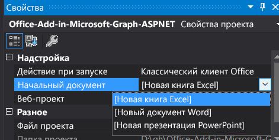

# <a name="create-an-aspnet-office-add-in-that-uses-single-sign-on-preview"></a><span data-ttu-id="ed087-103">Создание надстройки Office, в которой используется единый вход, на платформе ASP.NET (предварительная версия)</span><span class="sxs-lookup"><span data-stu-id="ed087-103">Create an ASP.NET Office Add-in that uses single sign-on (preview)</span></span>

<span data-ttu-id="ed087-104">После того как пользователи войдут в Office, ваша надстройка сможет использовать те же учетные данные для предоставления им доступа к нескольким приложениям без необходимости повторного входа.</span><span class="sxs-lookup"><span data-stu-id="ed087-104">When users are signed in to Office, your add-in can use the same credentials to permit users to access multiple applications without requiring them to sign in a second time.</span></span> <span data-ttu-id="ed087-105">Общие сведения см. в статье [Включение единого входа в надстройке Office](sso-in-office-add-ins.md).</span><span class="sxs-lookup"><span data-stu-id="ed087-105">For an overview, see [Enable SSO in an Office Add-in](sso-in-office-add-ins.md).</span></span>
<span data-ttu-id="ed087-106">Из этой статьи вы узнаете, как включить единый вход в надстройке, созданной с помощью Node.js и Express.</span><span class="sxs-lookup"><span data-stu-id="ed087-106">This article walks you through the process of enabling single sign-on (SSO) in an add-in that is built with Node.js and Express.</span></span>

> [!NOTE]
> <span data-ttu-id="ed087-107">Аналогичная статья, посвященная надстройке на основе ASP.NET, — [Создание надстройки Office на платформе Node.js с использованием единого входа](create-sso-office-add-ins-nodejs.md).</span><span class="sxs-lookup"><span data-stu-id="ed087-107">For a similar article about an ASP.NET-based add-in, see [Create a Node.js Office Add-in that uses single sign-on](create-sso-office-add-ins-nodejs.md).</span></span>

## <a name="prerequisites"></a><span data-ttu-id="ed087-108">Предварительные требования</span><span class="sxs-lookup"><span data-stu-id="ed087-108">Prerequisites</span></span>

* <span data-ttu-id="ed087-109">Visual Studio 2019 или более поздней версии.</span><span class="sxs-lookup"><span data-stu-id="ed087-109">Visual Studio 2019 or later.</span></span>

* [<span data-ttu-id="ed087-110">Office Developer Tools</span><span class="sxs-lookup"><span data-stu-id="ed087-110">Office Developer Tools</span></span>](https://www.visualstudio.com/features/office-tools-vs.aspx)

[!include[additional prerequisites](../includes/sso-tutorial-prereqs.md)]

* <span data-ttu-id="ed087-111">Несколько файлов и папок, сохраненных в OneDrive для бизнеса в составе подписки на Office 365.</span><span class="sxs-lookup"><span data-stu-id="ed087-111">At least a few files and folders stored on OneDrive for Business in your Office 365 subscription.</span></span>

* <span data-ttu-id="ed087-112">Подписка на Microsoft Azure.</span><span class="sxs-lookup"><span data-stu-id="ed087-112">A Microsoft Azure subscription.</span></span> <span data-ttu-id="ed087-113">Эта надстройка требует наличия Azure Active Directory (AD).</span><span class="sxs-lookup"><span data-stu-id="ed087-113">This add-in requires Azure Active Directory (AD).</span></span> <span data-ttu-id="ed087-114">В Azure AD доступны службы идентификации, которые приложения используют для проверки подлинности и авторизации.</span><span class="sxs-lookup"><span data-stu-id="ed087-114">Azure AD provides identity services that applications use for authentication and authorization.</span></span> <span data-ttu-id="ed087-115">Пробную подписку можно получить на сайте [Microsoft Azure](https://account.windowsazure.com/SignUp).</span><span class="sxs-lookup"><span data-stu-id="ed087-115">A trial subscription can be acquired at [Microsoft Azure](https://account.windowsazure.com/SignUp).</span></span>

## <a name="set-up-the-starter-project"></a><span data-ttu-id="ed087-116">Настройка начального проекта</span><span class="sxs-lookup"><span data-stu-id="ed087-116">Set up the starter project</span></span>

<span data-ttu-id="ed087-117">Клонируйте или скачайте репозиторий [Office Add-in ASPNET SSO](https://github.com/officedev/office-add-in-aspnet-sso).</span><span class="sxs-lookup"><span data-stu-id="ed087-117">Clone or download the repo at [Office Add-in ASPNET SSO](https://github.com/officedev/office-add-in-aspnet-sso).</span></span>

> [!NOTE]
> <span data-ttu-id="ed087-118">Существует две версии примера.</span><span class="sxs-lookup"><span data-stu-id="ed087-118">There are two versions of the sample:</span></span>
>
> * <span data-ttu-id="ed087-p103">В папке **Before** находится начальный проект. Пользовательский интерфейс и другие аспекты надстройки, не связанные непосредственно с единым входом и авторизацией, уже готовы. В последующих разделах этой статьи рассматривается доработка проекта.</span><span class="sxs-lookup"><span data-stu-id="ed087-p103">The **Before** folder is a starter project. The UI and other aspects of the add-in that are not directly connected to SSO or authorization are already done. Later sections of this article walk you through the process of completing it.</span></span>
> * <span data-ttu-id="ed087-122">Версия примера в папке **Complete** идентична надстройке, которую вы бы создали, выполнив процедуры из этой статьи, за тем исключением, что готовый проект содержит комментарии к коду. В них нет необходимости, если вы читаете эту статью.</span><span class="sxs-lookup"><span data-stu-id="ed087-122">The **Complete** version of the sample is just like the add-in that you would have if you completed the procedures of this article, except that the completed project has code comments that would be redundant with the text of this article.</span></span> <span data-ttu-id="ed087-123">Чтобы использовать готовую версию, просто выполните действия, описанные в этой статье, но замените папку "Before" на папку "Complete" и пропустите разделы **Код на стороне клиента** и **Код на стороне сервера**.</span><span class="sxs-lookup"><span data-stu-id="ed087-123">To use the completed version, just follow the instructions in this article, but replace "Before" with "Complete" and skip the sections **Code the client side** and **Code the server side**.</span></span>


## <a name="register-the-add-in-with-azure-ad-v20-endpoint"></a><span data-ttu-id="ed087-124">Регистрация надстройки в конечной точке Azure AD версии 2.0</span><span class="sxs-lookup"><span data-stu-id="ed087-124">Register the add-in with Azure AD v2.0 endpoint</span></span>

1. <span data-ttu-id="ed087-125">Перейдите на страницу [регистрации приложений портала Azure](https://go.microsoft.com/fwlink/?linkid=2083908), чтобы зарегистрировать свое приложение.</span><span class="sxs-lookup"><span data-stu-id="ed087-125">Navigate to the [Azure portal - App registrations](https://go.microsoft.com/fwlink/?linkid=2083908) page to register your app.</span></span>

1. <span data-ttu-id="ed087-126">Войдите в клиент Office 365, используя учетные данные ***администратора***.</span><span class="sxs-lookup"><span data-stu-id="ed087-126">Sign in with the ***admin*** credentials to your Office 365 tenancy.</span></span> <span data-ttu-id="ed087-127">Пример: MyName@contoso.onmicrosoft.com.</span><span class="sxs-lookup"><span data-stu-id="ed087-127">For example, MyName@contoso.onmicrosoft.com.</span></span>

1. <span data-ttu-id="ed087-128">Выберите **Новая регистрация**.</span><span class="sxs-lookup"><span data-stu-id="ed087-128">Select **New registration**.</span></span> <span data-ttu-id="ed087-129">На странице**Зарегистрировать приложение** задайте необходимые значения следующим образом.</span><span class="sxs-lookup"><span data-stu-id="ed087-129">On the **Register an application** page, set the values as follows.</span></span>

    * <span data-ttu-id="ed087-130">Введите **имя** `Office-Add-in-ASPNET-SSO`.</span><span class="sxs-lookup"><span data-stu-id="ed087-130">Set **Name** to `Office-Add-in-ASPNET-SSO`.</span></span>
    * <span data-ttu-id="ed087-131">Для параметра **Поддерживаемые типы учетных записей** укажите вариант **Учетные записи в любом каталоге организации (любой каталог Azure AD — мультитенантный) и личные учетные записи Майкрософт (например, Skype, Xbox)**.</span><span class="sxs-lookup"><span data-stu-id="ed087-131">Set **Supported account types** to **Accounts in any organizational directory (Any Azure AD directory - Multitenant) and personal Microsoft accounts (e.g. Skype, Xbox)**.</span></span> <span data-ttu-id="ed087-132">(Если вы хотите, чтобы надстройка была доступна пользователям только в клиенте, в котором вы ее регистрируете, можно выбрать вариант **Учетные записи только в этом каталоге организации…**, но вам потребуется выполнить дополнительные действия по настройке.</span><span class="sxs-lookup"><span data-stu-id="ed087-132">(If you want the add-in to be usable only by users in the tenancy where you are registering it, you can choose **Accounts in this organizational directory only ...** instead, but you will need to go through some additional setup steps.</span></span> <span data-ttu-id="ed087-133">См. раздел **Настройка в однотенантном режиме** ниже.)</span><span class="sxs-lookup"><span data-stu-id="ed087-133">See **Setup for single-tenant** below.)</span></span>
    * <span data-ttu-id="ed087-134">Убедитесь, что в разделе **URI перенаправления** в раскрывающемся списке выбран пункт **Интернет**, и задайте для URI значение ` https://localhost:44355/AzureADAuth/Authorize`.</span><span class="sxs-lookup"><span data-stu-id="ed087-134">In the **Redirect URI** section, ensure that **Web** is selected in the drop down and then set the URI to` https://localhost:44355/AzureADAuth/Authorize`.</span></span>
    * <span data-ttu-id="ed087-135">Нажмите кнопку **Зарегистрировать**.</span><span class="sxs-lookup"><span data-stu-id="ed087-135">Choose **Register**.</span></span>

1. <span data-ttu-id="ed087-136">На странице **Office-Add-in-NodeJS-SSO** скопируйте и сохраните значения параметров **Идентификатор приложения (клиент)** и **Идентификатор каталога (клиент)**.</span><span class="sxs-lookup"><span data-stu-id="ed087-136">On the **Office-Add-in-NodeJS-SSO** page, copy and save the values for the **Application (client) ID** and the **Directory (tenant) ID**.</span></span> <span data-ttu-id="ed087-137">Они понадобятся вам позже.</span><span class="sxs-lookup"><span data-stu-id="ed087-137">You'll use both of them in later procedures.</span></span>

    > [!NOTE]
    > <span data-ttu-id="ed087-138">Этот идентификатор представляет собой значение аудитории, используемое, когда другие приложения, например ведущее приложение Office (PowerPoint, Word, Excel и т. д.), пытаются получить авторизованный доступ к вашему приложению.</span><span class="sxs-lookup"><span data-stu-id="ed087-138">This ID is the "audience" value when other applications, such as the Office host application (e.g., PowerPoint, Word, Excel), seek authorized access to the application.</span></span> <span data-ttu-id="ed087-139">Кроме того, он используется как идентификатор клиента, когда приложение, в свою очередь, пытается получить авторизованный доступ к Microsoft Graph.</span><span class="sxs-lookup"><span data-stu-id="ed087-139">It is also the "client ID" of the application when it, in turn, seeks authorized access to Microsoft Graph.</span></span>

1. <span data-ttu-id="ed087-140">В разделе **Управление** выберите **Сертификаты и секреты**.</span><span class="sxs-lookup"><span data-stu-id="ed087-140">Under **Manage**, select **Certificates & secrets**.</span></span> <span data-ttu-id="ed087-141">Нажмите кнопку **Новый секрет клиента**.</span><span class="sxs-lookup"><span data-stu-id="ed087-141">Select the **New client secret** button.</span></span> <span data-ttu-id="ed087-142">Введите значение параметра **Описание**, выберите соответствующий вариант для параметра **Истекает срок действия** и нажмите кнопку **Добавить**.</span><span class="sxs-lookup"><span data-stu-id="ed087-142">Enter a value for **Description**, then select an appropriate option for **Expires** and choose **Add**.</span></span> <span data-ttu-id="ed087-143">*Сразу скопируйте значение секрета клиента и сохраните его с идентификатором приложения* перед продолжением, так как он понадобится вам позже.</span><span class="sxs-lookup"><span data-stu-id="ed087-143">*Copy the client secret value immediately and save it with the application ID* before proceeding as you'll need it in a later procedure.</span></span>

1. <span data-ttu-id="ed087-144">В разделе **Управление** выберите **Предоставление API**.</span><span class="sxs-lookup"><span data-stu-id="ed087-144">Under **Manage**, select **Expose an API**.</span></span> <span data-ttu-id="ed087-145">Щелкните ссылку **Задать**, чтобы создать URI идентификатора приложения в формате "api://$ИД приложения GUID$", где $App ID GUID$ — **идентификатор приложения (клиента)**.</span><span class="sxs-lookup"><span data-stu-id="ed087-145">Select the **Set** link to generate the Application ID URI in the form "api://$App ID GUID$", where $App ID GUID$ is the **Application (client) ID**.</span></span> <span data-ttu-id="ed087-146">Вставьте `localhost:44355/` (обратите внимание на знак косой черты "/", добавленный в конце) после `//` и перед GUID.</span><span class="sxs-lookup"><span data-stu-id="ed087-146">Insert `localhost:44355/` (note the forward slash "/" appended to the end) after the `//` and before the GUID.</span></span> <span data-ttu-id="ed087-147">Весь идентификатор должен отображаться в формате `api://localhost:44355/$App ID GUID$`, например: `api://localhost:44355/c6c1f32b-5e55-4997-881a-753cc1d563b7`.</span><span class="sxs-lookup"><span data-stu-id="ed087-147">The entire ID should have the form `api://localhost:44355/$App ID GUID$`; for example `api://localhost:44355/c6c1f32b-5e55-4997-881a-753cc1d563b7`.</span></span>

1. <span data-ttu-id="ed087-148">В диалоговом окне выберите **Сохранить**.</span><span class="sxs-lookup"><span data-stu-id="ed087-148">Select **Save** on the dialog.</span></span>

1. <span data-ttu-id="ed087-149">Нажмите кнопку **Добавить область**.</span><span class="sxs-lookup"><span data-stu-id="ed087-149">Select the **Add a scope** button.</span></span> <span data-ttu-id="ed087-150">В открывшейся панели введите `access_as_user` в качестве параметра **Имя области**.</span><span class="sxs-lookup"><span data-stu-id="ed087-150">In the panel that opens, enter `access_as_user` as the **Scope** name.</span></span>

1. <span data-ttu-id="ed087-151">Для параметра **Кто может давать согласие?** установите вариант **Администраторы и пользователи**.</span><span class="sxs-lookup"><span data-stu-id="ed087-151">Set **Who can consent?** to **Admins and users**.</span></span>

1. <span data-ttu-id="ed087-152">Заполните поля для настройки запросов согласия администраторов и пользователей значениями, соответствующими области `access_as_user`, позволяющей ведущему приложению Office использовать веб-интерфейсы API надстройки с такими же правами, как у текущего пользователя.</span><span class="sxs-lookup"><span data-stu-id="ed087-152">Fill in the fields for configuring the admin and user consent prompts with values that are appropriate for the `access_as_user` scope which enables the Office host application to use your add-in's web APIs with the same rights as the current user.</span></span> <span data-ttu-id="ed087-153">Возможные варианты:</span><span class="sxs-lookup"><span data-stu-id="ed087-153">Suggestions:</span></span>

    - <span data-ttu-id="ed087-154">**Отображаемое имя согласия администратора**. Office может действовать в качестве пользователя.</span><span class="sxs-lookup"><span data-stu-id="ed087-154">**Admin consent title**: Office can act as the user.</span></span>
    - <span data-ttu-id="ed087-155">**Описание согласия администратора**. Позволяет Office вызывать веб-API надстройки с такими же правами, как у текущего пользователя.</span><span class="sxs-lookup"><span data-stu-id="ed087-155">**Admin consent description**: Enable Office to call the add-in's web APIs with the same rights as the current user.</span></span>
    - <span data-ttu-id="ed087-156">**Отображаемое имя согласия пользователя**. Office может действовать от вашего имени.</span><span class="sxs-lookup"><span data-stu-id="ed087-156">**User consent title**: Office can act as you.</span></span>
    - <span data-ttu-id="ed087-157">**Описание согласия администратора**. Позволяет Office вызывать веб-API надстройки с такими же правами, как у вас.</span><span class="sxs-lookup"><span data-stu-id="ed087-157">**Admin consent description**: Enable Office to call the add-in's web APIs with the same rights that you have.</span></span>

1. <span data-ttu-id="ed087-158">Убедитесь, что параметру **Состояние** присвоено значение **Включено**.</span><span class="sxs-lookup"><span data-stu-id="ed087-158">Ensure that **State** is set to **Enabled**.</span></span>

1. <span data-ttu-id="ed087-159">Нажмите кнопку **Добавить область**.</span><span class="sxs-lookup"><span data-stu-id="ed087-159">Select **Add scope** .</span></span>

    > [!NOTE]
    > <span data-ttu-id="ed087-160">Доменная часть имени **области**, отображаемая непосредственно под текстовым полем, должна автоматически соответствовать URI идентификатора приложения, заданного ранее, с добавлением `/access_as_user` в конце, например: `api://localhost:6789/c6c1f32b-5e55-4997-881a-753cc1d563b7/access_as_user`.</span><span class="sxs-lookup"><span data-stu-id="ed087-160">The domain part of the **Scope** name displayed just below the text field should automatically match the Application ID URI that you set earlier, with `/access_as_user` appended to the end; for example, `api://localhost:6789/c6c1f32b-5e55-4997-881a-753cc1d563b7/access_as_user`.</span></span>

1. <span data-ttu-id="ed087-161">В разделе **Авторизованные клиентские приложения** укажите приложения, которые необходимо авторизовать для веб-приложения надстройки.</span><span class="sxs-lookup"><span data-stu-id="ed087-161">In the **Authorized client applications** section, you identify the applications that you want to authorize to your add-in's web application.</span></span> <span data-ttu-id="ed087-162">Необходимо обеспечить предварительную авторизацию для всех указанных ниже идентификаторов.</span><span class="sxs-lookup"><span data-stu-id="ed087-162">Each of the following IDs needs to be pre-authorized.</span></span>

    - <span data-ttu-id="ed087-163">`d3590ed6-52b3-4102-aeff-aad2292ab01c` (Microsoft Office).</span><span class="sxs-lookup"><span data-stu-id="ed087-163">`d3590ed6-52b3-4102-aeff-aad2292ab01c` (Microsoft Office)</span></span>
    - <span data-ttu-id="ed087-164">`ea5a67f6-b6f3-4338-b240-c655ddc3cc8e` (Microsoft Office).</span><span class="sxs-lookup"><span data-stu-id="ed087-164">`ea5a67f6-b6f3-4338-b240-c655ddc3cc8e` (Microsoft Office)</span></span>
    - <span data-ttu-id="ed087-165">`57fb890c-0dab-4253-a5e0-7188c88b2bb4` (Office в Интернете).</span><span class="sxs-lookup"><span data-stu-id="ed087-165">`57fb890c-0dab-4253-a5e0-7188c88b2bb4` (Office on the web)</span></span>
    - <span data-ttu-id="ed087-166">`bc59ab01-8403-45c6-8796-ac3ef710b3e3` (Outlook в Интернете).</span><span class="sxs-lookup"><span data-stu-id="ed087-166">`bc59ab01-8403-45c6-8796-ac3ef710b3e3` (Outlook on the web)</span></span>

    <span data-ttu-id="ed087-167">Для каждого идентификатора сделайте следующее:</span><span class="sxs-lookup"><span data-stu-id="ed087-167">For each ID, take these steps:</span></span>

    <span data-ttu-id="ed087-168">а)</span><span class="sxs-lookup"><span data-stu-id="ed087-168">a.</span></span> <span data-ttu-id="ed087-169">Нажмите кнопку **Добавить клиентское приложение**, в открывшейся панели присвойте параметру "Идентификатор клиента" соответствующий код GUID и установите флажок `api://localhost:44355/$App ID GUID$/access_as_user`.</span><span class="sxs-lookup"><span data-stu-id="ed087-169">Select **Add a client application** button and then, in the panel that opens, set the Client ID to the respective GUID and check the box for `api://localhost:44355/$App ID GUID$/access_as_user`.</span></span>

    <span data-ttu-id="ed087-170">б)</span><span class="sxs-lookup"><span data-stu-id="ed087-170">b.</span></span> <span data-ttu-id="ed087-171">Нажмите кнопку **Добавить приложение**.</span><span class="sxs-lookup"><span data-stu-id="ed087-171">Select **Add application**.</span></span>

1. <span data-ttu-id="ed087-172">В разделе **Управление** выберите **Разрешения API** и нажмите кнопку **Добавить разрешение**.</span><span class="sxs-lookup"><span data-stu-id="ed087-172">Under **Manage**, select **API permissions** and then select **Add a permission**.</span></span> <span data-ttu-id="ed087-173">В открывшейся панели выберите **Microsoft Graph** и щелкните **Делегированные разрешения**.</span><span class="sxs-lookup"><span data-stu-id="ed087-173">On the panel that opens, choose **Microsoft Graph** and then choose **Delegated permissions**.</span></span>

1. <span data-ttu-id="ed087-174">Используйте поле поиска **Выбрать разрешения**, чтобы найти нужные разрешения для надстройки.</span><span class="sxs-lookup"><span data-stu-id="ed087-174">Use the **Select permissions** search box to search for the permissions your add-in needs.</span></span> <span data-ttu-id="ed087-175">Выберите следующие параметры.</span><span class="sxs-lookup"><span data-stu-id="ed087-175">Select the following.</span></span> <span data-ttu-id="ed087-176">Для самой надстройки требуется только первое разрешение, но разрешение `profile` необходимо, чтобы ведущее приложение Office получило маркер для веб-приложения надстройки.</span><span class="sxs-lookup"><span data-stu-id="ed087-176">Only the first is really required by your add-in itself; but the `profile` permission is required for the Office host to get a token to your add-in web application.</span></span> <span data-ttu-id="ed087-177">(Для надстройки требуются только разрешения Files.Read.All и profile.</span><span class="sxs-lookup"><span data-stu-id="ed087-177">(Only Files.Read.All and profile are actually needed by the add-in.</span></span> <span data-ttu-id="ed087-178">Остальные два необходимо запросить для библиотеки MSAL.NET.)</span><span class="sxs-lookup"><span data-stu-id="ed087-178">You must request the other two because the MSAL.NET library requires them.)</span></span>

    * <span data-ttu-id="ed087-179">Files.Read.All</span><span class="sxs-lookup"><span data-stu-id="ed087-179">Files.Read.All</span></span>
    * <span data-ttu-id="ed087-180">offline_access</span><span class="sxs-lookup"><span data-stu-id="ed087-180">offline_access</span></span>
    * <span data-ttu-id="ed087-181">openid</span><span class="sxs-lookup"><span data-stu-id="ed087-181">openid</span></span>
    * <span data-ttu-id="ed087-182">profile</span><span class="sxs-lookup"><span data-stu-id="ed087-182">profile</span></span>

    > [!NOTE]
    > <span data-ttu-id="ed087-183">Разрешение `User.Read` может быть уже указано по умолчанию.</span><span class="sxs-lookup"><span data-stu-id="ed087-183">The `User.Read` permission may already be listed by default.</span></span> <span data-ttu-id="ed087-184">Незачем запрашивать ненужные разрешения, поэтому рекомендуем снять флажок рядом с разрешением, которое не требуется вашей надстройке.</span><span class="sxs-lookup"><span data-stu-id="ed087-184">It is a good practice not to ask for permissions that are not needed, so we recommend that you uncheck the box for this permission if your add-in does not actually need it.</span></span>

1. <span data-ttu-id="ed087-185">Установите флажок для каждого отображаемого разрешения.</span><span class="sxs-lookup"><span data-stu-id="ed087-185">Select the check box for each permission as it appears.</span></span> <span data-ttu-id="ed087-186">Выбрав нужные для надстройки разрешения, нажмите кнопку **Добавить разрешения** в нижней части панели.</span><span class="sxs-lookup"><span data-stu-id="ed087-186">After selecting the permissions that your add-in needs, select the **Add permissions** button at the bottom of the panel.</span></span>

1. <span data-ttu-id="ed087-187">На этой же странице нажмите кнопку **Предоставить согласие администратора для [имя клиента]** и выберите **Принять** в появившемся запросе подтверждения.</span><span class="sxs-lookup"><span data-stu-id="ed087-187">On the same page, choose the **Grant admin consent for [tenant name]** button, and then select **Accept** for the confirmation that appears.</span></span>

    > [!NOTE]
    > <span data-ttu-id="ed087-188">После нажатия кнопки **Предоставить согласие администратора для [имя клиента]** может появиться сообщение баннера с просьбой повторить попытку через несколько минут, чтобы можно было создать запрос на продолжение.</span><span class="sxs-lookup"><span data-stu-id="ed087-188">After choosing **Grant admin consent for [tenant name]**, you may see a banner message asking you to try again in a few minutes so that the consent prompt can be constructed.</span></span> <span data-ttu-id="ed087-189">В этом случае вы можете перейти к следующему разделу, ***но не забудьте вернуться на портал и нажать эту кнопку***!</span><span class="sxs-lookup"><span data-stu-id="ed087-189">If so, you can start work on the next section, ***but don't forget to come back to the portal and press this button***!</span></span>

## <a name="configure-the-solution"></a><span data-ttu-id="ed087-190">Настройка решения</span><span class="sxs-lookup"><span data-stu-id="ed087-190">Configure the solution</span></span>

1. <span data-ttu-id="ed087-191">В корне папки **Before** откройте SLN-файл решения в **Visual Studio**.</span><span class="sxs-lookup"><span data-stu-id="ed087-191">In the root of the **Before** folder, open the solution (.sln) file in **Visual Studio**.</span></span> <span data-ttu-id="ed087-192">В **обозревателе решений** щелкните правой кнопкой мыши верхний узел (узел решения, а не узлы проектов) и выберите **Назначить запускаемые проекты**.</span><span class="sxs-lookup"><span data-stu-id="ed087-192">Right-click the top node in **Solution Explorer** (the Solution node, not either of the project nodes), and then select **Set startup projects**.</span></span>

1. <span data-ttu-id="ed087-193">В разделе **Общие свойства** выберите **Запускаемый проект**, а затем **Несколько запускаемых проектов**.</span><span class="sxs-lookup"><span data-stu-id="ed087-193">Under **Common Properties**, select **Startup Project**, and then **Multiple startup projects**.</span></span> <span data-ttu-id="ed087-194">Убедитесь, что для параметра **Действие** в обоих проектах установлено значение **Запуск** и что проект, заканчивающийся на "...WebAPI", указан в списке первым.</span><span class="sxs-lookup"><span data-stu-id="ed087-194">Ensure that the **Action** for both projects is set to **Start**, and that the project that ends in "...WebAPI" is listed first.</span></span> <span data-ttu-id="ed087-195">Закройте диалоговое окно.</span><span class="sxs-lookup"><span data-stu-id="ed087-195">Close the dialog.</span></span>

1. <span data-ttu-id="ed087-196">Вернувшись в **Обозреватель решений**, выберите (не используя правую кнопку мыши) проект **Office-Add-in-Microsoft-Graph-ASPNETWebAPI**.</span><span class="sxs-lookup"><span data-stu-id="ed087-196">Back in **Solution Explorer**, select (don't right-click) the **Office-Add-in-Microsoft-Graph-ASPNETWebAPI** project.</span></span> <span data-ttu-id="ed087-197">Откроется область **Свойства**.</span><span class="sxs-lookup"><span data-stu-id="ed087-197">The **Properties** pane opens.</span></span> <span data-ttu-id="ed087-198">Убедитесь, что для параметра **SSL включен** задано значение **True**.</span><span class="sxs-lookup"><span data-stu-id="ed087-198">Ensure that **SSL Enabled** is **True**.</span></span> <span data-ttu-id="ed087-199">Убедитесь, что **URL-адрес SSL** указан как `http://localhost:44355/`.</span><span class="sxs-lookup"><span data-stu-id="ed087-199">Verify that the **SSL URL** is `http://localhost:44355/`.</span></span>

1. <span data-ttu-id="ed087-200">В файле web.config используйте значения, скопированные ранее.</span><span class="sxs-lookup"><span data-stu-id="ed087-200">In "Web.config", use the values that you copied in earlier.</span></span> <span data-ttu-id="ed087-201">Для **ida:ClientID** и **ida:Audience** укажите **идентификатор приложения (клиента)**, для **ida:Password** — секрет клиента.</span><span class="sxs-lookup"><span data-stu-id="ed087-201">Set both the **ida:ClientID** and the **ida:Audience** to your **Application (client) ID**, and set **ida:Password** to your client secret.</span></span>

    > [!NOTE]
    > <span data-ttu-id="ed087-202">**Идентификатор приложения (клиента)** представляет собой значение аудитории, используемое, когда другие приложения, например ведущее приложение Office (PowerPoint, Word, Excel), пытаются получить авторизованный доступ к вашему приложению.</span><span class="sxs-lookup"><span data-stu-id="ed087-202">The **Application (client) ID** is the "audience" value when other applications, such as the Office host application (e.g., PowerPoint, Word, Excel), seek authorized access to the application.</span></span> <span data-ttu-id="ed087-203">Кроме того, он используется как идентификатор клиента, когда приложение, в свою очередь, пытается получить авторизованный доступ к Microsoft Graph.</span><span class="sxs-lookup"><span data-stu-id="ed087-203">It is also the "client ID" of the application when it, in turn, seeks authorized access to Microsoft Graph.</span></span>

1. <span data-ttu-id="ed087-204">Если вы не указали вариант "Учетные записи только в этом каталоге организации" для параметра **ПОДДЕРЖИВАЕМЫЕ ТИПЫ УЧЕТНЫХ ЗАПИСЕЙ** при регистрации настройки, сохраните и закройте файл web.config. В противном случае сохраните его, но оставьте открытым. </span><span class="sxs-lookup"><span data-stu-id="ed087-204">If you didn't choose "Accounts in this organizational directory only" for **SUPPORTED ACCOUNT TYPES** when you registered the add-in, save and close the web.config. Otherwise, save but leave it open.</span></span>

1. <span data-ttu-id="ed087-205">В **обозревателе решений** выберите проект **Office-Add-in-Microsoft-Graph-ASPNET** и откройте файл манифеста надстройки Office-Add-in-ASPNET-SSO.xml, а затем прокрутите вниз до конца файла. </span><span class="sxs-lookup"><span data-stu-id="ed087-205">Still in **Solution Explorer**, choose the **Office-Add-in-Microsoft-Graph-ASPNET** project and open the add-in manifest file “Office-Add-in-ASPNET-SSO.xml” and then scroll to the bottom of the file.</span></span> <span data-ttu-id="ed087-206">Над закрывающим тегом `</VersionOverrides>` вы найдете следующую разметку:</span><span class="sxs-lookup"><span data-stu-id="ed087-206">Just above the end `</VersionOverrides>` tag, you'll find the following markup:</span></span>

    ```xml
    <WebApplicationInfo>
      <Id>$application_GUID here$</Id>
      <Resource>api://localhost:44355/$application_GUID here$</Resource>
      <Scopes>
          <Scope>Files.Read.All</Scope>
          <Scope>offline_access</Scope>
          <Scope>openid</Scope>
          <Scope>profile</Scope>
      </Scopes>
    </WebApplicationInfo>
    ```

1. <span data-ttu-id="ed087-207">Замените заполнитель "$application_GUID here$" *в обоих местах* разметки идентификатором приложения, скопированным при регистрации надстройки.</span><span class="sxs-lookup"><span data-stu-id="ed087-207">Replace the placeholder “$application_GUID here$” *in both places* in the markup with the Application ID that you copied when you registered your add-in.</span></span> <span data-ttu-id="ed087-208">Символы "$" не входят в состав идентификатора, их не нужно вставлять.</span><span class="sxs-lookup"><span data-stu-id="ed087-208">The "$" signs are not part of the ID, so do not include them.</span></span> <span data-ttu-id="ed087-209">Это тот же идентификатор, который использовался для ClientID и Audience в файле web.config.</span><span class="sxs-lookup"><span data-stu-id="ed087-209">This is the same ID you used in for the ClientID and Audience in the web.config.</span></span>

  > [!NOTE]
  > <span data-ttu-id="ed087-210">Значение **Resource** — это **URI идентификатора приложения**, указанный при регистрации надстройки.</span><span class="sxs-lookup"><span data-stu-id="ed087-210">The **Resource** value is the **Application ID URI** you set when you registered the add-in.</span></span> <span data-ttu-id="ed087-211">Раздел **Scopes** используется для создания диалогового окна согласия, только если надстройка продается в AppSource.</span><span class="sxs-lookup"><span data-stu-id="ed087-211">The **Scopes** section is used only to generate a consent dialog box if the add-in is sold through AppSource.</span></span>

1. <span data-ttu-id="ed087-212">Сохраните и закройте файл.</span><span class="sxs-lookup"><span data-stu-id="ed087-212">Save and close the file.</span></span>

### <a name="setup-for-single-tenant"></a><span data-ttu-id="ed087-213">Настройка в однотенантном режиме</span><span class="sxs-lookup"><span data-stu-id="ed087-213">Setup for single-tenant</span></span>

<span data-ttu-id="ed087-214">Если вы указали вариант "Учетные записи только в этом каталоге организации" для параметра **ПОДДЕРЖИВАЕМЫЕ ТИПЫ УЧЕТНЫХ ЗАПИСЕЙ** при регистрации надстройки, необходимо выполнить дополнительные шаги настройки. </span><span class="sxs-lookup"><span data-stu-id="ed087-214">If you chose "Accounts in this organizational directory only" for **SUPPORTED ACCOUNT TYPES** when you registered the add-in, you need to take these additional setup steps:</span></span>

1. <span data-ttu-id="ed087-215">Вернитесь на портал Azure и откройте колонку **Обзор** регистрации надстройки.</span><span class="sxs-lookup"><span data-stu-id="ed087-215">Go back to the Azure Portal and open the **Overview** blade of the add-in's registration.</span></span> <span data-ttu-id="ed087-216">Скопируйте **Идентификатор каталога (клиента)**.</span><span class="sxs-lookup"><span data-stu-id="ed087-216">Copy the **Directory (tenant) ID**.</span></span>

1. <span data-ttu-id="ed087-217">В файле web.config замените "common" в значении **ida:Authority** на GUID, скопированный на предыдущем шаге.  </span><span class="sxs-lookup"><span data-stu-id="ed087-217">In the web.config, replace the "common" in the value of **ida:Authority** with the GUID you copied in the preceding step.</span></span> <span data-ttu-id="ed087-218">После этого значение должно выглядеть следующим образом: `<add key="ida:Authority" value="https://login.microsoftonline.com/12345678-91ab-cdef-0123-456789abcdef/oauth2/v2.0" />`.</span><span class="sxs-lookup"><span data-stu-id="ed087-218">When you are finished the value should look similar to this: `<add key="ida:Authority" value="https://login.microsoftonline.com/12345678-91ab-cdef-0123-456789abcdef/oauth2/v2.0" />`.</span></span>

1. <span data-ttu-id="ed087-219">Сохраните и закройте файл web.config.</span><span class="sxs-lookup"><span data-stu-id="ed087-219">Save and close the web.config.</span></span>

## <a name="code-the-client-side"></a><span data-ttu-id="ed087-220">Код на стороне клиента</span><span class="sxs-lookup"><span data-stu-id="ed087-220">Code the client side</span></span>

1. <span data-ttu-id="ed087-221">Откройте файл HomeES6.js в папке **Scripts**.</span><span class="sxs-lookup"><span data-stu-id="ed087-221">Open the HomeES6.js file in the **Scripts** folder.</span></span> <span data-ttu-id="ed087-222">В нем уже есть следующий код:</span><span class="sxs-lookup"><span data-stu-id="ed087-222">It already has some code in it:</span></span>

    * <span data-ttu-id="ed087-223">Полизаполнение, которое назначает объект Office.Promise глобальному объекту window, чтобы надстройка могла работать, если в Office используется пользовательский интерфейс Internet Explorer.</span><span class="sxs-lookup"><span data-stu-id="ed087-223">A polyfill that assigns the Office.Promise object to the global window object so that the add-in can run when Office is using Internet Explorer for the UI.</span></span> <span data-ttu-id="ed087-224">(Дополнительные сведения см. в статье [Браузеры, используемые надстройками Office](../concepts/browsers-used-by-office-web-add-ins.md).)</span><span class="sxs-lookup"><span data-stu-id="ed087-224">(For more information, see [Browsers used by Office Add-ins](../concepts/browsers-used-by-office-web-add-ins.md).)</span></span>
    * <span data-ttu-id="ed087-225">Назначение методу `Office.initialize`, которое, в свою очередь, назначает обработчик события для нажатия кнопки `getGraphAccessTokenButton`.</span><span class="sxs-lookup"><span data-stu-id="ed087-225">An assignment to the `Office.initialize` method that, in turn, assigns a handler to the `getGraphAccessTokenButton` button click event.</span></span>
    * <span data-ttu-id="ed087-226">Метод `showResult` для отображения сообщения об ошибке (или данных, возвращаемых из Microsoft Graph) в нижней части области задач.</span><span class="sxs-lookup"><span data-stu-id="ed087-226">A `showResult` method that will display data returned from Microsoft Graph (or an error message) at the bottom of the task pane.</span></span>
    * <span data-ttu-id="ed087-227">Метод `logErrors` для регистрации в консоли ошибок, которые не предназначены для пользователя.</span><span class="sxs-lookup"><span data-stu-id="ed087-227">A `logErrors` method that will log to console errors that are not intended for the end user.</span></span>
    * <span data-ttu-id="ed087-228">Код для реализации резервной системы авторизации, которая будет использоваться надстройкой в сценариях, где единый вход не поддерживается или возникла ошибка единого входа.</span><span class="sxs-lookup"><span data-stu-id="ed087-228">Code that implements the fallback authorization system that the add-in will use in scenarios where SSO is not supported or has errored.</span></span>

1. <span data-ttu-id="ed087-229">Под назначением методу `Office.initialize` добавьте приведенный ниже код.</span><span class="sxs-lookup"><span data-stu-id="ed087-229">Below the assignment to `Office.initialize`, add the code below.</span></span> <span data-ttu-id="ed087-230">Обратите внимание на следующие особенности этого кода:</span><span class="sxs-lookup"><span data-stu-id="ed087-230">Note the following about this code:</span></span>

    * <span data-ttu-id="ed087-231">При обработке ошибок в надстройке иногда автоматически выполняется еще одна попытка получить маркер доступа с помощью другого набора параметров.</span><span class="sxs-lookup"><span data-stu-id="ed087-231">The error-handling in the add-in will sometimes automatically attempt a second time to get an access token, using a different set of options.</span></span> <span data-ttu-id="ed087-232">Переменная счетчика `retryGetAccessToken` используется, чтобы предотвратить циклическое повторение неудачных попыток получить маркер.</span><span class="sxs-lookup"><span data-stu-id="ed087-232">The counter variable `retryGetAccessToken` is used to ensure that the user isn't cycled repeatedly through failed attempts to get a token.</span></span>
    * <span data-ttu-id="ed087-233">Функция `getGraphData` определяется ключевым словом `async` в ES6.</span><span class="sxs-lookup"><span data-stu-id="ed087-233">The `getGraphData` function is defined with the ES6 `async` keyword.</span></span> <span data-ttu-id="ed087-234">Синтаксис ES6 значительно упрощает использование API единого входа в надстройках Office.</span><span class="sxs-lookup"><span data-stu-id="ed087-234">Using ES6 syntax makes the SSO API in Office Add-ins much easier to to use.</span></span> <span data-ttu-id="ed087-235">Это единственный файл в решении, в котором используется синтаксис, не поддерживаемый в Internet Explorer.</span><span class="sxs-lookup"><span data-stu-id="ed087-235">This is the only file in the solution that will use syntax that is not supported by Internet Explorer.</span></span> <span data-ttu-id="ed087-236">"ES6" включается в имя файла в качестве напоминания.</span><span class="sxs-lookup"><span data-stu-id="ed087-236">We put 'ES6' in the filename as a reminder.</span></span> <span data-ttu-id="ed087-237">Компилятор TSC используется в решении для компиляции этого файла в ES5, чтобы надстройка могла работать, если в Office используется пользовательский интерфейс Internet Explorer.</span><span class="sxs-lookup"><span data-stu-id="ed087-237">The solution uses the tsc transpiler to transpile this file to ES5, so that the add-in can run when Office is using Internet Explorer for the UI.</span></span> <span data-ttu-id="ed087-238">(См. файл tsconfig.json в корневой папке проекта.)</span><span class="sxs-lookup"><span data-stu-id="ed087-238">(See the tsconfig.json file in the root of the project.)</span></span>

    ```javascript
    var retryGetAccessToken = 0;

    async function getGraphData() {
        await getDataWithToken({ allowSignInPrompt: true, forMSGraphAccess: true });
    }
    ```

1. <span data-ttu-id="ed087-239">Добавьте указанную ниже функцию под функцией `getGraphData`.</span><span class="sxs-lookup"><span data-stu-id="ed087-239">Below the `getGraphData` function add the following function.</span></span> <span data-ttu-id="ed087-240">Обратите внимание, что функция `handleClientSideErrors` будет создана позже.</span><span class="sxs-lookup"><span data-stu-id="ed087-240">Note that you create the `handleClientSideErrors` function in a later step.</span></span>

    ```javascript
    async function getDataWithToken() {
        try {

            // TODO 1: Get the bootstrap token and send it to the server to exchange
            //         for an access token to Microsoft Graphn and then get the data
            //         from Microsoft Graph.

        }
        catch (exception) {
            if (exception.code) {
                handleClientSideErrors(exception);
            }
            else {
                showResult(["EXCEPTION: " + JSON.stringify(exception)]);
            }
        }
    }
    ```

1. <span data-ttu-id="ed087-241">Замените `TODO 1` приведенным ниже кодом.</span><span class="sxs-lookup"><span data-stu-id="ed087-241">Replace `TODO 1` with the following.</span></span> <span data-ttu-id="ed087-242">Вот что нужно знать об этом коде:</span><span class="sxs-lookup"><span data-stu-id="ed087-242">About this code, note:</span></span>

    * <span data-ttu-id="ed087-243">`getAccessToken` предписывает Office получить маркер начальной загрузки из Azure AD и вернуть в надстройку.</span><span class="sxs-lookup"><span data-stu-id="ed087-243">`getAccessToken` tells Office to get a bootstrap token from Azure AD and return to the add-in.</span></span>
    * <span data-ttu-id="ed087-244">`allowSignInPrompt` предписывает Office предложить пользователю выполнить вход, если он еще не вошел в Office.</span><span class="sxs-lookup"><span data-stu-id="ed087-244">`allowSignInPrompt` tells Office to prompt the user to sign in if the user isn't already signed into Office.</span></span>
    * <span data-ttu-id="ed087-245">`forMSGraphAccess` сообщает Office, что надстройка планирует заменить маркер начальной загрузки на маркер доступа к Microsoft Graph (вместо того, чтобы использовать его в качестве маркера ИД пользователя).</span><span class="sxs-lookup"><span data-stu-id="ed087-245">`forMSGraphAccess` tells Office that the add-in intends to swap the bootstrap token for an access token to Microsoft Graph (instead of just using the bootstrap token as a user ID token).</span></span> <span data-ttu-id="ed087-246">Установка этого параметра дает Office возможность отменить процесс получения маркера начальной загрузки (и вернуть код ошибки 13012), если администратор клиента пользователя не предоставил согласие надстройке.</span><span class="sxs-lookup"><span data-stu-id="ed087-246">Setting this option gives Office a chance to cancel the process of getting a bootstrap token (and return error code 13012) if the user's tenant administrator has not granted consent to the add-in.</span></span> <span data-ttu-id="ed087-247">Код на стороне клиента может реагировать на ошибку 13012, переходя на резервную систему авторизации.</span><span class="sxs-lookup"><span data-stu-id="ed087-247">The add-in's client-side code can respond to the 13012 by branching to a fallback authorization system.</span></span> <span data-ttu-id="ed087-248">Если `forMSGraphAccess` не используется и администратор не предоставил согласие, маркер начальной загрузки возвращается, но попытка заменить его в потоке "от имени" может привести к ошибке.</span><span class="sxs-lookup"><span data-stu-id="ed087-248">If the `forMSGraphAccess` is not used, and the admin has not granted consent, the bootstrap token is returned, but the attempt to exhange it with the on-behalf-of flow would result in an error.</span></span> <span data-ttu-id="ed087-249">Таким образом, параметр `forMSGraphAccess` позволяет надстройке быстро перейти на резервную систему.</span><span class="sxs-lookup"><span data-stu-id="ed087-249">Thus, the `forMSGraphAccess` option enables the add-in to branch to the fallback system quickly.</span></span>
    * <span data-ttu-id="ed087-250">Вы создадите функцию `getData` позже.</span><span class="sxs-lookup"><span data-stu-id="ed087-250">You create the `getData` function in a later step.</span></span>
    * <span data-ttu-id="ed087-251">Параметр `/api/values` является URL-адресом контроллера на стороне сервера, который будет осуществлять обмен маркерами и использовать маркер доступа, полученный обратно, для вызова Microsoft Graph.</span><span class="sxs-lookup"><span data-stu-id="ed087-251">The `/api/values` parameter is the URL of a server-side controller that will make the token exchange and use the access token it gets back to make the call to Microsoft Graph.</span></span>

    ```javascript
    let bootstrapToken = await OfficeRuntime.auth.getAccessToken({
        allowSignInPrompt: true,
        forMSGraphAccess: true });

    getData("/api/values", bootstrapToken);
    ```

1. <span data-ttu-id="ed087-252">Добавьте указанный ниже код под функцией `getGraphData`.</span><span class="sxs-lookup"><span data-stu-id="ed087-252">Below the `getGraphData` function, add the following.</span></span> <span data-ttu-id="ed087-253">Вот что нужно знать об этом коде:</span><span class="sxs-lookup"><span data-stu-id="ed087-253">About this code, note:</span></span>

    * <span data-ttu-id="ed087-254">Он используется и в системах единого входа, и в резервных системах авторизации.</span><span class="sxs-lookup"><span data-stu-id="ed087-254">It is used by both the SSO and the fallback authorization systems.</span></span>
    * <span data-ttu-id="ed087-255">Параметр `relativeUrl` является контроллером на стороне сервера.</span><span class="sxs-lookup"><span data-stu-id="ed087-255">The `relativeUrl` parameter is a server-side controller.</span></span>
    * <span data-ttu-id="ed087-256">Параметр `accessToken` может быть маркером начальной загрузки или маркером полного доступа.</span><span class="sxs-lookup"><span data-stu-id="ed087-256">The `accessToken` parameter can be a bootstrap token or a full access token.</span></span>
    * <span data-ttu-id="ed087-257">`writeFileNamesToOfficeDocument` уже включен в проект.</span><span class="sxs-lookup"><span data-stu-id="ed087-257">The `writeFileNamesToOfficeDocument` is already part of the project.</span></span>
    * <span data-ttu-id="ed087-258">Вы создадите функцию `handleServerSideErrors` позже.</span><span class="sxs-lookup"><span data-stu-id="ed087-258">You create the `handleServerSideErrors` function in a later step.</span></span>

    ```javascript
    function getData(relativeUrl, accessToken) {

        $.ajax({
            url: relativeUrl,
            headers: { "Authorization": "Bearer " + accessToken },
            type: "GET"
        })
            .done(function (result) {
                writeFileNamesToOfficeDocument(result)
                    .then(function () {
                        showResult(["Your data has been added to the document."]);
                    })
                    .catch(function (error) {
                        showResult([JSON.stringify(error)]);
                    });
            })
            .fail(function (result) {
                handleServerSideErrors(result);
            });
    }
    ```

### <a name="handle-client-side-errors"></a><span data-ttu-id="ed087-259">Обработка ошибок на стороне клиента</span><span class="sxs-lookup"><span data-stu-id="ed087-259">Handle client-side errors</span></span>

1. <span data-ttu-id="ed087-260">Добавьте указанную ниже функцию под функцией `getData`.</span><span class="sxs-lookup"><span data-stu-id="ed087-260">Below the `getData` function, add the following function.</span></span> <span data-ttu-id="ed087-261">Обратите внимание, что `error.code` — это число (обычно в диапазоне 13xxx).</span><span class="sxs-lookup"><span data-stu-id="ed087-261">Note that `error.code` is a number, usually in the range 13xxx.</span></span>

    ```javascript
    function handleClientSideErrors(error) {
        switch (error.code) {

            // TODO 2: Handle errors where the add-in should NOT invoke
            //         the alternative system of authorization.

            // TODO 3: Handle errors where the add-in should invoke
            //         the alternative system of authorization.

        }
    }
    ```

1. <span data-ttu-id="ed087-262">Замените `TODO 2` приведенным ниже кодом.</span><span class="sxs-lookup"><span data-stu-id="ed087-262">Replace `TODO 2` with the following code.</span></span> <span data-ttu-id="ed087-263">Дополнительные сведения об этих ошибках см. в статье [Устранение ошибок единого входа в надстройках Office](troubleshoot-sso-in-office-add-ins.md).</span><span class="sxs-lookup"><span data-stu-id="ed087-263">For more information about these errors, see [Troubleshoot SSO in Office Add-ins](troubleshoot-sso-in-office-add-ins.md).</span></span>

    ```javascript
    case 13001:
        // No one is signed into Office. If the add-in cannot be effectively used when no one
        // is logged into Office, then the first call of getAccessToken should pass the
        // `allowSignInPrompt: true` option.
        showResult(["No one is signed into Office. But you can use many of the add-ins functions anyway. If you want to log in, press the Get OneDrive File Names button again."]);
        break;
    case 13002:
        // The user aborted the consent prompt. If the add-in cannot be effectively used when consent
        // has not been granted, then the first call of getAccessToken should pass the `allowConsentPrompt: true` option.
        showResult(["You can use many of the add-ins functions even though you have not granted consent. If you want to grant consent, press the Get OneDrive File Names button again."]);
        break;
    case 13006:
        // Only seen in Office on the Web.
        showResult(["Office on the Web is experiencing a problem. Please sign out of Office, close the browser, and then start again."]);
        break;
    case 13008:
        // Only seen in Office on the Web.
        showResult(["Office is still working on the last operation. When it completes, try this operation again."]);
        break;
    case 13010:
        // Only seen in Office on the Web.
        showResult(["Follow the instructions to change your browser's zone configuration."]);
        break;
    ```

1. <span data-ttu-id="ed087-264">Замените `TODO 3` приведенным ниже кодом.</span><span class="sxs-lookup"><span data-stu-id="ed087-264">Replace `TODO 3` with the following code.</span></span> <span data-ttu-id="ed087-265">Во всех других случаях надстройка переходит на резервную систему авторизации.</span><span class="sxs-lookup"><span data-stu-id="ed087-265">For all other errors, the add-in branches to the fallback authorization system.</span></span> <span data-ttu-id="ed087-266">Дополнительные сведения об этих ошибках см. в статье [Устранение ошибок единого входа в надстройках Office](troubleshoot-sso-in-office-add-ins.md). В этой надстройке резервная система открывает диалоговое окно, требующее входа пользователя, даже если он уже выполнил вход, и использует msal.js и неявный поток, чтобы получить маркер доступа к Microsoft Graph.</span><span class="sxs-lookup"><span data-stu-id="ed087-266">For more information about these errors, see [Troubleshoot SSO in Office Add-ins](troubleshoot-sso-in-office-add-ins.md). In this add-in, the fallback system opens a dialog which requires the user to sign in, even if the user already is, and uses msal.js and the Implicit Flow to get an access token to Microsoft Graph.</span></span>

    ```javascript
    default:
        dialogFallback();
        break;
    ```

### <a name="handle-server-side-errors"></a><span data-ttu-id="ed087-267">Обработка ошибок на стороне сервера</span><span class="sxs-lookup"><span data-stu-id="ed087-267">Handle server-side errors</span></span>

1. <span data-ttu-id="ed087-268">Добавьте указанную ниже функцию под функцией `handleClientSideErrors`.</span><span class="sxs-lookup"><span data-stu-id="ed087-268">Below the `handleClientSideErrors` function, add the following function.</span></span>

    ```javascript
    function handleServerSideErrors(result) {

    // TODO 4: Parse the JSON response.

    // TODO 5: Handle case where Microsoft Graph requires an additional form
    //         of authentication.

    // TODO 6: Handle other Azure AD errors

    }
    ```

1. <span data-ttu-id="ed087-269">Замените `TODO 4` приведенным ниже кодом.</span><span class="sxs-lookup"><span data-stu-id="ed087-269">Replace `TODO 4` with the following.</span></span> <span data-ttu-id="ed087-270">Вот что нужно знать об этом коде: классы ошибок в ASP.NET были созданы до появления MFA.</span><span class="sxs-lookup"><span data-stu-id="ed087-270">About this code, note that ASP.NET error classes were created before there was such a thing as MFA.</span></span> <span data-ttu-id="ed087-271">Побочным эффектом того, как логика на стороне сервера обрабатывает запросы второго фактора проверки подлинности, является то, что у ошибки на стороне сервера, отправляемой клиенту, есть свойство **Message**, но нет свойства **ExceptionMessage**.</span><span class="sxs-lookup"><span data-stu-id="ed087-271">As a side-effect of how our server-side logic handles the requests for a second authentication factor, the server-side error sent to the client has a **Message** property but no **ExceptionMessage** property.</span></span> <span data-ttu-id="ed087-272">Однако у всех остальных ошибок будет свойство **ExceptionMessage**, поэтому клиентский код должен проанализировать ответ для обоих свойств. </span><span class="sxs-lookup"><span data-stu-id="ed087-272">But all other errors will have a **ExceptionMessage** property, so the client-side code has to parse the response for both.</span></span> <span data-ttu-id="ed087-273">Одна из переменных не будет определена.</span><span class="sxs-lookup"><span data-stu-id="ed087-273">Either one or the other variable will be undefined.</span></span>

    ```javascript
    var message = JSON.parse(result.responseText).Message;
    var exceptionMessage = JSON.parse(result.responseText).ExceptionMessage;
    ```

1. <span data-ttu-id="ed087-274">Замените `TODO 5` приведенным ниже кодом.</span><span class="sxs-lookup"><span data-stu-id="ed087-274">Replace `TODO 5` with the following.</span></span> <span data-ttu-id="ed087-275">Когда Microsoft Graph требует дополнительной проверки подлинности, он отправляет ошибку AADSTS50076.</span><span class="sxs-lookup"><span data-stu-id="ed087-275">When Microsoft Graph requires an additional form of authentication, it sends error AADSTS50076.</span></span> <span data-ttu-id="ed087-276">Она содержит сведения о дополнительном требовании в свойстве **Message.Claims**.</span><span class="sxs-lookup"><span data-stu-id="ed087-276">It includes information about the additional requirement in the **Message.Claims** property.</span></span> <span data-ttu-id="ed087-277">Чтобы обработать эту ошибку, код делает вторую попытку получить маркер начальной загрузки, но в этот раз он включает запрос дополнительного фактора в виде значения параметра `authChallenge`, который предписывает Azure AD предложить пользователю пройти все требуемые проверки подлинности. </span><span class="sxs-lookup"><span data-stu-id="ed087-277">To handle this, the code makes a second attempt to get the bootstrap token, but this time it includes the request for an additional factor as the value of the `authChallenge` option, which tells Azure AD to prompt the user for all required forms of authentication.</span></span>

    ```javascript
    if (message) {
        if (message.indexOf("AADSTS50076") !== -1) {
            var claims = JSON.parse(message).Claims;
            var claimsAsString = JSON.stringify(claims);
            getDataWithToken({ authChallenge: claimsAsString });
            return;
        }
    }
    ```

1. <span data-ttu-id="ed087-278">Замените `TODO 6` приведенным ниже кодом.</span><span class="sxs-lookup"><span data-stu-id="ed087-278">Replace `TODO 6` with the following.</span></span>

    ```javascript
    if (exceptionMessage) {

        // TODO 7: Handle case where bootstrap token has expired.

        // TODO 8: Handle all other Azure AD errors.
    }
    ```

1. <span data-ttu-id="ed087-279">Замените `TODO 7` приведенным ниже кодом.</span><span class="sxs-lookup"><span data-stu-id="ed087-279">Replace `TODO 7` with the following.</span></span> <span data-ttu-id="ed087-280">Обратите внимание, что иногда срок действия маркера начальной загрузки не истекает в момент его проверки в Office, но истекает ко времени его попадания в Azure AD для замены.</span><span class="sxs-lookup"><span data-stu-id="ed087-280">Note that on rare occasions the bootstrap token is unexpired when Office validates it, but expires by the time it is sent to Azure AD for exchange.</span></span> <span data-ttu-id="ed087-281">Служба Azure AD ответит ошибкой AADSTS500133.</span><span class="sxs-lookup"><span data-stu-id="ed087-281">Azure AD will respond with error AADSTS500133.</span></span> <span data-ttu-id="ed087-282">В этом случае код вызывает API единого входа (но не более одного раза).</span><span class="sxs-lookup"><span data-stu-id="ed087-282">When this happens, the code  recalls the SSO API (but no more than once).</span></span> <span data-ttu-id="ed087-283">На этот раз Office возвращает новый маркер начальной загрузки, срок действия которого не истек.  </span><span class="sxs-lookup"><span data-stu-id="ed087-283">This time Office returns a new unexpired bootstrap token.</span></span>

    ```javascript
    if ((exceptionMessage.indexOf("AADSTS500133") !== -1)
        && (retryGetAccessToken <= 0)) {

        retryGetAccessToken++;
        getGraphData();
    }
    ```

1. <span data-ttu-id="ed087-284">Замените `TODO 8` приведенным ниже кодом.</span><span class="sxs-lookup"><span data-stu-id="ed087-284">Replace `TODO 8` with the following.</span></span>

    ```javascript
    else {
        dialogFallback();
    }
    ```

1. <span data-ttu-id="ed087-285">Сохраните файл.</span><span class="sxs-lookup"><span data-stu-id="ed087-285">Save the file.</span></span>

## <a name="code-the-server-side"></a><span data-ttu-id="ed087-286">Код на стороне сервера</span><span class="sxs-lookup"><span data-stu-id="ed087-286">Code the server side</span></span>

### <a name="configure-the-owin-middleware"></a><span data-ttu-id="ed087-287">Настройка ПО промежуточного слоя OWIN</span><span class="sxs-lookup"><span data-stu-id="ed087-287">Configure the OWIN middleware</span></span>

1. <span data-ttu-id="ed087-288">Откройте файл Startup.cs в корневой папке проекта **Office-Add-in-ASPNET-SSO-WebAPI** и добавьте приведенный ниже метод в класс **Startup**.</span><span class="sxs-lookup"><span data-stu-id="ed087-288">Open the Startup.cs file in the root of the **Office-Add-in-ASPNET-SSO-WebAPI** project and add the following method to the **Startup** class.</span></span> <span data-ttu-id="ed087-289">Обратите внимание, что метод `ConfigureAuth` создается позже.</span><span class="sxs-lookup"><span data-stu-id="ed087-289">Note that you create the `ConfigureAuth` method in a later step.</span></span>

    ```csharp
    public void Configuration(IAppBuilder app)
    {
        ConfigureAuth(app);
    }
    ```

1. <span data-ttu-id="ed087-290">Сохраните и закройте файл.</span><span class="sxs-lookup"><span data-stu-id="ed087-290">Save and close the file.</span></span>

1. <span data-ttu-id="ed087-291">Щелкните правой кнопкой мыши папку **App_Start** и выберите **Добавить > Класс**.</span><span class="sxs-lookup"><span data-stu-id="ed087-291">Right-click the **App_Start** folder and select **Add > Class**.</span></span>

1. <span data-ttu-id="ed087-292">В диалоговом окне **Добавить новый элемент** введите имя файла **Startup.Auth.cs** и нажмите кнопку **Добавить**.</span><span class="sxs-lookup"><span data-stu-id="ed087-292">In the **Add new item** dialog name the file **Startup.Auth.cs** and then click **Add**.</span></span>

1. <span data-ttu-id="ed087-293">Сократите имя пространства имен в новом файле до `Office_Add_in_ASPNET_SSO_WebAPI`.</span><span class="sxs-lookup"><span data-stu-id="ed087-293">Shorten the namespace name in the new file to `Office_Add_in_ASPNET_SSO_WebAPI`.</span></span>

1. <span data-ttu-id="ed087-294">Убедитесь, что в начале файла есть все приведенные ниже операторы `using`.</span><span class="sxs-lookup"><span data-stu-id="ed087-294">Ensure that all of the following `using` statements are at the top of the file.</span></span>

    ```csharp
    using Owin;
    using Microsoft.IdentityModel.Tokens;
    using System.Configuration;
    using Microsoft.Owin.Security.OAuth;
    using Microsoft.Owin.Security.Jwt;
    using Office_Add_in_ASPNET_SSO_WebAPI.App_Start;
    ```

1. <span data-ttu-id="ed087-p148">Добавьте ключевое слово `partial` в объявление класса `Startup`, если его там еще нет. Оно должно выглядеть так:</span><span class="sxs-lookup"><span data-stu-id="ed087-p148">Add the keyword `partial` to the declaration of the `Startup` class, if it is not already there. It should look like this:</span></span>

    `public partial class Startup`

1. <span data-ttu-id="ed087-p149">Добавьте приведенный ниже метод в класс `Startup`. Этот метод указывает, как ПО промежуточного слоя OWIN будет проверять маркеры доступа, передаваемые ему из метода `getData` в файле Home.js на стороне клиента. Процесс вызывается при каждом вызове конечной точки веб-API, содержащей атрибут `[Authorize]`.</span><span class="sxs-lookup"><span data-stu-id="ed087-p149">Add the following method to the `Startup` class. This method specifies how the OWIN middleware will validate the access tokens that are passed to it from the `getData` method in the client-side Home.js file. The authorization process is triggered whenever a Web API endpoint that is decorated with the `[Authorize]` attribute is called.</span></span>

    ```csharp
    public void ConfigureAuth(IAppBuilder app)
    {
        // TODO 1: Configure the validation settings

        // TODO 2: Specify the type of authorization and the discovery endpoint
        //        of the secure token service.
    }
    ```

1. <span data-ttu-id="ed087-300">Замените `TODO 1` приведенным ниже кодом.</span><span class="sxs-lookup"><span data-stu-id="ed087-300">Replace the `TODO 1` with the following.</span></span> <span data-ttu-id="ed087-301">Что нужно знать об этом коде:</span><span class="sxs-lookup"><span data-stu-id="ed087-301">Note about this code:</span></span>

    * <span data-ttu-id="ed087-302">Код предписывает OWIN убедиться, что аудитория, указанная в маркере начальной загрузки из ведущего приложения Office, совпадает со значением, указанным в файле web.config.</span><span class="sxs-lookup"><span data-stu-id="ed087-302">The code instructs OWIN to ensure that the audience specified in the bootstrap token that comes from the Office host must match the value specified in the web.config.</span></span>
    * <span data-ttu-id="ed087-303">У учетных записей Майкрософт есть идентификатор GUID поставщика, отличный от GUID корпоративного клиента. Чтобы поддержать оба вида учетных записей, поставщик не проверяется.</span><span class="sxs-lookup"><span data-stu-id="ed087-303">Microsoft Accounts have an issuer GUID that is different from any organizational tenant GUID, so to support both kinds of accounts, we do not validate the issuer.</span></span>
    * <span data-ttu-id="ed087-304">Если задать для свойства `SaveSigninToken` значение `true`, OWIN сохранит необработанный маркер начальной загрузки из ведущего приложения Office.</span><span class="sxs-lookup"><span data-stu-id="ed087-304">Setting `SaveSigninToken` to `true` causes OWIN to save the raw bootstrap token from the Office host.</span></span> <span data-ttu-id="ed087-305">Он необходим надстройке, чтобы получить маркер доступа к Microsoft Graph в потоке "от имени".</span><span class="sxs-lookup"><span data-stu-id="ed087-305">The add-in needs it to obtain an access token to Microsoft Graph with the on-behalf-of flow.</span></span>
    * <span data-ttu-id="ed087-306">ПО промежуточного слоя OWIN не проверяет области.</span><span class="sxs-lookup"><span data-stu-id="ed087-306">Scopes are not validated by the OWIN middleware.</span></span> <span data-ttu-id="ed087-307">Области маркера начальной загрузки, которые должны включать `access_as_user`, проверяются в контроллере.</span><span class="sxs-lookup"><span data-stu-id="ed087-307">The scopes of the bootstrap token, which should include `access_as_user`, is validated in the controller.</span></span>

    ```csharp
    TokenValidationParameters tvps = new TokenValidationParameters
    {
        ValidAudience = ConfigurationManager.AppSettings["ida:Audience"],
        ValidateIssuer = false,
        SaveSigninToken = true
    };
    ```

1. <span data-ttu-id="ed087-308">Замените `TODO 2` приведенным ниже кодом.</span><span class="sxs-lookup"><span data-stu-id="ed087-308">Replace `TODO 2` with the following.</span></span> <span data-ttu-id="ed087-309">Что нужно знать об этом коде:</span><span class="sxs-lookup"><span data-stu-id="ed087-309">Note about this code:</span></span>

    * <span data-ttu-id="ed087-310">Метод `UseOAuthBearerAuthentication` вызывается вместо более распространенного метода `UseWindowsAzureActiveDirectoryBearerAuthentication`, так как последний несовместим с конечной точкой Azure AD версии 2.</span><span class="sxs-lookup"><span data-stu-id="ed087-310">The method `UseOAuthBearerAuthentication` is called instead of the more common `UseWindowsAzureActiveDirectoryBearerAuthentication` because the latter is not compatible with the Azure AD V2 endpoint.</span></span>
    * <span data-ttu-id="ed087-311">ПО промежуточного слоя OWIN использует URL-адрес, передаваемый методу, чтобы получить ключ, необходимый для проверки подписи в маркере начальной загрузки, полученном из ведущего приложения Office.</span><span class="sxs-lookup"><span data-stu-id="ed087-311">The URL that is passed to the method is where the OWIN middleware obtains instructions for getting the key it needs to verify the signature on the bootstrap token received from the Office host.</span></span> <span data-ttu-id="ed087-312">Сегмент URL-адреса "Полномочия" предоставляется файлом web.config. Это либо строка "common", либо GUID для однотенантной надстройки.</span><span class="sxs-lookup"><span data-stu-id="ed087-312">The Authority segment of the URL comes from the web.config. It is either the string "common" or, for a single-tenant add-in, a GUID.</span></span>

    ```csharp
    string[] endAuthoritySegments = { "oauth2/v2.0" };
    string[] parsedAuthority = ConfigurationManager.AppSettings["ida:Authority"].Split(endAuthoritySegments, System.StringSplitOptions.None);
    string wellKnownURL = parsedAuthority[0] + "v2.0/.well-known/openid-configuration";

    app.UseOAuthBearerAuthentication(new OAuthBearerAuthenticationOptions
    {
        AccessTokenFormat = new JwtFormat(tvps, new OpenIdConnectCachingSecurityTokenProvider(wellKnownURL))
    });
    ```

1. <span data-ttu-id="ed087-313">Сохраните и закройте файл.</span><span class="sxs-lookup"><span data-stu-id="ed087-313">Save and close the file.</span></span>

### <a name="create-the-apivalues-controller"></a><span data-ttu-id="ed087-314">Создание контроллера /api/values</span><span class="sxs-lookup"><span data-stu-id="ed087-314">Create the /api/values controller</span></span>

1. <span data-ttu-id="ed087-315">Откройте файл **Controllers\ValueController.cs**.</span><span class="sxs-lookup"><span data-stu-id="ed087-315">Open the file **Controllers\ValueController.cs**.</span></span> <span data-ttu-id="ed087-316">Этот контроллер используется в случае успешного получения маркера начальной загрузки системой единого входа.</span><span class="sxs-lookup"><span data-stu-id="ed087-316">This controller is used when the SSO system has successfully obtained a bootstrap token.</span></span> <span data-ttu-id="ed087-317">Он не используется в рамках резервной системы авторизации.</span><span class="sxs-lookup"><span data-stu-id="ed087-317">It is not used as part of the fallback authorization system.</span></span> <span data-ttu-id="ed087-318">В этой системе использован AzureADAuthController, созданный для вас.</span><span class="sxs-lookup"><span data-stu-id="ed087-318">That system used the AzureADAuthController, which has been created for you.</span></span>

1. <span data-ttu-id="ed087-319">Убедитесь, что в начале файла есть приведенные ниже инструкции с `using`.</span><span class="sxs-lookup"><span data-stu-id="ed087-319">Ensure that the following `using` statements are at the top of the file.</span></span>

    ```csharp
    using Microsoft.Identity.Client;
    using System.Configuration;
    using System.Linq;
    using System.Security.Claims;
    using System.Threading.Tasks;
    using System.Web.Http;
    using System;
    using System.Net;
    using System.Net.Http;
    using Office_Add_in_ASPNET_SSO_WebAPI.Helpers;
    ```

1. <span data-ttu-id="ed087-p156">Над строкой с объявлением `ValuesController` добавьте атрибут `[Authorize]`. Это гарантирует, что надстройка будет выполнять процесс авторизации, настроенный в последней процедуре, при каждом вызове метода контроллера. Вызывать методы контроллера можно только при наличии действительного маркера доступа к надстройке.</span><span class="sxs-lookup"><span data-stu-id="ed087-p156">Just above the line that declares the `ValuesController`, add the `[Authorize]` attribute. This ensures that your add-in will run the authorization process that you configured in the last procedure whenever a controller method is called. Only callers with a valid access token to your add-in can invoke the methods of the controller.</span></span>

1. <span data-ttu-id="ed087-323">Добавьте приведенный ниже метод в `ValuesController`.</span><span class="sxs-lookup"><span data-stu-id="ed087-323">Add the following method to the `ValuesController`.</span></span> <span data-ttu-id="ed087-324">Обратите внимание, что возвращаемое значение — `Task<HttpResponseMessage>`, а не `Task<IEnumerable<string>>`, которое чаще используется для метода `GET api/values`.</span><span class="sxs-lookup"><span data-stu-id="ed087-324">Note that the return value is `Task<HttpResponseMessage>` instead of `Task<IEnumerable<string>>` as would be more common for a `GET api/values` method.</span></span> <span data-ttu-id="ed087-325">Это побочный эффект того, что логика авторизации OAuth находится в контроллере, а не в фильтре ASP.NET.</span><span class="sxs-lookup"><span data-stu-id="ed087-325">This is a side effect of that fact that the OAuth  authorization logic must be in the controller, instead of in an ASP.NET filter.</span></span> <span data-ttu-id="ed087-326">Некоторые условия возникновения ошибки в этой логике требуют отправки объекта HTTP-ответа в клиент надстройки.</span><span class="sxs-lookup"><span data-stu-id="ed087-326">Some error conditions in that logic require that an HTTP Response object be sent to the add-in's client.</span></span>

    ```csharp
    // GET api/values
    public async Task<HttpResponseMessage> Get()
    {
        // TODO 1: Validate the scopes of the bootstrap token.

        // TODO 2: Assemble all the information that is needed to get a
        //        token for Microsoft Graph using the on-behalf-of flow.

        // TODO 3: Get the access token for Microsoft Graph.

        // TODO 4: Use the token to call Microsoft Graph.
    }
    ```

1. <span data-ttu-id="ed087-327">Замените `TODO1` приведенным ниже кодом, чтобы убедиться, что в маркере указано разрешение `access_as_user`.</span><span class="sxs-lookup"><span data-stu-id="ed087-327">Replace `TODO1` with the following code to validate that the scopes that are specified in the token include `access_as_user`.</span></span> <span data-ttu-id="ed087-328">Обратите внимание, что второй параметр метода `SendErrorToClient` — объект **Exception**.</span><span class="sxs-lookup"><span data-stu-id="ed087-328">Note that the second parameter of the `SendErrorToClient` method is an **Exception** object.</span></span> <span data-ttu-id="ed087-329">В этом случае код передает `null`, потому что включение объекта **Exception** блокирует включение свойства **Message** в создаваемый HTTP-ответ.</span><span class="sxs-lookup"><span data-stu-id="ed087-329">In this case, the code passes `null` because including the **Exception** object blocks the inclusion of the **Message** property in the HTTP Response that is generated.</span></span>


    ```csharp
    string[] addinScopes = ClaimsPrincipal.Current.FindFirst("http://schemas.microsoft.com/identity/claims/scope").Value.Split(' ');
    if (!(addinScopes.Contains("access_as_user")))
    {
        return HttpErrorHelper.SendErrorToClient(HttpStatusCode.Unauthorized, null, "Missing access_as_user.");
    }
    ```

1. <span data-ttu-id="ed087-330">Замените `TODO 2` приведенным ниже кодом, чтобы собрать все сведения, необходимые для получения маркера для Microsoft Graph, используя поток "от имени".</span><span class="sxs-lookup"><span data-stu-id="ed087-330">Replace `TODO 2` with the following code to assemble all the information that is needed to get a token for Microsoft Graph using the "on behalf of" flow.</span></span> <span data-ttu-id="ed087-331">Вот что нужно знать об этом коде:</span><span class="sxs-lookup"><span data-stu-id="ed087-331">About this code, note:</span></span>

    * <span data-ttu-id="ed087-p160">Надстройка больше не выступает в роли ресурса (или аудитории), доступ к которому необходим ведущему приложению Office и пользователю. Теперь она сама является клиентом, которому необходим доступ к Microsoft Graph. `ConfidentialClientApplication` — это объект "контекста клиента" MSAL.</span><span class="sxs-lookup"><span data-stu-id="ed087-p160">Your add-in is no longer playing the role of a resource (or audience) to which the Office host and user need access. Now it is itself a client that needs access to Microsoft Graph. `ConfidentialClientApplication` is the MSAL “client context” object.</span></span>
    * <span data-ttu-id="ed087-335">Начиная с MSAL.NET 3.x.x, `bootstrapContext` — это сам маркер начальной загрузки. </span><span class="sxs-lookup"><span data-stu-id="ed087-335">Beginning with MSAL.NET 3.x.x, the `bootstrapContext` is just the bootstrap token itself.</span></span>
    * <span data-ttu-id="ed087-336">Полномочия предоставляются файлом web.config. Это либо строка "common", либо GUID для однотенантной надстройки.</span><span class="sxs-lookup"><span data-stu-id="ed087-336">The Authority comes from the web.config. It is either the string "common" or, for a single-tenant add-in, a GUID.</span></span>
    * <span data-ttu-id="ed087-p161">Для работы библиотеки MSAL требуются области `openid` и `offline_access`, но если код их избыточно запрашивает, возникает ошибка. Кроме того, ошибка возникнет, если код запросит `profile` (фактически используется только при получении ведущим приложением Office токена для веб-приложения надстройки). Поэтому явным образом запрашивается только `Files.Read.All`.</span><span class="sxs-lookup"><span data-stu-id="ed087-p161">MSAL requires the `openid` and `offline_access` scopes to function, but it throws an error if your code redundantly requests them. It will also throw an error if your code requests `profile`, which is really only used when the Office host application gets the token to your add-in's web application. So only `Files.Read.All` is explicitly requested.</span></span>

    ```csharp
    string bootstrapContext = ClaimsPrincipal.Current.Identities.First().BootstrapContext.ToString();
    UserAssertion userAssertion = new UserAssertion(bootstrapContext);

    var cca = ConfidentialClientApplicationBuilder.Create(ConfigurationManager.AppSettings["ida:ClientID"])
                                                    .WithRedirectUri("https://localhost:44355")
                                                    .WithClientSecret(ConfigurationManager.AppSettings["ida:Password"])
                                                    .WithAuthority(ConfigurationManager.AppSettings["ida:Authority"])
                                                    .Build();

    string[] graphScopes = { "https://graph.microsoft.com/Files.Read.All" };
    ```

1. <span data-ttu-id="ed087-p162">Замените `TODO 3` приведенным ниже кодом. Вот что нужно знать об этом коде:</span><span class="sxs-lookup"><span data-stu-id="ed087-p162">Replace `TODO 3` with the following code. Note about this code:</span></span>

    * <span data-ttu-id="ed087-342">Для начала метод `ConfidentialClientApplication.AcquireTokenOnBehalfOfAsync` проверит кэш MSAL, который находится в памяти, на наличие подходящего маркера доступа.</span><span class="sxs-lookup"><span data-stu-id="ed087-342">The `ConfidentialClientApplication.AcquireTokenOnBehalfOfAsync` method will first look in the MSAL cache, which is in memory, for a matching access token.</span></span> <span data-ttu-id="ed087-343">Только в случае его отсутствия запускается поток "от имени" с конечной точкой Azure AD версии 2.</span><span class="sxs-lookup"><span data-stu-id="ed087-343">Only if there isn't one, does it initiate the on-behalf-of flow with the Azure AD V2 endpoint.</span></span>
    * <span data-ttu-id="ed087-344">Любые исключения, отличные от типа `MsalServiceException`, не перехватываются преднамеренно, поэтому будут переданы клиенту в виде сообщений `500 Server Error`.</span><span class="sxs-lookup"><span data-stu-id="ed087-344">Any exceptions that are not of type `MsalServiceException` are intentionally not caught, so they will propagate to the client as `500 Server Error` messages.</span></span>

    ```csharp
    AcquireTokenOnBehalfOfParameterBuilder parameterBuilder = null;
    AuthenticationResult authResult = null;
    try
    {
        parameterBuilder = cca.AcquireTokenOnBehalfOf(graphScopes, userAssertion);
        authResult = await parameterBuilder.ExecuteAsync();
    }
    catch (MsalServiceException e)
    {
        // TODO 3a: Handle request for multi-factor authentication.

        // TODO 3b: Handle lack of consent and invalid scope (permission).

        // TODO 3c: Handle all other MsalServiceExceptions.
    }
    ```

1. <span data-ttu-id="ed087-345">Замените `TODO 3a` приведенным ниже кодом.</span><span class="sxs-lookup"><span data-stu-id="ed087-345">Replace `TODO 3a` with the following code.</span></span> <span data-ttu-id="ed087-346">Вот что нужно знать об этом коде:</span><span class="sxs-lookup"><span data-stu-id="ed087-346">About this code, note:</span></span>

    * <span data-ttu-id="ed087-347">Если ресурс Microsoft Graph требует многофакторной проверки подлинности, а пользователь еще не предоставил соответствующие данные, Azure AD вернет состояние "400 Bad Request" с ошибкой `AADSTS50076` и свойство **Claims**.</span><span class="sxs-lookup"><span data-stu-id="ed087-347">If multi-factor authentication is required by the Microsoft Graph resource and the user has not yet provided it, Azure AD will return "400 Bad Request" with error `AADSTS50076` and a **Claims** property.</span></span> <span data-ttu-id="ed087-348">MSAL выдает исключение **MsalUiRequiredException** (которое наследуется от **MsalServiceException**), используя эту информацию.</span><span class="sxs-lookup"><span data-stu-id="ed087-348">MSAL throws a **MsalUiRequiredException** (which inherits from **MsalServiceException**) with this information.</span></span>
    * <span data-ttu-id="ed087-349">Значение свойства **Claims** необходимо передать клиенту, который передаст его ведущему приложению Office. Последнее добавит его в запрос на получение нового маркера начальной загрузки.</span><span class="sxs-lookup"><span data-stu-id="ed087-349">The **Claims** property value must be passed to the client which should pass it to the Office host, which then includes it in a request for a new bootstrap token.</span></span> <span data-ttu-id="ed087-350">Azure AD предложит пользователю пройти все необходимые проверки подлинности.</span><span class="sxs-lookup"><span data-stu-id="ed087-350">Azure AD will prompt the user for all required forms of authentication.</span></span>
    * <span data-ttu-id="ed087-p167">API, которые создают HTTP-ответы из исключений, не знают о свойстве **Claims**, поэтому не включают его в ответ. Нам нужно создать сообщение с ним вручную. Однако настраиваемое свойство **Message** блокирует создание свойства **ExceptionMessage**, поэтому единственный способ передать идентификатор ошибки `AADSTS50076` клиенту — добавить его в настраиваемое свойство **Message**. Код JavaScript в клиенте должен будет определить, какое свойство содержится в ответе (**Message** или **ExceptionMessage**).</span><span class="sxs-lookup"><span data-stu-id="ed087-p167">The APIs that create HTTP Responses from exceptions don't know about the **Claims** property, so they don't include it in the response object. We have to manually create a message that includes it. A custom **Message** property, however, blocks the creation of an **ExceptionMessage** property, so the only way to get the error ID `AADSTS50076` to the client is to add it to the custom **Message**. JavaScript in the client will need to discover if a response has a **Message** or **ExceptionMessage**, so it knows which to read.</span></span>
    * <span data-ttu-id="ed087-355">Сообщение создается в формате JSON, чтобы клиентский код JavaScript мог проанализировать его с помощью известных методов объекта JavaScript `JSON`.</span><span class="sxs-lookup"><span data-stu-id="ed087-355">The custom message is formatted as JSON so that the client-side JavaScript can parse it with well-known JavaScript `JSON` object methods.</span></span>

    ```csharp
    if (e.Message.StartsWith("AADSTS50076"))
    {
        string responseMessage = String.Format("{{\"AADError\":\"AADSTS50076\",\"Claims\":{0}}}", e.Claims);
        return HttpErrorHelper.SendErrorToClient(HttpStatusCode.Forbidden, null, responseMessage);
    }
    ```

1. <span data-ttu-id="ed087-356">Замените `TODO 3b` приведенным ниже кодом.</span><span class="sxs-lookup"><span data-stu-id="ed087-356">Replace `TODO 3b` with the following code.</span></span> <span data-ttu-id="ed087-357">Вот что нужно знать об этом коде:</span><span class="sxs-lookup"><span data-stu-id="ed087-357">About this code, note:</span></span>

    * <span data-ttu-id="ed087-358">Если вызов Azure AD содержал по крайней мере одно разрешение, которое не предоставил ни пользователь, ни администратор клиента (или оно было отозвано), Azure AD вернет состояние "400 Bad Request" с ошибкой `AADSTS65001`.</span><span class="sxs-lookup"><span data-stu-id="ed087-358">If the call to Azure AD contained at least one scope (permission) for which neither the user nor a tenant administrator has consented (or consent was revoked), Azure AD will return "400 Bad Request" with error `AADSTS65001`.</span></span> <span data-ttu-id="ed087-359">MSAL выдает исключение **MsalUiRequiredException**, используя эту информацию.</span><span class="sxs-lookup"><span data-stu-id="ed087-359">MSAL throws a **MsalUiRequiredException** with this information.</span></span>
    *  <span data-ttu-id="ed087-360">Если вызов Azure AD содержал по крайней мере одно нераспознанное разрешение, Azure AD вернет состояние "400 Bad Request" с ошибкой `AADSTS70011`.</span><span class="sxs-lookup"><span data-stu-id="ed087-360">If the call to Azure AD contained at least one scope that Azure AD does not recognize, AAD returns "400 Bad Request" with error `AADSTS70011`.</span></span> <span data-ttu-id="ed087-361">MSAL выдает исключение **MsalUiRequiredException**, используя эту информацию.</span><span class="sxs-lookup"><span data-stu-id="ed087-361">MSAL throws a **MsalUiRequiredException** with this information.</span></span>
    *  <span data-ttu-id="ed087-362">Полное описание включается, так как ошибка 70011 возвращается и в других случаях, и ее следует обрабатывать в этой надстройке, только когда она означает запрос недопустимого разрешения.</span><span class="sxs-lookup"><span data-stu-id="ed087-362">The entire description is included because 70011 is returned in other conditions and it should only be handled in this add-in when it means that there is an invalid scope.</span></span>
    *  <span data-ttu-id="ed087-p171">Объект **MsalUiRequiredException** передается методу `SendErrorToClient`. Это гарантирует, что свойство **ExceptionMessage**, содержащее информацию об ошибке, будет включено в HTTP-отклик.</span><span class="sxs-lookup"><span data-stu-id="ed087-p171">The **MsalUiRequiredException** object is passed to `SendErrorToClient`. This ensures that an **ExceptionMessage** property that contains the error information is included in the HTTP Response.</span></span>

    ```csharp
    if ((e.Message.StartsWith("AADSTS65001")) || (e.Message.StartsWith("AADSTS70011: The provided value for the input parameter 'scope' is not valid.")))
    {
        return HttpErrorHelper.SendErrorToClient(HttpStatusCode.Forbidden, e, null);
    }
    ```

1. <span data-ttu-id="ed087-365">Замените `TODO 3c` приведенным ниже кодом, чтобы обработать все остальные исключения **MsalServiceException**.</span><span class="sxs-lookup"><span data-stu-id="ed087-365">Replace `TODO 3c` with the following code to handle all other **MsalServiceException**s.</span></span> <span data-ttu-id="ed087-366">Как отмечалось выше,</span><span class="sxs-lookup"><span data-stu-id="ed087-366">As noted earlier,</span></span>

    ```csharp
    else
    {
        throw e;
    }
    ```

1. <span data-ttu-id="ed087-367">замените `TODO 4` приведенным ниже кодом.</span><span class="sxs-lookup"><span data-stu-id="ed087-367">Replace `TODO 4` with the following code.</span></span> <span data-ttu-id="ed087-368">Метод `GraphApiHelper.GetOneDriveFileNames`, созданный для вас, выполняет запрос данных в Microsoft Graph и включает маркер доступа.</span><span class="sxs-lookup"><span data-stu-id="ed087-368">The `GraphApiHelper.GetOneDriveFileNames` method, which has been created for you, makes the request for data to Microsoft Graph and includes the access token.</span></span>

    ```csharp
    return await GraphApiHelper.GetOneDriveFileNames(authResult.AccessToken);
    ```

1. <span data-ttu-id="ed087-369">Сохраните и закройте файл.</span><span class="sxs-lookup"><span data-stu-id="ed087-369">Save and close the file.</span></span>

## <a name="run-the-solution"></a><span data-ttu-id="ed087-370">Запуск решения</span><span class="sxs-lookup"><span data-stu-id="ed087-370">Run the solution</span></span>

1. <span data-ttu-id="ed087-371">Откройте файл решения в Visual Studio.</span><span class="sxs-lookup"><span data-stu-id="ed087-371">Open the Visual Studio solution file.</span></span>
1. <span data-ttu-id="ed087-372">В меню **Построение** выберите команду **Очистить решение**.</span><span class="sxs-lookup"><span data-stu-id="ed087-372">On the **Build** menu, select **Clean Solution**.</span></span> <span data-ttu-id="ed087-373">После выполнения команды снова откройте меню **Построение** и выберите команду **Построить решение**.</span><span class="sxs-lookup"><span data-stu-id="ed087-373">When it finishes, open the **Build** menu again and select **Build Solution**.</span></span>
1. <span data-ttu-id="ed087-374">В **обозревателе решений** выберите узел проекта **Office-Add-in-ASPNET-SSO** (не верхний узел решения и не узел проекта, имя которого заканчивается на "WebAPI").</span><span class="sxs-lookup"><span data-stu-id="ed087-374">In **Solution Explorer**, select the **Office-Add-in-ASPNET-SSO** project node (not the top solution node and not the project whose name ends in "WebAPI").</span></span>
1. <span data-ttu-id="ed087-375">В области **Свойства** откройте раскрывающийся список **Начальный документ** и выберите один из трех вариантов (Excel, Word или PowerPoint).</span><span class="sxs-lookup"><span data-stu-id="ed087-375">In the **Properties** pane, open the **Start Document** drop down and choose one of the three options (Excel, Word, or PowerPoint).</span></span>

    

1. <span data-ttu-id="ed087-377">Нажмите клавишу F5.</span><span class="sxs-lookup"><span data-stu-id="ed087-377">Press F5.</span></span>
1. <span data-ttu-id="ed087-378">В приложении Office на вкладке ленты **Главная** в группе **Единый вход ASP.NET** выберите команду **Показать надстройку**, чтобы открыть надстройку области задач.</span><span class="sxs-lookup"><span data-stu-id="ed087-378">In the Office application, on the **Home** ribbon, select the **Show Add-in** in the **SSO ASP.NET** group to open the task pane add-in.</span></span>
1. <span data-ttu-id="ed087-379">Нажмите кнопку **Получить имена файлов OneDrive**.</span><span class="sxs-lookup"><span data-stu-id="ed087-379">Click the **Get OneDrive File Names** button.</span></span> <span data-ttu-id="ed087-380">Если вы выполнили вход в Office с помощью рабочей или учебной учетной записи (Office 365) либо учетной записи Майкрософт и единый вход работает надлежащим образом, первые 10 имен файлов и папок из OneDrive для бизнеса отобразятся в области задач.</span><span class="sxs-lookup"><span data-stu-id="ed087-380">If you are logged into Office with either a Work or School (Office 365) account or Microsoft Account, and SSO is working as expected, the first 10 file and folder names in your OneDrive for Business are displayed on the task pane.</span></span> <span data-ttu-id="ed087-381">Если вы не выполнили вход или используете сценарий, не поддерживающий единый вход, или единый вход не работает по какой-то причине, появится запрос на вход.</span><span class="sxs-lookup"><span data-stu-id="ed087-381">If you are not logged in, or you are in a scenario that does not support SSO, or SSO is not working for any reason, you will be prompted to log in.</span></span> <span data-ttu-id="ed087-382">После входа в систему отобразятся имена файлов и папок.</span><span class="sxs-lookup"><span data-stu-id="ed087-382">After you log in, the file and folder names appear.</span></span>
