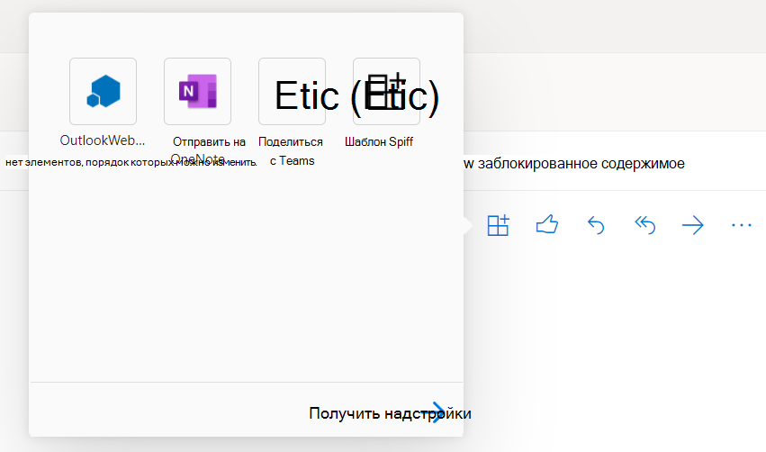

# Отладка надстроек Office в Visual Studio

В этой статье описывается отладка клиентского кода в надстройки Office, созданные с помощью одного из шаблонов проектов надстроек Office в Visual Studio 2022.  Сведения об отладке серверного кода в надстройки Office см. в статье "Общие сведения об отладке надстроек Office на стороне сервера или на стороне [клиента?"](../testing/debug-add-ins-overview.md#server-side-or-client-side).

> [!NOTE]
> Вы не можете использовать Visual Studio для отладки надстроек в Office для Mac. Сведения об отладке на компьютере Mac см. в разделе " [Отладка надстроек Office" на компьютере Mac](../testing/debug-office-add-ins-on-ipad-and-mac.md).

## Просмотр параметров сборки и отладки

Перед началом отладки просмотрите свойства каждого проекта, чтобы убедиться, что Visual Studio откроет нужное приложение Office и что другие свойства сборки и отладки заданные соответствующим образом.

### Свойства проекта надстройки

Откройте **окно "Свойства** " для проекта надстройки, чтобы просмотреть свойства проекта.

1. В **Обозревателе решений** выберите проект надстройки (*не* проект веб-приложения).

2. В панели меню выберите **Вид** > **Окно свойств**.

В следующей таблице описываются свойства проекта надстройки.

|Свойство|Описание|
|:-----|:-----|
|**Действие при запуске**|Определяет режим отладки для вашей надстройки. Для надстройки Outlook должно быть задано значение **Microsoft Edge** . Для всех остальных приложений Office необходимо задать для него значение **"Настольный клиент Office"**.|
|**Начальный документ** (только для надстроек Excel, PowerPoint и Word)|Указывает, какой документ следует открыть при запуске проекта. В новом проекте задано значение **[Новая книга Excel]**, **[Новый документ Word]** или **[Новая презентация PowerPoint]**. Чтобы указать конкретный документ, выполните действия, описанные в разделе ["Использование существующего документа для отладки надстройки"](#use-an-existing-document-to-debug-the-add-in).|
|**Веб-проект**|Определяет имя веб-проекта, связанного с надстройкой.|
|**Адрес электронной почты** (только для надстроек Outlook)|Указывает адрес электронной почты учетной записи пользователя на сервере Exchange Server или Exchange Online, который вы хотите использовать для проверки надстройки Outlook. Если оставить поле пустым, при запуске отладки вам будет предложено ввести адрес электронной почты.|
|**EWS Url** (только для надстроек Outlook)|Указывает URL-адрес веб-служб Exchange (например: `https://www.contoso.com/ews/exchange.aspx`). Это свойство можно оставить пустым.|
|**URL-адрес OWA** (только для надстроек Outlook)|Указывает URL-адрес Outlook в Интернете (например: `https://www.contoso.com/owa`). Это свойство можно оставить пустым.|
|**Использование многофакторной проверки подлинности** (только для надстроек Outlook)|Указывает логическое значение, указывающее, следует ли использовать многофакторную проверку подлинности. Значение по умолчанию **— false**, но свойство не имеет практического эффекта. Если для входа в учетную запись электронной почты обычно требуется указать второй фактор, вам будет предложено приступить к отладке. |
|**Имя пользователя** (только для надстроек Outlook)|Определяет имя учетной записи на сервере Exchange Server или Exchange Online, которое вы хотите использовать для проверки вашей надстройки Outlook. Это свойство можно оставить пустым.|
|**Файл проекта**|Задает имя файла, в котором указаны сборка, конфигурация и другие сведения о проекте.|
|**Папка проекта**|Указывает расположение файла проекта.|

> [!NOTE]
> Для надстройки Outlook вы можете задать значения для одной или нескольких используемых только для *надстроек Outlook свойств* в окне **Свойства**, но делать это необязательно.

### Свойства проекта веб-приложения

Откройте окно **"Свойства** " для проекта веб-приложения, чтобы просмотреть свойства проекта.

1. В **Обозреватель решений** выберите проект веб-приложения.

2. В панели меню выберите **Вид** > **Окно свойств**.

В таблице ниже описаны свойства проекта веб-приложения, которые наиболее подходят для проектов надстройки Office.

|Свойство|Описание|
|:-----|:-----|
|**SSL включен**|Указывает, включен ли SSL на сайте. Это свойство должно иметь значение **True** для проектов надстройки Office.|
|**URL-АДРЕС SSL**|Задает защищенный HTTPS URL-адрес сайта. Только для чтения.|
|**URL**|Задает HTTP URL-адрес сайта. Только для чтения.|
|**Файл проекта**|Задает имя файла, в котором указаны сборка, конфигурация и другие сведения о проекте.|
|**Папка проекта**|Указывает расположение файла проекта. Только для чтения. Файл манифеста, который генерирует Visual Studio во время выполнения, записывается в папку `bin\Debug\OfficeAppManifests` в этом расположении.|

## Отладка проекта надстройки Excel, PowerPoint или Word

В этом разделе описывается запуск и отладка надстройки Excel, PowerPoint или Word.

### Запуск проекта надстройки Excel, PowerPoint или Word

Запустите проект **, нажав** >  кнопку **"** Начать отладку" в строке меню или нажав клавишу F5. Visual Studio автоматически создаст решение и запустит ведущего приложения Office.

При сборке проекта Visual Studio выполняет следующие задачи:

1. Создает копию XML-файла манифеста и добавляет его в  `_ProjectName_\bin\Debug\OfficeAppManifests` каталог. Приложение Office, в котором размещается надстройка, использует эту копию при запуске Visual Studio и отладке надстройки.

2. Создает набор записей реестра на компьютере с Windows, который позволяет надстройке отображаться в приложении Office.

3. Создает проект веб-приложения, а затем развертывает его на локальном веб-сервере IIS (`https://localhost`).

4. Если это первый проект надстройки, развернутый на локальном веб-сервере IIS, может появиться запрос на установку сертификата Self-Signed в хранилище доверенных корневых сертификатов текущего пользователя. Это необходимо для того, чтобы приложение IIS Express отображало содержимое вашей надстройки правильно.

> [!NOTE]
> Если Office использует элемент управления веб-представления edge Legacy (EdgeHTML) для запуска надстроек на компьютере с Windows, Visual Studio может предложить добавить исключение замыкания на себя локальной сети. Это необходимо для того, чтобы элемент управления webview был доступен на веб-сайте, развернутом на локальном веб-сервере IIS. Эту настройку также можно изменить в любое время в Visual Studio в разделе **Инструменты** > **Параметры** > **Средства Office (веб)** > **Отладка веб-настройки**. Сведения о том, какой элемент управления браузером используется на компьютере с Windows, см. в статье "Браузеры, используемые надстройки [Office"](../concepts/browsers-used-by-office-web-add-ins.md).

Затем Visual Studio выполняет следующее:

1. Изменяет элемент [SourceLocation](/javascript/api/manifest/sourcelocation) XML-файла манифеста ( `_ProjectName_\bin\Debug\OfficeAppManifests` который был скопирован в каталог), `~remoteAppUrl` заменяя маркер полным адресом начальной страницы (например, `https://localhost:44302/Home.html`).

2. Запускает проект веб-приложения в IIS Express.

3. Проверяет манифест. Чтобы просмотреть правила проверки XML-файла манифеста проекта, ознакомьтесь с разделом [XML-манифест надстройки для Office](../develop/add-in-manifests.md). 

   > [!IMPORTANT]
   > XSD-файлы манифеста Office, устанавливаемые Visual Studio, устарели. Если вы получаете ошибки проверки для манифеста, первым шагом по устранению неполадок должно быть замена одного или нескольких из этих файлов последними версиями. Подробные инструкции см. в статье об ошибках проверки [схемы манифеста в проектах Visual Studio](../testing/troubleshoot-development-errors.md#manifest-schema-validation-errors-in-visual-studio-projects).

4. Открывает приложение Office и добавляет неопубликованную надстройку.

### Отладка надстройки Excel, PowerPoint или Word

1. Запустите надстройку в приложении Office. Например, если это надстройка области задач, она добавит кнопку на ленту **"** Главная" (например, кнопку **"Показать область** задач"). Нажмите кнопку на ленте. 

   > [!NOTE]
   > Если надстройка не загружена неопубликованным приложением Visual Studio, ее можно загрузить вручную. В Excel, PowerPoint или Word выберите вкладку "Вставка", а затем стрелку вниз, расположенную справа от "Мои **надстройки"**.
   >
   > 
   >
   > В списке доступных надстроек найдите раздел **Надстройки разработчика** и выберите вашу надстройку, чтобы зарегистрировать ее.

   > [!TIP]
   > При первом запуске область задач может отображаться пустой. В этом случае он должен правильно отображаться при запуске средств отладки на более позднем этапе.

3. Откройте меню ["Личных данных](../design/task-pane-add-ins.md#personality-menu) " и выберите **команду "Присоединить отладчик"**. Откроется инструменты отладки для элемента управления webview, который Office использует для запуска надстроек на компьютере с Windows. Вы можете задать точки останова и выполнить пошаговое выполнение кода, как описано в одной из следующих статей:

    - [Отладка надстроек с помощью средств разработчика для Internet Explorer](../testing/debug-add-ins-using-f12-tools-ie.md)
    - [Отладка надстроек с помощью средств разработчика для устаревшей версии Microsoft Edge](../testing/debug-add-ins-using-devtools-edge-legacy.md)
    - [Отладка надстроек с помощью средств разработчика в Microsoft Edge (на основе Chromium)](../testing/debug-add-ins-using-devtools-edge-chromium.md)

4. Чтобы внести изменения в код, сначала остановите сеанс отладки в Visual Studio и закройте приложение Office. Внесите изменения и запустите новый сеанс отладки.

## Отладка проекта надстройки Outlook

В этом разделе описывается запуск и отладка надстройки Outlook.

### Запуск проекта надстройки Outlook

Запустите проект **, нажав** >  кнопку **"** Начать отладку" в строке меню или нажав клавишу F5. Visual Studio автоматически создаст решение и запустит страницу Outlook клиента Microsoft 365.

При сборке проекта Visual Studio выполняет следующие задачи.

1. Запрашивает учетные данные для входа. Если вам будет предложено выполнить повторный вход или при появлении ошибки, которая не была авторизована, обычная проверка подлинности может быть отключена для учетных записей в клиенте Microsoft 365. В этом случае попробуйте использовать учетную запись Майкрософт. Вы также можете попробовать задать для свойства **Use Multi-Factor Auth** значение **True** в области свойств проекта веб-надстройки Outlook. См [. свойства проекта надстройки](#add-in-project-properties).

1. Создает копию XML-файла манифеста и добавляет его в `_ProjectName_\bin\Debug\OfficeAppManifests` каталог. Outlook использует эту копию при запуске Visual Studio и отладке надстройки.

2. Создает проект веб-приложения, а затем развертывает его на локальном веб-сервере IIS (`https://localhost`).

3. Если это первый проект надстройки, развернутый на локальном веб-сервере IIS, может появиться запрос на установку сертификата Self-Signed в хранилище доверенных корневых сертификатов текущего пользователя. Это необходимо для того, чтобы приложение IIS Express отображало содержимое вашей надстройки правильно.

> [!NOTE]
> Если Office использует элемент управления веб-представления edge Legacy (EdgeHTML) для запуска надстроек на компьютере с Windows, Visual Studio может предложить добавить исключение замыкания на себя локальной сети. Это необходимо для того, чтобы элемент управления webview был доступен на веб-сайте, развернутом на локальном веб-сервере IIS. Эту настройку также можно изменить в любое время в Visual Studio в разделе **Инструменты** > **Параметры** > **Средства Office (веб)** > **Отладка веб-настройки**. Сведения о том, какой элемент управления браузером используется на компьютере с Windows, см. в статье "Браузеры, используемые надстройки [Office"](../concepts/browsers-used-by-office-web-add-ins.md).

Затем Visual Studio выполняет следующее:

1. Изменяет элемент [SourceLocation](/javascript/api/manifest/sourcelocation) XML-файла манифеста ( `_ProjectName_\bin\Debug\OfficeAppManifests` который был скопирован в каталог), `~remoteAppUrl` заменяя маркер полным адресом начальной страницы (например, `https://localhost:44302/Home.html`).

2. Запускает проект веб-приложения в IIS Express.

3. Проверяет манифест. Чтобы просмотреть правила проверки XML-файла манифеста проекта, ознакомьтесь с разделом [XML-манифест надстройки для Office](../develop/add-in-manifests.md). 

   > [!IMPORTANT]
   > XSD-файлы манифеста Office, устанавливаемые Visual Studio, устарели. Если вы получаете ошибки проверки для манифеста, первым шагом по устранению неполадок должно быть замена одного или нескольких из этих файлов последними версиями. Подробные инструкции см. в статье об ошибках проверки [схемы манифеста в проектах Visual Studio](../testing/troubleshoot-development-errors.md#manifest-schema-validation-errors-in-visual-studio-projects).

4. Открывает страницу Outlook клиента Microsoft 365 в Microsoft Edge.

### Отладка надстройки Outlook

1. На странице Outlook выберите сообщение электронной почты или элемент встречи, чтобы открыть его в собственном окне. 

2. Нажмите клавишу F12, чтобы открыть средство отладки Edge.

3. После открытия средства запустите надстройку. Например, на панели инструментов в верхней части сообщения нажмите кнопку "Дополнительные приложения", а затем выберите надстройку в открываемом выноске.

   

4. Используйте инструкции из одной из следующих статей, чтобы задать точки останова и выполнить пошаговое выполнение кода. Каждый из них содержит ссылку на более подробные инструкции.

   - [Отладка надстроек с помощью средств разработчика для устаревшей версии Microsoft Edge](../testing/debug-add-ins-using-devtools-edge-legacy.md)
   - [Отладка надстроек с помощью средств разработчика в Microsoft Edge (на основе Chromium)](../testing/debug-add-ins-using-devtools-edge-chromium.md)

   > [!TIP]
   > Чтобы отладить `Office.initialize` `Office.onReady` код, выполняемый в функции или функции, которая выполняется при открытии надстройки, установите точки останова, а затем закройте и снова откройте надстройку. Дополнительные сведения об этих функциях см. в [разделе "Инициализация надстройки Office"](../develop/initialize-add-in.md).

5. Чтобы внести изменения в код, сначала остановите сеанс отладки в Visual Studio и закройте страницы Outlook. Внесите изменения и запустите новый сеанс отладки.

## Использование существующего документа для отладки надстройки

Если у вас есть документ, содержащий тестовые данные, которые вы хотите использовать при отладке надстройки Excel, PowerPoint или Word, Visual Studio можно настроить на открытия документа при запуске проекта. Чтобы указать существующий документ для использования при отладке надстройки, выполните указанные ниже действия.

1. В **Обозревателе решений** выберите проект надстройки (*не* проект веб-приложения).

2. В строке меню выберите **Проект** > **добавить существующий элемент**.

3. В диалоговом окне **Добавление существующего элемента** найдите и выберите документ, который вы хотите добавить.

4. Нажмите кнопку **Добавить**, чтобы добавить документ в проект.

5. В **Обозревателе решений** выберите проект надстройки (*не* проект веб-приложения).

6. В панели меню выберите **Вид** > **Окно свойств**.

7. В окне **Свойства** выберите список **Стартовый документ**, а затем выберите документ, который вы добавили в проект. Проект теперь настроен на запуск надстройки в данном документе.

## Дальнейшие действия

Если надстройка работает корректно, см. статью [Развертывание и публикация вашей надстройки Office](../publish/publish.md), чтобы ознакомиться со способами распространения вашей надстройки среди пользователей.
