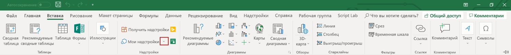

# Отладка надстроек Office в Visual Studio

В этой статье описывается отламывка клиентского кода в Office надстроек, созданных с помощью одного из шаблонов Office надстроек в Visual Studio 2022 г.  Сведения об отладке кода на стороне сервера в Office надстройки см. в обзоре отладки Office надстроек - на стороне сервера или на стороне [клиента?](../testing/debug-add-ins-overview.md#server-side-or-client-side).

> [!NOTE]
> Вы не можете использовать Visual Studio для отлаговки надстроек в Office Mac. Сведения о отладки на Mac см. в Office [надстроек на Mac](../testing/debug-office-add-ins-on-ipad-and-mac.md).

## Просмотр параметров сборки и отладки

Перед началом отладки просмотрите свойства каждого проекта, чтобы подтвердить, что Visual Studio откроет нужное приложение Office и что другие свойства сборки и отладки задаются надлежащим образом.

### Свойства проекта надстройки

Откройте **окно Свойства** для проекта надстройки, чтобы просмотреть свойства проекта.

1. В **Обозревателе решений** выберите проект надстройки (*не* проект веб-приложения).

2. В панели меню выберите **Вид** > **Окно свойств**.

В следующей таблице описываются свойства проекта надстройки.

|Свойство|Описание|
|:-----|:-----|
|**Действие при запуске**|Определяет режим отладки для вашей надстройки. Это должно быть заданной **Microsoft Edge** для Outlook надстройки. Для всех остальных Office приложений следует установить Office **desktop Client**.|
|**Начальный документ** (только для надстроек Excel, PowerPoint и Word)|Указывает, какой документ следует открыть при запуске проекта. В новом проекте заданной является **[** Новая книга Excel], **[New Word Document]**, **или [New PowerPoint Presentation]**. Чтобы указать конкретный документ, выполните действия в Использовании существующего документа для [отлаговки надстройки](#use-an-existing-document-to-debug-the-add-in).|
|**Веб-проект**|Определяет имя веб-проекта, связанного с надстройкой.|
|**Адрес электронной почты** (только для надстроек Outlook)|Указывает адрес электронной почты учетной записи пользователя на сервере Exchange Server или Exchange Online, который вы хотите использовать для проверки надстройки Outlook. Если оставить пустым, вам будет предложен адрес электронной почты, когда вы начнете отладку.|
|**EWS Url** (только для надстроек Outlook)|Указывает URL Exchange веб-служб (например: `https://www.contoso.com/ews/exchange.aspx`). Это свойство можно оставить пустым.|
|**URL-адрес OWA** (только для надстроек Outlook)|Указывает URL-Outlook в Интернете (например: `https://www.contoso.com/owa`). Это свойство можно оставить пустым.|
|**Использование многофакторной проверки подлинности** (только для надстроек Outlook)|Указывает значение boolean, которое указывает, следует ли использовать многофакторную проверку подлинности. Значение по умолчанию **является ложным**, но свойство не имеет практического эффекта. Если для входа в учетную запись электронной почты обычно необходимо предоставить второй фактор, вам будет предложено приступить к отладки. |
|**Имя пользователя** (только для надстроек Outlook)|Определяет имя учетной записи на сервере Exchange Server или Exchange Online, которое вы хотите использовать для проверки вашей надстройки Outlook. Это свойство можно оставить пустым.|
|**Файл проекта**|Задает имя файла, в котором указаны сборка, конфигурация и другие сведения о проекте.|
|**Папка проекта**|Указывает расположение файла проекта.|

> [!NOTE]
> Для надстройки Outlook вы можете задать значения для одной или нескольких используемых только для *надстроек Outlook свойств* в окне **Свойства**, но делать это необязательно.

### Свойства проекта веб-приложения

Откройте **окно Свойства** для проекта веб-приложения, чтобы просмотреть свойства проекта.

1. В **Обозревателе решений** выберите проект веб-приложения.

2. В панели меню выберите **Вид** > **Окно свойств**.

В таблице ниже описаны свойства проекта веб-приложения, которые наиболее подходят для проектов надстройки Office.

|Свойство|Описание|
|:-----|:-----|
|**SSL включен**|Указывает, включен ли SSL на сайте. Это свойство должно иметь значение **True** для проектов надстройки Office.|
|**URL-АДРЕС SSL**|Задает защищенный HTTPS URL-адрес сайта. Только для чтения.|
|**URL**|Задает HTTP URL-адрес сайта. Только для чтения.|
|**Файл проекта**|Задает имя файла, в котором указаны сборка, конфигурация и другие сведения о проекте.|
|**Папка проекта**|Указывает расположение файла проекта. Только для чтения. Файл манифеста, который генерирует Visual Studio во время выполнения, записывается в папку `bin\Debug\OfficeAppManifests` в этом расположении.|

## Отламывка Excel, PowerPoint или надстройки Word

В этом разделе описывается запуск и отлагивание надстройки Excel, PowerPoint или Word.

### Запуск проекта надстройки Excel, PowerPoint или Word

Начните проект с выбора **отладки DebugStart** >  из панели меню или нажмите кнопку F5. Visual Studio автоматически создайте решение и запустите Office хост-приложение.

Когда Visual Studio проект, он выполняет следующие задачи:

1. Создает копию XML-файла манифеста и добавляет его в  `_ProjectName_\bin\Debug\OfficeAppManifests` каталог. Приложение Office, в котором размещена ваша надстройка, потребляет эту копию при Visual Studio и отлаговка надстройки.

2. Создает набор записей реестра на Windows, что позволяет надстройка отображаться в Office приложении.

3. Создает проект веб-приложения, а затем развертывает его на локальном веб-сервере IIS (`https://localhost`).

4. Если это первый проект надстройки, развернутый на локальном веб-сервере IIS, вам может быть предложено установить сертификат Self-Signed в хранилище надежных корневых сертификатов текущего пользователя. Это необходимо для того, чтобы приложение IIS Express отображало содержимое вашей надстройки правильно.

> [!NOTE]
> Если Office использует управление веб-просмотром Edge Legacy (EdgeHTML) для запуска надстройок на Windows компьютере, Visual Studio может потребоваться добавить локальное освобождение от циклов в сети. Это необходимо для управления веб-просмотром, чтобы иметь доступ к веб-сайту, развернутом на локальном веб-сервере IIS. Эту настройку также можно изменить в любое время в Visual Studio в разделе **Инструменты** > **Параметры** > **Средства Office (веб)** > **Отладка веб-настройки**. Чтобы узнать, какое управление браузером используется на Windows компьютере, см. в Office [надстройки](../concepts/browsers-used-by-office-web-add-ins.md).

Затем Visual Studio выполняет следующее:

1. Изменяет элемент [SourceLocation](../reference/manifest/sourcelocation.md) файла манифеста XML ( `_ProjectName_\bin\Debug\OfficeAppManifests` который был скопирован в каталог) `~remoteAppUrl` путем замены маркера на полностью квалифицированный адрес страницы запуска (например, `https://localhost:44302/Home.html`).

2. Запускает проект веб-приложения в IIS Express.

3. Проверяет манифест. Чтобы просмотреть правила проверки XML-файла манифеста проекта, ознакомьтесь с разделом [XML-манифест надстройки для Office](../develop/add-in-manifests.md). 

   > [!IMPORTANT]
   > Файлы Office XSD, Visual Studio установки, устарели. Если вы получаете ошибки проверки для манифеста, первым шагом для устранения неполадок должно стать замена одного или более из этих файлов последними версиями. Подробные инструкции см. в описании ошибок проверки схемы манифеста [в Visual Studio проектах](../testing/troubleshoot-development-errors.md#manifest-schema-validation-errors-in-visual-studio-projects).

4. Открывает Office приложение и побок добавляет надстройку.

### Отламывка надстройки Excel, PowerPoint или Word

1. Запустите надстройка в Office приложении. Например, если это надстройка области задач, в ленту **Home** будет добавлена кнопка (например, кнопка **Показать** задачу). Выберите кнопку в ленте. 

   > [!NOTE]
   > Если надстройка не загружена Visual Studio, ее можно перегружать вручную. В Excel, PowerPoint word выберите вкладку **Вставить**, а затем выберите стрелку вниз, расположенную справа от **надстройки My**.
   >
   > 
   >
   > В списке доступных надстроек найдите раздел **Надстройки разработчика** и выберите вашу надстройку, чтобы зарегистрировать ее.

   > [!TIP]
   > Области задач могут отображаться пустыми при первом открываемом открываемом ок. Если это так, он должен правильно отрисовки при запуске средств отладки на более позднем этапе.

3. Откройте меню [личности и](../design/task-pane-add-ins.md#personality-menu) выберите **Присоединение отладки**. Это откроет средства отладки для управления веб-Office, которые Office для запуска надстроек на Windows компьютере. Можно установить точки разрыва и пройти код, как описано в одной из следующих статей:

    - [Отладка надстроек с помощью средств разработчика для Internet Explorer](../testing/debug-add-ins-using-f12-tools-ie.md)
    - [Отладка надстроек с помощью средств разработчика для устаревшей версии Microsoft Edge](../testing/debug-add-ins-using-devtools-edge-legacy.md)
    - [Отладка надстроек с помощью средств разработчика в Microsoft Edge (на основе Chromium)](../testing/debug-add-ins-using-devtools-edge-chromium.md)

4. Чтобы внести изменения в код, сначала остановите сеанс отладки в Visual Studio и закройте Office приложение. Внести изменения и начать новый сеанс отладки.

## Отламывка Outlook надстройки

В этом разделе описывается, как запускать и отлаговка Outlook надстройки.

### Запуск проекта Outlook надстройки

Начните проект с выбора **отладки DebugStart** >  из панели меню или нажмите кнопку F5. Visual Studio автоматически создает решение и запускает Outlook страницу вашего Microsoft 365 аренды.

Когда Visual Studio проект, он выполняет следующие задачи.

1. Запросы для входа учетных данных. Если вам будет предложено войти повторно или если вы получили несанкционированную ошибку, базовый auth может быть отключен для учетных записей Microsoft 365 клиента. В этом случае попробуйте использовать учетную запись Майкрософт. Вы также можете попробовать установить свойство **Use multi-factor auth** to **True** в области свойств веб-надстройки Outlook веб-надстройки. См [. свойства проекта надстройки](#add-in-project-properties).

1. Создает копию XML-файла манифеста и добавляет его в `_ProjectName_\bin\Debug\OfficeAppManifests` каталог. Outlook потребляет эту копию при Visual Studio и отлаговка надстройки.

2. Создает проект веб-приложения, а затем развертывает его на локальном веб-сервере IIS (`https://localhost`).

3. Если это первый проект надстройки, развернутый на локальном веб-сервере IIS, вам может быть предложено установить сертификат Self-Signed в хранилище надежных корневых сертификатов текущего пользователя. Это необходимо для того, чтобы приложение IIS Express отображало содержимое вашей надстройки правильно.

> [!NOTE]
> Если Office использует управление веб-просмотром Edge Legacy (EdgeHTML) для запуска надстройок на Windows компьютере, Visual Studio может потребоваться добавить локальное освобождение от циклов в сети. Это необходимо для управления веб-просмотром, чтобы иметь доступ к веб-сайту, развернутом на локальном веб-сервере IIS. Эту настройку также можно изменить в любое время в Visual Studio в разделе **Инструменты** > **Параметры** > **Средства Office (веб)** > **Отладка веб-настройки**. Чтобы узнать, какое управление браузером используется на Windows компьютере, см. в Office [надстройки](../concepts/browsers-used-by-office-web-add-ins.md).

Затем Visual Studio выполняет следующее:

1. Изменяет элемент [SourceLocation](../reference/manifest/sourcelocation.md) файла манифеста XML ( `_ProjectName_\bin\Debug\OfficeAppManifests` который был скопирован в каталог) `~remoteAppUrl` путем замены маркера на полностью квалифицированный адрес страницы запуска (например, `https://localhost:44302/Home.html`).

2. Запускает проект веб-приложения в IIS Express.

3. Проверяет манифест. Чтобы просмотреть правила проверки XML-файла манифеста проекта, ознакомьтесь с разделом [XML-манифест надстройки для Office](../develop/add-in-manifests.md). 

   > [!IMPORTANT]
   > Файлы Office XSD, Visual Studio установки, устарели. Если вы получаете ошибки проверки для манифеста, первым шагом для устранения неполадок должно стать замена одного или более из этих файлов последними версиями. Подробные инструкции см. в описании ошибок проверки схемы манифеста [в Visual Studio проектах](../testing/troubleshoot-development-errors.md#manifest-schema-validation-errors-in-visual-studio-projects).

4. Открывает Outlook страницу вашего Microsoft 365 в Microsoft Edge.

### Отламывка Outlook надстройки

1. На Outlook выберите сообщение электронной почты или пункт встречи, чтобы открыть его в собственном окне. 

2. Нажмите кнопку F12, чтобы открыть средство отладки Edge.

3. После открытия средства запустите надстройка. Например, в панели инструментов в верхней части сообщения выберите кнопку **Дополнительные** приложения, а затем выберите надстройку из открываемого вызова.

   

4. Используйте инструкции в одной из следующих статей, чтобы установить точки разрыва и пройти код. Каждый из них имеет ссылку на более подробные инструкции.

   - [Отладка надстроек с помощью средств разработчика для устаревшей версии Microsoft Edge](../testing/debug-add-ins-using-devtools-edge-legacy.md)
   - [Отладка надстроек с помощью средств разработчика в Microsoft Edge (на основе Chromium)](../testing/debug-add-ins-using-devtools-edge-chromium.md)

   > [!TIP]
   > Чтобы отлагировать `Office.initialize` `Office.onReady` код, который выполняется в методе или методе, который запускается при запуске надстройки, установите точки разрыва, а затем закройте и снова откроете надстройки. Дополнительные сведения об этих методах см. в [Office надстройки](../develop/initialize-add-in.md).

5. Чтобы внести изменения в код, сначала остановите сеанс отладки в Visual Studio и закройте Outlook страниц. Внести изменения и начать новый сеанс отладки.

## Использование существующего документа для отладки надстройки

Если у вас есть документ, содержащий тестовые данные, которые вы хотите использовать при отладке надстройки Excel, PowerPoint или Word, Visual Studio можно настроить на открытия документа при запуске проекта. Чтобы указать существующий документ для использования при отладке надстройки, выполните указанные ниже действия.

1. В **Обозревателе решений** выберите проект надстройки (*не* проект веб-приложения).

2. В строке меню выберите **Проект** > **добавить существующий элемент**.

3. В диалоговом окне **Добавление существующего элемента** найдите и выберите документ, который вы хотите добавить.

4. Нажмите кнопку **Добавить**, чтобы добавить документ в проект.

5. В **Обозревателе решений** выберите проект надстройки (*не* проект веб-приложения).

6. В панели меню выберите **Вид** > **Окно свойств**.

7. В окне **Свойства** выберите список **Стартовый документ**, а затем выберите документ, который вы добавили в проект. Проект теперь настроен на запуск надстройки в данном документе.

## Дальнейшие действия

Если надстройка работает корректно, см. статью [Развертывание и публикация вашей надстройки Office](../publish/publish.md), чтобы ознакомиться со способами распространения вашей надстройки среди пользователей.
