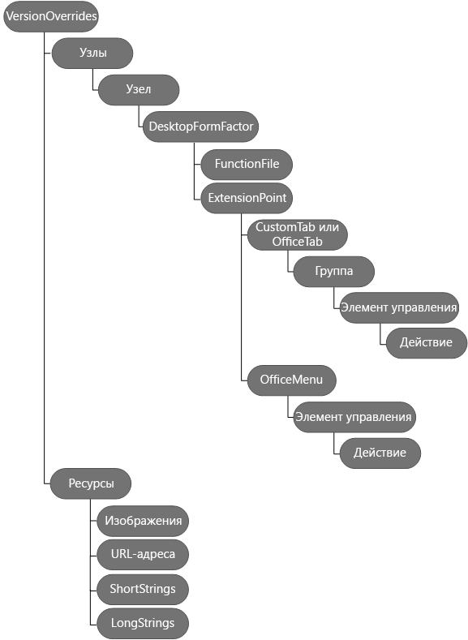

# Определение команд надстройки в манифесте

С помощью команд надстроек можно с легкостью настроить стандартный пользовательский интерфейс Office, добавив элементы, выполняющие действия. Например, вы можете добавить на ленту собственные кнопки. Чтобы создать команды, можно добавить узел **[VersionOverrides](http://dev.office.com/reference/add-ins/manifest/versionoverrides)** в уже созданный манифест. 

Если манифест содержит элемент **VersionOverrides**, то версии Word, Excel, Outlook и PowerPoint, поддерживающие команды надстроек, будут использовать данные из этого элемента для загрузки надстройки. В более ранних версиях Office, не поддерживающих команды надстроек, этот элемент игнорируется.

Когда клиентские приложения обнаруживают узел **VersionOverrides**, имя надстройки появляется на ленте, а не в области задач, просмотра или создания. Надстройка не будет отображаться на ленте и в соответствующей области одновременно.
 
## VersionOverrides

[VersionOverrides](http://dev.office.com/reference/add-ins/manifest/versionoverrides) — корневой элемент, который содержит сведения о командах надстройки. Поддерживается в схеме манифеста 1.1 и более поздней версии.

Существуют две версии схемы **VersionOverrides**.

| Версия схемы | Описание |
|----------------|-------------|
| 1.0 | Поддерживает команды надстроек для классических версий приложений Office. | 
| 1.1 | Добавляет поддержку [закрепляемых областей задач](https://docs.microsoft.com/outlook/add-ins/pinnable-taskpane) и мобильных надстроек. **Примечание.** В настоящее время поддерживается только в Outlook 2016 для Windows и Outlook для iOS. |

Надстройка может поддерживать несколько версий схемы **VersionOverrides** благодаря вложению более новых версий в предыдущие. Это обеспечивает доступ клиента к новым функциям, описанным в новой схеме, если он ее поддерживает, а также возможность загрузки более старой версии, если нет. Подробные сведения см. в разделе [Реализация нескольких версий](../../reference/manifest/versionoverrides.md#implementing-multiple-versions).

Элемент **VersionOverrides** включает следующие дочерние элементы:

- [Description](http://dev.office.com/reference/add-ins/manifest/description)
- [Requirements](http://dev.office.com/reference/add-ins/manifest/requirements)
- [Hosts](http://dev.office.com/reference/add-ins/manifest/hosts)
- [Resources](http://dev.office.com/reference/add-ins/manifest/resources);
- [VersionOverrides](http://dev.office.com/reference/add-ins/manifest/versionoverrides)

На приведенной ниже схеме показана иерархия элементов, используемых для определения команд надстроек. 

## Примеры манифестов

Пример манифеста, в котором реализуются команды надстройки для Word, Excel и PowerPoint, представлен на странице [Простой пример команд надстроек](https://github.com/OfficeDev/Office-Add-in-Commands-Samples/tree/master/Simple).

Пример манифеста, в котором реализуются команды надстройки для Outlook, представлен на странице [Пример файла манифеста для надстройки Outlook](https://github.com/OfficeDev/outlook-add-in-command-demo/blob/master/command-demo-manifest.xml).

## Дополнительные ресурсы

- [Команды надстроек Outlook](https://docs.microsoft.com/outlook/add-ins/add-in-commands-for-outlook)
    
- [Манифесты надстроек Outlook](https://docs.microsoft.com/outlook/add-ins/manifests)
    
- [Пример команды надстройки Outlook (демонстрация)](https://github.com/OfficeDev/outlook-add-in-command-demo)
